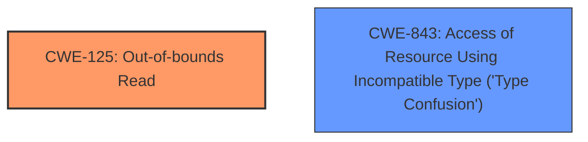

# Enhanced Analysis for CVE-2020-35631

# Summary
| CWE ID    | CWE Name                                                                     | Confidence | CWE Abstraction Level | CWE Vulnerability Mapping Label | CWE-Vulnerability Mapping Notes |
| :---------- | :--------------------------------------------------------------------------- | :--------- | :---------------------- | :------------------------------ | :------------------------------ |
| CWE-125     | Out-of-bounds Read                                                           | 1          | Base                    | Primary                         | Allowed                       |
| CWE-843     | Access of Resource Using Incompatible Type ('Type Confusion')              | 0.9        | Base                    | Secondary                       | Allowed                       |

## Evidence and Confidence

*   **Confidence Score:** 0.95
*   **Evidence Strength:** HIGH

## Relationship Analysis
The primary weakness is CWE-125 (Out-of-bounds Read), which is a base-level CWE and accurately describes the vulnerability where data is read beyond the intended buffer. CWE-843 (Type Confusion) is a secondary weakness, indicating that a resource is accessed using an incompatible type, which may lead to the out-of-bounds read. Both CWEs are at the Base abstraction level and provide a detailed representation of the vulnerability.



## Vulnerability Chain
The vulnerability chain begins with a malformed file leading to a **type confusion**, which then results in an **out-of-bounds read**, ultimately leading to potential **code execution**.

## Summary of Analysis
The initial assessment identified the primary weakness as CWE-125 (**Out-of-bounds Read**) due to the direct mention of this vulnerability in the description: "An **oob read** vulnerability exists...". The secondary weakness identified is CWE-843 (Access of Resource Using Incompatible Type ('Type Confusion')), based on the description stating, "A specially crafted malformed file can lead to... **type confusion**".

The selection of CWE-125 and CWE-843 is based on the explicit evidence of the **out-of-bounds read** and **type confusion** vulnerabilities. These CWEs are at the optimal level of specificity because they directly represent the root causes identified in the vulnerability description.

Relevant CWE Information:

# Enhanced Context (25 CWEs)

## CWE-129: Improper Validation of Array Index
**Abstraction Level**: Variant
**Similarity Score**: 0.76
**Source**: dense

**Description**:
The product uses untrusted input when calculating or using an array index, but the product does not validate or incorrectly validates the index to ensure the index references a valid position within the array.

**Mapping Guidance**:
- Usage: Allowed
- Rationale: This CWE entry is at the Variant level of abstraction, which is a preferred level of abstraction for mapping to the root causes of vulnerabilities.

*   Not selected, while array indices are involved, the primary issue is reading beyond buffer boundaries, not specifically the validation of the array index.

## CWE-703: Improper Check or Handling of Exceptional Conditions
**Abstraction Level**: Pillar
**Similarity Score**: 0.72
**Source**: dense

**Description**:
The product does not properly anticipate or handle exceptional conditions that rarely occur during normal operation of the product.

**Mapping Guidance**:
- Usage: Discouraged
- Rationale: This CWE entry is extremely high-level, a Pillar.

*   Not selected as it is a very high-level and doesn't accurately describe the root cause.

## CWE-131: Incorrect Calculation of Buffer Size
**Abstraction Level**: Base
**Similarity Score**: 0.72
**Source**: dense

**Description**:
The product does not correctly calculate the size to be used when allocating a buffer, which could lead to a buffer overflow.

**Mapping Guidance**:
- Usage: Allowed
- Rationale: This CWE entry is at the Base level of abstraction, which is a preferred level of abstraction for mapping to the root causes of vulnerabilities.

*   Not selected as the vulnerability description does not mention incorrect buffer size calculation, but rather reading beyond buffer boundaries.

## CWE-125: Out-of-bounds Read
**Abstraction Level**: Base
**Similarity Score**: 0.71
**Source**: dense

**Description**:
The product reads data past the end, or before the beginning, of the intended buffer.

**Mapping Guidance**:
- Usage: Allowed
- Rationale: This CWE entry is at the Base level of abstraction, which is a preferred level of abstraction for mapping to the root causes of vulnerabilities.

*   Selected as the primary CWE since the vulnerability involves reading data past the end of the buffer.

## CWE-824: Access of Uninitialized Pointer
**Abstraction Level**: Base
**Similarity Score**: 0.71
**Source**: dense

**Description**:
The product accesses or uses a pointer that has not been initialized.

**Mapping Guidance**:
- Usage: Allowed
- Rationale: This CWE entry is at the Base level of abstraction, which is a preferred level of abstraction for mapping to the root causes of vulnerabilities.

*   Not selected as there is no evidence of an uninitialized pointer being accessed.

## CWE-193: Off-by-one Error
**Abstraction Level**: Base
**Similarity Score**: 0.70
**Source**: dense

**Description**:
A product calculates or uses an incorrect maximum or minimum value that is 1 more, or 1 less, than the correct value.

**Mapping Guidance**:
- Usage: Allowed
- Rationale: This CWE entry is at the Base level of abstraction, which is a preferred level of abstraction for mapping to the root causes of vulnerabilities.

*   Not selected as there is no explicit mention of an off-by-one error.

## CWE-252: Unchecked Return Value
**Abstraction Level**: Base
**Similarity Score**: 0.70
**Source**: dense

**Description**:
The product does not check the return value from a method or function, which can prevent it from detecting unexpected states and conditions.

**Mapping Guidance**:
- Usage: Allowed
- Rationale: This CWE entry is at the Base level of abstraction, which is a preferred level of abstraction for mapping to the root causes of vulnerabilities.

*   Not selected as the vulnerability description does not mention anything about unchecked return values.

## CWE-704: Incorrect Type Conversion or Cast
**Abstraction Level**: Class
**Similarity Score**: 0.70
**Source**: dense

**Description**:
The product does not correctly convert an object, resource, or structure from one type to a different type.

**Mapping Guidance**:
- Usage: Allowed-with-Review
- Rationale: This CWE entry is a Class and might have Base-level children that would be more appropriate

*   Not selected as it is less specific than CWE-843.

## CWE-407: Inefficient Algorithmic Complexity
**Abstraction Level**: Class
**Similarity Score**: 0.69
**Source**: dense

**Description**:
An algorithm in a product has an inefficient worst-case computational complexity that may be detrimental to system performance and can be triggered by an attacker, typically using crafted manipulations that ensure that the worst case is being reached.

**Mapping Guidance**:
- Usage: Allowed-with-Review
- Rationale: This CWE entry is a Class and might have Base-level children that would be more appropriate

*   Not selected as there is no mention of inefficient algorithmic complexity.

## CWE-696: Incorrect Behavior Order
**Abstraction Level**: Class
**Similarity Score**: 0.69
**Source**: dense

**Description**:
The product performs multiple related behaviors, but the behaviors are performed in the wrong order in ways which may produce resultant weaknesses.

**Mapping Guidance**:
- Usage: Allowed-with-Review
- Rationale: This CWE entry is a Class and might have Base-level children that would be more appropriate

*   Not selected as there is no mention of incorrect behavior order.

## CWE-190: Integer Overflow or Wraparound
**Abstraction Level**: Base
**Similarity Score**: 2831.79
**Source**: sparse

**Description**:
The product performs a calculation that can
         produce an integer overflow or wraparound when the logic
         assumes that the resulting value will always be larger than
         the original value. This occurs when an integer value is
         incremented to a value that is too large to store in the
         associated representation. When this occurs, the value may
         become a very small or negative number.

**Mapping Guidance**:
- Usage: Allowed
- Rationale: This CWE entry is at the Base level of abstraction, which is a preferred level of abstraction for mapping to the root causes of vulnerabilities.

*   Not selected as there is no mention of an integer overflow or wraparound.

## CWE-125: Out-of-bounds Read
**Abstraction Level**: Base
**Similarity Score**: 2779.61
**Source**: sparse

**Description**:
The product reads data


## CWE Relationship Analysis

Current CWEs represent these abstraction levels: .


### Vulnerability Chain Analysis

**Chain starting from CWE-843:**
- 843 (Access of Resource Using Incompatible Type ('Type Confusion')) - ROOT


**Chain starting from CWE-193:**
- 193 (Off-by-one Error) - ROOT


### CWE Relationship Diagram

```mermaid
graph TD
    classDef primary fill:#f96,stroke:#333,stroke-width:2px
    classDef secondary fill:#69f,stroke:#333
    classDef tertiary fill:#9e9,stroke:#333
```