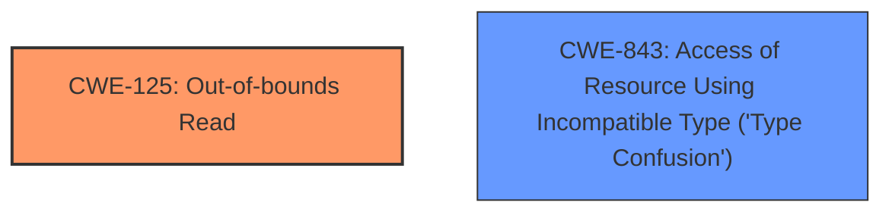

# Analysis for CVE-2020-35631

# Summary
| CWE ID    | CWE Name                                                                     | Confidence | CWE Abstraction Level | CWE Vulnerability Mapping Label | CWE-Vulnerability Mapping Notes |
| :---------- | :--------------------------------------------------------------------------- | :--------- | :---------------------- | :------------------------------ | :------------------------------ |
| CWE-125     | Out-of-bounds Read                                                           | 1          | Base                    | Primary                         | Allowed                       |
| CWE-843     | Access of Resource Using Incompatible Type ('Type Confusion')              | 0.9        | Base                    | Secondary                       | Allowed                       |

## Evidence and Confidence

*   **Confidence Score:** 0.95
*   **Evidence Strength:** HIGH

## Relationship Analysis
The primary weakness is CWE-125 (Out-of-bounds Read), which is a base-level CWE and accurately describes the vulnerability where data is read beyond the intended buffer. CWE-843 (Type Confusion) is a secondary weakness, indicating that a resource is accessed using an incompatible type, which may lead to the out-of-bounds read. Both CWEs are at the Base abstraction level and provide a detailed representation of the vulnerability.

## Vulnerability Chain
The vulnerability chain begins with a malformed file leading to a **type confusion**, which then results in an **out-of-bounds read**, ultimately leading to potential **code execution**.

## Summary of Analysis
The initial assessment identified the primary weakness as CWE-125 (**Out-of-bounds Read**) due to the direct mention of this vulnerability in the description: "An **oob read** vulnerability exists...". The secondary weakness identified is CWE-843 (Access of Resource Using Incompatible Type ('Type Confusion')), based on the description stating, "A specially crafted malformed file can lead to... **type confusion**".

The selection of CWE-125 and CWE-843 is based on the explicit evidence of the **out-of-bounds read** and **type confusion** vulnerabilities. These CWEs are at the optimal level of specificity because they directly represent the root causes identified in the vulnerability description.

Relevant CWE Information:

# Enhanced Context (25 CWEs)

## CWE-129: Improper Validation of Array Index
**Abstraction Level**: Variant
**Similarity Score**: 0.76
**Source**: dense

**Description**:
The product uses untrusted input when calculating or using an array index, but the product does not validate or incorrectly validates the index to ensure the index references a valid position within the array.

**Mapping Guidance**:
- Usage: Allowed
- Rationale: This CWE entry is at the Variant level of abstraction, which is a preferred level of abstraction for mapping to the root causes of vulnerabilities.

*   Not selected, while array indices are involved, the primary issue is reading beyond buffer boundaries, not specifically the validation of the array index.

## CWE-703: Improper Check or Handling of Exceptional Conditions
**Abstraction Level**: Pillar
**Similarity Score**: 0.72
**Source**: dense

**Description**:
The product does not properly anticipate or handle exceptional conditions that rarely occur during normal operation of the product.

**Mapping Guidance**:
- Usage: Discouraged
- Rationale: This CWE entry is extremely high-level, a Pillar.

*   Not selected as it is a very high-level and doesn't accurately describe the root cause.

## CWE-131: Incorrect Calculation of Buffer Size
**Abstraction Level**: Base
**Similarity Score**: 0.72
**Source**: dense

**Description**:
The product does not correctly calculate the size to be used when allocating a buffer, which could lead to a buffer overflow.

**Mapping Guidance**:
- Usage: Allowed
- Rationale: This CWE entry is at the Base level of abstraction, which is a preferred level of abstraction for mapping to the root causes of vulnerabilities.

*   Not selected as the vulnerability description does not mention incorrect buffer size calculation, but rather reading beyond buffer boundaries.

## CWE-125: Out-of-bounds Read
**Abstraction Level**: Base
**Similarity Score**: 0.71
**Source**: dense

**Description**:
The product reads data past the end, or before the beginning, of the intended buffer.

**Mapping Guidance**:
- Usage: Allowed
- Rationale: This CWE entry is at the Base level of abstraction, which is a preferred level of abstraction for mapping to the root causes of vulnerabilities.

*   Selected as the primary CWE since the vulnerability involves reading data past the end of the buffer.

## CWE-824: Access of Uninitialized Pointer
**Abstraction Level**: Base
**Similarity Score**: 0.71
**Source**: dense

**Description**:
The product accesses or uses a pointer that has not been initialized.

**Mapping Guidance**:
- Usage: Allowed
- Rationale: This CWE entry is at the Base level of abstraction, which is a preferred level of abstraction for mapping to the root causes of vulnerabilities.

*   Not selected as there is no evidence of an uninitialized pointer being accessed.

## CWE-193: Off-by-one Error
**Abstraction Level**: Base
**Similarity Score**: 0.70
**Source**: dense

**Description**:
A product calculates or uses an incorrect maximum or minimum value that is 1 more, or 1 less, than the correct value.

**Mapping Guidance**:
- Usage: Allowed
- Rationale: This CWE entry is at the Base level of abstraction, which is a preferred level of abstraction for mapping to the root causes of vulnerabilities.

*   Not selected as there is no explicit mention of an off-by-one error.

## CWE-252: Unchecked Return Value
**Abstraction Level**: Base
**Similarity Score**: 0.70
**Source**: dense

**Description**:
The product does not check the return value from a method or function, which can prevent it from detecting unexpected states and conditions.

**Mapping Guidance**:
- Usage: Allowed
- Rationale: This CWE entry is at the Base level of abstraction, which is a preferred level of abstraction for mapping to the root causes of vulnerabilities.

*   Not selected as the vulnerability description does not mention anything about unchecked return values.

## CWE-704: Incorrect Type Conversion or Cast
**Abstraction Level**: Class
**Similarity Score**: 0.70
**Source**: dense

**Description**:
The product does not correctly convert an object, resource, or structure from one type to a different type.

**Mapping Guidance**:
- Usage: Allowed-with-Review
- Rationale: This CWE entry is a Class and might have Base-level children that would be more appropriate

*   Not selected as it is less specific than CWE-843.

## CWE-407: Inefficient Algorithmic Complexity
**Abstraction Level**: Class
**Similarity Score**: 0.69
**Source**: dense

**Description**:
An algorithm in a product has an inefficient worst-case computational complexity that may be detrimental to system performance and can be triggered by an attacker, typically using crafted manipulations that ensure that the worst case is being reached.

**Mapping Guidance**:
- Usage: Allowed-with-Review
- Rationale: This CWE entry is a Class and might have Base-level children that would be more appropriate

*   Not selected as there is no mention of inefficient algorithmic complexity.

## CWE-696: Incorrect Behavior Order
**Abstraction Level**: Class
**Similarity Score**: 0.69
**Source**: dense

**Description**:
The product performs multiple related behaviors, but the behaviors are performed in the wrong order in ways which may produce resultant weaknesses.

**Mapping Guidance**:
- Usage: Allowed-with-Review
- Rationale: This CWE entry is a Class and might have Base-level children that would be more appropriate

*   Not selected as there is no mention of incorrect behavior order.

## CWE-190: Integer Overflow or Wraparound
**Abstraction Level**: Base
**Similarity Score**: 2831.79
**Source**: sparse

**Description**:
The product performs a calculation that can
         produce an integer overflow or wraparound when the logic
         assumes that the resulting value will always be larger than
         the original value. This occurs when an integer value is
         incremented to a value that is too large to store in the
         associated representation. When this occurs, the value may
         become a very small or negative number.

**Mapping Guidance**:
- Usage: Allowed
- Rationale: This CWE entry is at the Base level of abstraction, which is a preferred level of abstraction for mapping to the root causes of vulnerabilities.

*   Not selected as there is no mention of an integer overflow or wraparound.

## CWE-125: Out-of-bounds Read
**Abstraction Level**: Base
**Similarity Score**: 2779.61
**Source**: sparse

**Description**:
The product reads data

# Enhanced Query for CVE-2020-35631

# Vulnerability Description

    Multiple code execution vulnerabilities exists in the Nef polygon-parsing functionality of CGAL libcgal CGAL-5.1.1. A specially crafted malformed file can lead to an **out-of-bounds read** and **type confusion**, which could lead to code execution. An attacker can provide malicious input to trigger any of these vulnerabilities. An oob read vulnerability exists in Nef_S2/SNC_io_parser.h SNC_io_parserread_sface() SD.link_as_face_cycle().

    # Keyphrase-Specific CWE Analysis
    This vulnerability contains multiple keyphrases that may map to different CWEs. 
    Please analyze each keyphrase separately and determine the most appropriate CWE(s) for each.

    ## WEAKNESS: 'out-of-bounds read'

Relevant CWEs for this WEAKNESS:

### 1. CWE-129: Improper Validation of Array Index (Score: 858.10)

The product uses untrusted input when calculating or using an array index, but the product does not validate or incorrectly validates the index to ensure the index references a valid position within the array....

### 2. CWE-125: Out-of-bounds Read (Score: 576.82)

The product reads data past the end, or before the beginning, of the intended buffer....

### 3. CWE-190: Integer Overflow or Wraparound (Score: 412.23)

The product performs a calculation that can
         produce an integer overflow or wraparound when the logic
         assumes that the resulting value will always be larger than
         the original value. This occurs when an integer value is
         incremented to a value that is too large to st...

### 4. CWE-193: Off-by-one Error (Score: 391.93)

A product calculates or uses an incorrect maximum or minimum value that is 1 more, or 1 less, than the correct value....

### 5. CWE-119: Improper Restriction of Operations within the Bounds of a Memory Buffer (Score: 391.64)

The product performs operations on a memory buffer, but it reads from or writes to a memory location outside the buffer's intended boundary. This may result in read or write operations on unexpected memory locations that could be linked to other variables, data structures, or internal program data....

## WEAKNESS: 'type confusion'

Relevant CWEs for this WEAKNESS:

### 1. CWE-129: Improper Validation of Array Index (Score: 858.10)

The product uses untrusted input when calculating or using an array index, but the product does not validate or incorrectly validates the index to ensure the index references a valid position within the array....

### 2. CWE-125: Out-of-bounds Read (Score: 576.82)

The product reads data past the end, or before the beginning, of the intended buffer....

### 3. CWE-190: Integer Overflow or Wraparound (Score: 412.23)

The product performs a calculation that can
         produce an integer overflow or wraparound when the logic
         assumes that the resulting value will always be larger than
         the original value. This occurs when an integer value is
         incremented to a value that is too large to st...

### 4. CWE-843: Access of Resource Using Incompatible Type ('Type Confusion') (Score: 362.79)

The product allocates or initializes a resource such as a pointer, object, or variable using one type, but it later accesses that resource using a type that is incompatible with the original type....

### 5. CWE-197: Numeric Truncation Error (Score: 347.60)

Truncation errors occur when a primitive is cast to a primitive of a smaller size and data is lost in the conversion....

## IMPACT: 'code execution'

Relevant CWEs for this IMPACT:

### 1. CWE-129: Improper Validation of Array Index (Score: 858.10)

The product uses untrusted input when calculating or using an array index, but the product does not validate or incorrectly validates the index to ensure the index references a valid position within the array....

### 2. CWE-125: Out-of-bounds Read (Score: 576.82)

The product reads data past the end, or before the beginning, of the intended buffer....

### 3. CWE-190: Integer Overflow or Wraparound (Score: 412.23)

The product performs a calculation that can
         produce an integer overflow or wraparound when the logic
         assumes that the resulting value will always be larger than
         the original value. This occurs when an integer value is
         incremented to a value that is too large to st...

### 4. CWE-1284: Improper Validation of Specified Quantity in Input (Score: 120.77)

The product receives input that is expected to specify a quantity (such as size or length), but it does not validate or incorrectly validates that the quantity has the required properties....

### 5. CWE-787: Out-of-bounds Write (Score: 118.96)

The product writes data past the end, or before the beginning, of the intended buffer....

## PRODUCT: 'CGAL libcgal'

Relevant CWEs for this PRODUCT:

### 1. CWE-129: Improper Validation of Array Index (Score: 858.10)

The product uses untrusted input when calculating or using an array index, but the product does not validate or incorrectly validates the index to ensure the index references a valid position within the array....

### 2. CWE-125: Out-of-bounds Read (Score: 576.82)

The product reads data past the end, or before the beginning, of the intended buffer....

### 3. CWE-190: Integer Overflow or Wraparound (Score: 412.23)

The product performs a calculation that can
         produce an integer overflow or wraparound when the logic
         assumes that the resulting value will always be larger than
         the original value. This occurs when an integer value is
         incremented to a value that is too large to st...

### 4. CWE-1284: Improper Validation of Specified Quantity in Input (Score: 120.77)

The product receives input that is expected to specify a quantity (such as size or length), but it does not validate or incorrectly validates that the quantity has the required properties....

### 5. CWE-787: Out-of-bounds Write (Score: 118.96)

The product writes data past the end, or before the beginning, of the intended buffer....

## VERSION: 'CGAL-5.1.1'

Relevant CWEs for this VERSION:

### 1. CWE-129: Improper Validation of Array Index (Score: 858.10)

The product uses untrusted input when calculating or using an array index, but the product does not validate or incorrectly validates the index to ensure the index references a valid position within the array....

### 2. CWE-125: Out-of-bounds Read (Score: 576.82)

The product reads data past the end, or before the beginning, of the intended buffer....

### 3. CWE-190: Integer Overflow or Wraparound (Score: 412.23)

The product performs a calculation that can
         produce an integer overflow or wraparound when the logic
         assumes that the resulting value will always be larger than
         the original value. This occurs when an integer value is
         incremented to a value that is too large to st...

### 4. CWE-1284: Improper Validation of Specified Quantity in Input (Score: 120.77)

The product receives input that is expected to specify a quantity (such as size or length), but it does not validate or incorrectly validates that the quantity has the required properties....

### 5. CWE-787: Out-of-bounds Write (Score: 118.96)

The product writes data past the end, or before the beginning, of the intended buffer....

## COMPONENT: 'Nef polygon-parsing functionality'

Relevant CWEs for this COMPONENT:

### 1. CWE-129: Improper Validation of Array Index (Score: 858.10)

The product uses untrusted input when calculating or using an array index, but the product does not validate or incorrectly validates the index to ensure the index references a valid position within the array....

### 2. CWE-125: Out-of-bounds Read (Score: 576.82)

The product reads data past the end, or before the beginning, of the intended buffer....

### 3. CWE-190: Integer Overflow or Wraparound (Score: 412.23)

The product performs a calculation that can
         produce an integer overflow or wraparound when the logic
         assumes that the resulting value will always be larger than
         the original value. This occurs when an integer value is
         incremented to a value that is too large to st...

### 4. CWE-120: Buffer Copy without Checking Size of Input ('Classic Buffer Overflow') (Score: 128.83)

The product copies an input buffer to an output buffer without verifying that the size of the input buffer is less than the size of the output buffer, leading to a buffer overflow....

### 5. CWE-787: Out-of-bounds Write (Score: 118.96)

The product writes data past the end, or before the beginning, of the intended buffer....

    # Analysis Instructions
    1. For each keyphrase, identify the most appropriate CWE(s) that represent the weakness.
    2. Consider how the different keyphrases might relate to each other in the vulnerability chain.
    3. Provide a final determination of primary CWE(s) and any secondary CWEs.
    4. Format your response using the standard analysis template.

    Please analyze how these different weaknesses interact and provide a comprehensive CWE classification.
    