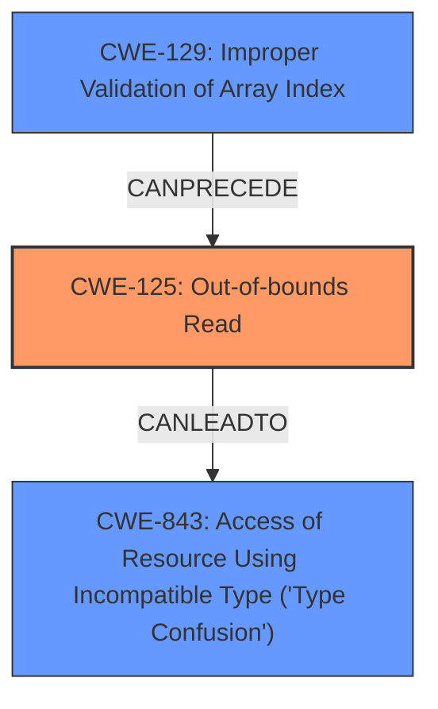

# Raw Analyzer Response for CVE-2020-35632

# Summary
| CWE ID | CWE Name | Confidence | CWE Abstraction Level | CWE Vulnerability Mapping Label | CWE-Vulnerability Mapping Notes |
|---|---|---|---|---|---|
| CWE-125 | Out-of-bounds Read | 1.0 | Base | Allowed | Primary CWE |
| CWE-843 | Access of Resource Using Incompatible Type ('Type Confusion') | 0.7 | Base | Allowed | Secondary CWE |
| CWE-129 | Improper Validation of Array Index | 0.6 | Variant | Allowed | Secondary CWE |

## Evidence and Confidence

*   **Confidence Score:** 0.8
*   **Evidence Strength:** HIGH

## Relationship Analysis
The primary CWE is CWE-125, which represents the **out-of-bounds read** vulnerability. CWE-843 (Type Confusion) is a related weakness that can arise from the **out-of-bounds read**, as reading from an unexpected memory location can lead to interpreting data as the wrong type. CWE-129 (Improper Validation of Array Index) can precede CWE-125 as the root cause for accessing memory out of bounds.

## Vulnerability Chain
The vulnerability chain starts with the lack of proper input validation (potentially CWE-129). This leads to an **out-of-bounds read** (CWE-125), which can then cause **type confusion** (CWE-843). The final impact is code execution.

## Summary of Analysis
The primary vulnerability is an **out-of-bounds read** (CWE-125) in the Nef polygon-parsing functionality of CGAL. This is supported by the vulnerability description, which states "A specially crafted malformed file can lead to an **out-of-bounds read** and **type confusion**, which could lead to code execution." The "CVE Reference Links Content Summary" confirms that the root cause is a lack of proper bounds checking, leading to out-of-bounds reads due to unchecked indices. The type confusion (CWE-843) arises as a consequence of reading from unexpected memory locations. The lack of validation of array indices (CWE-129) leads to the out-of-bounds read.

CWE-125 is the most specific and accurate representation of the core vulnerability. The other CWEs were considered because of their relationship to the out-of-bounds read, either as a cause (CWE-129) or a consequence (CWE-843).

**CWE Considered But Not Used:**

*   CWE-190, CWE-197, CWE-193, CWE-128, CWE-787, CWE-122: These CWEs were considered as possibilities, but they didn't directly describe the **out-of-bounds read** vulnerability. They were also not explicitly listed as a weakness in the description.
*   CWE-1284: While the vulnerability does involve input, the core issue is the out-of-bounds access rather than the validation of the specified quantity itself, making CWE-125 a more direct fit.

Relevant CWE Information:

# Enhanced Context (25 CWEs)

## CWE-125: Out-of-bounds Read
**CWE-125 (Out-of-bounds Read)**: This is the primary CWE because the vulnerability description explicitly mentions "out-of-bounds read". The "CVE Reference Links Content Summary" confirms that the root cause is a lack of proper bounds checking when parsing Nef polygon data, leading to out-of-bounds reads due to unchecked indices used to access data vectors. The "CVE Reference Links Content Summary" states: "The primary vulnerability is an out-of-bounds read due to the unchecked use of parsed indices... If the index is negative or greater than or equal to the vector size, an out-of-bounds read occurs." Confidence: 1.0

## CWE-843: Access of Resource Using Incompatible Type ('Type Confusion')
**CWE-843 (Access of Resource Using Incompatible Type ('Type Confusion'))**: The vulnerability description mentions "type confusion" as a secondary weakness. The "CVE Reference Links Content Summary" explains that the **out-of-bounds read** can lead to type confusion, as the code might access memory that is not intended and treat data of one type as a different type. This makes CWE-843 a relevant secondary CWE. Confidence: 0.7

## CWE-129: Improper Validation of Array Index
**CWE-129 (Improper Validation of Array Index)**: The "CVE Reference Links Content Summary" indicates that the parsing functions lack appropriate checks on the input data, specifically the indices read from the file. This lack of validation directly contributes to the possibility of an **out-of-bounds read**. This makes CWE-129 a valid, secondary CWE to consider. Confidence: 0.6