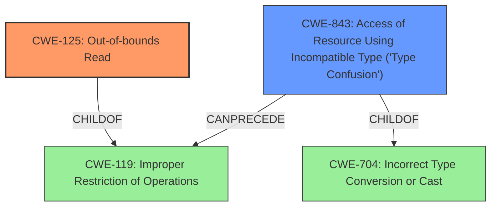

# Enhanced Analysis for CVE-2020-35635

# Summary
| CWE ID    | CWE Name                                                 | Confidence | CWE Abstraction Level | CWE Vulnerability Mapping Label | CWE-Vulnerability Mapping Notes |
| :---------- | :------------------------------------------------------- | :--------- | :---------------------- | :------------------------------ | :------------------------------ |
| CWE-125     | Out-of-bounds Read                                       | 0.9        | Base                    | Primary                         | Allowed                         |
| CWE-843     | Access of Resource Using Incompatible Type ('Type Confusion') | 0.7        | Base                    | Secondary                       | Allowed                         |

## Evidence and Confidence

*   **Confidence Score:** 0.8
*   **Evidence Strength:** HIGH

## Relationship Analysis
The primary weakness is **CWE-125 (Out-of-bounds Read)** which occurs when the product reads data past the end, or before the beginning, of the intended buffer. **CWE-843 (Access of Resource Using Incompatible Type ('Type Confusion'))** is a secondary weakness where the product accesses a resource using a type incompatible with its original type. These weaknesses can occur independently but can also be related in exploitation.



## Vulnerability Chain
The vulnerability chain begins with a specially crafted malformed file that leads to an **out-of-bounds read** (CWE-125) and **type confusion** (CWE-843) in the Nef polygon-parsing functionality of CGAL. This can then lead to code execution.

## Summary of Analysis
The initial analysis focused on the two key weaknesses identified in the description: **out-of-bounds read** and **type confusion**. The description states: "A specially crafted malformed file can lead to an **out-of-bounds read** and **type confusion**, which could lead to code execution."

The primary CWE is **CWE-125 (Out-of-bounds Read)** because the vulnerability description explicitly mentions an **out-of-bounds read** as a direct consequence of the malformed file. The description for CWE-125 states: "The product reads data past the end, or before the beginning, of the intended buffer."

The secondary CWE is **CWE-843 (Access of Resource Using Incompatible Type ('Type Confusion'))** because the vulnerability description also explicitly mentions **type confusion**. The description for CWE-843 states: "The product allocates or initializes a resource such as a pointer, object, or variable using one type, but it later accesses that resource using a type that is incompatible with the original type."

CWE-129 (Improper Validation of Array Index) was considered due to its high scores in the retriever results. However, there is no explicit evidence of **improper validation** in the provided description. The description simply states an **out-of-bounds read** occurs due to a malformed file. Therefore, CWE-129 is not selected.

CWE-787 (Out-of-bounds Write) was also considered due to its presence in the retriever results, especially for the "code execution" impact. However, the initial trigger is an **out-of-bounds read**, not a write. Therefore, CWE-787 is not selected as a primary weakness.


## CWE Relationship Analysis

Current CWEs represent these abstraction levels: .


### Vulnerability Chain Analysis

**Chain starting from CWE-787:**
- 787 (Out-of-bounds Write) - ROOT


**Chain starting from CWE-843:**
- 843 (Access of Resource Using Incompatible Type ('Type Confusion')) - ROOT


### CWE Relationship Diagram

```mermaid
graph TD
    classDef primary fill:#f96,stroke:#333,stroke-width:2px
    classDef secondary fill:#69f,stroke:#333
    classDef tertiary fill:#9e9,stroke:#333
```