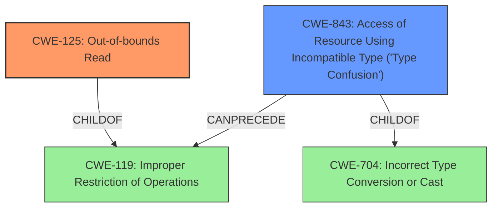

# Analysis for CVE-2020-35635

# Summary
| CWE ID    | CWE Name                                                 | Confidence | CWE Abstraction Level | CWE Vulnerability Mapping Label | CWE-Vulnerability Mapping Notes |
| :---------- | :------------------------------------------------------- | :--------- | :---------------------- | :------------------------------ | :------------------------------ |
| CWE-125     | Out-of-bounds Read                                       | 0.9        | Base                    | Primary                         | Allowed                         |
| CWE-843     | Access of Resource Using Incompatible Type ('Type Confusion') | 0.7        | Base                    | Secondary                       | Allowed                         |

## Evidence and Confidence

*   **Confidence Score:** 0.8
*   **Evidence Strength:** HIGH

## Relationship Analysis
The primary weakness is **CWE-125 (Out-of-bounds Read)** which occurs when the product reads data past the end, or before the beginning, of the intended buffer. **CWE-843 (Access of Resource Using Incompatible Type ('Type Confusion'))** is a secondary weakness where the product accesses a resource using a type incompatible with its original type. These weaknesses can occur independently but can also be related in exploitation.

## Vulnerability Chain
The vulnerability chain begins with a specially crafted malformed file that leads to an **out-of-bounds read** (CWE-125) and **type confusion** (CWE-843) in the Nef polygon-parsing functionality of CGAL. This can then lead to code execution.

## Summary of Analysis
The initial analysis focused on the two key weaknesses identified in the description: **out-of-bounds read** and **type confusion**. The description states: "A specially crafted malformed file can lead to an **out-of-bounds read** and **type confusion**, which could lead to code execution."

The primary CWE is **CWE-125 (Out-of-bounds Read)** because the vulnerability description explicitly mentions an **out-of-bounds read** as a direct consequence of the malformed file. The description for CWE-125 states: "The product reads data past the end, or before the beginning, of the intended buffer."

The secondary CWE is **CWE-843 (Access of Resource Using Incompatible Type ('Type Confusion'))** because the vulnerability description also explicitly mentions **type confusion**. The description for CWE-843 states: "The product allocates or initializes a resource such as a pointer, object, or variable using one type, but it later accesses that resource using a type that is incompatible with the original type."

CWE-129 (Improper Validation of Array Index) was considered due to its high scores in the retriever results. However, there is no explicit evidence of **improper validation** in the provided description. The description simply states an **out-of-bounds read** occurs due to a malformed file. Therefore, CWE-129 is not selected.

CWE-787 (Out-of-bounds Write) was also considered due to its presence in the retriever results, especially for the "code execution" impact. However, the initial trigger is an **out-of-bounds read**, not a write. Therefore, CWE-787 is not selected as a primary weakness.

# Enhanced Query for CVE-2020-35635

# Vulnerability Description

    A code execution vulnerability exists in the Nef polygon-parsing functionality of CGAL libcgal CGAL-5.1.1 in Nef_S2/SNC_io_parser.h SNC_io_parserread_sface() store_sm_boundary_item() Sloop_of OOB read. A specially crafted malformed file can lead to an **out-of-bounds read** and **type confusion**, which could lead to code execution. An attacker can provide malicious input to trigger this vulnerability.

    # Keyphrase-Specific CWE Analysis
    This vulnerability contains multiple keyphrases that may map to different CWEs. 
    Please analyze each keyphrase separately and determine the most appropriate CWE(s) for each.

    ## WEAKNESS: 'out-of-bounds read'

Relevant CWEs for this WEAKNESS:

### 1. CWE-129: Improper Validation of Array Index (Score: 800.04)

The product uses untrusted input when calculating or using an array index, but the product does not validate or incorrectly validates the index to ensure the index references a valid position within the array....

### 2. CWE-125: Out-of-bounds Read (Score: 582.30)

The product reads data past the end, or before the beginning, of the intended buffer....

### 3. CWE-190: Integer Overflow or Wraparound (Score: 383.17)

The product performs a calculation that can
         produce an integer overflow or wraparound when the logic
         assumes that the resulting value will always be larger than
         the original value. This occurs when an integer value is
         incremented to a value that is too large to st...

### 4. CWE-787: Out-of-bounds Write (Score: 377.62)

The product writes data past the end, or before the beginning, of the intended buffer....

### 5. CWE-122: Heap-based Buffer Overflow (Score: 369.67)

A heap overflow condition is a buffer overflow, where the buffer that can be overwritten is allocated in the heap portion of memory, generally meaning that the buffer was allocated using a routine such as malloc()....

## WEAKNESS: 'type confusion'

Relevant CWEs for this WEAKNESS:

### 1. CWE-129: Improper Validation of Array Index (Score: 800.04)

The product uses untrusted input when calculating or using an array index, but the product does not validate or incorrectly validates the index to ensure the index references a valid position within the array....

### 2. CWE-125: Out-of-bounds Read (Score: 582.30)

The product reads data past the end, or before the beginning, of the intended buffer....

### 3. CWE-190: Integer Overflow or Wraparound (Score: 383.17)

The product performs a calculation that can
         produce an integer overflow or wraparound when the logic
         assumes that the resulting value will always be larger than
         the original value. This occurs when an integer value is
         incremented to a value that is too large to st...

### 4. CWE-843: Access of Resource Using Incompatible Type ('Type Confusion') (Score: 355.67)

The product allocates or initializes a resource such as a pointer, object, or variable using one type, but it later accesses that resource using a type that is incompatible with the original type....

### 5. CWE-197: Numeric Truncation Error (Score: 325.01)

Truncation errors occur when a primitive is cast to a primitive of a smaller size and data is lost in the conversion....

## IMPACT: 'code execution'

Relevant CWEs for this IMPACT:

### 1. CWE-129: Improper Validation of Array Index (Score: 800.04)

The product uses untrusted input when calculating or using an array index, but the product does not validate or incorrectly validates the index to ensure the index references a valid position within the array....

### 2. CWE-125: Out-of-bounds Read (Score: 582.30)

The product reads data past the end, or before the beginning, of the intended buffer....

### 3. CWE-190: Integer Overflow or Wraparound (Score: 383.17)

The product performs a calculation that can
         produce an integer overflow or wraparound when the logic
         assumes that the resulting value will always be larger than
         the original value. This occurs when an integer value is
         incremented to a value that is too large to st...

### 4. CWE-787: Out-of-bounds Write (Score: 377.62)

The product writes data past the end, or before the beginning, of the intended buffer....

### 5. CWE-122: Heap-based Buffer Overflow (Score: 369.67)

A heap overflow condition is a buffer overflow, where the buffer that can be overwritten is allocated in the heap portion of memory, generally meaning that the buffer was allocated using a routine such as malloc()....

## ATTACKER: 'attacker'

Relevant CWEs for this ATTACKER:

### 1. CWE-129: Improper Validation of Array Index (Score: 800.04)

The product uses untrusted input when calculating or using an array index, but the product does not validate or incorrectly validates the index to ensure the index references a valid position within the array....

### 2. CWE-125: Out-of-bounds Read (Score: 582.30)

The product reads data past the end, or before the beginning, of the intended buffer....

### 3. CWE-190: Integer Overflow or Wraparound (Score: 383.17)

The product performs a calculation that can
         produce an integer overflow or wraparound when the logic
         assumes that the resulting value will always be larger than
         the original value. This occurs when an integer value is
         incremented to a value that is too large to st...

### 4. CWE-787: Out-of-bounds Write (Score: 377.62)

The product writes data past the end, or before the beginning, of the intended buffer....

### 5. CWE-122: Heap-based Buffer Overflow (Score: 369.67)

A heap overflow condition is a buffer overflow, where the buffer that can be overwritten is allocated in the heap portion of memory, generally meaning that the buffer was allocated using a routine such as malloc()....

## PRODUCT: 'CGAL libcgal'

Relevant CWEs for this PRODUCT:

### 1. CWE-129: Improper Validation of Array Index (Score: 800.04)

The product uses untrusted input when calculating or using an array index, but the product does not validate or incorrectly validates the index to ensure the index references a valid position within the array....

### 2. CWE-125: Out-of-bounds Read (Score: 582.30)

The product reads data past the end, or before the beginning, of the intended buffer....

### 3. CWE-190: Integer Overflow or Wraparound (Score: 383.17)

The product performs a calculation that can
         produce an integer overflow or wraparound when the logic
         assumes that the resulting value will always be larger than
         the original value. This occurs when an integer value is
         incremented to a value that is too large to st...

### 4. CWE-787: Out-of-bounds Write (Score: 377.62)

The product writes data past the end, or before the beginning, of the intended buffer....

### 5. CWE-122: Heap-based Buffer Overflow (Score: 369.67)

A heap overflow condition is a buffer overflow, where the buffer that can be overwritten is allocated in the heap portion of memory, generally meaning that the buffer was allocated using a routine such as malloc()....

## VERSION: 'CGAL-5.1.1'

Relevant CWEs for this VERSION:

### 1. CWE-129: Improper Validation of Array Index (Score: 800.04)

The product uses untrusted input when calculating or using an array index, but the product does not validate or incorrectly validates the index to ensure the index references a valid position within the array....

### 2. CWE-125: Out-of-bounds Read (Score: 582.30)

The product reads data past the end, or before the beginning, of the intended buffer....

### 3. CWE-190: Integer Overflow or Wraparound (Score: 383.17)

The product performs a calculation that can
         produce an integer overflow or wraparound when the logic
         assumes that the resulting value will always be larger than
         the original value. This occurs when an integer value is
         incremented to a value that is too large to st...

### 4. CWE-787: Out-of-bounds Write (Score: 377.62)

The product writes data past the end, or before the beginning, of the intended buffer....

### 5. CWE-122: Heap-based Buffer Overflow (Score: 369.67)

A heap overflow condition is a buffer overflow, where the buffer that can be overwritten is allocated in the heap portion of memory, generally meaning that the buffer was allocated using a routine such as malloc()....

## COMPONENT: 'Nef polygon-parsing functionality'

Relevant CWEs for this COMPONENT:

### 1. CWE-129: Improper Validation of Array Index (Score: 800.04)

The product uses untrusted input when calculating or using an array index, but the product does not validate or incorrectly validates the index to ensure the index references a valid position within the array....

### 2. CWE-125: Out-of-bounds Read (Score: 582.30)

The product reads data past the end, or before the beginning, of the intended buffer....

### 3. CWE-190: Integer Overflow or Wraparound (Score: 383.17)

The product performs a calculation that can
         produce an integer overflow or wraparound when the logic
         assumes that the resulting value will always be larger than
         the original value. This occurs when an integer value is
         incremented to a value that is too large to st...

### 4. CWE-787: Out-of-bounds Write (Score: 377.62)

The product writes data past the end, or before the beginning, of the intended buffer....

### 5. CWE-122: Heap-based Buffer Overflow (Score: 369.67)

A heap overflow condition is a buffer overflow, where the buffer that can be overwritten is allocated in the heap portion of memory, generally meaning that the buffer was allocated using a routine such as malloc()....

    # Analysis Instructions
    1. For each keyphrase, identify the most appropriate CWE(s) that represent the weakness.
    2. Consider how the different keyphrases might relate to each other in the vulnerability chain.
    3. Provide a final determination of primary CWE(s) and any secondary CWEs.
    4. Format your response using the standard analysis template.

    Please analyze how these different weaknesses interact and provide a comprehensive CWE classification.
    