# Analysis Report for CVE-2020-3566

# Vulnerability Analysis Report: CVE-2020-3566

## Description


## Analysis (with Relationship Data)

# Summary
| CWE ID | CWE Name | Confidence | CWE Abstraction Level | CWE Vulnerability Mapping Label | CWE-Vulnerability Mapping Notes |
|---|---|---|---|---|---|
| CWE-770 | Allocation of Resources Without Limits or Throttling | 0.9 | Base | Allowed | Primary CWE |
| CWE-400 | Uncontrolled Resource Consumption | 0.7 | Class | Discouraged | Secondary Candidate |
| CWE-406 | Insufficient Control of Network Message Volume (Network Amplification) | 0.6 | Class | Allowed-with-Review | Secondary Candidate |

## Evidence and Confidence

*   **Confidence Score:** 0.9
*   **Evidence Strength:** HIGH

## Relationship Analysis
The primary CWE selected is CWE-770, which is a Base level CWE and a child of CWE-400. CWE-400 represents a more general class of vulnerabilities related to uncontrolled resource consumption. CWE-406 is also related as it deals with insufficient control of network message volume, potentially leading to resource exhaustion. The hierarchical relationship influenced the decision by guiding towards the more specific CWE-770 when the evidence supported it.

```mermaid
graph TD
    cwe770["CWE-770: Allocation of Resources Without Limits or Throttling"]
    cwe400["CWE-400: Uncontrolled Resource Consumption"]
    cwe406["CWE-406: Insufficient Control of Network Message Volume (Network Amplification)"]

    cwe770 -->|CHILDOF| cwe400
    cwe406 -->|CHILDOF| cwe405

    classDef primary fill:#f96,stroke:#333,stroke-width:2px
    classDef secondary fill:#69f,stroke:#333
    class cwe770 primary
    class cwe400,cwe406 secondary
```



## Vulnerability Chain
The vulnerability chain begins with **insufficient queue management for Internet Group Management Protocol (IGMP) packets**, leading to **allocation of resources without limits or throttling (CWE-770)**, which eventually causes **memory exhaustion** and instability of other processes.

## Summary of Analysis
The initial analysis focused on the **insufficient queue management for Internet Group Management Protocol (IGMP) packets** as the root cause, which leads to memory exhaustion. The "CVE Reference Links Content Summary" section supports this by stating that the vulnerability stems from the incorrect handling of IGMP packets, leading to excessive resource consumption.

The retriever results highlighted CWE-770 as a strong candidate due to its description aligning with the vulnerability's root cause: "The product allocates a reusable resource or group of resources on behalf of an actor without imposing any restrictions on the size or number of resources that can be allocated." This perfectly matches the **insufficient queue management** issue where the system doesn't limit the resources allocated for IGMP packets.

CWE-400 was considered but deemed less specific. While it describes "Uncontrolled Resource Consumption," CWE-770 pinpoints the exact weakness: the allocation of resources without limits.

CWE-406 was also considered because the vulnerability involves network traffic (IGMP packets). However, CWE-770 is a better fit because the core issue is the **unlimited allocation of resources**, not necessarily the volume of network traffic itself.

The decision to select CWE-770 is based on the evidence from the vulnerability description and the CVE reference, which clearly indicates **insufficient queue management** resulting in **unlimited resource allocation**. This is further supported by the retriever results, which gives CWE-770 a high similarity score.

The selected CWEs are at the optimal level of specificity because CWE-770 directly addresses the root cause of the vulnerability, while CWE-400 and CWE-406 represent broader categories.

Relevant CWE Information:

# Enhanced Context (25 CWEs)

## CWE-664: Improper Control of a Resource Through its Lifetime
**Abstraction Level**: Pillar
**Similarity Score**: 0.76
**Source**: dense
**Description**:
The product does not maintain or incorrectly maintains control over a resource throughout its lifetime of creation, use, and release.
**Mapping Guidance**: Discouraged because it is a high-level CWE when lower-level children are available.

## CWE-404: Improper Resource Shutdown or Release
**Abstraction Level**: Class
**Similarity Score**: 0.76
**Source**: dense
**Description**:
The product does not release or incorrectly releases a resource before it is made available for re-use.
**Mapping Guidance**: Allowed-with-Review because it is a Class and might have Base-level children that would be more appropriate.

## CWE-405: Asymmetric Resource Consumption (Amplification)
**Abstraction Level**: Class
**Similarity Score**: 0.76
**Source**: dense
**Description**:
The product does not properly control situations in which an adversary can cause the product to consume or produce excessive resources without requiring the adversary to invest equivalent work or otherwise prove authorization, i.e., the adversary's influence is "asymmetric."
**Mapping Guidance**: Allowed-with-Review because it is a Class and might have Base-level children that would be more appropriate.

## CWE-1220: Insufficient Granularity of Access Control
**Abstraction Level**: Base
**Similarity Score**: 0.75
**Source**: dense
**Description**:
The product implements access controls via a policy or other feature with the intention to disable or restrict accesses (reads and/or writes) to assets in a system from untrusted agents. However, implemented access controls lack required granularity, which renders the control policy too broad because it allows accesses from unauthorized agents to the security-sensitive assets.
**Mapping Guidance**: Allowed.

## CWE-799: Improper Control of Interaction Frequency
**Abstraction Level**: Class
**Similarity Score**: 0.75
**Source**: dense
**Description**:
The product does not properly limit the number or frequency of interactions that it has with an actor, such as the number of incoming requests.
**Mapping Guidance**: Allowed-with-Review because it is a Class and might have Base-level children that would be more appropriate.

## CWE-653: Improper Isolation or Compartmentalization
**Abstraction Level**: Class
**Similarity Score**: 0.75
**Source**: dense
**Description**:
The product does not properly compartmentalize or isolate functionality, processes, or resources that require different privilege levels, rights, or permissions.
**Mapping Guidance**: Allowed.

## CWE-1289: Improper Validation of Unsafe Equivalence in Input
**Abstraction Level**: Base
**Similarity Score**: 0.75
**Source**: dense
**Description**:
The product receives an input value that is used as a resource identifier or other type of reference, but it does not validate or incorrectly validates that the input is equivalent to a potentially-unsafe value.
**Mapping Guidance**: Allowed.

## CWE-226: Sensitive Information in Resource Not Removed Before Reuse
**Abstraction Level**: Base
**Similarity Score**: 0.75
**Source**: dense
**Description**:
The product releases a resource such as memory or a file so that it can be made available for reuse, but it does not clear or "zeroize" the information contained in the resource before the product performs a critical state transition or makes the resource available for reuse by other entities.
**Mapping Guidance**: Allowed.

## CWE-668: Exposure of Resource to Wrong Sphere
**Abstraction Level**: Class
**Similarity Score**: 0.75
**Source**: dense
**Description**:
The product exposes a resource to the wrong control sphere, providing unintended actors with inappropriate access to the resource.
**Mapping Guidance**: Discouraged because it is high-level.

## CWE-691: Insufficient Control Flow Management
**Abstraction Level**: Pillar
**Similarity Score**: 0.75
**Source**: dense
**Description**:
The code does not sufficiently manage its control flow during execution, creating conditions in which the control flow can be modified in unexpected ways.
**Mapping Guidance**: Discouraged because it is extremely high-level.

## CWE-770: Allocation of Resources Without Limits or Throttling
**Abstraction Level**: Base
**Similarity Score**: 8239.52
**Source**: sparse
**Description**:
The product allocates a reusable resource or group of resources on behalf of an actor without imposing any restrictions on the size or number of resources that can be allocated, in violation of the intended security policy for that actor.
**Mapping Guidance**: Allowed.

## CWE-1284: Improper Validation of Specified Quantity in Input
**Abstraction Level**: Base
**Similarity Score**: 7978.67
**Source**: sparse
**Description**:
The product receives input that is expected to specify a quantity (such as size or length), but it does not validate or incorrectly validates that the quantity has the required properties.
**Mapping Guidance**: Allowed.

## CWE-789: Memory Allocation with Excessive Size Value
**Abstraction Level**: Variant
**Similarity Score**: 7876.04
**Source**: sparse
**Description**:
The product allocates memory based on an untrusted, large size value, but it does not ensure that the size is within expected limits, allowing arbitrary amounts of memory


## CWE Relationship Analysis

Current CWEs represent these abstraction levels: .


### Vulnerability Chain Analysis

**Chain starting from CWE-691:**
- 691 (Insufficient Control Flow Management) - ROOT


**Chain starting from CWE-664:**
- 664 (Improper Control of a Resource Through its Lifetime) - ROOT


### CWE Relationship Diagram

```mermaid
graph TD
    classDef primary fill:#f96,stroke:#333,stroke-width:2px
    classDef secondary fill:#69f,stroke:#333
    classDef tertiary fill:#9e9,stroke:#333
```


*Report generated on 2025-04-02 00:45:31*
