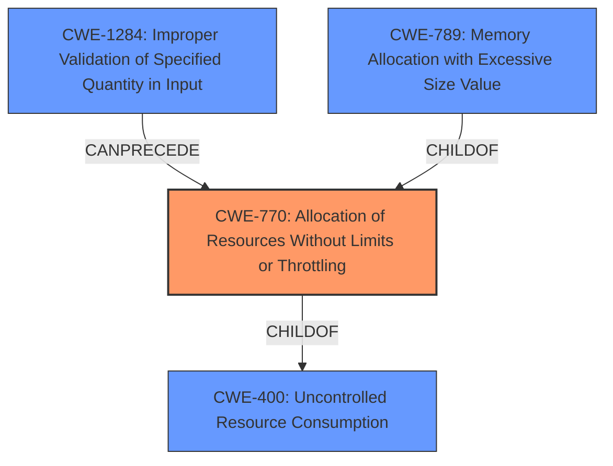

# Raw Analyzer Response for CVE-2020-3569

# Summary
| CWE ID | CWE Name | Confidence | CWE Abstraction Level | CWE Vulnerability Mapping Label | CWE-Vulnerability Mapping Notes |
|---|---|---|---|---|---|
| CWE-770 | Allocation of Resources Without Limits or Throttling | 0.9 | Base | Allowed | Primary CWE |
| CWE-1284 | Improper Validation of Specified Quantity in Input | 0.8 | Base | Allowed | Secondary Candidate |
| CWE-400 | Uncontrolled Resource Consumption | 0.6 | Class | Discouraged | Secondary Candidate |
| CWE-789 | Memory Allocation with Excessive Size Value | 0.6 | Variant | Allowed | Secondary Candidate |

## Evidence and Confidence

*   **Confidence Score:** 0.8
*   **Evidence Strength:** HIGH

## Relationship Analysis
The primary CWE, CWE-770 (Allocation of Resources Without Limits or Throttling), is a Base level CWE. Its parent is CWE-400 (Uncontrolled Resource Consumption), which is a Class level CWE. CWE-1284 (Improper Validation of Specified Quantity in Input) can precede CWE-770. CWE-789 (Memory Allocation with Excessive Size Value) is a variant of CWE-770. The relationships show a chain from input to resource allocation to potential memory issues, but the most descriptive weakness is CWE-770.

## Vulnerability Chain
The vulnerability chain starts with **incorrect handling of IGMP packets**, potentially leading to **memory exhaustion** and finally resulting in the **crash of the IGMP process**, which can destabilize other processes on the device.

## Summary of Analysis
Initially, the **incorrect handling of IGMP packets** leading to **memory exhaustion** pointed towards a resource management issue. The "Vulnerability Description Key Phrases" mention **incorrect handling of IGMP packets**, which is the root cause. The "CVE Reference Links Content Summary" confirms that the **improper input handling** of crafted IGMP packets can lead to **memory exhaustion**. This confirms the root cause is that the software does not limit the amount of resources allocated based on the input.

CWE-770 (Allocation of Resources Without Limits or Throttling) directly addresses the core issue of the product allocating resources without proper restrictions, potentially leading to denial of service. The vulnerability description states that the **incorrect handling of IGMP packets** can cause the IGMP process to **consume available memory and eventually crash**. This aligns with CWE-770's description of allocating resources without limits, violating the intended security policy.

CWE-1284 (Improper Validation of Specified Quantity in Input) is also relevant, as the size or quantity of IGMP packets isn't being validated, contributing to the memory exhaustion. The description states "The product receives input that is expected to specify a quantity (such as size or length), but it does not validate or incorrectly validates that the quantity has the required properties."

CWE-400 (Uncontrolled Resource Consumption) is a more general class, but is still applicable because the attacker is able to influence the amount of resources consumed leading to exhaustion.

CWE-789 (Memory Allocation with Excessive Size Value) suggests that the memory allocation size is not validated, directly causing the memory exhaustion.

The final decision is to use CWE-770 as the primary weakness because it best represents the **allocation of resources without limits**, with the **incorrect handling of IGMP packets** as the trigger. CWE-1284 is a contributing factor, as it describes the lack of validation on the input quantity, which then triggers the excessive memory allocation. CWE-400 is too general. CWE-789 is also relevant, but less descriptive than CWE-770.

Relevant CWE Information:

# Enhanced Context (25 CWEs)
The following CWEs were identified as potentially relevant to this vulnerability:

## CWE-770: Allocation of Resources Without Limits or Throttling
**Abstraction Level**: Base
**Similarity Score**: 8425.08
**Source**: sparse

**Description**:
The product allocates a reusable resource or group of resources on behalf of an actor without imposing any restrictions on the size or number of resources that can be allocated, in violation of the intended security policy for that actor.

**Mapping Guidance**:
- Usage: Allowed
- Rationale: This CWE entry is at the Base level of abstraction, which is a preferred level of abstraction for mapping to the root causes of vulnerabilities.

## CWE-1284: Improper Validation of Specified Quantity in Input
**Abstraction Level**: Base
**Similarity Score**: 8155.31
**Source**: sparse

**Description**:
The product receives input that is expected to specify a quantity (such as size or length), but it does not validate or incorrectly validates that the quantity has the required properties.

**Mapping Guidance**:
- Usage: Allowed
- Rationale: This CWE entry is at the Base level of abstraction, which is a preferred level of abstraction for mapping to the root causes of vulnerabilities.

## CWE-400: Uncontrolled Resource Consumption
**Abstraction Level**: Class
**Similarity Score**: 0.721
**Source**: dense

**Description**:
The product does not properly control the allocation and maintenance of a limited resource, thereby enabling an actor to influence the amount of resources consumed, eventually leading to the exhaustion of available resources.

**Mapping Guidance**:
- Usage: Discouraged
- Rationale: CWE-400 is intended for incorrect behaviors in which the product is expected to track and restrict how many resources it consumes, but CWE-400 is often misused because it is conflated with the "technical impact" of vulnerabilities in which resource consumption occurs. It is sometimes used for low-information vulnerability reports. It is a level-1 Class (i.e., a child of a Pillar).

## CWE-789: Memory Allocation with Excessive Size Value
**Abstraction Level**: Variant
**Similarity Score**: 8287.16
**Source**: sparse

**Description**:
The product allocates memory based on an untrusted, large size value, but it does not ensure that the size is within expected limits, allowing arbitrary amounts of memory to be allocated.

**Mapping Guidance**:
- Usage: Allowed
- Rationale: This CWE entry is at the Variant level of abstraction, which is a preferred level of abstraction for mapping to the root causes of vulnerabilities.