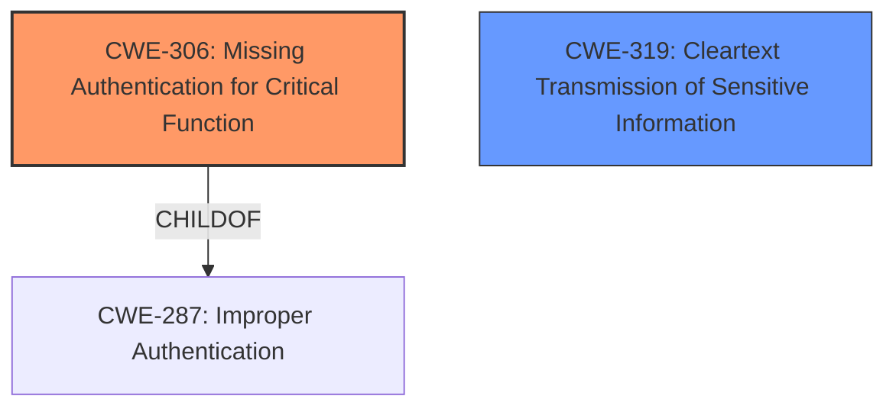

# Enhanced Analysis for CVE-2020-35756

# Summary
| CWE ID | CWE Name | Confidence | CWE Abstraction Level | CWE Vulnerability Mapping Label | CWE-Vulnerability Mapping Notes |
|---|---|---|---|---|---|
| CWE-306 | Missing Authentication for Critical Function | 1.0 | Base | Allowed | Primary CWE |
| CWE-319 | Cleartext Transmission of Sensitive Information | 0.9 | Base | Allowed | Secondary CWE |

## Evidence and Confidence

*   **Confidence Score:** 0.95
*   **Evidence Strength:** HIGH

## Relationship Analysis
The primary relationship influencing the selection of CWE-306 is its direct relevance to the vulnerability description, as the luci_service daemon **lacks authentication** for a critical function (returning the device configuration password). Additionally, the vulnerability also involves the transmission of this password in **cleartext**, leading to the inclusion of CWE-319. CWE-306 is a child of CWE-287 (Improper Authentication), indicating a more specific case of authentication failure.



## Vulnerability Chain
The vulnerability chain starts with the **missing authentication** (CWE-306) for the `GETPASS` command. Because of this missing authentication, the device configuration password is then transmitted in **cleartext** (CWE-319). This ultimately leads to the impact of an **unauthenticated attacker** being able to leak the user's device configuration password.

## Summary of Analysis
Initially, the retriever results suggested CWE-200 (Exposure of Sensitive Information to an Unauthorized Actor). However, CWE-200 is a Class-level CWE that is often misused as a catch-all for loss of confidentiality. The root cause of the vulnerability is the **missing authentication** on the `luci_service` daemon, which allows the device configuration password to be transmitted in cleartext. This directly aligns with CWE-306 (Missing Authentication for Critical Function), which is a Base-level CWE and more accurately represents the root cause.

The vulnerability description clearly states that the `luci_service` daemon running on port 7777 does not require authentication to return the device configuration password in cleartext when using the `GETPASS` command. As such, the selection of CWE-306 is strongly supported by the evidence provided.

The secondary weakness is the transmission of the sensitive password data in cleartext.

CWE-319 (Cleartext Transmission of Sensitive Information) is also selected because the `GETPASS` command returns the device configuration password in cleartext. This selection is supported by the vulnerability description and the CVE Reference Links Content Summary.

The final decision to map CWE-306 and CWE-319 is based on the evidence of **missing authentication** and the **cleartext transmission** of sensitive information, respectively. Both CWEs are at the Base level of abstraction, providing the optimal level of specificity.

Relevant CWE Information:

# Enhanced Context (25 CWEs)
The following CWEs were identified as potentially relevant to this vulnerability:

## CWE-200: Exposure of Sensitive Information to an Unauthorized Actor
**Abstraction:** Class
**Similarity Score**: 5949.98
**Source**: sparse

**Description**:
The product exposes sensitive information to an actor that is not explicitly authorized to have access to that information.

**Mapping Guidance**:
- Usage: Discouraged
- Rationale: CWE-200 is commonly misused to represent the loss of confidentiality in a vulnerability, but confidentiality loss is a technical impact - not a root cause error. As of CWE 4.9, over 400 CWE entries can lead to a loss of confidentiality. Other options are often available. [REF-1287].

## CWE-306: Missing Authentication for Critical Function
**Abstraction:** Base
**Similarity Score**: 5816.96
**Source**: sparse

**Description**:
The product does not perform any authentication for functionality that requires a provable user identity or consumes a significant amount of resources.

**Mapping Guidance**:
- Usage: Allowed
- Rationale: This CWE entry is at the Base level of abstraction, which is a preferred level of abstraction for mapping to the root causes of vulnerabilities.

## CWE-319: Cleartext Transmission of Sensitive Information
**Abstraction:** Base
**Similarity Score**: 5935.89
**Source**: sparse

**Description**:
The product transmits sensitive or security-critical data in cleartext in a communication channel that can be sniffed by unauthorized actors.

**Mapping Guidance**:
- Usage: Allowed
- Rationale: This CWE entry is at the Base level of abstraction, which is a preferred level of abstraction for mapping to the root causes of vulnerabilities.

**CWEs Considered but Not Used:**

*   **CWE-200 (Exposure of Sensitive Information to an Unauthorized Actor):** While the vulnerability results in the exposure of sensitive information, this is a consequence of the **missing authentication** and **cleartext transmission**. CWE-200 is a high-level Class that is discouraged for use as a primary CWE when more specific options are available.
*   **CWE-522 (Insufficiently Protected Credentials)**: This CWE was considered but not used because the root cause is not related to credential protection, but the lack of authentication to access those credentials in the first place.


## CWE Relationship Analysis

Current CWEs represent these abstraction levels: .


### Vulnerability Chain Analysis

**Chain starting from CWE-306:**
- 306 (Missing Authentication for Critical Function) - ROOT


**Chain starting from CWE-287:**
- 287 (Improper Authentication) - ROOT


### CWE Relationship Diagram

```mermaid
graph TD
    classDef primary fill:#f96,stroke:#333,stroke-width:2px
    classDef secondary fill:#69f,stroke:#333
    classDef tertiary fill:#9e9,stroke:#333
```