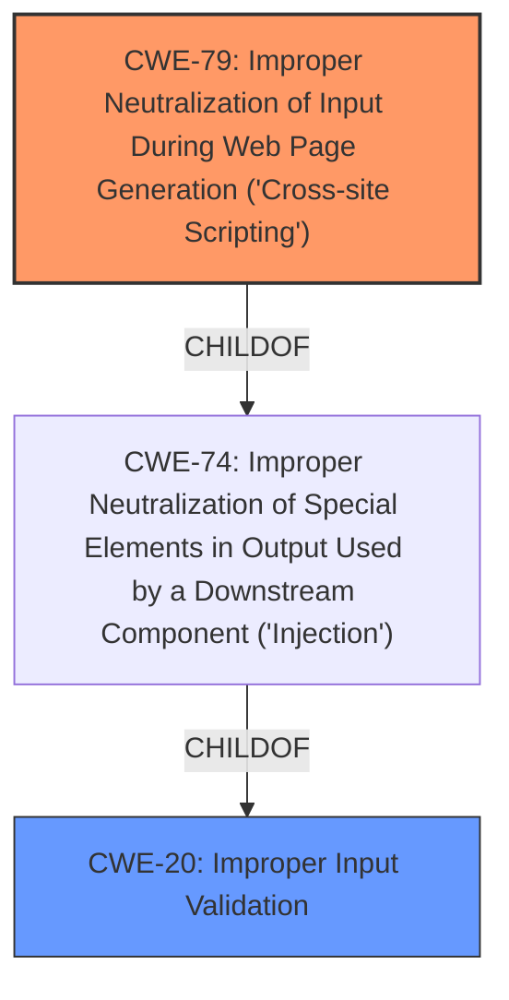

# Raw Analyzer Response for CVE-2020-3580

# Summary

| CWE ID | CWE Name | Confidence | CWE Abstraction Level | CWE Vulnerability Mapping Label | CWE-Vulnerability Mapping Notes |
|---|---|---|---|---|---|
| CWE-79 | Improper Neutralization of Input During Web Page Generation ('Cross-site Scripting') | 1.0 | Base | Allowed | Primary CWE |
| CWE-20 | Improper Input Validation | 0.7 | Class | Discouraged | Secondary Candidate |

## Evidence and Confidence

*   **Confidence Score:** 0.9
*   **Evidence Strength:** HIGH

## Relationship Analysis

The primary relationship influencing the CWE selection is the parent-child relationship between CWE-79 and CWE-74. CWE-79 is a more specific case of improper neutralization that leads to cross-site scripting, making it a better fit than its parent. The retriever results also suggest CWE-20, Improper Input Validation, which is a class-level CWE and a parent of CWE-79 but is too general for this case.

## Vulnerability Chain

The vulnerability chain starts with **insufficient input validation** (which could be mapped to CWE-20, but is implicit in CWE-79) leading to **cross-site scripting** (CWE-79), which then allows an attacker to execute arbitrary script code and access sensitive information.

## Summary of Analysis

The analysis indicates that CWE-79, Improper Neutralization of Input During Web Page Generation ('Cross-site Scripting'), is the most appropriate CWE for this vulnerability. This is supported by the vulnerability description, which explicitly mentions "cross-site scripting" and states that the vulnerabilities are due to **insufficient input validation** of user-supplied input. The "CVE Reference Links Content Summary" also identifies CWE-79 as a weakness.

The retriever results also list CWE-79 as a top candidate. While CWE-20, Improper Input Validation, is also listed, it is a more general class of weakness and the description points to a specific type of vulnerability: XSS. The provided evidence strongly supports the selection of CWE-79 as the primary CWE.

Relevant CWE Information:

# Enhanced Context (25 CWEs)

## CWE-113: Improper Neutralization of CRLF Sequences in HTTP Headers ('HTTP Request/Response Splitting')
**Abstraction Level**: Variant
**Similarity Score**: 0.78
**Source**: dense

**Description**:
The product receives data from an HTTP agent/component (e.g., web server, proxy, browser, etc.), but it does not neutralize or incorrectly neutralizes CR and LF characters before the data is included in outgoing HTTP headers.

**Mapping Guidance**:
- Usage: Allowed
- Rationale: This CWE entry is at the Variant level of abstraction, which is a preferred level of abstraction for mapping to the root causes of vulnerabilities.

## CWE-444: Inconsistent Interpretation of HTTP Requests ('HTTP Request/Response Smuggling')
**Abstraction Level**: Base
**Similarity Score**: 0.74
**Source**: dense

**Description**:
The product acts as an intermediary HTTP agent
         (such as a proxy or firewall) in the data flow between two
         entities such as a client and server, but it does not
         interpret malformed HTTP requests or responses in ways that
         are consistent with how the messages will be processed by
         those entities that are at the ultimate destination.

**Mapping Guidance**:
- Usage: Allowed
- Rationale: This CWE entry is at the Base level of abstraction, which is a preferred level of abstraction for mapping to the root causes of vulnerabilities.

## CWE-644: Improper Neutralization of HTTP Headers for Scripting Syntax
**Abstraction Level**: Variant
**Similarity Score**: 0.73
**Source**: dense

**Description**:
The product does not neutralize or incorrectly neutralizes web scripting syntax in HTTP headers that can be used by web browser components that can process raw headers, such as Flash.

**Mapping Guidance**:
- Usage: Allowed
- Rationale: This CWE entry is at the Variant level of abstraction, which is a preferred level of abstraction for mapping to the root causes of vulnerabilities.

## CWE-162: Improper Neutralization of Trailing Special Elements
**Abstraction Level**: Variant
**Similarity Score**: 0.73
**Source**: dense

**Description**:
The product receives input from an upstream component, but it does not neutralize or incorrectly neutralizes trailing special elements that could be interpreted in unexpected ways when they are sent to a downstream component.

**Mapping Guidance**:
- Usage: Allowed
- Rationale: This CWE entry is at the Variant level of abstraction, which is a preferred level of abstraction for mapping to the root causes of vulnerabilities.

## CWE-80: Improper Neutralization of Script-Related HTML Tags in a Web Page (Basic XSS)
**Abstraction Level**: Variant
**Similarity Score**: 0.70
**Source**: dense

**Description**:
The product receives input from an upstream component, but it does not neutralize or incorrectly neutralizes special characters such as "<", ">", and "&" that could be interpreted as web-scripting elements when they are sent to a downstream component that processes web pages.

**Mapping Guidance**:
- Usage: Allowed
- Rationale: This CWE entry is at the Variant level of abstraction, which is a preferred level of abstraction for mapping to the root causes of vulnerabilities.

## CWE-160: Improper Neutralization of Leading Special Elements
**Abstraction Level**: Variant
**Similarity Score**: 0.70
**Source**: dense

**Description**:
The product receives input from an upstream component, but it does not neutralize or incorrectly neutralizes leading special elements that could be interpreted in unexpected ways when they are sent to a downstream component.

**Mapping Guidance**:
- Usage: Allowed
- Rationale: This CWE entry is at the Variant level of abstraction, which is a preferred level of abstraction for mapping to the root causes of vulnerabilities.

## CWE-163: Improper Neutralization of Multiple Trailing Special Elements
**Abstraction Level**: Variant
**Similarity Score**: 0.70
**Source**: dense

**Description**:
The product receives input from an upstream component, but it does not neutralize or incorrectly neutralizes multiple trailing special elements that could be interpreted in unexpected ways when they are sent to a downstream component.

**Mapping Guidance**:
- Usage: Allowed
- Rationale: This CWE entry is at the Variant level of abstraction, which is a preferred level of abstraction for mapping to the root causes of vulnerabilities.

## CWE-161: Improper Neutralization of Multiple Leading Special Elements
**Abstraction Level**: Variant
**Similarity Score**: 0.70
**Source**: dense

**Description**:
The product receives input from an upstream component, but it does not neutralize or incorrectly neutralizes multiple leading special elements that could be interpreted in unexpected ways when they are sent to a downstream component.

**Mapping Guidance**:
- Usage: Allowed
- Rationale: This CWE entry is at the Variant level of abstraction, which is a preferred level of abstraction for mapping to the root causes of vulnerabilities.

## CWE-150: Improper Neutralization of Escape, Meta, or Control Sequences
**Abstraction Level**: Variant
**Similarity Score**: 0.70
**Source**: dense

**Description**:
The product receives input from an upstream component, but it does not neutralize or incorrectly neutralizes special elements that could be interpreted as escape, meta, or control character sequences when they are sent to a downstream component.

**Mapping Guidance**:
- Usage: Allowed
- Rationale: This CWE entry is at the Variant level of abstraction, which is a preferred level of abstraction for mapping to the root causes of vulnerabilities.

## CWE-436: Interpretation Conflict
**Abstraction Level**: Class
**Similarity Score**: 0.69
**Source**: dense

**Description**:
Product A handles inputs or steps differently than Product B, which causes A to perform incorrect actions based on its perception of B's state.

**Mapping Guidance**:
- Usage: Allowed-with-Review
- Rationale: This CWE entry is a Class and might have Base-level children that would be more appropriate

## CWE-113: Improper Neutralization of CRLF Sequences in HTTP Headers ('HTTP Request/Response Splitting')
**Abstraction Level**: Variant
**Similarity Score**: 9891.89
**Source**: sparse

**Description**:
The product receives data from an HTTP agent/component (e.g., web server, proxy, browser, etc.), but it does not neutralize or incorrectly neutralizes CR and LF characters before the data is included in outgoing HTTP headers.

**Mapping Guidance**: