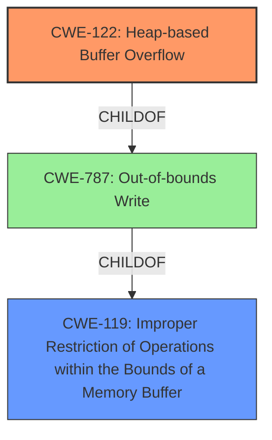

# Enhanced Analysis for CVE-2020-35979

# Summary
| CWE ID | CWE Name | Confidence | CWE Abstraction Level | CWE Vulnerability Mapping Label | CWE-Vulnerability Mapping Notes |
|---|---|---|---|---|---|
| CWE-122 | Heap-based Buffer Overflow | 1.0 | Variant | Allowed | Primary CWE |
| CWE-119 | Improper Restriction of Operations within the Bounds of a Memory Buffer | 0.7 | Class | Discouraged | Secondary Candidate |

## Evidence and Confidence

*   **Confidence Score:** 1.0
*   **Evidence Strength:** HIGH

## Relationship Analysis
The primary relationship that influenced the decision was the hierarchical relationship between CWE-119 (Class) and CWE-122 (Variant). Since the vulnerability is explicitly a **heap-based buffer overflow**, CWE-122 is a more specific and accurate classification than its parent, CWE-119, which is a more general "Improper Restriction of Operations within the Bounds of a Memory Buffer".



## Vulnerability Chain
The vulnerability chain can be described as follows:
1.  The application GPAC **incorrectly handles NALU sizes** in the `gp_rtp_builder_do_avc` function.
2.  This leads to a **heap-based buffer overflow (CWE-122)** when processing a crafted MP4 file.
3.  The overflow can cause a **denial of service (DoS)** or potentially lead to arbitrary code execution.
In this chain, the **heap-based buffer overflow (CWE-122)** is the direct result of the **incorrect handling of NALU sizes**. The potential impacts are DoS or code execution.

## Summary of Analysis
The initial assessment identified the vulnerability as a **heap-based buffer overflow**, based on the vulnerability description and the CVE Reference Links Content Summary. The Retriever results also highlighted several related CWEs, including CWE-119, CWE-122, and others.

The final decision to classify the vulnerability as CWE-122 is based on the explicit mention of "heap-based buffer overflow" in the vulnerability description and the more detailed information in the CVE Reference Links Content Summary. The relationship analysis confirmed that CWE-122 is a more specific variant of CWE-119, making it the more appropriate choice.

The evidence supporting this decision includes:

*   Vulnerability Description Key Phrases: "**weakness:** **heap-based buffer overflow**"
*   CVE Reference Links Content Summary: "The vulnerability is a heap-buffer-overflow in the `gp_rtp_builder_do_avc` function located in `ietf/rtp_pck_mpeg4.c`."

CWE-119 was considered but not selected as the primary CWE because it is a more general class of weakness. While a **buffer overflow** is an instance of **improper restriction of operations within the bounds of a memory buffer**, the description provides enough information to pinpoint the issue as a **heap-based** overflow, making CWE-122 a more precise classification.

Other CWEs such as CWE-190 (Integer Overflow or Wraparound), CWE-197 (Numeric Truncation Error), and CWE-125 (Out-of-bounds Read) were also considered, but they did not directly address the core weakness of a **heap-based buffer overflow**. While these issues might be related or contribute to the vulnerability, they are not the primary cause.

Ultimately, the classification of CWE-122 provides the optimal level of specificity, accurately reflecting the **heap-based buffer overflow** vulnerability in GPAC.


## CWE Relationship Analysis

Current CWEs represent these abstraction levels: .


### Vulnerability Chain Analysis

**Chain starting from CWE-787:**
- 787 (Out-of-bounds Write) - ROOT


**Chain starting from CWE-197:**
- 197 (Numeric Truncation Error) - ROOT


### CWE Relationship Diagram

```mermaid
graph TD
    classDef primary fill:#f96,stroke:#333,stroke-width:2px
    classDef secondary fill:#69f,stroke:#333
    classDef tertiary fill:#9e9,stroke:#333
```