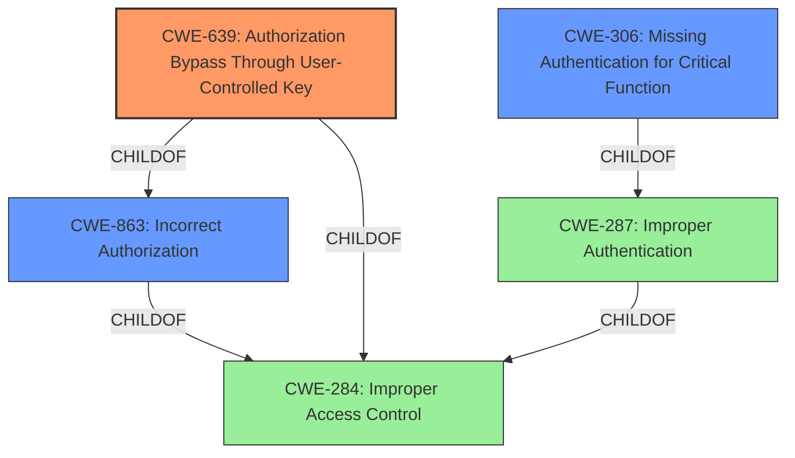

# Analysis for CVE-2020-36125

# Summary
| CWE ID | CWE Name | Confidence | CWE Abstraction Level | CWE Vulnerability Mapping Label | CWE-Vulnerability Mapping Notes |
|---|---|---|---|---|---|
| CWE-639 | Authorization Bypass Through User-Controlled Key | 0.9 | Base | Allowed | Primary CWE |
| CWE-306 | Missing Authentication for Critical Function | 0.7 | Base | Allowed | Secondary Candidate |
| CWE-863 | Incorrect Authorization | 0.6 | Class | Allowed-with-Review | Secondary Candidate |

## Evidence and Confidence

*   **Confidence Score:** 0.9
*   **Evidence Strength:** HIGH

## Relationship Analysis
The primary CWE selected is CWE-639, which is a **Base** level CWE and a child of **CWE-863 (Incorrect Authorization)** and **CWE-284 (Improper Access Control)**. CWE-306 (Missing Authentication for Critical Function) is a child of CWE-287 (Improper Authentication), which in turn is a child of CWE-284. The relationship analysis helps in understanding the hierarchical structure and in selecting the most specific CWE.

## Vulnerability Chain
The vulnerability chain starts with an **incorrect access control** which leads to a bypass of password revalidation.

## Summary of Analysis
The initial analysis focused on the **incorrect access control** root cause, which suggested CWE-284 (Improper Access Control) or its children. However, CWE-284 is a Pillar level CWE and is discouraged. The Retriever Results pointed towards CWE-639 (Authorization Bypass Through User-Controlled Key), CWE-306 (Missing Authentication for Critical Function), and CWE-863 (Incorrect Authorization).

The vulnerability description states that "password revalidation in sensitive operations can be bypassed remotely by an authenticated attacker through requesting the endpoint directly." The CVE Reference Links Content Summary confirms this, stating that "the PAXSTORE marketplace requires password revalidation for sensitive operations... However, this password validation can be bypassed by directly accessing the relevant API endpoints." This indicates a flaw in the authorization process where the system does not properly check if the authenticated user has sufficient entitlements to perform the requested data access, which aligns with **CWE-639 (Authorization Bypass Through User-Controlled Key)**.

While CWE-306 (Missing Authentication for Critical Function) was considered, the vulnerability involves an authenticated attacker, so it's not a case of missing authentication entirely, but rather a bypass of an additional authorization check (password revalidation).

CWE-863 (Incorrect Authorization) is a more general class, while CWE-639 is a specific type of authorization bypass where the user-controlled key is modified to access another user's data or record. The direct API access bypassing the password revalidation mechanism fits well with CWE-639.

Therefore, **CWE-639** is the most appropriate primary CWE, representing the **incorrect access control** that allows bypassing password revalidation via direct endpoint requests. CWE-306 and CWE-863 are secondary candidates, but CWE-639 is more specific.

Relevant CWE Information:

# Enhanced Context (25 CWEs)

## CWE-639: Authorization Bypass Through User-Controlled Key
**Abstraction:** Base
**Status:** Incomplete

### Description
The system's authorization functionality does not prevent one user from gaining access to another user's data or record by modifying the key value identifying the data.

### Mapping Guidance
**Usage:** Allowed
**Rationale:** This CWE entry is at the Base level of abstraction, which is a preferred level of abstraction for mapping to the root causes of vulnerabilities.

## CWE-306: Missing Authentication for Critical Function
**Abstraction:** Base
**Status:** Draft

### Description
The product does not perform any authentication for functionality that requires a provable user identity or consumes a significant amount of resources.

### Mapping Guidance
**Usage:** Allowed
**Rationale:** This CWE entry is at the Base level of abstraction, which is a preferred level of abstraction for mapping to the root causes of vulnerabilities.

## CWE-863: Incorrect Authorization
**Abstraction:** Class
**Status:** Incomplete

### Description
The product performs an authorization check when an actor attempts to access a resource or perform an action, but it does not correctly perform the check.

### Mapping Guidance
**Usage:** Allowed-with-Review
**Rationale:** This CWE entry is a Class and might have Base-level children that would be more appropriate