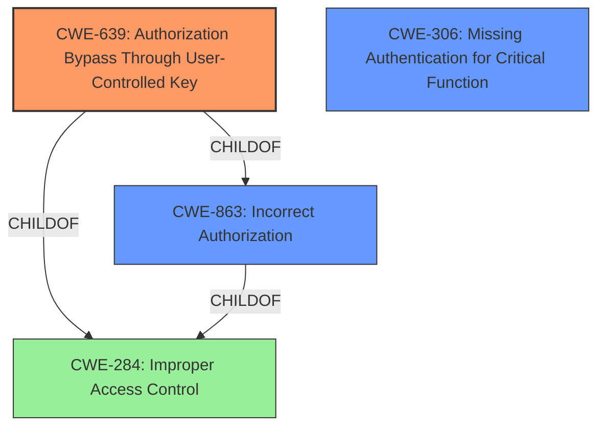

# Analysis for CVE-2020-36126

# Summary
| CWE ID  | CWE Name  | Confidence | CWE Abstraction Level | CWE Vulnerability Mapping Label | CWE-Vulnerability Mapping Notes |
|---|---|---|---|---|---|
| CWE-639 | Authorization Bypass Through User-Controlled Key | 1 | Base  | Allowed | Primary CWE |
| CWE-863 | Incorrect Authorization | 0.7 | Class | Allowed-with-Review | Secondary Candidate |
| CWE-306 | Missing Authentication for Critical Function | 0.6 | Base | Allowed | Secondary Candidate |

## Evidence and Confidence

*   **Confidence Score:** 0.9
*   **Evidence Strength:** HIGH

## Relationship Analysis
The primary CWE selected is CWE-639, which is a Base level CWE and a child of CWE-863 (Incorrect Authorization) and CWE-284 (Improper Access Control). CWE-863 is a Class-level CWE, making CWE-639 more specific and appropriate. CWE-306 (Missing Authentication) is also related to access control, but the vulnerability description focuses on authorization issues rather than a complete lack of authentication. Therefore, CWE-639 is the most accurate representation of the vulnerability's root cause.

## Vulnerability Chain
The vulnerability chain starts with **incorrect access control** (CWE-639) due to the lack of proper authorization checks in the PAXSTORE marketplace APIs. This allows an authenticated user to read and write data not owned by them. The impact of this weakness is privilege escalation, where an attacker can impersonate any user, leading to unauthorized disclosure, modification, or destruction of information.

## Summary of Analysis
The initial analysis identified **incorrect access control** as the primary weakness, aligning with the description of CWE-639 (Authorization Bypass Through User-Controlled Key). The "CVE Reference Links Content Summary" section explicitly mentions Insecure Direct Object References (IDOR) and broken access control as the root cause, further supporting the selection of CWE-639. The retriever results also list CWE-639 as the top candidate.

The evidence from the vulnerability description is:
"Pax Technology PAXSTORE v7.0.8_20200511171508 and lower is affected by **incorrect access control** that can lead to remote privilege escalation."
"The root cause is Insecure Direct Object References (IDOR) in the PAXSTORE marketplace APIs. The API endpoints allow authenticated users to access and manipulate data belonging to other users, applications, and payment terminals, without proper authorization checks."

CWE-639 is chosen because it specifically addresses the scenario where a user can modify a key value to access another user's data, which aligns with the IDOR vulnerability described. The other CWEs considered were either too high-level (CWE-285, CWE-284) or focused on different aspects of access control (CWE-306, CWE-732). Therefore, CWE-639 is the most specific and accurate representation of the vulnerability.

Relevant CWE Information:

# Enhanced Context (25 CWEs)
The following CWEs were identified as potentially relevant to this vulnerability:

## CWE-639: Authorization Bypass Through User-Controlled Key
**Abstraction Level**: Base
**Similarity Score**: 0.76
**Source**: dense

**Description**:
The system's authorization functionality does not prevent one user from gaining access to another user's data or record by modifying the key value identifying the data.

**Mapping Guidance**:
- Usage: Allowed
- Rationale: This CWE entry is at the Base level of abstraction, which is a preferred level of abstraction for mapping to the root causes of vulnerabilities.

## CWE-285: Improper Authorization
**Abstraction Level**: Class

**Description**:
The product does not perform or incorrectly performs an authorization check when an actor attempts to access a resource or perform an action.

**Mapping Guidance**:
**Usage:** Discouraged
**Rationale:** CWE-285 is high-level and lower-level CWEs can frequently be used instead.

## CWE-306: Missing Authentication for Critical Function
**Abstraction Level**: Base

**Description**:
The product does not perform any authentication for functionality that requires a provable user identity or consumes a significant amount of resources.

**Mapping Guidance**:
**Usage:** Allowed
**Rationale:** This CWE entry is at the Base level of abstraction, which is a preferred level of abstraction for mapping to the root causes of vulnerabilities.

I also considered but did not use the following CWEs:

*   **CWE-1220: Insufficient Granularity of Access Control:** This CWE is similar, but the provided information focuses on the bypass of authorization rather than the granularity of the access control itself.
*   **CWE-664: Improper Control of a Resource Through its Lifetime:** This is too broad and doesn't fit the specific issue of authorization bypass.
*   **CWE-668: Exposure of Resource to Wrong Sphere:** This is also too broad and doesn't capture the specific mechanism of authorization bypass.
*   **CWE-274: Improper Handling of Insufficient Privileges:** This is not the root cause, as the issue is with incorrect authorization checks, not the handling of insufficient privileges.
*   **CWE-653: Improper Isolation or Compartmentalization:** This is not relevant to the vulnerability.
*   **CWE-280: Improper Handling of Insufficient Permissions or Privileges:** This is similar to CWE-274 and not the primary root cause.
*   **CWE-404: Improper Resource Shutdown or Release:** This is unrelated to the vulnerability.
*   **CWE-1390: Weak Authentication:** The issue is not with weak authentication, but with authorization after authentication.
*   **CWE-552: Files or Directories Accessible to External Parties:** This is not relevant to the vulnerability.
*   **CWE-613: Insufficient Session Expiration:** This is unrelated to the vulnerability.
*   **CWE-1289: Improper Validation of Unsafe Equivalence in Input:** This is not the primary cause.
*   **CWE-178: Improper Handling of Case Sensitivity:** This is not relevant to the vulnerability.
*   **CWE-73: External Control of File Name or Path:** This is not relevant to the vulnerability.
*   **CWE-41: Improper Resolution of Path Equivalence:** This is not relevant to the vulnerability.
*   **CWE-322: Key Exchange without Entity Authentication:** This is unrelated to the vulnerability.
*   **CWE-289: Authentication Bypass by Alternate Name:** This is not the primary cause.
*   **CWE-911: Improper Update of Reference Count:** This is unrelated to the vulnerability.
*   **CWE-826: Premature Release of Resource During Expected Lifetime:** This is unrelated to the vulnerability.
*   **CWE-942: Permissive Cross-domain Policy with Untrusted Domains:** This is not relevant to the vulnerability.

# Enhanced Query for CVE-2020-36126

## Vulnerability Description
Pax Technology PAXSTORE v7.0.8_20200511171508 and lower is affected by **incorrect access control** that can lead to remote privilege escalation. PAXSTORE marketplace endpoints allow an authenticated user to read and write data not owned by them, including third-party users, application and payment terminals, where an attacker can impersonate any user which may lead to the unauthorized disclosure, modification, or destruction of information.

### Vulnerability Description Key Phrases
- **rootcause:** **incorrect access control**
- **impact:** unauthorized disclosure and modification and destruction of information
- **attacker:** authenticated user
- **product:** Pax Technology PAXSTORE
- **version:** v7.0.8_20200511171508 and lower
- **component:** marketplace endpoints

## CVE Reference Links Content Summary
Based on the provided content, here's a breakdown of the vulnerability information related to CVE-2020-36126:

**Root Cause of Vulnerability:**
- The root cause is Insecure Direct Object References (IDOR) in the PAXSTORE marketplace APIs. The API endpoints allow authenticated users to access and manipulate data belonging to other users, applications, and payment terminals, without proper authorization checks.

**Weaknesses/Vulnerabilities Present:**
- **IDOR Vulnerability:** The core issue is the lack of proper authorization checks when accessing resources via the API. The system uses predictable identifiers (sequential IDs, serial numbers) that can be easily guessed or enumerated by attackers.
- **Broken Access Control:** This is a classic case of broken access control, where users can access resources they are not supposed to.
- **Numerous Vulnerable Endpoints**: The advisory lists 26 different API endpoints vulnerable to IDOR attacks.

**Impact of Exploitation:**
- **Privilege Escalation (Horizontal & Vertical):** Attackers can impersonate other users, including administrators, granting them unauthorized access and privileges within the platform.
- **Data Breaches:** Unauthorized disclosure of sensitive information, including user data, application secrets, and device details, can occur.
- **Data Manipulation:** Attackers can modify or delete data belonging to other users, applications, or terminals, leading to potential fraud, service disruptions, and operational failures.
- **Malware Deployment:** Attackers could force remote installation of malicious applications on thousands of payment terminals managed by PAXSTORE.
- **Botnet Creation:** Attackers could create a botnet of compromised payment terminals for DDoS attacks.
- **Financial Information Theft:** Attackers can target financial information from the terminals or the platform.
- **Terminal Disruption:** Attackers could put payment terminals out of operation.
- **Compromise of Signing Keys:** The document mentions that an attacker can also use another vulnerability to obtain signing keys that would allow them to further compromise terminals.

**Attack Vectors:**
- **API Manipulation:** Attackers exploit the vulnerability by crafting malicious API requests with predictable identifiers to target specific users, applications, or terminals.
- **Authenticated Access:** The attacker needs to be an authenticated user (developer, reseller, or terminal user) to exploit the IDOR vulnerabilities.
- **Knowledge of the API:** The attacker needs some knowledge of the PAXSTORE API structure and endpoints.
- **Enumeration:** Attackers can use techniques like enumeration to discover accessible resources by trying different predictable identifiers.

**Required Attacker Capabilities/Position:**
- The attacker needs to have a valid account on the PAXSTORE platform (e.g., a developer or reseller account).
- The attacker needs to have some knowledge of the PAXSTORE API endpoints and data structure.
- An attacker can exploit these vulnerabilities through the use of standard web application testing tools that allow modifying request parameters.

**Summary**
The advisory details how a multitude of IDOR vulnerabilities in the PAXSTORE API could allow an attacker to take control of other accounts, deploy malicious applications, and disable terminals. The fact that these vulnerabilities could be exploited with standard web app testing tools makes this a high risk issue.

## Retriever Results

### Top Combined Results

| Rank | CWE ID | Name | Abstraction | Usage  | Retrievers | Individual Scores |
|------|--------|------|-------------|-------|------------|-------------------|
| 1 | 639 | Authorization Bypass Through User-Controlled Key | Base | Allowed | sparse | 0.435 |
| 2 | 285 | Improper Authorization | Class | Discouraged | sparse | 0.359 |
| 3 | 306 | Missing Authentication for Critical Function | Base | Allowed | sparse | 0.357 |
| 4 | 732 | Incorrect Permission Assignment for Critical Resource | Class | Allowed-with-Review | sparse | 0.356 |
| 5 | 863 | Incorrect Authorization | Class | Allowed-with-Review | sparse | 0.349 |
| 6 | 269 | Improper Privilege Management | Class | Discouraged | dense | 0.572 |
| 7 | 613 | Insufficient Session Expiration | Base | Allowed | graph | 0.002 |
| 8 | 668 | Exposure of Resource to Wrong Sphere | Class | Discouraged | sparse | 0.348 |
| 9 | 284 | Improper Access Control | Pillar | Discouraged | sparse | 0.348 |
| 10 | 522 | Insufficiently Protected Credentials | Class | Allowed-with-Review | sparse | 0.345 |

# Complete CWE Specifications

## CWE-639: Authorization Bypass Through User-Controlled Key
**Abstraction:** Base
**Status:** Incomplete

### Description
The system's authorization functionality does not prevent one user from gaining access to another user's data or record by modifying the key value identifying the data.

### Extended Description

Retrieval of a user record occurs in the system based on some key value that is under user control. The key would typically identify a user-related record stored in the system and would be used to lookup that record for presentation to the user. It is likely that an attacker would have to be an authenticated user in the system. However, the authorization process would not properly check the data access operation to ensure that the authenticated user performing the operation has sufficient entitlements to perform the requested data access, hence bypassing any other authorization checks present in the system.

For example, attackers can look at places where user specific data is retrieved (e.g. search screens) and determine whether the key for the item being looked up is controllable externally. The key may be a hidden field in the HTML form field, might be passed as a URL parameter or as an unencrypted cookie variable, then in each of these cases it will be possible to tamper with the key value.

One manifestation of this weakness is when a system uses sequential or otherwise easily-guessable session IDs that would allow one user to easily switch to another user's session and read/modify their data.

### Alternative Terms
Insecure Direct Object Reference / IDOR: The "Insecure Direct Object Reference" term, as described in the OWASP Top Ten, is broader than this CWE because it also covers path traversal (CWE-22). Within the context of vulnerability theory, there is a similarity between the OWASP concept and CWE-706: Use of Incorrectly-Resolved Name or Reference.
Broken Object Level Authorization / BOLA: BOLA is used in the 2019 OWASP API Security Top 10 and is said to be the same as IDOR.
Horizontal Authorization: "Horizontal Authorization" is used to describe situations in which two users have the same privilege level, but must be prevented from accessing each other's resources. This is fairly common when using key-based access to resources in a multi-user context.

### Relationships
ChildOf -> CWE-863
ChildOf -> CWE-863
ChildOf -> CWE-284

### Mapping Guidance
**Usage:** Allowed
**Rationale:** This CWE entry is at the Base level of abstraction, which is a preferred level of abstraction for mapping to the root causes of vulnerabilities.
**Comments:** Carefully read both the name and description to ensure that this mapping is an appropriate fit. Do not try to 'force' a mapping to a lower-level Base/Variant simply to comply with this preferred level of abstraction.
**Reasons:**
- Acceptable-Use

### Observed Examples
- **CVE-2021-36539:** An educational application does not appropriately restrict file IDs to a particular user. The attacker can brute-force guess IDs, indicating IDOR.

## CWE-285: Improper Authorization
**Abstraction:** Class
**Status:** Draft

### Description
The product does not perform or incorrectly performs an authorization check when an actor attempts to access a resource or perform an action.

### Extended Description

Assuming a user with a given identity, authorization is the process of determining whether that user can access a given resource, based on the user's privileges and any permissions or other access-control specifications that apply to the resource.

When access control checks are not applied consistently - or not at all - users are able to access data or perform actions that they should not be allowed to perform. This can lead to a wide range of problems, including information exposures, denial of service, and arbitrary code execution.

### Alternative Terms
AuthZ: "AuthZ" is typically used as an abbreviation of "authorization" within the web application security community. It is distinct from "AuthN" (or, sometimes, "AuthC") which is an abbreviation of "authentication." The use of "Auth" as an abbreviation is discouraged, since it could be used for either authentication or authorization.

### Relationships
ChildOf -> CWE-284
ChildOf -> CWE-284

### Mapping Guidance
**Usage:** Discouraged
**Rationale:** CWE-285 is high-level and lower-level CWEs can frequently be used instead. It is a level-1 Class (i.e., a child of a Pillar).
**Comments:** Look at CWE-285's children and consider mapping to CWEs such as CWE-862: Missing Authorization, CWE-863: Incorrect Authorization, CWE-732: Incorrect Permission Assignment for Critical Resource, or others.
**Reasons:**
- Abstraction
**Suggested Alternatives:**
- CWE-862: Missing Authorization
- CWE-863: Incorrect Authorization
- CWE-732: Incorrect Permission Assignment for Critical Resource

### Observed Examples
- **CVE-2022-24730:** Go-based continuous deployment product does not check that a user has certain privileges to update or create an app, allowing adversaries to read sensitive repository information
- **CVE-2009-3168:** Web application does not restrict access to admin scripts, allowing authenticated users to reset administrative passwords.
- **CVE-2009-2960:** Web application does not restrict access to admin scripts, allowing authenticated users to modify passwords of other users.

## CWE-306: Missing Authentication for Critical Function
**Abstraction:** Base
**Status:** Draft

### Description
The product does not perform any authentication for functionality that requires a provable user identity or consumes a significant amount of resources.

### Extended Description
Not provided

### Alternative Terms
None

### Relationships
ChildOf -> CWE-287
ChildOf -> CWE-287

### Mapping Guidance
**Usage:** Allowed
**Rationale:** This CWE entry is at the Base level of abstraction, which is a preferred level of abstraction for mapping to the root causes of vulnerabilities.
**Comments:** Carefully read both the name and description to ensure that this mapping is an appropriate fit. Do not try to 'force' a mapping to a lower-level Base/Variant simply to comply with this preferred level of abstraction.
**Reasons:**
- Acceptable-Use

### Observed Examples
- **CVE-2022-31260:** Chain: a digital asset management program has an undisclosed backdoor in the legacy version of a PHP script (CWE-912) that could allow an unauthenticated user to export metadata (CWE-306)
- **CVE-2022-29951:** TCP-based protocol in Programmable Logic Controller (PLC) has no authentication.
- **CVE-2022-29952:** Condition Monitor firmware uses a protocol that does not require authentication.

## CWE-732: Incorrect Permission Assignment for Critical Resource
**Abstraction:** Class
**Status:** Draft

### Description
The product specifies permissions for a security-critical resource in a way that allows that resource to be read or modified by unintended actors.

### Extended Description
When a resource is given a permission setting that provides access to a wider range of actors than required, it could lead to the exposure of sensitive information, or the modification of that resource by unintended parties. This is especially dangerous when the resource is related to program configuration, execution, or sensitive user data. For example, consider a misconfigured storage account for the cloud that can be read or written by a public or anonymous user.

### Alternative Terms
None

### Relationships
ChildOf -> CWE-285
ChildOf -> CWE-668

### Mapping Guidance
**Usage:** Allowed-with-Review
**Rationale:** While the name itself indicates an assignment of permissions for resources, this is often misused for vulnerabilities in which "permissions" are not checked, which is an "authorization" weakness (CWE-285 or descendants) within CWE's model [REF-1287].
**Comments:** Closely analyze the specific mistake that is allowing the resource to be exposed, and perform a CWE mapping for that mistake.
**Reasons:**
- Frequent Misuse

### Additional Notes
**[Maintenance]** The relationships between privileges, permissions, and actors (e.g. users and groups) need further refinement within the Research view. One complication is that these concepts apply to two different pillars, related to control of resources (CWE-664) and protection mechanism failures (CWE-693).

### Observed Examples
- **CVE-2022-29527:** Go application for cloud management creates a world-writable sudoers file that allows local attackers to inject sudo rules and escalate privileges to root by winning a race condition.
- **CVE-2009-3482:** Anti-virus product sets insecure "Everyone: Full Control" permissions for files under the "Program Files" folder, allowing attackers to replace executables with Trojan horses.
- **CVE-2009-3897:** Product creates directories with 0777 permissions at installation, allowing users to gain privileges and access a socket used for authentication.

## CWE-863: Incorrect Authorization
**Abstraction:** Class
**Status:** Incomplete

### Description
The product performs an authorization check when an actor attempts to access a resource or perform an action, but it does not correctly perform the check.

### Extended Description
Not provided

### Alternative Terms
AuthZ: "AuthZ" is typically used as an abbreviation of "authorization" within the web application security community. It is distinct from "AuthN" (or, sometimes, "AuthC") which is an abbreviation of "authentication." The use of "Auth" as an abbreviation is discouraged, since it could be used for either authentication or authorization.

### Relationships
ChildOf -> CWE-285
ChildOf -> CWE-284

### Mapping Guidance
**Usage:** Allowed-with-Review
**Rationale:** This CWE entry is a Class and might have Base-level children that would be more appropriate
**Comments:** Examine children of this entry to see if there is a better fit
**Reasons:**
- Abstraction

### Additional Notes
**[Terminology]** 

Assuming a user with a given identity, authorization is the process of determining whether that user can access a given resource, based on the user's privileges and any permissions or other access-control specifications that apply to the resource.

### Observed Examples
- **CVE-2021-39155:** Chain: A microservice integration and management platform compares the hostname in the HTTP Host header in a case-sensitive way (CWE-178, CWE-1289), allowing bypass of the authorization policy (CWE-863) using a hostname with mixed case or other variations.
- **CVE-2019-15900:** Chain: sscanf() call is used to check if a username and group exists, but the return value of sscanf() call is not checked (CWE-252), causing an uninitialized variable to be checked (CWE-457), returning success to allow authorization bypass for executing a privileged (CWE-863).
- **CVE-2009-2213:** Gateway uses default "Allow" configuration for its authorization settings.

## CWE-269: Improper Privilege Management
**Abstraction:** Class
**Status:** Draft

### Description
The product does not properly assign, modify, track, or check privileges for an actor, creating an unintended sphere of control for that actor.

### Extended Description
Not provided

### Alternative Terms
None

### Relationships
ChildOf -> CWE-284

### Mapping Guidance
**Usage:** Discouraged
**Rationale:** CWE-269 is commonly misused. It can be conflated with "privilege escalation," which is a technical impact that is listed in many low-information vulnerability reports [REF-1287]. It is not useful for trend analysis.
**Comments:** If an error or mistake allows privilege escalation, then use the CWE ID for that mistake. Avoid using CWE-269 when only phrases such as "privilege escalation" or "gain privileges" are available, as these indicate technical impact of the vulnerability - not the root cause weakness. If the root cause seems to be directly related to privileges, then examine the children of CWE-269 for additional hints, such as Execution with Unnecessary Privileges (CWE-250) or Incorrect Privilege Assignment (CWE-266).
**Reasons:**
- Frequent Misuse

### Additional Notes
**[Maintenance]** The relationships between privileges, permissions, and actors (e.g. users and groups) need further refinement within the Research view. One complication is that these concepts apply to two different pillars, related to control of resources (CWE-664) and protection mechanism failures (CWE-693).

### Observed Examples
- **CVE-2001-1555:** Terminal privileges are not reset when a user logs out.
- **CVE-2001-1514:** Does not properly pass security context to child processes in certain cases, allows privilege escalation.
- **CVE-2001-0128:** Does not properly compute roles.

## CWE-613: Insufficient Session Expiration
**Abstraction:** Base
**Status:** Incomplete

### Description
According to WASC, "Insufficient Session Expiration is when a web site permits an attacker to reuse old session credentials or session IDs for authorization."

### Extended Description
Not provided

### Alternative Terms
None

### Relationships
ChildOf -> CWE-672
ChildOf -> CWE-672
CanPrecede -> CWE-287

### Mapping Guidance
**Usage:** Allowed
**Rationale:** This CWE entry is at the Base level of abstraction, which is a preferred level of abstraction for mapping to the root causes of vulnerabilities.
**Comments:** Carefully read both the name and description to ensure that this mapping is an appropriate fit. Do not try to 'force' a mapping to a lower-level Base/Variant simply to comply with this preferred level of abstraction.
**Reasons:**
- Acceptable-Use

### Additional Notes
**[Other]** The lack of proper session expiration may improve the likely success of certain attacks. For example, an attacker may intercept a session ID, possibly via a network sniffer or Cross-site Scripting attack. Although short session expiration times do not help if a stolen token is immediately used, they will protect against ongoing replaying of the session ID. In another scenario, a user might access a web site from a shared computer (such as at a library, Internet cafe, or open work environment). Insufficient Session Expiration could allow an attacker to use the browser's back button to access web pages previously accessed by the victim.

## CWE-668: Exposure of Resource to Wrong Sphere
**Abstraction:** Class
**Status:** Draft

### Description
The product exposes a resource to the wrong control sphere, providing unintended actors with inappropriate access to the resource.

### Extended Description

Resources such as files and directories may be inadvertently exposed through mechanisms such as insecure permissions, or when a program accidentally operates on the wrong object. For example, a program may intend that private files can only be provided to a specific user. This effectively defines a control sphere that is intended to prevent attackers from accessing these private files. If the file permissions are insecure, then parties other than the user will be able to access those files.

A separate control sphere might effectively require that the user can only access the private files, but not any other files on the system. If the program does not ensure that the user is only requesting private files, then the user might be able to access other files on the system.

In either case, the end result is that a resource has been exposed to the wrong party.

### Alternative Terms
None

### Relationships
ChildOf -> CWE-664

### Mapping Guidance
**Usage:** Discouraged
**Rationale:** CWE-668 is high-level and is often misused as a catch-all when lower-level CWE IDs might be applicable. It is sometimes used for low-information vulnerability reports [REF-1287]. It is a level-1 Class (i.e., a child of a Pillar). It is not useful for trend analysis.
**Comments:** Closely analyze the specific mistake that is allowing the resource to be exposed, and perform a CWE mapping for that mistake.
**Reasons:**
- Frequent Misuse
- Abstraction

### Additional Notes
**[Theoretical]** A "control sphere" is a set of resources and behaviors that are accessible to a single actor, or a group of actors. A product's security model will typically define multiple spheres, possibly implicitly. For example, a server might define one sphere for "administrators" who can create new user accounts with subdirectories under /home/server/, and a second sphere might cover the set of users who can create or delete files within their own subdirectories. A third sphere might be "users who are authenticated to the operating system on which the product is installed." Each sphere has different sets of actors and allowable behaviors.

## CWE-284: Improper Access Control
**Abstraction:** Pillar
**Status:** Incomplete

### Description
The product does not restrict or incorrectly restricts access to a resource from an unauthorized actor.

### Extended Description

Access control involves the use of several protection mechanisms such as:

  - Authentication (proving the identity of an actor)

  - Authorization (ensuring that a given actor can access a resource), and

  - Accountability (tracking of activities that were performed)

When any mechanism is not applied or otherwise fails, attackers can compromise the security of the product by gaining privileges, reading sensitive information, executing commands, evading detection, etc.

There are two distinct behaviors that can introduce access control weaknesses:

  - Specification: incorrect privileges, permissions, ownership, etc. are explicitly specified for either the user or the resource (for example, setting a password file to be world-writable, or giving administrator capabilities to a guest user). This action could be performed by the program or the administrator.

  - Enforcement: the mechanism contains errors that prevent it from properly enforcing the specified access control requirements (e.g., allowing the user to specify their own privileges, or allowing a syntactically-incorrect ACL to produce insecure settings). This problem occurs within the program itself, in that it does not actually enforce the intended security policy that the administrator specifies.

### Alternative Terms
Authorization: The terms "access control" and "authorization" are often used interchangeably, although many people have distinct definitions. The CWE usage of "access control" is intended as a general term for the various mechanisms that restrict which users can access which resources, and "authorization" is more narrowly defined. It is unlikely that there will be community consensus on the use of these terms.

### Relationships
None

### Mapping Guidance
**Usage:** Discouraged
**Rationale:** CWE-284 is extremely high-level, a Pillar. Its name, "Improper Access Control," is often misused in low-information vulnerability reports [REF-1287] or by active use of the OWASP Top Ten, such as "A01:2021-Broken Access Control". It is not useful for trend analysis.
**Comments:** Consider using descendants of CWE-284 that are more specific to the kind of access control involved, such as those involving authorization (Missing Authorization (CWE-862), Incorrect Authorization (CWE-863), Incorrect Permission Assignment for Critical Resource (CWE-732), etc.); authentication (Missing Authentication (CWE-306) or Weak Authentication (CWE-1390)); Incorrect User Management (CWE-286); Improper Restriction of Communication Channel to Intended Endpoints (CWE-923); etc.
**Reasons:**
- Frequent Misuse
- Abstraction
**Suggested Alternatives:**
- CWE-862: Missing Authorization
- CWE-863: Incorrect Authorization
- CWE-732: Incorrect Permission Assignment for Critical Resource
- CWE-306: Missing Authentication
- CWE-1390: Weak Authentication
- CWE-923: Improper Restriction of Communication Channel to Intended Endpoints

### Additional Notes
**[Maintenance]** 

This entry needs more work. Possible sub-categories include:

  - Trusted group includes undesired entities (partially covered by CWE-286)

  - Group can perform undesired actions

  - ACL parse error does not fail closed

### Observed Examples
- **CVE-2022-24985:** A form hosting website only checks the session authentication status for a single form, making it possible to bypass authentication when there are multiple forms
- **CVE-2022-29238:** Access-control setting in web-based document collaboration tool is not properly implemented by the code, which prevents listing hidden directories but does not prevent direct requests to files in those directories.
- **CVE-2022-23607:** Python-based HTTP library did not scope cookies to a particular domain such that "supercookies" could be sent to any domain on redirect

## CWE-522: Insufficiently Protected Credentials
**Abstraction:** Class
**Status:** Incomplete

### Description
The product transmits or stores authentication credentials, but it uses an insecure method that is susceptible to unauthorized interception and/or retrieval.

### Extended Description
Not provided

### Alternative Terms
None

### Relationships
ChildOf -> CWE-1390
ChildOf -> CWE-287
ChildOf -> CWE-668

### Mapping Guidance
**Usage:** Allowed-with-Review
**Rationale:** This CWE entry is a Class and might have Base-level children that would be more appropriate
**Comments:** Examine children of this entry to see if there is a better fit
**Reasons:**
- Abstraction

### Observed Examples
- **CVE-2022-30018:** A messaging platform serializes all elements of User/Group objects, making private information available to adversaries
- **CVE-2022-29959:** Initialization file contains credentials that can be decoded using a "simple string transformation"
- **CVE-2022-35411:** Python-based RPC framework enables pickle functionality by default, allowing clients to unpickle untrusted data.

