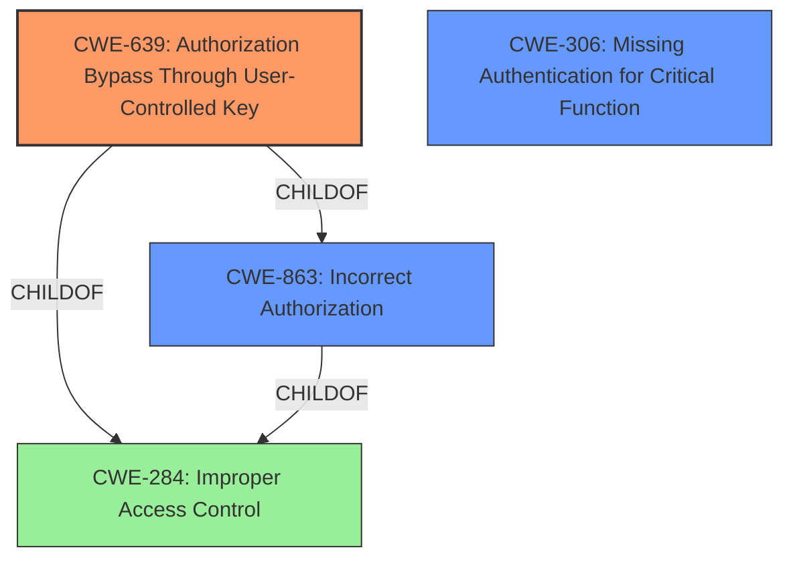

# Analysis Report for CVE-2020-36126

# Vulnerability Analysis Report: CVE-2020-36126

## Description


## Analysis (with Relationship Data)

# Summary
| CWE ID  | CWE Name  | Confidence | CWE Abstraction Level | CWE Vulnerability Mapping Label | CWE-Vulnerability Mapping Notes |
|---|---|---|---|---|---|
| CWE-639 | Authorization Bypass Through User-Controlled Key | 1 | Base  | Allowed | Primary CWE |
| CWE-863 | Incorrect Authorization | 0.7 | Class | Allowed-with-Review | Secondary Candidate |
| CWE-306 | Missing Authentication for Critical Function | 0.6 | Base | Allowed | Secondary Candidate |

## Evidence and Confidence

*   **Confidence Score:** 0.9
*   **Evidence Strength:** HIGH

## Relationship Analysis
The primary CWE selected is CWE-639, which is a Base level CWE and a child of CWE-863 (Incorrect Authorization) and CWE-284 (Improper Access Control). CWE-863 is a Class-level CWE, making CWE-639 more specific and appropriate. CWE-306 (Missing Authentication) is also related to access control, but the vulnerability description focuses on authorization issues rather than a complete lack of authentication. Therefore, CWE-639 is the most accurate representation of the vulnerability's root cause.



## Vulnerability Chain
The vulnerability chain starts with **incorrect access control** (CWE-639) due to the lack of proper authorization checks in the PAXSTORE marketplace APIs. This allows an authenticated user to read and write data not owned by them. The impact of this weakness is privilege escalation, where an attacker can impersonate any user, leading to unauthorized disclosure, modification, or destruction of information.

## Summary of Analysis
The initial analysis identified **incorrect access control** as the primary weakness, aligning with the description of CWE-639 (Authorization Bypass Through User-Controlled Key). The "CVE Reference Links Content Summary" section explicitly mentions Insecure Direct Object References (IDOR) and broken access control as the root cause, further supporting the selection of CWE-639. The retriever results also list CWE-639 as the top candidate.

The evidence from the vulnerability description is:
"Pax Technology PAXSTORE v7.0.8_20200511171508 and lower is affected by **incorrect access control** that can lead to remote privilege escalation."
"The root cause is Insecure Direct Object References (IDOR) in the PAXSTORE marketplace APIs. The API endpoints allow authenticated users to access and manipulate data belonging to other users, applications, and payment terminals, without proper authorization checks."

CWE-639 is chosen because it specifically addresses the scenario where a user can modify a key value to access another user's data, which aligns with the IDOR vulnerability described. The other CWEs considered were either too high-level (CWE-285, CWE-284) or focused on different aspects of access control (CWE-306, CWE-732). Therefore, CWE-639 is the most specific and accurate representation of the vulnerability.

Relevant CWE Information:

# Enhanced Context (25 CWEs)
The following CWEs were identified as potentially relevant to this vulnerability:

## CWE-639: Authorization Bypass Through User-Controlled Key
**Abstraction Level**: Base
**Similarity Score**: 0.76
**Source**: dense

**Description**:
The system's authorization functionality does not prevent one user from gaining access to another user's data or record by modifying the key value identifying the data.

**Mapping Guidance**:
- Usage: Allowed
- Rationale: This CWE entry is at the Base level of abstraction, which is a preferred level of abstraction for mapping to the root causes of vulnerabilities.


## CWE-285: Improper Authorization
**Abstraction Level**: Class

**Description**:
The product does not perform or incorrectly performs an authorization check when an actor attempts to access a resource or perform an action.

**Mapping Guidance**:
**Usage:** Discouraged
**Rationale:** CWE-285 is high-level and lower-level CWEs can frequently be used instead.

## CWE-306: Missing Authentication for Critical Function
**Abstraction Level**: Base

**Description**:
The product does not perform any authentication for functionality that requires a provable user identity or consumes a significant amount of resources.

**Mapping Guidance**:
**Usage:** Allowed
**Rationale:** This CWE entry is at the Base level of abstraction, which is a preferred level of abstraction for mapping to the root causes of vulnerabilities.

I also considered but did not use the following CWEs:

*   **CWE-1220: Insufficient Granularity of Access Control:** This CWE is similar, but the provided information focuses on the bypass of authorization rather than the granularity of the access control itself.
*   **CWE-664: Improper Control of a Resource Through its Lifetime:** This is too broad and doesn't fit the specific issue of authorization bypass.
*   **CWE-668: Exposure of Resource to Wrong Sphere:** This is also too broad and doesn't capture the specific mechanism of authorization bypass.
*   **CWE-274: Improper Handling of Insufficient Privileges:** This is not the root cause, as the issue is with incorrect authorization checks, not the handling of insufficient privileges.
*   **CWE-653: Improper Isolation or Compartmentalization:** This is not relevant to the vulnerability.
*   **CWE-280: Improper Handling of Insufficient Permissions or Privileges:** This is similar to CWE-274 and not the primary root cause.
*   **CWE-404: Improper Resource Shutdown or Release:** This is unrelated to the vulnerability.
*   **CWE-1390: Weak Authentication:** The issue is not with weak authentication, but with authorization after authentication.
*   **CWE-552: Files or Directories Accessible to External Parties:** This is not relevant to the vulnerability.
*   **CWE-613: Insufficient Session Expiration:** This is unrelated to the vulnerability.
*   **CWE-1289: Improper Validation of Unsafe Equivalence in Input:** This is not the primary cause.
*   **CWE-178: Improper Handling of Case Sensitivity:** This is not relevant to the vulnerability.
*   **CWE-73: External Control of File Name or Path:** This is not relevant to the vulnerability.
*   **CWE-41: Improper Resolution of Path Equivalence:** This is not relevant to the vulnerability.
*   **CWE-322: Key Exchange without Entity Authentication:** This is unrelated to the vulnerability.
*   **CWE-289: Authentication Bypass by Alternate Name:** This is not the primary cause.
*   **CWE-911: Improper Update of Reference Count:** This is unrelated to the vulnerability.
*   **CWE-826: Premature Release of Resource During Expected Lifetime:** This is unrelated to the vulnerability.
*   **CWE-942: Permissive Cross-domain Policy with Untrusted Domains:** This is not relevant to the vulnerability.


## CWE Relationship Analysis

Current CWEs represent these abstraction levels: .


### Vulnerability Chain Analysis

**Chain starting from CWE-404:**
- 404 (Improper Resource Shutdown or Release) - ROOT


**Chain starting from CWE-1220:**
- 1220 (Insufficient Granularity of Access Control) - ROOT


### CWE Relationship Diagram

```mermaid
graph TD
    classDef primary fill:#f96,stroke:#333,stroke-width:2px
    classDef secondary fill:#69f,stroke:#333
    classDef tertiary fill:#9e9,stroke:#333
```


*Report generated on 2025-04-01 19:27:54*
