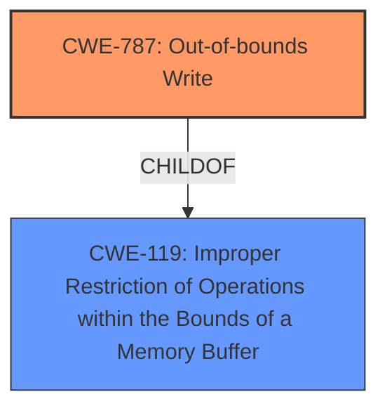

# Raw Analyzer Response for CVE-2020-36134

# Summary
| CWE ID | CWE Name | Confidence | CWE Abstraction Level | CWE Vulnerability Mapping Label | CWE-Vulnerability Mapping Notes |
|---|---|---|---|---|---|
| CWE-787 | Out-of-bounds Write | 0.9 | Base | Allowed | Primary CWE |
| CWE-119 | Improper Restriction of Operations within the Bounds of a Memory Buffer | 0.6 | Class | Discouraged | Secondary Candidate |

## Evidence and Confidence

*   **Confidence Score:** 0.9
*   **Evidence Strength:** HIGH

## Relationship Analysis
The primary CWE selected is CWE-787, which is a base-level CWE and a child of CWE-119. While the description mentions a "segmentation violation", which can be a symptom of memory corruption issues, the root cause is likely an out-of-bounds write. CWE-119 is a more general class, and the evidence supports the more specific CWE-787. The relationship between CWE-787 and CWE-119 is a parent-child relationship, with CWE-787 being a specific type of memory corruption.

## Vulnerability Chain
The vulnerability chain starts with the **improper** handling of memory, leading to an **out-of-bounds write** (CWE-787), which then results in a **segmentation violation**.

## Summary of Analysis
The initial assessment focused on the **segmentation violation**, a symptom of memory corruption. However, the root cause analysis, combined with the retriever results and CWE descriptions, led to the selection of CWE-787 (Out-of-bounds Write) as the primary CWE. The vulnerability description key phrases highlight the **segmentation violation**. The CVE reference links content summary mentions "Multiple unspecified vulnerabilities exist within libaom" and "The worst of the vulnerabilities can lead to remote code execution.", suggesting a memory corruption issue.

The retriever results listed CWE-787 as a candidate, with a reasonable score. The CWE description aligns with the **improper** memory handling. The relationship analysis shows that CWE-787 is a child of CWE-119, but choosing CWE-787 provides a more specific description of the vulnerability.

The decision to select CWE-787 is supported by the evidence and the mapping guidance. CWE-787 is a base-level CWE, which is the preferred level of abstraction.

The other CWEs considered but not selected include:

*   CWE-125: Out-of-bounds Read: While out-of-bounds read is a possibility, the **segmentation violation** suggests a write operation, not a read.
*   CWE-476: NULL Pointer Dereference: There's no explicit mention of a NULL pointer dereference in the description.
*   CWE-770: Allocation of Resources Without Limits or Throttling: Resource exhaustion is not mentioned.
*   CWE-119: Improper Restriction of Operations within the Bounds of a Memory Buffer: This is a more general class, and CWE-787 is a more specific child.
*   CWE-121: Stack-based Buffer Overflow: The location of the buffer (stack or heap) is not specified.
*   CWE-1285: Improper Validation of Specified Index, Position, or Offset in Input: This is possible, but the description does not indicate that an index, position or offset is the cause.
*   CWE-822: Untrusted Pointer Dereference: This is possible, but the description does not indicate that an untrusted pointer is the cause.
*   CWE-704: Incorrect Type Conversion or Cast: This is possible, but the description does not indicate that type conversion is the cause.
*   CWE-122: Heap-based Buffer Overflow: The location of the buffer (stack or heap) is not specified.

Relevant CWE Information:

# Enhanced Context (25 CWEs)

## CWE-131: Incorrect Calculation of Buffer Size
**Abstraction Level**: Base
**Similarity Score**: 0.80
**Source**: dense

**Description**:
The product does not correctly calculate the size to be used when allocating a buffer, which could lead to a buffer overflow.

**Mapping Guidance**:
- Usage: Allowed
- Rationale: This CWE entry is at the Base level of abstraction, which is a preferred level of abstraction for mapping to the root causes of vulnerabilities.

## CWE-125: Out-of-bounds Read
**Abstraction Level**: Base
**Similarity Score**: 0.80
**Source**: dense

**Description**:
The product reads data past the end, or before the beginning, of the intended buffer.

**Mapping Guidance**:
- Usage: Allowed
- Rationale: This CWE entry is at the Base level of abstraction, which is a preferred level of abstraction for mapping to the root causes of vulnerabilities.

## CWE-805: Buffer Access with Incorrect Length Value
**Abstraction Level**: Base
**Similarity Score**: 0.79
**Source**: dense

**Description**:
The product uses a sequential operation to read or write a buffer, but it uses an incorrect length value that causes it to access memory that is outside of the bounds of the buffer.

**Mapping Guidance**:
- Usage: Allowed
- Rationale: This CWE entry is at the Base level of abstraction, which is a preferred level of abstraction for mapping to the root causes of vulnerabilities.

## CWE-126: Buffer Over-read
**Abstraction Level**: Variant
**Similarity Score**: 0.79
**Source**: dense

**Description**:
The product reads from a buffer using buffer access mechanisms such as indexes or pointers that reference memory locations after the targeted buffer.

**Mapping Guidance**:
- Usage: Allowed
- Rationale: This CWE entry is at the Variant level of abstraction, which is a preferred level of abstraction for mapping to the root causes of vulnerabilities.

## CWE-191: Integer Underflow (Wrap or Wraparound)
**Abstraction Level**: Base
**Similarity Score**: 0.78
**Source**: dense

**Description**:
The product subtracts one value from another, such that the result is less than the minimum allowable integer value, which produces a value that is not equal to the correct result.

**Mapping Guidance**:
- Usage: Allowed
- Rationale: This CWE entry is at the Base level of abstraction, which is a preferred level of abstraction for mapping to the root causes of vulnerabilities.

## CWE-823: Use of Out-of-range Pointer Offset
**Abstraction Level**: Base
**Similarity Score**: 0.78
**Source**: dense

**Description**:
The product performs pointer arithmetic on a valid pointer, but it uses an offset that can point outside of the intended range of valid memory locations for the resulting pointer.

**Mapping Guidance**:
- Usage: Allowed
- Rationale: This CWE entry is at the Base level of abstraction, which is a preferred level of abstraction for mapping to the root causes of vulnerabilities.

## CWE-129: Improper Validation of Array Index
**Abstraction Level**: Variant
**Similarity Score**: 0.78
**Source**: dense

**Description**:
The product uses untrusted input when calculating or using an array index, but the product does not validate or incorrectly validates the index to ensure the index references a valid position within the array.

**Mapping Guidance**:
- Usage: Allowed
- Rationale: This CWE entry is at the Variant level of abstraction, which is a preferred level of abstraction for mapping to the root causes of vulnerabilities.

## CWE-667: Improper Locking
**Abstraction Level**: Class
**Similarity Score**: 0.78
**Source**: dense

**Description**:
The product does not properly acquire or release a lock on a resource, leading to unexpected resource state changes and behaviors.

**Mapping Guidance**:
- Usage: Allowed-with-Review
- Rationale: This CWE entry is a Class and might have Base-level children that would be more appropriate

## CWE-681: Incorrect Conversion between Numeric Types
**Abstraction Level**: Base
**Similarity Score**: 0.78
**Source**: dense

**Description**:
When converting from one data type to another, such as long to integer, data can be omitted or translated in a way that produces unexpected values. If the resulting values are used in a sensitive context, then dangerous behaviors may occur.

**Mapping Guidance**:
- Usage: Allowed
- Rationale: This CWE entry is at the Base level of abstraction, which is a preferred level of abstraction for mapping to the root causes of vulnerabilities.

## CWE-119: Improper Restriction of Operations within the Bounds of a Memory Buffer
**Abstraction Level**: Class
**Similarity Score**: 0.78
**Source**: dense

**Description**:
The product performs operations