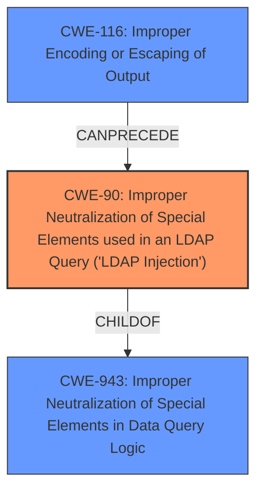

# Analysis for CVE-2020-36144

# Summary
| CWE ID | CWE Name | Confidence | CWE Abstraction Level | CWE Vulnerability Mapping Label | CWE-Vulnerability Mapping Notes |
|---|---|---|---|---|---|
| CWE-90 | Improper Neutralization of Special Elements used in an LDAP Query ('LDAP Injection') | 1.0 | Base | Primary | Allowed |
| CWE-116 | Improper Encoding or Escaping of Output | 0.7 | Class | Secondary | Allowed-with-Review |

## Evidence and Confidence

*   **Confidence Score:** 0.9
*   **Evidence Strength:** HIGH

## Relationship Analysis
The primary CWE is CWE-90, which represents the specific type of injection vulnerability. CWE-90 is a child of CWE-943 (Improper Neutralization of Special Elements in Data Query Logic), indicating that it's a specific type of data query injection. CWE-116 (Improper Encoding or Escaping of Output) can precede CWE-90. The relationships confirm that CWE-90 is the most specific and appropriate choice, with CWE-116 as a potential contributing factor.

## Vulnerability Chain
The vulnerability chain starts with the **lack of sanitization** of the username, leading to **improper encoding or escaping of output** (CWE-116), which then results in **LDAP Injection** (CWE-90). This allows attackers to craft special queries and potentially leads to information disclosure.
  - **Root Cause:** Lack of sanitization of user input.
  - **Weakness:** Improper Encoding or Escaping of Output (CWE-116).
  - **Vulnerability:** LDAP Injection (CWE-90).
  - **Impact:** Information disclosure.

## Summary of Analysis
Initially, the vulnerability was identified as an LDAP Injection due to the **lack of sanitization** of the username parameter. The analysis of the vulnerability description and the CVE Reference Links Content Summary provided sufficient evidence to support this classification. The Retriever Results also highlighted CWE-90 as the most relevant CWE.

The final decision to map CWE-90 as the primary CWE is based on the clear evidence of **LDAP Injection** due to the **lack of sanitization** of the username in the LDAP search filter construction. This is further supported by the description mentioning the ability to craft special queries to escape the provided template. The evidence is strong and directly aligns with the definition of CWE-90.

CWE-116 was considered as a secondary CWE because the chain of the vulnerability begins with the missing encoding or escaping of the output.

The selected CWEs are at the optimal level of specificity because CWE-90 is a Base level CWE that directly describes the LDAP injection vulnerability, while CWE-116 is a Class level CWE that highlights the lack of proper output handling.

Relevant CWE Information:

# Enhanced Context (25 CWEs)

## CWE-943: Improper Neutralization of Special Elements in Data Query Logic
**Abstraction Level**: Class
**Similarity Score**: 0.78
**Source**: dense

**Description**:
The product generates a query intended to access or manipulate data in a data store such as a database, but it does not neutralize or incorrectly neutralizes special elements that can modify the intended logic of the query.

**Mapping Guidance**:
- Usage: Allowed-with-Review
- Rationale: This CWE entry is a Class and might have Base-level children that would be more appropriate

## CWE-917: Improper Neutralization of Special Elements used in an Expression Language Statement ('Expression Language Injection')
**Abstraction Level**: Base
**Similarity Score**: 0.78
**Source**: dense

**Description**:
The product constructs all or part of an expression language (EL) statement in a framework such as a Java Server Page (JSP) using externally-influenced input from an upstream component, but it does not neutralize or incorrectly neutralizes special elements that could modify the intended EL statement before it is executed.

**Mapping Guidance**:
- Usage: Allowed
- Rationale: This CWE entry is at the Base level of abstraction, which is a preferred level of abstraction for mapping to the root causes of vulnerabilities.

## CWE-74: Improper Neutralization of Special Elements in Output Used by a Downstream Component ('Injection')
**Abstraction Level**: Class
**Similarity Score**: 0.75
**Source**: dense

**Description**:
The product constructs all or part of a command, data structure, or record using externally-influenced input from an upstream component, but it does not neutralize or incorrectly neutralizes special elements that could modify how it is parsed or interpreted when it is sent to a downstream component.

**Mapping Guidance**:
- Usage: Discouraged
- Rationale: CWE-74 is high-level and often misused when lower-level weaknesses are more appropriate.

## CWE-80: Improper Neutralization of Script-Related HTML Tags in a Web Page (Basic XSS)
**Abstraction Level**: Variant
**Similarity Score**: 0.73
**Source**: dense

**Description**:
The product receives input from an upstream component, but it does not neutralize or incorrectly neutralizes special characters such as "<", ">", and "&" that could be interpreted as web-scripting elements when they are sent to a downstream component that processes web pages.

**Mapping Guidance**:
- Usage: Allowed
- Rationale: This CWE entry is at the Variant level of abstraction, which is a preferred level of abstraction for mapping to the root causes of vulnerabilities.

## CWE-184: Incomplete List of Disallowed Inputs
**Abstraction Level**: Base
**Similarity Score**: 0.73
**Source**: dense

**Description**:
The product implements a protection mechanism that relies on a list of inputs (or properties of inputs) that are not allowed by policy or otherwise require other action to neutralize before additional processing takes place, but the list is incomplete.

**Mapping Guidance**:
- Usage: Allowed
- Rationale: This CWE entry is at the Base level of abstraction, which is a preferred level of abstraction for mapping to the root causes of vulnerabilities.

## CWE-1236: Improper Neutralization of Formula Elements in a CSV File
**Abstraction Level**: Base
**Similarity Score**: 0.72
**Source**: dense

**Description**:
The product saves user-provided information into a Comma-Separated Value (CSV) file, but it does not neutralize or incorrectly neutralizes special elements that could be interpreted as a command when the file is opened by a spreadsheet product.

**Mapping Guidance**:
- Usage: Allowed
- Rationale: This CWE entry is at the Base level of abstraction, which is a preferred level of abstraction for mapping to the root causes of vulnerabilities.

## CWE-470: Use of Externally-Controlled Input to Select Classes or Code ('Unsafe Reflection')
**Abstraction Level**: Base
**Similarity Score**: 0.72
**Source**: dense

**Description**:
The product uses external input with reflection to select which classes or code to use, but it does not sufficiently prevent the input from selecting improper classes or code.

**Mapping Guidance**:
- Usage: Allowed
- Rationale: This CWE entry is at the Base level of abstraction, which is a preferred level of abstraction for mapping to the root causes of vulnerabilities.

## CWE-99: Improper Control of Resource Identifiers ('Resource Injection')
**Abstraction Level**: Class
**Similarity Score**: 0.72
**Source**: dense

**Description**:
The product receives input from an upstream component, but it does not restrict or incorrectly restricts the input before it is used as an identifier for a resource that may be outside the intended sphere of control.

**Mapping Guidance**:
- Usage: Allowed-with-Review
- Rationale: This CWE entry is a Class and might have Base-level children that would be more appropriate

## CWE-138: Improper Neutralization of Special Elements
**Abstraction Level**: Class
**Similarity Score**: 0.72
**Source**: dense

**Description**:
The product receives input from an upstream component, but it does not neutralize or incorrectly neutralizes special elements that could be interpreted as control elements or syntactic markers when they are sent to a downstream component.

**Mapping Guidance**:
- Usage: Discouraged
- Rationale: This CWE entry is a level-1 Class (i.e., a child of a Pillar). It might have lower-level children that would be more appropriate

## CWE-116: Improper Encoding or Escaping of Output
**Abstraction Level**: Class
**Similarity Score**: 0.72
**Source**: dense

**Description**:
The product prepares a structured message for communication with another component