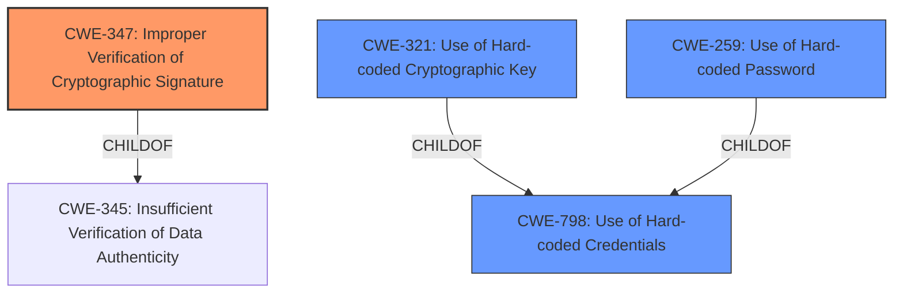

# Enhanced Analysis for CVE-2020-36284

# Summary
| CWE ID | CWE Name | Confidence | CWE Abstraction Level | CWE Vulnerability Mapping Label | CWE-Vulnerability Mapping Notes |
|---|---|---|---|---|---|
| CWE-347 | Improper Verification of Cryptographic Signature | 1.0 | Base | Allowed | Primary CWE |
| CWE-798 | Use of Hard-coded Credentials | 0.7 | Base | Allowed | Secondary Candidate |
| CWE-321 | Use of Hard-coded Cryptographic Key | 0.6 | Variant | Allowed | Secondary Candidate |
| CWE-259 | Use of Hard-coded Password | 0.5 | Variant | Allowed | Secondary Candidate |

## Evidence and Confidence

*   **Confidence Score:** 0.9
*   **Evidence Strength:** HIGH

## Relationship Analysis
The primary CWE, CWE-347 **[Improper Verification of Cryptographic Signature]**, is a base-level CWE that directly addresses the **improper verification** issue described in the vulnerability. The secondary CWE candidates, CWE-798 **[Use of Hard-coded Credentials]**, CWE-321 **[Use of Hard-coded Cryptographic Key]**, and CWE-259 **[Use of Hard-coded Password]**, are related because the **NULL secret key** effectively acts as a hard-coded (or rather, non-existent) key, leading to a bypass of cryptographic signature verification. CWE-347 is a child of CWE-345 **[Insufficient Verification of Data Authenticity]**, which represents a broader class of weaknesses.



## Vulnerability Chain
The vulnerability chain starts with the **NULL secret key**. This **NULL secret key** leads to **Improper Verification of Cryptographic Signature** (CWE-347). The impact is that attackers can shop for free due to the bypassed authentication.

## Summary of Analysis
The initial analysis correctly identified CWE-347 **[Improper Verification of Cryptographic Signature]** as the primary weakness, as highlighted in both the vulnerability description and the "CWE for similar CVE Descriptions" section. The presence of a **NULL secret key** is the root cause allowing the **improper verification** to occur. The retriever results also support this selection, with CWE-347 having the highest score.

Further analysis reveals that the **NULL secret key** could also be viewed as a case of using a hard-coded (or, in this case, a non-existent) key. This leads to the consideration of CWE-798 **[Use of Hard-coded Credentials]**, CWE-321 **[Use of Hard-coded Cryptographic Key]**, and CWE-259 **[Use of Hard-coded Password]**.

Ultimately, I selected CWE-347 as the primary CWE because the vulnerability description explicitly mentions "**Improper Verification of Cryptographic Signature**". The **NULL secret key** is the underlying cause that *enables* the **improper verification**, which is the more direct weakness being exploited. CWE-798, CWE-321, and CWE-259 are considered secondary candidates because they describe the nature of the misused credential, but the core issue is the **improper verification** itself.

The selected CWEs are at the optimal level of specificity. CWE-347 is a base-level CWE, which is preferred for root cause analysis. While CWE-345 **[Insufficient Verification of Data Authenticity]** is a parent of CWE-347, it is a broader class and less specific to the actual vulnerability.

Relevant CWE Information:

# Enhanced Context (25 CWEs)
The following CWEs were identified as potentially relevant to this vulnerability:

## CWE-1204: Generation of Weak Initialization Vector (IV)
**Abstraction Level**: Base
**Similarity Score**: 0.82
**Source**: dense

**Description**:
The product uses a cryptographic primitive that uses an Initialization
			Vector (IV), but the product does not generate IVs that are
			sufficiently unpredictable or unique according to the expected
			cryptographic requirements for that primitive.
			

**Mapping Guidance**:
- Usage: Allowed
- Rationale: This CWE entry is at the Base level of abstraction, which is a preferred level of abstraction for mapping to the root causes of vulnerabilities.


## CWE-330: Use of Insufficiently Random Values
**Abstraction Level**: Class
**Similarity Score**: 0.79
**Source**: dense

**Description**:
The product uses insufficiently random numbers or values in a security context that depends on unpredictable numbers.

**Mapping Guidance**:
- Usage: Discouraged
- Rationale: This CWE entry is a level-1 Class (i.e., a child of a Pillar). It might have lower-level children that would be more appropriate


## CWE-1391: Use of Weak Credentials
**Abstraction Level**: Class
**Similarity Score**: 0.79
**Source**: dense

**Description**:
The product uses weak credentials (such as a default key or hard-coded password) that can be calculated, derived, reused, or guessed by an attacker.

**Mapping Guidance**:
- Usage: Allowed-with-Review
- Rationale: This CWE entry is a Class and might have Base-level children that would be more appropriate


## CWE-331: Insufficient Entropy
**Abstraction Level**: Base
**Similarity Score**: 0.78
**Source**: dense

**Description**:
The product uses an algorithm or scheme that produces insufficient entropy, leaving patterns or clusters of values that are more likely to occur than others.

**Mapping Guidance**:
- Usage: Allowed
- Rationale: This CWE entry is at the Base level of abstraction, which is a preferred level of abstraction for mapping to the root causes of vulnerabilities.


## CWE-1240: Use of a Cryptographic Primitive with a Risky Implementation
**Abstraction Level**: Base
**Similarity Score**: 0.77
**Source**: dense

**Description**:
To fulfill the need for a cryptographic primitive, the product implements a cryptographic algorithm using a non-standard, unproven, or disallowed/non-compliant cryptographic implementation.

**Mapping Guidance**:
- Usage: Allowed
- Rationale: This CWE entry is at the Base level of abstraction, which is a preferred level of abstraction for mapping to the root causes of vulnerabilities.


## CWE-340: Generation of Predictable Numbers or Identifiers
**Abstraction Level**: Class
**Similarity Score**: 0.76
**Source**: dense

**Description**:
The product uses a scheme that generates numbers or identifiers that are more predictable than required.

**Mapping Guidance**:
- Usage: Allowed-with-Review
- Rationale: This CWE entry is a Class and might have Base-level children that would be more appropriate


## CWE-345: Insufficient Verification of Data Authenticity
**Abstraction Level**: Class
**Similarity Score**: 0.76
**Source**: dense

**Description**:
The product does not sufficiently verify the origin or authenticity of data, in a way that causes it to accept invalid data.

**Mapping Guidance**:
- Usage: Discouraged
- Rationale: This CWE entry is a level-1 Class (i.e., a child of a Pillar). It might have lower-level children that would be more appropriate


## CWE-208: Observable Timing Discrepancy
**Abstraction Level**: Base
**Similarity Score**: 0.75
**Source**: dense

**Description**:
Two separate operations in a product require different amounts of time to complete, in a way that is observable to an actor and reveals security-relevant information about the state of the product, such as whether a particular operation was successful or not.

**Mapping Guidance**:
- Usage: Allowed
- Rationale: This CWE entry is at the Base level of abstraction, which is a preferred level of abstraction for mapping to the root causes of vulnerabilities.


## CWE-203: Observable Discrepancy
**Abstraction Level**: Base
**Similarity Score**: 0.75
**Source**: dense

**Description**:
The product behaves differently or sends different responses under different circumstances in a way that is observable to an unauthorized actor, which exposes security-relevant information about the state of the product, such as whether a particular operation was successful or not.


## CWE Relationship Analysis

Current CWEs represent these abstraction levels: .


### Vulnerability Chain Analysis

**Chain starting from CWE-208:**
- 208 (Observable Timing Discrepancy) - ROOT


**Chain starting from CWE-331:**
- 331 (Insufficient Entropy) - ROOT


### CWE Relationship Diagram

```mermaid
graph TD
    classDef primary fill:#f96,stroke:#333,stroke-width:2px
    classDef secondary fill:#69f,stroke:#333
    classDef tertiary fill:#9e9,stroke:#333
```