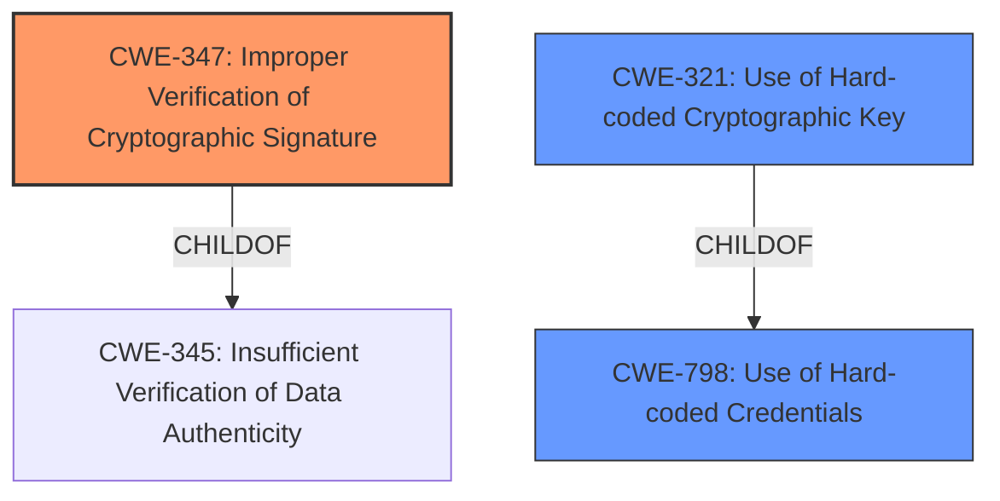

# Enhanced Analysis for CVE-2020-36285

# Summary
| CWE ID | CWE Name | Confidence | CWE Abstraction Level | CWE Vulnerability Mapping Label | CWE-Vulnerability Mapping Notes |
|---|---|---|---|---|---|
| CWE-347 | Improper Verification of Cryptographic Signature | 1.0 | Base | Allowed | Primary CWE |
| CWE-798 | Use of Hard-coded Credentials | 0.7 | Base | Allowed | Secondary Candidate |
| CWE-321 | Use of Hard-coded Cryptographic Key | 0.6 | Variant | Allowed | Secondary Candidate |

## Evidence and Confidence

*   **Confidence Score:** 0.9
*   **Evidence Strength:** HIGH

## Relationship Analysis
The primary CWE is CWE-347, which is a base level CWE. The secondary CWEs are CWE-798 and CWE-321. CWE-321 is a child of CWE-798.
CWE-347 is a child of CWE-345 (Insufficient Verification of Data Authenticity), a class level CWE.



## Vulnerability Chain
The vulnerability chain starts with the **improper verification of the cryptographic signature** (CWE-347). Because the secret key is NULL, the crafted authentication code (MAC) is easily generated, leading to the impact of attackers being able to shop for free in merchants' websites and mobile apps.

## Summary of Analysis
The vulnerability description states that Union Pay up to version 3.3.12 contains a CWE-347 **Improper Verification of Cryptographic Signature** vulnerability because the authentication code (MAC) is generated based on a secret key which is NULL. This allows attackers to shop for free in merchants' websites and mobile apps via a crafted authentication code (MAC).

The primary CWE is CWE-347 **Improper Verification of Cryptographic Signature**. The description of CWE-347 states "The product does not verify, or incorrectly verifies, the cryptographic signature for data." This aligns with the vulnerability description of the secret key being NULL, which leads to **improper verification of the cryptographic signature**.

CWE-798 **Use of Hard-coded Credentials** was considered because the secret key is NULL, which can be considered a hard-coded credential. The description of CWE-798 states "The product contains hard-coded credentials, such as a password or cryptographic key." This aligns with the vulnerability description of the secret key being NULL.
CWE-321 **Use of Hard-coded Cryptographic Key** was also considered because the secret key is NULL, which can be considered a hard-coded cryptographic key. The description of CWE-321 states "The use of a hard-coded cryptographic key significantly increases the possibility that encrypted data may be recovered." This also aligns with the vulnerability description of the secret key being NULL. However, since the secret key is NULL, it is not exactly hard-coded.

CWE-287 **Improper Authentication** was also considered, but it was discarded because it is too general.
CWE-345 **Insufficient Verification of Data Authenticity** was also considered, but CWE-347 is a child of CWE-345 and is more specific.

I am selecting CWE-347 as the primary CWE because it is the most specific CWE that aligns with the vulnerability description, and it is at the base level of abstraction. CWE-798 and CWE-321 are secondary considerations because the NULL secret key can be considered a hard-coded credential/key.


## CWE Relationship Analysis

Current CWEs represent these abstraction levels: .


### Vulnerability Chain Analysis

**Chain starting from CWE-287:**
- 287 (Improper Authentication) - ROOT


**Chain starting from CWE-345:**
- 345 (Insufficient Verification of Data Authenticity) - ROOT


### CWE Relationship Diagram

```mermaid
graph TD
    classDef primary fill:#f96,stroke:#333,stroke-width:2px
    classDef secondary fill:#69f,stroke:#333
    classDef tertiary fill:#9e9,stroke:#333
```