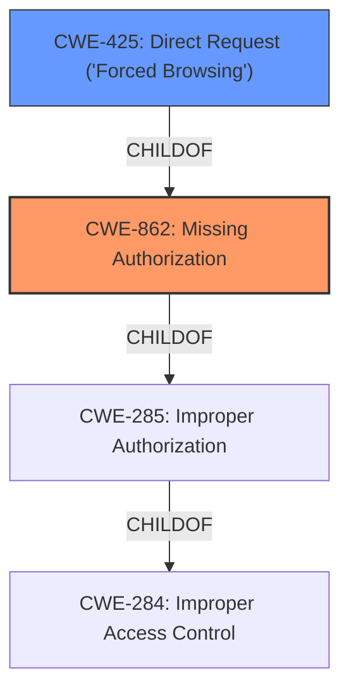

# Analysis for CVE-2020-36287

# Summary

| CWE ID  | CWE Name                                                                                                              | Confidence | CWE Abstraction Level | CWE Vulnerability Mapping Label | CWE-Vulnerability Mapping Notes |
| :-------- | :-------------------------------------------------------------------------------------------------------------------- | :---------- | :---------------------- | :------------------------------ | :------------------------------ |
| CWE-862   | Missing Authorization                                                                                               | 1          | Class                  | Primary                         | Allowed-with-Review             |
| CWE-425   | Direct Request ('Forced Browsing')                                                                                  | 0.75        | Base                   | Secondary                       | Allowed                         |

## Evidence and Confidence

*   **Confidence Score:** 0.9
*   **Evidence Strength:** HIGH

## Relationship Analysis

The primary weakness is the **missing authorization** check (CWE-862), which is a class-level CWE. A more specific base-level CWE that fits the description is CWE-425, Direct Request ('Forced Browsing'), as the vulnerability allows direct access to resources due to inadequate authorization enforcement.

## Vulnerability Chain

The chain of events for this vulnerability begins with the **missing permissions check** (CWE-862), which allows remote anonymous attackers to directly access and obtain gadget-related settings (CWE-425).

## Summary of Analysis

The primary weakness identified is CWE-862, **Missing Authorization**, because the vulnerability description explicitly states a **missing permissions check**. The Atlassian gadgets plugin in Jira Server and Data Center lacks an authorization check, allowing unauthorized remote anonymous attackers to obtain gadget-related settings.

Supporting evidence:

*   "The dashboard gadgets preference resource of the Atlassian gadgets plugin used in Jira Server and Jira Data Center before version 8.13.5, and from version 8.14.0 before version 8.15.1 allows remote anonymous attackers to obtain gadget related settings via a **missing permissions check**."
*   "**Root cause of vulnerability:** **Missing permissions check** in the dashboard gadgets preference resource of the Atlassian gadgets plugin."

CWE-862 is a Class-level CWE, and the mapping guidance suggests examining its children for a better fit. CWE-425, **Direct Request ('Forced Browsing')**, is a child of CWE-862 and better describes the vulnerability. The application does not adequately enforce authorization on restricted URLs, scripts, or files, allowing direct access.

CWE-306, **Missing Authentication for Critical Function**, was considered but is not the best fit since the vulnerability description focuses on authorization, not authentication. Authentication confirms identity, while authorization confirms access rights.

CWE-639, **Authorization Bypass Through User-Controlled Key**, was considered but does not apply because the vulnerability isn't due to a user-controlled key but a **missing permissions check**.

I am confident in this assessment because the vulnerability description clearly indicates a **missing permissions check**, which aligns with CWE-862 and can be further refined to CWE-425.

Relevant CWE Information:

# Enhanced Context (25 CWEs)

## CWE-1220: Insufficient Granularity of Access Control
**Abstraction Level**: Base
**Similarity Score**: 0.76
**Source**: dense

**Description**:
The product implements access controls via a policy or other feature with the intention to disable or restrict accesses (reads and/or writes) to assets in a system from untrusted agents. However, implemented access controls lack required granularity, which renders the control policy too broad because it allows accesses from unauthorized agents to the security-sensitive assets.

**Mapping Guidance**:
- Usage: Allowed
- Rationale: This CWE entry is at the Base level of abstraction, which is a preferred level of abstraction for mapping to the root causes of vulnerabilities.

## CWE-639: Authorization Bypass Through User-Controlled Key
**Abstraction Level**: Base
**Similarity Score**: 0.76
**Source**: dense

**Description**:
The system's authorization functionality does not prevent one user from gaining access to another user's data or record by modifying the key value identifying the data.

**Mapping Guidance**:
- Usage: Allowed
- Rationale: This CWE entry is at the Base level of abstraction, which is a preferred level of abstraction for mapping to the root causes of vulnerabilities.

## CWE-807: Reliance on Untrusted Inputs in a Security Decision
**Abstraction Level**: Base
**Similarity Score**: 0.75
**Source**: dense

**Description**:
The product uses a protection mechanism that relies on the existence or values of an input, but the input can be modified by an untrusted actor in a way that bypasses the protection mechanism.

**Mapping Guidance**:
- Usage: Allowed
- Rationale: This CWE entry is at the Base level of abstraction, which is a preferred level of abstraction for mapping to the root causes of vulnerabilities.

## CWE-274: Improper Handling of Insufficient Privileges
**Abstraction Level**: Base
**Similarity Score**: 0.75
**Source**: dense

**Description**:
The product does not handle or incorrectly handles when it has insufficient privileges to perform an operation, leading to resultant weaknesses.

**Mapping Guidance**:
- Usage: Discouraged
- Rationale: This CWE entry could be deprecated in a future version of CWE.

## CWE-691: Insufficient Control Flow Management
**Abstraction Level**: Pillar
**Similarity Score**: 0.74
**Source**: dense

**Description**:
The code does not sufficiently manage its control flow during execution, creating conditions in which the control flow can be modified in unexpected ways.

**Mapping Guidance**:
- Usage: Discouraged
- Rationale: This CWE entry is extremely high-level, a Pillar. However, classification research is limited for weaknesses of this type, so there can be gaps or organizational difficulties within CWE that force use of this weakness, even at such a high level of abstraction.

## CWE-653: Improper Isolation or Compartmentalization
**Abstraction Level**: Class
**Similarity Score**: 0.74
**Source**: dense

**Description**:
The product does not properly compartmentalize or isolate functionality, processes, or resources that require different privilege levels, rights, or permissions.

**Mapping Guidance**:
- Usage: Allowed
- Rationale: This CWE entry is at the Base level of abstraction, which is a preferred level of abstraction for mapping to the root causes of vulnerabilities.

## CWE-425: Direct Request ('Forced Browsing')
**Abstraction Level**: Base
**Similarity Score**: 0.74
**Source**: dense

**Description**:
The web application does not adequately enforce appropriate authorization on all restricted URLs, scripts, or files.

**Mapping Guidance**:
- Usage: Allowed
- Rationale: This CWE entry is at the Base level of abstraction, which is a preferred level of abstraction for mapping to the root causes of vulnerabilities.

## CWE-799: Improper Control of Interaction Frequency
**Abstraction Level**: Class
**Similarity Score**: 0.74
**Source**: dense

**Description**:
The product does not properly limit the number or frequency of interactions that it has with an actor, such as the number of incoming requests.

**Mapping Guidance**:
- Usage: Allowed-with-Review
- Rationale: This CWE entry is a Class and might have Base-level children that would be more appropriate

## CWE-280: Improper Handling of Insufficient Permissions or Privileges
**Abstraction Level**: Base
**Similarity Score**: 0.74
**Source**: dense

**Description**:
The product does not handle or incorrectly handles when it has insufficient privileges to access resources or functionality as specified by their permissions. This may cause it to follow unexpected code paths that may leave the product in an invalid state.

**Mapping Guidance**:
- Usage: Allowed
- Rationale: This CWE entry is at the Base level of abstraction, which is a preferred level of abstraction for mapping to the root causes of vulnerabilities.

## CWE-664: Improper Control of a Resource Through its Lifetime
**Abstraction Level**: Pillar
**Similarity Score**: 0.74
**Source**: dense

**Description**:
The product does not maintain or incorrectly maintains control over a resource throughout its lifetime of creation, use, and release.

**Mapping Guidance**:
- Usage: Discouraged
- Rationale: This CWE entry is high-level when lower-level children are available.

## CWE-639: Authorization Bypass Through User-Controlled Key
**Abstraction