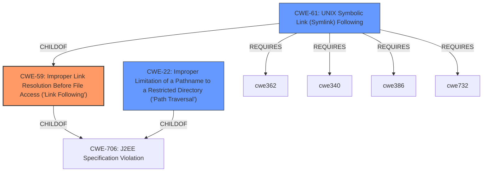

# Raw Analyzer Response for CVE-2020-36314

# Summary

| CWE ID | CWE Name | Confidence | CWE Abstraction Level | CWE Vulnerability Mapping Label | CWE-Vulnerability Mapping Notes |
|---|---|---|---|---|---|
| CWE-59 | Improper Link Resolution Before File Access ('Link Following') | 0.9 | Base | Allowed | Primary CWE |
| CWE-22 | Improper Limitation of a Pathname to a Restricted Directory ('Path Traversal') | 0.7 | Base | Allowed | Secondary Candidate |

## Evidence and Confidence

*   **Confidence Score:** 0.8
*   **Evidence Strength:** HIGH

## Relationship Analysis
The primary relationship impacting the decision is the hierarchical relationship where CWE-59 and CWE-22 are children of CWE-706. Additionally, CWE-61, UNIX Symbolic Link (Symlink) Following, is a compound CWE that requires CWE-59. The selection of CWE-59 over CWE-61 is due to the root cause focusing on **improper symlink checking** leading to directory traversal. While CWE-61 represents the complete scenario, the description emphasizes the **improper handling of symlinks** as the core issue, making CWE-59 a more precise fit. CWE-22 is considered as a secondary candidate because the symlink issue directly enables path traversal.

## Vulnerability Chain
The vulnerability chain starts with **insufficient symlink handling**, leading to a directory traversal issue, and ultimately resulting in arbitrary file overwrite and potential system compromise.
  - Root Cause: **Improper symlink checking** (CWE-59)
  - Weakness: Directory Traversal
  - Impact: Arbitrary File Overwrite

## Summary of Analysis
The initial analysis focused on identifying the root cause of the vulnerability, which is the **improper symlink checking** during archive extraction. The evidence from the "CVE Reference Links Content Summary" clearly states the "**insufficient symlink handling**" as a core weakness.

> "The vulnerability stems from insufficient checks within the GNOME Archive Manager (file-roller) when extracting archive files, specifically when dealing with symlinks within the parent directories of extracted files...The application's logic failed to correctly identify and prevent the traversal through symlinks present in the parent directories of the extracted files. This allowed for bypassing previous checks that aimed to prevent files from being extracted outside the destination directory."

The Retriever Results also list CWE-59 as the top candidate, further supporting this selection.
CWE-22 is added as a secondary candidate because the **improper symlink handling** directly leads to the possibility of directory traversal. This is also supported by the "CVE Reference Links Content Summary":

> "Directory Traversal: The core weakness is a directory traversal vulnerability. By crafting a malicious archive containing symlinks in the parent directories, an attacker can force the Archive Manager to write files to locations outside of the intended extraction directory."

The selected CWEs are at the base level of abstraction, representing the specific weaknesses present in the vulnerability.

Relevant CWE Information:

# Enhanced Context (25 CWEs)

## CWE-59: Improper Link Resolution Before File Access ('Link Following')
**Abstraction:** Base
**Status:** Draft

### Description
The product attempts to access a file based on the filename, but it does not properly prevent that filename from identifying a link or shortcut that resolves to an unintended resource.

### Technical Explanation
CWE-59, Improper Link Resolution Before File Access ('Link Following'), describes a vulnerability where the software does not properly validate if a file accessed via its filename is a symbolic link that redirects to an unintended resource. This aligns with the vulnerability description, where the file-roller fails to check if the parent directory of a file being extracted is a symlink, leading to files being written outside the intended extraction directory.

### Security Implications
This vulnerability allows an attacker to craft a malicious archive with symlinks that, when extracted, can overwrite arbitrary files on the system, leading to potential system compromise, data tampering, or malware installation.

### Mitigation
The vulnerability was addressed by disallowing symlinks in parent directories.

## CWE-22: Improper Limitation of a Pathname to a Restricted Directory ('Path Traversal')
**Abstraction:** Base
**Status:** Stable

### Description
The product uses external input to construct a pathname that is intended to identify a file or directory that is located underneath a restricted parent directory, but the product does not properly neutralize special elements within the pathname that can cause the pathname to resolve to a location that is outside of the restricted directory.

### Technical Explanation
CWE-22, Improper Limitation of a Pathname to a Restricted Directory ('Path Traversal'), describes a vulnerability where the software does not properly restrict the pathnames used, allowing an attacker to access files or directories outside the intended restricted directory. The vulnerability description states that the lack of symlink checking allows for directory traversal during extraction.

### Security Implications
This vulnerability allows an attacker to craft a malicious archive with symlinks that, when extracted, can write files outside of the intended destination.

### Mitigation
The vulnerability was addressed by disallowing symlinks in parent directories.

## CWEs Considered But Not Used

*   **CWE-61: UNIX Symbolic Link (Symlink) Following:** While closely related, CWE-61 is a compound weakness and less precise than CWE-59 in capturing the root cause, which is the **improper link resolution**. CWE-61 requires multiple conditions to be met, including race conditions and insecure permissions, which are not explicitly detailed in the vulnerability description. Therefore, focusing on the fundamental **improper link resolution** (CWE-59) is more accurate.
*   **CWE-23: Relative Path Traversal:** While directory traversal is the consequence, the root cause is the **improper handling of symlinks** that enables the traversal. Therefore, CWE-59 is more representative of the initial weakness.
*   **CWE-367: Time-of-check Time-of-use (TOCTOU) Race Condition:** Although race conditions can be involved in symlink vulnerabilities, the provided information doesn't explicitly point to a TOCTOU issue.
*   **CWE-427: Uncontrolled Search Path Element:** This CWE is not applicable as the vulnerability doesn't involve an uncontrolled search path element.