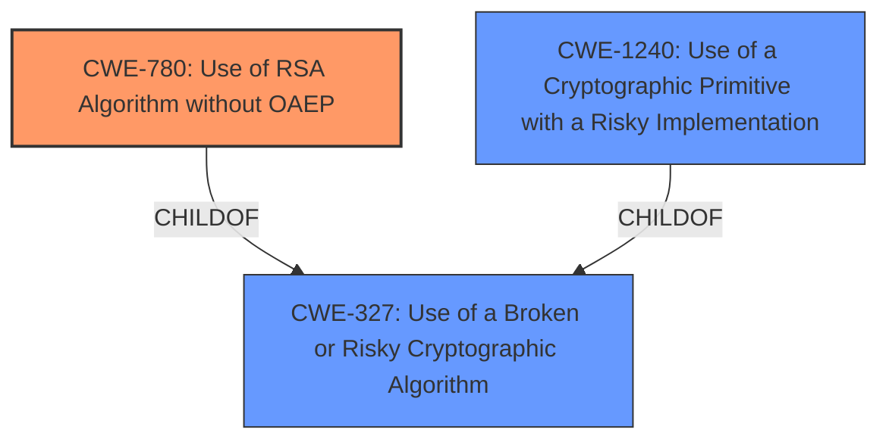

# Analysis Report for CVE-2020-36315

# Vulnerability Analysis Report: CVE-2020-36315

## Description


## Analysis (with Relationship Data)

# Summary
| CWE ID | CWE Name | Confidence | CWE Abstraction Level | CWE Vulnerability Mapping Label | CWE-Vulnerability Mapping Notes |
|---|---|---|---|---|---|
| **CWE-780** | Use of RSA Algorithm without OAEP | 0.8 | Variant | Primary | Allowed |
| CWE-327 | Use of a Broken or Risky Cryptographic Algorithm | 0.6 | Class | Secondary | Allowed-with-Review |
| CWE-1240 | Use of a Cryptographic Primitive with a Risky Implementation | 0.5 | Base | Secondary | Allowed |

## Evidence and Confidence

*   **Confidence Score:** 0.7
*   **Evidence Strength:** HIGH

## Relationship Analysis
The primary CWE, CWE-780, is a Variant of CWE-327, indicating a specific type of cryptographic issue. CWE-327 itself is a Class, suggesting that it could have more specific child CWEs. CWE-1240 is another Base-level CWE related to risky cryptographic implementations and is a child of CWE-327. The relationships highlight the hierarchical nature of cryptographic weaknesses, where a general category (CWE-327) encompasses more specific instances (CWE-780, CWE-1240).



## Vulnerability Chain
The vulnerability chain starts with the **inadequate checks of the padding** in the RSA PKCS#1 v1.5 signature implementation, leading to a susceptibility to signature forgery. This can be viewed as a **root cause** leading to the impact.
- **Root Cause:** **Inadequate checks of the padding (and of the first two bytes)** leading to bypassing of expected cryptographic protections.
- **Weakness:** Use of RSA Algorithm without OAEP (CWE-780) and a broken or risky cryptographic algorithm (CWE-327), due to the **inadequate** padding and input validation.
- **Impact:** RSA PKCS#1 v1.5 signature forgery, allowing attackers to bypass signature verification.

## Summary of Analysis
The initial assessment, based on the provided evidence, points to a vulnerability stemming from **inadequate checks of the padding (and of the first two bytes)** in the RSA PKCS#1 v1.5 signature implementation.

The vulnerability description key phrases state:
- **rootcause:** **inadequate checks of the padding (and of the first two bytes)**
- **impact:** RSA PKCS#1 v1.5 signature forgery

The CVE Reference Links Content Summary states:
"The code does not reject malformed inputs when the first two bytes do not match the expected `0x00 0x01`... The padding bytes are not checked to ensure they are `0xFF`."

Given the **inadequate** padding verification and the resulting vulnerability to signature forgery, CWE-780 (Use of RSA Algorithm without OAEP) is the most specific and relevant CWE. This is further supported by the fact that the vulnerability enables Bleichenbacher-style small exponent signature forgery, which is directly related to padding issues in RSA.

CWE-327 (Use of a Broken or Risky Cryptographic Algorithm) is a broader classification, but applicable because the **inadequate checks** make the implementation risky. Similarly, CWE-1240 (Use of a Cryptographic Primitive with a Risky Implementation) is relevant as it addresses the implementation aspects of the cryptographic primitive, which in this case is the RSA signature scheme.

CWEs like Observable Timing Discrepancy (CWE-208) and Cross-Site Request Forgery (CSRF) (CWE-352) were considered but deemed not applicable as they do not directly address the root cause of the vulnerability, which lies in the **inadequate padding checks** and signature validation.

The selected CWEs are at the optimal level of specificity. CWE-780 is a Variant that directly addresses the lack of OAEP in RSA, while CWE-327 and CWE-1240 provide broader context regarding the use of risky cryptographic algorithms and implementations. The choice of CWE-780 as the primary CWE reflects the specific nature of the vulnerability, while the secondary CWEs capture the broader implications of the **inadequate checks**.
Based on the high degree of alignment between the vulnerability description, the root cause, and the CWE specifications, the confidence in this assessment is high.

Relevant CWE Information:

# Enhanced Context (25 CWEs)
The following CWEs were identified as potentially relevant to this vulnerability:

## CWE-807: Reliance on Untrusted Inputs in a Security Decision
**Abstraction Level**: Base
**Similarity Score**: 0.77
**Source**: dense

**Description**:
The product uses a protection mechanism that relies on the existence or values of an input, but the input can be modified by an untrusted actor in a way that bypasses the protection mechanism.

**Mapping Guidance**:
- Usage: Allowed
- Rationale: This CWE entry is at the Base level of abstraction, which is a preferred level of abstraction for mapping to the root causes of vulnerabilities.

## CWE-1289: Improper Validation of Unsafe Equivalence in Input
**Abstraction Level**: Base
**Similarity Score**: 0.76
**Source**: dense

**Description**:
The product receives an input value that is used as a resource identifier or other type of reference, but it does not validate or incorrectly validates that the input is equivalent to a potentially-unsafe value.

**Mapping Guidance**:
- Usage: Allowed
- Rationale: This CWE entry is at the Base level of abstraction, which is a preferred level of abstraction for mapping to the root causes of vulnerabilities.

## CWE-208: Observable Timing Discrepancy
**Abstraction Level**: Base
**Similarity Score**: 0.76
**Source**: dense

**Description**:
Two separate operations in a product require different amounts of time to complete, in a way that is observable to an actor and reveals security-relevant information about the state of the product, such as whether a particular operation was successful or not.

**Mapping Guidance**:
- Usage: Allowed
- Rationale: This CWE entry is at the Base level of abstraction, which is a preferred level of abstraction for mapping to the root causes of vulnerabilities.

## CWE-204: Observable Response Discrepancy
**Abstraction Level**: Base
**Similarity Score**: 0.75
**Source**: dense

**Description**:
The product provides different responses to incoming requests in a way that reveals internal state information to an unauthorized actor outside of the intended control sphere.

**Mapping Guidance**:
- Usage: Allowed
- Rationale: This CWE entry is at the Base level of abstraction, which is a preferred level of abstraction for mapping to the root causes of vulnerabilities.

## CWE-639: Authorization Bypass Through User-Controlled Key
**Abstraction Level**: Base
**Similarity Score**: 0.75
**Source**: dense

**Description**:
The system's authorization functionality does not prevent one user from gaining access to another user's data or record by modifying the key value identifying the data.

**Mapping Guidance**:
- Usage: Allowed
- Rationale: This CWE entry is at the Base level of abstraction, which is a preferred level of abstraction for mapping to the root causes of vulnerabilities.

## CWE-1390: Weak Authentication
**Abstraction Level**: Class
**Similarity Score**: 0.75
**Source**: dense

**Description**:
The product uses an authentication mechanism to restrict access to specific users or identities, but the mechanism does not sufficiently prove that the claimed identity is correct.

**Mapping Guidance**:
- Usage: Allowed-with-Review
- Rationale: This CWE entry is a Class and might have Base-level children that would be more appropriate

## CWE-1391: Use of Weak Credentials
**Abstraction Level**: Class
**Similarity Score**: 0.75
**Source**: dense

**Description**:
The product uses weak credentials (such as a default key or hard-coded password) that can be calculated, derived, reused, or guessed by an attacker.

**Mapping Guidance**:
- Usage: Allowed-with-Review
- Rationale: This CWE entry is a Class and might have Base-level children that would be more appropriate

## CWE-74: Improper Neutralization of Special Elements in Output Used by a Downstream Component ('Injection')
**Abstraction Level**: Class
**Similarity Score**: 0.75
**Source**: dense

**Description**:
The product constructs all or part of a command, data structure, or record using externally-influenced input from an upstream component, but it does not


## CWE Relationship Analysis

Current CWEs represent these abstraction levels: .


### Vulnerability Chain Analysis

**Chain starting from CWE-639:**
- 639 (Authorization Bypass Through User-Controlled Key) - ROOT


**Chain starting from CWE-807:**
- 807 (Reliance on Untrusted Inputs in a Security Decision) - ROOT


### CWE Relationship Diagram

```mermaid
graph TD
    classDef primary fill:#f96,stroke:#333,stroke-width:2px
    classDef secondary fill:#69f,stroke:#333
    classDef tertiary fill:#9e9,stroke:#333
```


*Report generated on 2025-04-01 19:23:24*
