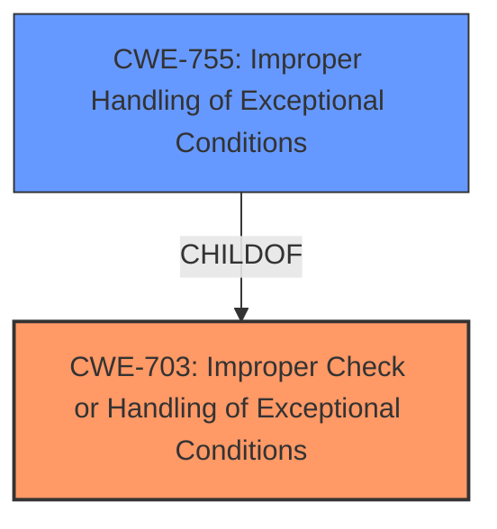

# Enhanced Analysis for CVE-2020-36317

# Summary
| CWE ID  | CWE Name                                                              | Confidence | CWE Abstraction Level | CWE Vulnerability Mapping Label | CWE-Vulnerability Mapping Notes |
| :------- | :-------------------------------------------------------------------- | :--------- | :---------------------- | :------------------------------ | :------------------------------ |
| CWE-703 | Improper Check or Handling of Exceptional Conditions               | 0.9        | Pillar                  | Primary CWE                     | Discouraged                   |

## Evidence and Confidence

*   **Confidence Score:** 0.9
*   **Evidence Strength:** HIGH

## Relationship Analysis
The primary relationship that influenced the decision was the parent-child relationship between CWE-703 (Improper Check or Handling of Exceptional Conditions) and potential child CWEs like CWE-755 (Improper Handling of Exceptional Conditions). While CWE-755 seemed relevant initially, the broader scope of CWE-703 more accurately captured the vulnerability's root cause. The vulnerability stems from a failure to properly handle a panic, which is an exceptional condition. CWE-703 is a pillar level of abstraction. While it is better to select a Base or Variant level of abstraction, in this case, there is not enough evidence to select a more specific CWE.



## Vulnerability Chain
The vulnerability chain starts with the **panic safety problem** in the `String::retain()` function. When a closure panics, the cleanup logic is skipped, leading to a `String` containing invalid UTF-8. This **invariant violation** allows the creation of invalid `String` values, potentially leading to undefined behavior and **memory safety violation**.
  - Root Cause: **Panic safety problem** in String::retain()
  - Weakness: Skipping cleanup logic on panic, leading to invalid UTF-8 in String.
  - Impact: Memory safety violation, undefined behavior.

## Summary of Analysis
The initial analysis considered CWE-787 (Out-of-bounds Write) and CWE-119 (Improper Restriction of Operations within the Bounds of a Memory Buffer) due to the potential for memory corruption. However, the core issue isn't directly an out-of-bounds write but rather the **improper handling of the panic** which leads to the corrupted state. This indicates that the **root cause** lies in the handling of exceptional conditions, not a direct memory access violation.

The decision to choose CWE-703 is based on the evidence that the `String::retain()` function **fails to properly handle the exceptional condition** of a panic within the provided closure. This failure to handle the panic allows the `String` to be left in an inconsistent state.

While CWE-703 is a high-level (Pillar) CWE, it accurately reflects the **root cause** as identified in the vulnerability description and the CVE reference content summary. The summary states, "The vulnerability stems from the `String::retain` function in the Rust standard library... However, if the user-provided closure panics, and that panic is caught by the caller, the function's cleanup logic is skipped..." This skipping of cleanup logic on panic is the **improper handling of the exceptional condition.**

CWE-755 was considered, but not used, as it is a Class-level CWE, and the evidence more directly points to the broader category of exceptional condition handling rather than a specific type of improper handling.

Relevant CWE Information:
- CWE-703: Improper Check or Handling of Exceptional Conditions

# Enhanced Context (25 CWEs)
The following CWEs were identified as potentially relevant to this vulnerability:

## CWE-703: Improper Check or Handling of Exceptional Conditions
**Abstraction Level**: Pillar
**Similarity Score**: 0.77
**Source**: dense

**Description**:
The product does not properly anticipate or handle exceptional conditions that rarely occur during normal operation of the product.

**Mapping Guidance**:
- Usage: Discouraged
- Rationale: This CWE entry is extremely high-level, a Pillar.


## CWE Relationship Analysis

Current CWEs represent these abstraction levels: .


### Vulnerability Chain Analysis

**Chain starting from CWE-755:**
- 755 (Improper Handling of Exceptional Conditions) - ROOT


**Chain starting from CWE-703:**
- 703 (Improper Check or Handling of Exceptional Conditions) - ROOT


### CWE Relationship Diagram

```mermaid
graph TD
    classDef primary fill:#f96,stroke:#333,stroke-width:2px
    classDef secondary fill:#69f,stroke:#333
    classDef tertiary fill:#9e9,stroke:#333
```