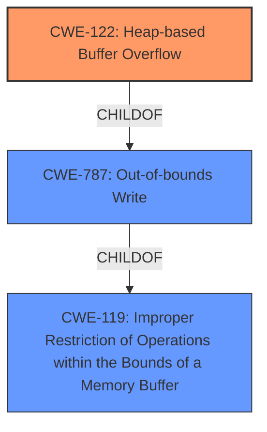

# Analysis for CVE-2020-36328

# Summary
| CWE ID | CWE Name | Confidence | CWE Abstraction Level | CWE Vulnerability Mapping Label | CWE-Vulnerability Mapping Notes |
|---|---|---|---|---|---|
| CWE-122 | Heap-based Buffer Overflow | 1.0 | Variant | Allowed | Primary CWE |
| CWE-119 | Improper Restriction of Operations within the Bounds of a Memory Buffer | 0.7 | Class | Discouraged | Secondary Candidate |
| CWE-787 | Out-of-bounds Write | 0.6 | Base | Allowed | Secondary Candidate |

## Evidence and Confidence

*   **Confidence Score:** 0.9
*   **Evidence Strength:** HIGH

## Relationship Analysis
The primary CWE is CWE-122, which is a variant of CWE-787 (Out-of-bounds Write). CWE-787 is a child of CWE-119 (Improper Restriction of Operations within the Bounds of a Memory Buffer). This hierarchical relationship indicates that CWE-122 is a more specific type of out-of-bounds write that occurs on the heap. The choice of CWE-122 is driven by the evidence explicitly mentioning "heap-based buffer overflow."

## Vulnerability Chain
The vulnerability chain starts with an invalid check for buffer size, leading to a heap-based buffer overflow. This can then lead to data confidentiality, integrity, and system availability issues.
  - Root Cause: Invalid check for buffer size
  - Weakness: Heap-based buffer overflow (CWE-122)
  - Impact: Data confidentiality, integrity, and system availability

## Summary of Analysis
The analysis is based on the provided evidence, which clearly indicates a **heap-based buffer overflow** due to an **invalid check for buffer size**. The vulnerability description explicitly mentions "heap-based buffer overflow" in function WebPDecodeRGBInto. The CVE Reference Links Content Summary further confirms this, stating that the root cause is a heap-based buffer overflow due to an invalid buffer size check.

The graph relationships confirm that CWE-122 is the most specific CWE for this vulnerability, as it is a variant of CWE-787 and CWE-119. While CWE-119 is a parent, it is too general, and the MITRE mapping guidance discourages its usage when a more specific CWE is available. CWE-787 is more specific, but CWE-122 captures the fact that this is a heap-based overflow.

The selection of CWE-122 is based on the explicit mention of "heap-based buffer overflow" and the evidence from the CVE reference links confirming the root cause. This provides a high level of confidence in the assessment.

CWE-190 (Integer Overflow or Wraparound), CWE-125 (Out-of-bounds Read), CWE-126 (Buffer Over-read), CWE-193 (Off-by-one Error), CWE-1284 (Improper Validation of Specified Quantity in Input), and CWE-787 (Out-of-bounds Write) were considered but not selected as the primary CWE. CWE-190 was not chosen because the description doesn't focus on an integer overflow. CWE-125 and CWE-126 were not chosen because the vulnerability involves a write, not a read. CWE-193 was not chosen because the description doesn't focus on an off-by-one error. CWE-1284 was not chosen because, while the vulnerability involves an invalid check for buffer size, the primary issue is the heap-based buffer overflow. CWE-787 was considered but CWE-122 is more specific.

Relevant CWE Information:

# Enhanced Context (25 CWEs)
The following CWEs were identified as potentially relevant to this vulnerability:

## CWE-131: Incorrect Calculation of Buffer Size
**Abstraction Level**: Base
**Similarity Score**: 0.77
**Source**: dense

**Description**:
The product does not correctly calculate the size to be used when allocating a buffer, which could lead to a buffer overflow.

**Mapping Guidance**:
- Usage: Allowed
- Rationale: This CWE entry is at the Base level of abstraction, which is a preferred level of abstraction for mapping to the root causes of vulnerabilities.

This CWE was not selected because the description focuses on the buffer overflow, and not the calculation.

## CWE-191: Integer Underflow (Wrap or Wraparound)
**Abstraction Level**: Base
**Similarity Score**: 0.77
**Source**: dense

**Description**:
The product subtracts one value from another, such that the result is less than the minimum allowable integer value, which produces a value that is not equal to the correct result.

**Mapping Guidance**:
- Usage: Allowed
- Rationale: This CWE entry is at the Base level of abstraction, which is a preferred level of abstraction for mapping to the root causes of vulnerabilities.

This CWE was not selected because there is no integer underflow.

## CWE-124: Buffer Underwrite ('Buffer Underflow')
**Abstraction Level**: Base
**Similarity Score**: 0.77
**Source**: dense

**Description**:
The product writes to a buffer using an index or pointer that references a memory location prior to the beginning of the buffer.

**Mapping Guidance**:
- Usage: Allowed
- Rationale: This CWE entry is at the Base level of abstraction, which is a preferred level of abstraction for mapping to the root causes of vulnerabilities.

This CWE was not selected because there is a buffer overflow, not underflow.

## CWE-125: Out-of-bounds Read
**Abstraction Level**: Base
**Similarity Score**: 0.76
**Source**: dense

**Description**:
The product reads data past the end, or before the beginning, of the intended buffer.

**Mapping Guidance**:
- Usage: Allowed
- Rationale: This CWE entry is at the Base level of abstraction, which is a preferred level of abstraction for mapping to the root causes of vulnerabilities.

This CWE was not selected because there is a buffer overflow (write), not a read.

## CWE-126: Buffer Over-read
**Abstraction Level**: Variant
**Similarity Score**: 0.76
**Source**: dense

**Description**:
The product reads from a buffer using buffer access mechanisms such as indexes or pointers that reference memory locations after the targeted buffer.

**Mapping Guidance**:
- Usage: Allowed
- Rationale: This CWE entry is at the Variant level of abstraction, which is a preferred level of abstraction for mapping to the root causes of vulnerabilities.

This CWE was not selected because there is a buffer overflow (write), not a read.

## CWE-193: Off-by-one Error
**Abstraction Level**: Base
**Similarity Score**: 0.75
**Source**: dense

**Description**:
A product calculates or uses an incorrect maximum or minimum value that is 1 more, or 1 less, than the correct value.

**Mapping Guidance**:
- Usage: Allowed
- Rationale: This CWE entry is at the Base level of abstraction, which is a preferred level of abstraction for mapping to the root causes of vulnerabilities.

This CWE was not selected because the description doesn't focus on an off-by-one error.

## CWE-805: Buffer Access with Incorrect Length Value
**Abstraction Level**: Base
**Similarity Score**: 0.75
**Source**: dense

**Description**:
The product uses a sequential operation to read or write a buffer, but it uses an incorrect length value that causes it to access memory that is outside of the bounds of the buffer.

**Mapping Guidance**:
- Usage: Allowed
- Rationale: This CWE entry is at the Base level of abstraction, which is a preferred level of abstraction for mapping to the root causes of vulnerabilities.

This CWE was not selected because the description focuses on the buffer overflow, and not the access with incorrect length value.

## CWE-190: Integer Overflow or Wraparound
**Abstraction Level**: Base
**Similarity Score**: 0.74
**Source**: dense

**Description**:
The product performs a calculation that can
         produce an integer overflow or wraparound when the logic
         assumes that the resulting value will always be larger than
         the original value. This occurs when an integer value is
         incremented to a value that is too large to store in the
         associated representation. When this occurs, the value may
         become a very small or negative number.

**Mapping Guidance**:
- Usage: Allowed
- Rationale: This