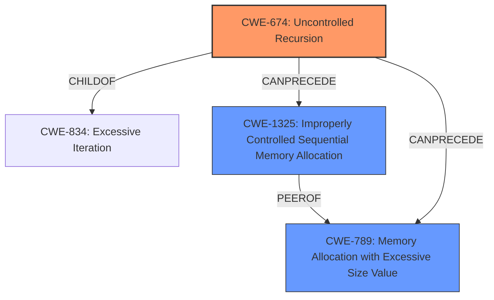

# Raw Analyzer Response for CVE-2020-36366

# Summary
| CWE ID  | CWE Name | Confidence | CWE Abstraction Level | CWE Vulnerability Mapping Label | CWE-Vulnerability Mapping Notes |
|-----------------|--------------------------------------|------------|-------------------------|-----------------------------------|------------------------------------|
| CWE-674 | Uncontrolled Recursion | 1.0 | Class | Allowed-with-Review | Primary CWE |
| CWE-1325 | Improperly Controlled Sequential Memory Allocation | 0.7 | Base | Allowed | Secondary Candidate |
| CWE-789 | Memory Allocation with Excessive Size Value | 0.6 | Variant | Allowed | Secondary Candidate |

## Evidence and Confidence

*   **Confidence Score:** 0.9
*   **Evidence Strength:** HIGH

## Relationship Analysis
The primary CWE, CWE-674 [Uncontrolled Recursion], is a Class-level CWE and a child of CWE-834 [Excessive Iteration]. The vulnerability description clearly points to a **stack overflow** caused by unbounded recursion within the `parse_array` function. The recursive calls consume excessive stack resources, aligning with CWE-674.

Secondary CWEs like CWE-1325 [Improperly Controlled Sequential Memory Allocation] and CWE-789 [Memory Allocation with Excessive Size Value] were considered, as excessive recursion can lead to uncontrolled memory allocation. However, the primary issue is the lack of control over the recursion depth, making CWE-674 the most relevant.

## Vulnerability Chain
The vulnerability chain starts with the **uncontrolled recursion** in the `parse_array` function (CWE-674). This leads to excessive stack usage and ultimately a **stack overflow**. The stack overflow can cause a Denial of Service (DoS).

CWE-674 -> Excessive stack usage -> Stack Overflow -> Denial of Service

## Summary of Analysis
The initial assessment strongly pointed towards CWE-674 [Uncontrolled Recursion] as the primary weakness, supported by the vulnerability description, which explicitly mentions a **stack overflow** due to unbounded recursion. The "CVE Reference Links Content Summary" confirms the root cause: "The vulnerability is caused by a stack overflow in the `mjs` (embedded JavaScript engine) library when parsing deeply nested arrays. The `parse_array` function recursively calls itself, leading to excessive stack usage when processing nested array structures."

The Retriever Results listed CWE-674 as a possible match, reinforcing the initial assessment. While other CWEs such as CWE-1325 [Improperly Controlled Sequential Memory Allocation] and CWE-789 [Memory Allocation with Excessive Size Value] were considered due to the potential for excessive memory allocation during recursion, CWE-674 remains the most accurate representation of the root cause.

The decision to classify this vulnerability as CWE-674 is based on the evidence of **uncontrolled recursion** leading to a **stack overflow**. The vulnerability chain and relationship analysis further support this classification. While CWE-674 is a Class-level CWE, there isn't a more specific Base or Variant CWE that accurately captures the unbounded recursion issue.

Relevant CWE Information:

# Enhanced Context (25 CWEs)
The following CWEs were identified as potentially relevant to this vulnerability:

## CWE-1325: Improperly Controlled Sequential Memory Allocation
**Abstraction Level**: Base
**Similarity Score**: 0.79
**Source**: dense

**Description**:
The product manages a group of objects or resources and performs a separate memory allocation for each object, but it does not properly limit the total amount of memory that is consumed by all of the combined objects.

**Mapping Guidance**:
- Usage: Allowed
- Rationale: This CWE entry is at the Base level of abstraction, which is a preferred level of abstraction for mapping to the root causes of vulnerabilities.

## CWE-789: Memory Allocation with Excessive Size Value
**Abstraction Level**: Variant
**Similarity Score**: 0.78
**Source**: dense

**Description**:
The product allocates memory based on an untrusted, large size value, but it does not ensure that the size is within expected limits, allowing arbitrary amounts of memory to be allocated.

**Mapping Guidance**:
- Usage: Allowed
- Rationale: This CWE entry is at the Variant level of abstraction, which is a preferred level of abstraction for mapping to the root causes of vulnerabilities.

## CWE-131: Incorrect Calculation of Buffer Size
**Abstraction Level**: Base
**Similarity Score**: 0.76
**Source**: dense

**Description**:
The product does not correctly calculate the size to be used when allocating a buffer, which could lead to a buffer overflow.

**Mapping Guidance**:
- Usage: Allowed
- Rationale: This CWE entry is at the Base level of abstraction, which is a preferred level of abstraction for mapping to the root causes of vulnerabilities.

## CWE-191: Integer Underflow (Wrap or Wraparound)
**Abstraction Level**: Base
**Similarity Score**: 0.75
**Source**: dense

**Description**:
The product subtracts one value from another, such that the result is less than the minimum allowable integer value, which produces a value that is not equal to the correct result.

**Mapping Guidance**:
- Usage: Allowed
- Rationale: This CWE entry is at the Base level of abstraction, which is a preferred level of abstraction for mapping to the root causes of vulnerabilities.

## CWE-404: Improper Resource Shutdown or Release
**Abstraction Level**: Class
**Similarity Score**: 0.75
**Source**: dense

**Description**:
The product does not release or incorrectly releases a resource before it is made available for re-use.

**Mapping Guidance**:
- Usage: Allowed-with-Review
- Rationale: This CWE entry is a Class and might have Base-level children that would be more appropriate

## CWE-226: Sensitive Information in Resource Not Removed Before Reuse
**Abstraction Level**: Base
**Similarity Score**: 0.75
**Source**: dense

**Description**:
The product releases a resource such as memory or a file so that it can be made available for reuse, but it does not clear or "zeroize" the information contained in the resource before the product performs a critical state transition or makes the resource available for reuse by other entities.

**Mapping Guidance**:
- Usage: Allowed
- Rationale: This CWE entry is at the Base level of abstraction, which is a preferred level of abstraction for mapping to the root causes of vulnerabilities.

## CWE-674: Uncontrolled Recursion
**Abstraction Level**: Class
**Similarity Score**: 0.75
**Source**: dense

**Description**:
The product does not properly control the amount of recursion that takes place,  consuming excessive resources, such as allocated memory or the program stack.

**Mapping Guidance**:
- Usage: Allowed-with-Review
- Rationale: This CWE entry is a Class and might have Base-level children that would be more appropriate

## CWE-405: Asymmetric Resource Consumption (Amplification)
**Abstraction Level**: Class
**Similarity Score**: 0.74
**Source**: dense

**Description**:
The product does not properly control situations in which an adversary can cause the product to consume or produce excessive resources without requiring the adversary to invest equivalent work or otherwise prove authorization, i.e., the adversary's influence is "asymmetric."

**Mapping Guidance**:
- Usage: Allowed-with-Review
- Rationale: This CWE entry is a Class and might have Base-level children that would be more appropriate

## CWE-664: Improper Control of a Resource Through its Lifetime
**Abstraction Level**: Pillar
**Similarity Score**: 0.74
**Source**: dense

**Description**:
The product does not maintain or incorrectly maintains control over a resource throughout its lifetime of creation, use, and release.

**Mapping Guidance**:
- Usage: Discouraged
- Rationale: This CWE entry is high-level when lower-level children are available.

## CWE-125: Out-of-bounds Read
**Abstraction Level**: Base
**Similarity Score**: 0.74
**Source**: dense

**Description**:
The product reads data past the end, or before the beginning, of the intended buffer.

**Mapping Guidance**:
- Usage: Allowed
- Rationale: This CWE entry is at the Base level of abstraction, which is a preferred level