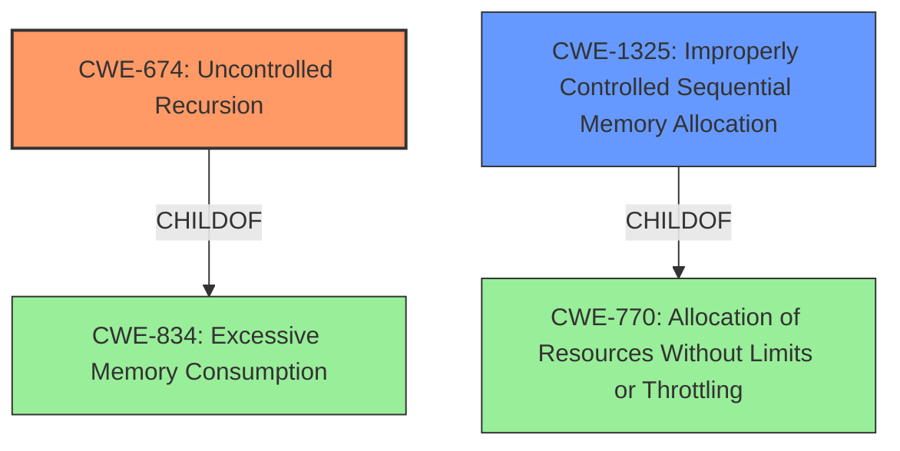

# Analysis for CVE-2020-36367

# Summary
| CWE ID | CWE Name | Confidence | CWE Abstraction Level | CWE Vulnerability Mapping Label | CWE-Vulnerability Mapping Notes |
|---|---|---|---|---|---|
| CWE-674 | Uncontrolled Recursion | 1.0 | Class | Allowed-with-Review | Primary CWE |
| CWE-1325 | Improperly Controlled Sequential Memory Allocation | 0.6 | Base | Allowed | Secondary Candidate |

## Evidence and Confidence

*   **Confidence Score:** 0.8
*   **Evidence Strength:** HIGH

## Relationship Analysis
The primary CWE is CWE-674 (Uncontrolled Recursion), which is a Class-level CWE. It has a child relationship to CWE-834 (Excessive Memory Consumption). CWE-1325 (Improperly Controlled Sequential Memory Allocation) is a Base-level CWE and a child of CWE-770 (Allocation of Resources Without Limits or Throttling). There is no direct relationship between CWE-674 and CWE-1325.

## Vulnerability Chain
The vulnerability chain begins with **uncontrolled recursion** (CWE-674) due to the `parse_block`, `parse_statement`, and `parse_statement_list` functions calling each other recursively without proper checks. This leads to **stack exhaustion** and a **denial of service** (DoS).

## Summary of Analysis
The initial assessment identified CWE-674 as the primary weakness, supported by the "Vulnerability Description Key Phrases" which highlighted "Stack overflow" as the **weakness** and "Denial of Service (DoS)" as the impact. The "CVE Reference Links Content Summary" further solidified this by stating "Stack exhaustion due to **uncontrolled recursion** in parsing functions".

The evidence strongly supports CWE-674 as the primary CWE. The "CVE Reference Links Content Summary" confirms the **root cause** as **uncontrolled recursion** leading to stack exhaustion, which aligns perfectly with CWE-674's description. While other CWEs like CWE-787 (Stack-based Buffer Overflow) were considered, the description clearly indicates a recursion issue rather than a buffer overflow in the traditional sense.

The selected CWE is at the optimal level of specificity. While CWE-674 is a Class, it accurately represents the core weakness. A more specific child CWE might exist, but the current evidence doesn't point to a more precise classification.

CWE-1325 (Improperly Controlled Sequential Memory Allocation) was considered as a secondary CWE because recursion can lead to allocating memory on the stack for each call, but there is no direct evidence that specifically says memory is being allocated.

Relevant CWE Information:

# Enhanced Context (25 CWEs)
The following CWEs were identified as potentially relevant to this vulnerability:

## CWE-1325: Improperly Controlled Sequential Memory Allocation
**Abstraction Level**: Base
**Similarity Score**: 0.79
**Source**: dense

**Description**:
The product manages a group of objects or resources and performs a separate memory allocation for each object, but it does not properly limit the total amount of memory that is consumed by all of the combined objects.

**Mapping Guidance**:
- Usage: Allowed
- Rationale: This CWE entry is at the Base level of abstraction, which is a preferred level of abstraction for mapping to the root causes of vulnerabilities.

## CWE-674: Uncontrolled Recursion
**Abstraction:** Class
**Status:** Draft

### Description
The product does not properly control the amount of recursion that takes place,  consuming excessive resources, such as allocated memory or the program stack.

### Extended Description
Not provided

### Alternative Terms
Stack Exhaustion

### Relationships
ChildOf -> CWE-834

### Mapping Guidance
**Usage:** Allowed-with-Review
**Rationale:** This CWE entry is a Class and might have Base-level children that would be more appropriate
**Comments:** Examine children of this entry to see if there is a better fit
**Reasons:**
- Abstraction

## CWE-674: Uncontrolled Recursion
**CWE-674** (Uncontrolled Recursion) is the primary CWE because the **root cause** is **uncontrolled recursion**. The description for CWE-674 states "The product does not properly control the amount of recursion that takes place, consuming excessive resources, such as allocated memory or the program stack." This aligns with the vulnerability description, which states "Stack exhaustion due to **uncontrolled recursion** in parsing functions." The impact of this vulnerability is denial of service.
## CWE-1325: Improperly Controlled Sequential Memory Allocation
**CWE-1325** (Improperly Controlled Sequential Memory Allocation) is a secondary CWE because the description states "The product manages a group of objects or resources and performs a separate memory allocation for each object, but it does not properly limit the total amount of memory that is consumed by all of the combined objects." The vulnerability description does not specifically state that memory is being allocated, but the recursion does consume stack resources.