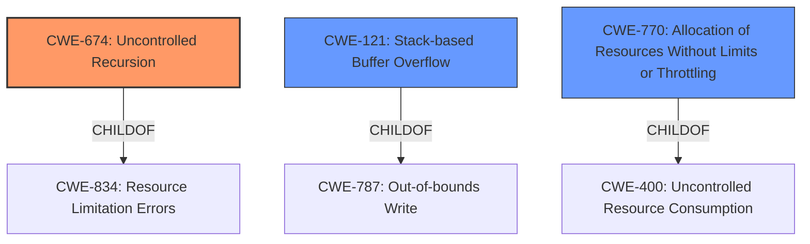

# Enhanced Analysis for CVE-2020-36369

# Summary
| CWE ID | CWE Name | Confidence | CWE Abstraction Level | CWE Vulnerability Mapping Label | CWE-Vulnerability Mapping Notes |
|---|---|---|---|---|---|
| CWE-674 | Uncontrolled Recursion | 0.9 | Class | Allowed-with-Review | Primary CWE |
| CWE-121 | Stack-based Buffer Overflow | 0.7 | Variant | Allowed | Secondary Candidate |
| CWE-770 | Allocation of Resources Without Limits or Throttling | 0.6 | Base | Allowed | Secondary Candidate |

## Evidence and Confidence

*   **Confidence Score:** 0.8
*   **Evidence Strength:** HIGH

## Relationship Analysis
The primary CWE, CWE-674 **Uncontrolled Recursion**, is a Class-level CWE. The analysis considered the relationship of CWE-674 to CWE-834 Resource Limitation Errors, of which CWE-674 is a child. It also considered CWE-770 **Allocation of Resources Without Limits or Throttling** as a potential child and root cause.

The secondary CWE, CWE-121 **Stack-based Buffer Overflow**, is a Variant and a child of CWE-787. The analysis also considered the relationship of CWE-121 to other buffer overflow CWEs, such as CWE-122 **Heap-based Buffer Overflow**.



## Vulnerability Chain
The vulnerability chain starts with the **uncontrolled recursion** due to the parser's handling of nested blocks and statements, leading to stack exhaustion and ultimately a denial of service.

## Summary of Analysis
The initial analysis focused on the **stack overflow** reported in the vulnerability description. However, the root cause analysis from the CVE Reference Links Content Summary points to **uncontrolled recursion** as the primary driver of the vulnerability.

The CVE Reference Links Content Summary states: "Recursive calls to `parse_block`, `parse_statement`, and `parse_statement_list` functions lead to stack exhaustion. The vulnerability lies in the way the parser handles nested blocks and statements, causing excessive stack usage." This provides strong evidence for classifying the vulnerability as CWE-674 **Uncontrolled Recursion**, which directly addresses the **weakness** of the product not properly controlling the amount of recursion.

CWE-121 **Stack-based Buffer Overflow** was considered because the vulnerability description mentions "**Stack overflow**". However, the root cause is the **uncontrolled recursion** leading to stack exhaustion, not necessarily writing beyond the bounds of a stack-allocated buffer. The retriever results also list CWE-121 with a high score, but the evidence from the CVE details points more directly to CWE-674.

CWE-770 **Allocation of Resources Without Limits or Throttling** was considered because **uncontrolled recursion** can be viewed as a form of resource allocation without limits. However, CWE-674 more directly captures the nature of the recursive calls being the core issue.

The final decision favors CWE-674 due to the explicit mention of recursive calls leading to stack exhaustion in the CVE Reference Links Content Summary. This highlights the **uncontrolled recursion** as the primary cause of the denial-of-service vulnerability. The selection of CWE-674 is at the Class level of abstraction because there isn't a more specific Base or Variant that directly addresses **uncontrolled recursion** leading to stack exhaustion.

Relevant CWE Information:

# Enhanced Context (25 CWEs)

## CWE-1325: Improperly Controlled Sequential Memory Allocation
**Abstraction Level**: Base
**Similarity Score**: 0.79
**Source**: dense

**Description**:
The product manages a group of objects or resources and performs a separate memory allocation for each object, but it does not properly limit the total amount of memory that is consumed by all of the combined objects.

**Mapping Guidance**:
- Usage: Allowed
- Rationale: This CWE entry is at the Base level of abstraction, which is a preferred level of abstraction for mapping to the root causes of vulnerabilities.

## CWE-789: Memory Allocation with Excessive Size Value
**Abstraction Level**: Variant
**Similarity Score**: 0.77
**Source**: dense

**Description**:
The product allocates memory based on an untrusted, large size value, but it does not ensure that the size is within expected limits, allowing arbitrary amounts of memory to be allocated.

**Mapping Guidance**:
- Usage: Allowed
- Rationale: This CWE entry is at the Variant level of abstraction, which is a preferred level of abstraction for mapping to the root causes of vulnerabilities.

## CWE-131: Incorrect Calculation of Buffer Size
**Abstraction Level**: Base
**Similarity Score**: 0.76
**Source**: dense

**Description**:
The product does not correctly calculate the size to be used when allocating a buffer, which could lead to a buffer overflow.

**Mapping Guidance**:
- Usage: Allowed
- Rationale: This CWE entry is at the Base level of abstraction, which is a preferred level of abstraction for mapping to the root causes of vulnerabilities.

## CWE-191: Integer Underflow (Wrap or Wraparound)
**Abstraction Level**: Base
**Similarity Score**: 0.75
**Source**: dense

**Description**:
The product subtracts one value from another, such that the result is less than the minimum allowable integer value, which produces a value that is not equal to the correct result.

**Mapping Guidance**:
- Usage: Allowed
- Rationale: This CWE entry is at the Base level of abstraction, which is a preferred level of abstraction for mapping to the root causes of vulnerabilities.

## CWE-404: Improper Resource Shutdown or Release
**Abstraction Level**: Class
**Similarity Score**: 0.75
**Source**: dense

**Description**:
The product does not release or incorrectly releases a resource before it is made available for re-use.

**Mapping Guidance**:
- Usage: Allowed-with-Review
- Rationale: This CWE entry is a Class and might have Base-level children that would be more appropriate

## CWE-226: Sensitive Information in Resource Not Removed Before Reuse
**Abstraction Level**: Base
**Similarity Score**: 0.75
**Source**: dense

**Description**:
The product releases a resource such as memory or a file so that it can be made available for reuse, but it does not clear or "zeroize" the information contained in the resource before the product performs a critical state transition or makes the resource available for reuse by other entities.

**Mapping Guidance**:
- Usage: Allowed
- Rationale: This CWE entry is at the Base level of abstraction, which is a preferred level of abstraction for mapping to the root causes of vulnerabilities.

## CWE-674: Uncontrolled Recursion
**Abstraction Level**: Class
**Similarity Score**: 0.74
**Source**: dense

**Description**:
The product does not properly control the amount of recursion that takes place,  consuming excessive resources, such as allocated memory or the program stack.

**Mapping Guidance**:
- Usage: Allowed-with-Review
- Rationale: This CWE entry is a Class and might have Base-level children that would be more appropriate

## CWE-405: Asymmetric Resource Consumption (Amplification)
**Abstraction Level**: Class
**Similarity Score**: 0.74
**Source**: dense

**Description**:
The product does not properly control situations in which an adversary can cause the product to consume or produce excessive resources without requiring the adversary to invest equivalent work or otherwise prove authorization, i.e., the adversary's influence is "asymmetric."

**Mapping Guidance**:
- Usage: Allowed-with-Review
- Rationale: This CWE entry is a Class and might have Base-level children that would be more appropriate

## CWE-664: Improper Control of a Resource Through its Lifetime
**Abstraction Level**: Pillar
**Similarity Score**: 0.74
**Source**: dense

**Description**:
The product does not maintain or incorrectly maintains control over a resource throughout its lifetime of creation, use, and release.

**Mapping Guidance**:
- Usage: Discouraged
- Rationale: This CWE entry is high-level when lower-level children are available.

## CWE-681: Incorrect Conversion between Numeric Types


## CWE Relationship Analysis

Current CWEs represent these abstraction levels: .


### Vulnerability Chain Analysis

**Chain starting from CWE-121:**
- 121 (Stack-based Buffer Overflow) - ROOT


**Chain starting from CWE-787:**
- 787 (Out-of-bounds Write) - ROOT


### CWE Relationship Diagram

```mermaid
graph TD
    classDef primary fill:#f96,stroke:#333,stroke-width:2px
    classDef secondary fill:#69f,stroke:#333
    classDef tertiary fill:#9e9,stroke:#333
```