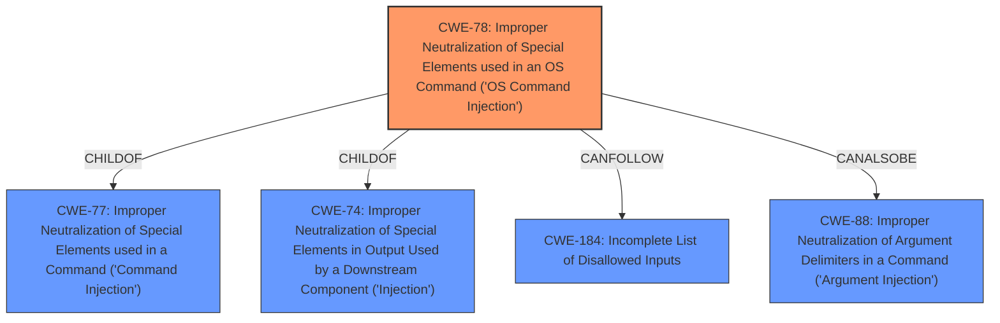

# Analysis for CVE-2020-36376

# Summary
| CWE ID | CWE Name | Confidence | CWE Abstraction Level | CWE Vulnerability Mapping Label | CWE-Vulnerability Mapping Notes |
|---|---|---|---|---|---|
| CWE-78 | Improper Neutralization of Special Elements used in an OS Command ('OS Command Injection') | 1.0 | Base | Allowed | Primary CWE |

## Evidence and Confidence

*   **Confidence Score:** 1.0
*   **Evidence Strength:** HIGH

## Relationship Analysis
The primary relationship influencing the CWE selection is that CWE-78 is a base-level CWE which is the preferred level of abstraction. CWE-78 is a child of CWE-77 (Command Injection) and CWE-74 (Improper Neutralization of Special Elements). The other relationships like CANFOLLOW -> CWE-184 and CANALSOBE -> CWE-88 did not influence the selection because they represent potential consequences or related weaknesses, not the primary weakness itself.

## Vulnerability Chain
The vulnerability chain starts with the **improper handling of user input** which is directly passed to the `exec` command without sanitization. This leads to **OS command injection**, allowing an attacker to execute arbitrary commands on the system.
  - Initial Flaw: **Insecure command formatting**
  - Root Cause: **Improper Neutralization**
  - Weakness: **OS Command Injection (CWE-78)**
  - Impact: **Remote Code Execution**

## Summary of Analysis
The analysis is based on the provided evidence which clearly indicates that the root cause of the vulnerability is the **insecure command formatting** where user input is directly used in the `exec` command without proper sanitization.

The "CVE Reference Links Content Summary" explicitly states: "**Root cause of vulnerability**: Insecure command formatting in `aaptjs/index.js` where user input is directly used in the `exec` command without proper sanitization or validation."

This aligns perfectly with the description of CWE-78, which is "**Improper Neutralization of Special Elements used in an OS Command ('OS Command Injection')**: The product constructs all or part of an OS command using externally-influenced input from an upstream component, but it does not neutralize or incorrectly neutralizes special elements that could modify the intended OS command when it is sent to a downstream component."

The relationship graph helped confirm that CWE-78 is the appropriate base-level weakness.

The selected CWE is at the optimal level of specificity because it directly describes the **root cause** which is the **improper neutralization** of special elements in an OS command, rather than a more general weakness like improper input validation. Other CWEs like CWE-77 were considered but are more general.
Other CWEs Considered and Rejected:

*   **CWE-77 (Improper Neutralization of Special Elements used in a Command ('Command Injection'))**: This is a class-level CWE and a parent of CWE-78. While applicable, it's less specific than CWE-78 which clearly identifies the vulnerability as related to OS commands.
*   **CWE-138 (Improper Neutralization of Special Elements)**: This is also a class-level CWE. It is too broad and doesn't specify the context of OS command injection.
*   **CWE-22 (Improper Limitation of a Pathname to a Restricted Directory ('Path Traversal'))** and **CWE-41 (Improper Resolution of Path Equivalence)**: These are related to file path manipulation, which is not the primary issue in this vulnerability. The core problem is the ability to execute arbitrary commands, not accessing unauthorized files.
*   **CWE-476 (NULL Pointer Dereference)**: This is unrelated to the described vulnerability.
*   **CWE-116 (Improper Encoding or Escaping of Output)**: While encoding/escaping could be a mitigation, the primary weakness is the lack of neutralization of special elements before executing the command.
*   **CWE-184 (Incomplete List of Disallowed Inputs)**: This could be a contributing factor, but the core issue is the lack of any neutralization, not an incomplete list.
*   **CWE-88 (Improper Neutralization of Argument Delimiters in a Command ('Argument Injection'))**: This is a related weakness but not the primary one. The vulnerability allows complete command execution, not just argument manipulation.
*   **CWE-79 (Improper Neutralization of Input During Web Page Generation ('Cross-site Scripting'))**: This is specific to web page generation and XSS, which is not relevant to this vulnerability.
*   **CWE-98 (Improper Control of Filename for Include/Require Statement in PHP Program ('PHP Remote File Inclusion'))**: This is specific to PHP applications, which is not mentioned in the vulnerability description.
*   **CWE-94 (Improper Control of Generation of Code ('Code Injection'))**: This is a more general case of code injection, while CWE-78 is specific to OS command injection, making it a better fit.
*   **CWE-73 (External Control of File Name or Path)**: This is related to file path manipulation, which is not the primary issue in this vulnerability. The core problem is the ability to execute arbitrary commands.
*   **CWE-182 (Collapse of Data into Unsafe Value)**: There is no indication of data collapsing in the vulnerability description, so this CWE is not applicable.