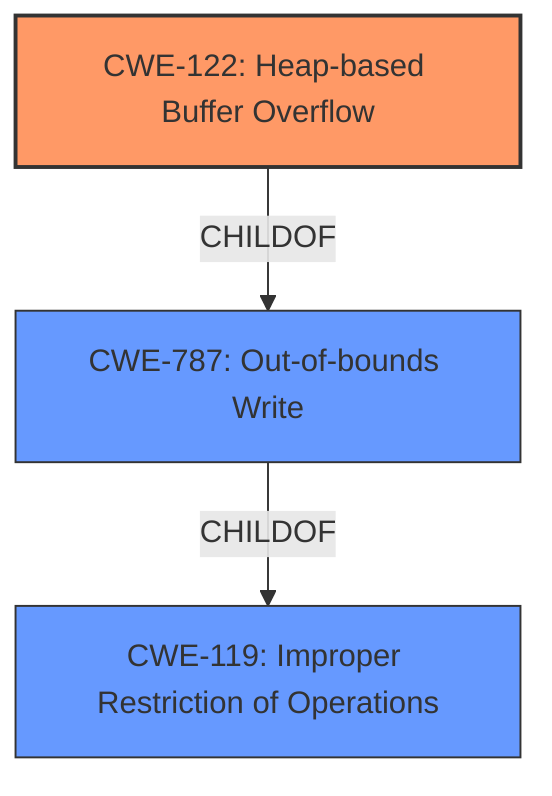

# Enhanced Analysis for CVE-2020-36428

# Summary
| CWE ID | CWE Name | Confidence | CWE Abstraction Level | CWE Vulnerability Mapping Label | CWE-Vulnerability Mapping Notes |
|---|---|---|---|---|---|
| CWE-122 | Heap-based Buffer Overflow | 1.0 | Variant | Allowed | Primary CWE |

## Evidence and Confidence

*   **Confidence Score:** 1.0
*   **Evidence Strength:** HIGH

## Relationship Analysis
The primary relationship that influenced the choice of CWE-122 is its direct link to the vulnerability description, which explicitly mentions a **"heap-based buffer overflow"**. CWE-122 is a variant of CWE-787 (Out-of-bounds Write) and CWE-119 (Improper Restriction of Operations within the Bounds of a Memory Buffer). Given the specificity of the heap allocation, selecting the variant CWE-122 provides a more precise classification than its more general parents.



## Vulnerability Chain
The vulnerability chain involves a **heap-based buffer overflow**. The root cause is in `ReadInt32DataDouble` function within the `matio` library, where the function attempts to write beyond the allocated buffer, leading to a crash.
  - **Root Cause**: **Heap-based buffer overflow** in `ReadInt32DataDouble`
  - **Weakness**: Improper write operation beyond buffer boundary
  - **Impact**: Crash, potential code execution

## Summary of Analysis
The initial assessment pointed towards CWE-122 (Heap-based Buffer Overflow) due to the explicit mention of this vulnerability type in the description. The supporting evidence from "CVE Reference Links Content Summary" confirms the **root cause** as "Heap-buffer-overflow" and lists "Heap-buffer-overflow WRITE 4" as a **weakness**, solidifying the choice of CWE-122. The relationship analysis reinforces this decision, as CWE-122 is a variant (more specific) of CWE-787 and CWE-119, making it the most appropriate choice.

The decision to use CWE-122 is based on direct evidence from the vulnerability description. The description states: "matio (aka MAT File I/O Library) 1.5.18 through 1.5.21 has a **heap-based buffer overflow** in ReadInt32DataDouble".

The selected CWE is at the optimal level of specificity because it precisely describes the type of buffer overflow (heap-based) and avoids generalization to broader categories like CWE-119.
Relevant CWE Information:
# Enhanced Context (25 CWEs)
The following CWEs were identified as potentially relevant to this vulnerability:

## CWE-131: Incorrect Calculation of Buffer Size
**Abstraction Level**: Base
**Similarity Score**: 0.79
**Source**: dense

**Description**:
The product does not correctly calculate the size to be used when allocating a buffer, which could lead to a buffer overflow.

**Mapping Guidance**:
- Usage: Allowed
- Rationale: This CWE entry is at the Base level of abstraction, which is a preferred level of abstraction for mapping to the root causes of vulnerabilities.
## CWE-190: Integer Overflow or Wraparound
**Abstraction Level**: Base
**Similarity Score**: 0.75
**Source**: dense

**Description**:
The product performs a calculation that can produce an integer overflow or wraparound when the logic assumes that the resulting value will always be larger than the original value.

**Mapping Guidance**:
- Usage: Allowed
- Rationale: This CWE entry is at the Base level of abstraction, which is a preferred level of abstraction for mapping to the root causes of vulnerabilities.

## CWE-119: Improper Restriction of Operations within the Bounds of a Memory Buffer
**Abstraction:** Class

The other CWEs listed in the "Retriever Results" (e.g., CWE-190, CWE-193, CWE-126, CWE-680, CWE-128, CWE-121, CWE-131, CWE-1284) were considered but ultimately not selected because they represent either contributing factors (e.g., incorrect size calculation leading to the overflow) or alternative manifestations (e.g., stack-based overflow). Since the core issue is a **heap-based buffer overflow** as described in the vulnerability, CWE-122 is the most accurate representation.


## CWE Relationship Analysis

Current CWEs represent these abstraction levels: .


### Vulnerability Chain Analysis

**Chain starting from CWE-787:**
- 787 (Out-of-bounds Write) - ROOT


**Chain starting from CWE-680:**
- 680 (Integer Overflow to Buffer Overflow) - ROOT


### CWE Relationship Diagram

```mermaid
graph TD
    classDef primary fill:#f96,stroke:#333,stroke-width:2px
    classDef secondary fill:#69f,stroke:#333
    classDef tertiary fill:#9e9,stroke:#333
```