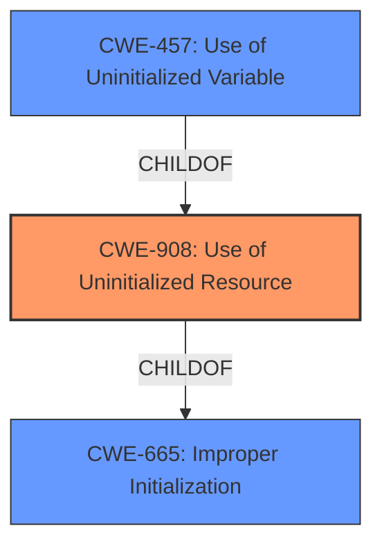

# Raw Analyzer Response for CVE-2020-36432

# Summary
| CWE ID | CWE Name | Confidence | CWE Abstraction Level | CWE Vulnerability Mapping Label | CWE-Vulnerability Mapping Notes |
|---|---|---|---|---|---|
| **CWE-908** | Use of Uninitialized Resource | 0.9 | Base | Primary | Allowed |
| CWE-457 | Use of Uninitialized Variable | 0.7 | Variant | Secondary | Allowed |
| CWE-665 | Improper Initialization | 0.6 | Class | Secondary | Discouraged |

## Evidence and Confidence

*   **Confidence Score:** 0.9
*   **Evidence Strength:** HIGH

## Relationship Analysis
The primary CWE is CWE-908 Use of Uninitialized Resource, which is a base-level CWE. CWE-457 Use of Uninitialized Variable is a variant of CWE-908 and CWE-665. CWE-665 Improper Initialization is a class-level CWE and a parent of CWE-908. Since the vulnerability involves the use of an uninitialized resource, CWE-908 is the most appropriate base-level CWE.

## Vulnerability Chain
The vulnerability begins with the **uninitialized memory** in `Matrixnew()`. This leads to the use of the **uninitialized resource**, and subsequently, a double-free or use-after-free scenario when the uninitialized memory is dropped.

## Summary of Analysis
The primary weakness identified in the vulnerability description is the **use of uninitialized memory**, specifically in the `Matrix::new()` function, which leads to a drop of this **uninitialized memory**. The CVE Reference Links Content Summary explicitly states, "The core weakness is the attempt to drop a struct at a memory location that has not been properly initialized." This aligns perfectly with CWE-908, "Use of Uninitialized Resource."

The Retriever Results also list CWE-908 as the top candidate CWE. While CWE-457, "Use of Uninitialized Variable," is also relevant, the vulnerability description specifies the uninitialized resource is memory, making CWE-908 a more precise fit.

CWE-665, "Improper Initialization," is a broader class that encompasses the root cause, but CWE-908 captures the specific manifestation of the problem - the use of the uninitialized resource, after the improper initialization.

The relationship graph emphasizes that CWE-908 is a child of CWE-665 and a parent of CWE-457. Therefore, choosing CWE-908 provides the right level of specificity.

The evidence, relationship analysis, and retriever results all support the selection of CWE-908 as the primary CWE.

Relevant CWE Information:

# Enhanced Context (25 CWEs)

## CWE-457: Use of Uninitialized Variable
**Abstraction Level**: Variant
**Similarity Score**: 0.80
**Source**: dense

**Description**:
The code uses a variable that has not been initialized, leading to unpredictable or unintended results.

**Mapping Guidance**:
- Usage: Allowed
- Rationale: This CWE entry is at the Variant level of abstraction, which is a preferred level of abstraction for mapping to the root causes of vulnerabilities.

## CWE-824: Access of Uninitialized Pointer
**Abstraction Level**: Base
**Similarity Score**: 0.79
**Source**: dense

**Description**:
The product accesses or uses a pointer that has not been initialized.

**Mapping Guidance**:
- Usage: Allowed
- Rationale: This CWE entry is at the Base level of abstraction, which is a preferred level of abstraction for mapping to the root causes of vulnerabilities.

## CWE-665: Improper Initialization
**Abstraction Level**: Class
**Similarity Score**: 0.79
**Source**: dense

**Description**:
The product does not initialize or incorrectly initializes a resource, which might leave the resource in an unexpected state when it is accessed or used.

**Mapping Guidance**:
- Usage: Discouraged
- Rationale: This CWE entry is a level-1 Class (i.e., a child of a Pillar). It might have lower-level children that would be more appropriate

## CWE-908: Use of Uninitialized Resource
**Abstraction Level**: Base
**Similarity Score**: 0.79
**Source**: dense

**Description**:
The product uses or accesses a resource that has not been initialized.

**Mapping Guidance**:
- Usage: Allowed
- Rationale: This CWE entry is at the Base level of abstraction, which is a preferred level of abstraction for mapping to the root causes of vulnerabilities.

## CWE-909: Missing Initialization of Resource
**Abstraction Level**: Class
**Similarity Score**: 0.78
**Source**: dense

**Description**:
The product does not initialize a critical resource.

**Mapping Guidance**:
- Usage: Allowed-with-Review
- Rationale: This CWE entry is a Class and might have Base-level children that would be more appropriate