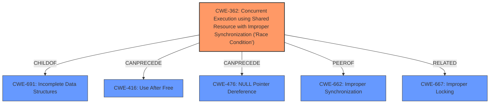

# Enhanced Analysis for CVE-2020-36437

# Summary
| CWE ID | CWE Name | Confidence | CWE Abstraction Level | CWE Vulnerability Mapping Label | CWE-Vulnerability Mapping Notes |
|---|---|---|---|---|---|
| CWE-362 | Concurrent Execution using Shared Resource with Improper Synchronization ('Race Condition') | 0.9 | Class | Allowed-with-Review | Primary CWE |
| CWE-667 | Improper Locking | 0.7 | Class | Allowed-with-Review | Secondary Candidate |
| CWE-662 | Improper Synchronization | 0.6 | Class | Discouraged | Secondary Candidate |

## Evidence and Confidence

*   **Confidence Score:** 0.9
*   **Evidence Strength:** HIGH

## Relationship Analysis
The primary CWE is CWE-362, a Class-level weakness describing race conditions due to improper synchronization. While CWE-362 is a Class, it directly describes the vulnerability. The parent CWE is CWE-691, and CWE-362 can precede CWE-416 (Use After Free) or CWE-476 (NULL Pointer Dereference). CWE-662 (Improper Synchronization) is a related Class-level CWE, and CWE-667 (Improper Locking) can be related.



## Vulnerability Chain
The vulnerability chain starts with the **unconditional implementation of Send and Sync traits** for `QueueSender` and `QueueReceiver`. This allows non-`Send` types to be sent across thread boundaries, leading to **data races** and potential memory corruption. The chain is:

1.  **Improper Implementation**: The `Send` and `Sync` traits are implemented unconditionally.
2.  **Race Condition**: Sending non-`Send` types across threads causes data races (CWE-362).
3.  **Impact**: Data races lead to memory corruption and other undefined behavior.

## Summary of Analysis
The initial analysis identifies a race condition due to improper synchronization. The `conqueue` crate **incorrectly implemented** `Send` and `Sync` traits, which allowed non-thread-safe types to be shared across threads, leading to **data races**.

The evidence supports this: "The `QueueSender` and `QueueReceiver` types in the `conqueue` crate **incorrectly implemented** `Send` and `Sync` traits unconditionally, without requiring the contained type `T` to also be `Send`."

CWE-362 (Concurrent Execution using Shared Resource with Improper Synchronization ('Race Condition')) is the most appropriate because it directly addresses the **race condition** arising from the **improper synchronization** of shared resources across threads.

The decision to use CWE-362 is at the optimal level of specificity, as it is a Class that accurately captures the essence of the vulnerability. The suggested alternative, CWE-366 (Race Condition within a Thread), is a more specific Base, however, the description of CWE-362 better captures the overall issue. CWE-662 (Improper Synchronization) is a related Class, but CWE-362 more precisely describes the **race condition**.

Relevant CWE Information:
*   CWE-362: Concurrent Execution using Shared Resource with Improper Synchronization ('Race Condition')
*   CWE-667: Improper Locking
*   CWE-662: Improper Synchronization


## CWE Relationship Analysis

Current CWEs represent these abstraction levels: .


### Vulnerability Chain Analysis

**Chain starting from CWE-667:**
- 667 (Improper Locking) - ROOT


**Chain starting from CWE-662:**
- 662 (Improper Synchronization) - ROOT


### CWE Relationship Diagram

```mermaid
graph TD
    classDef primary fill:#f96,stroke:#333,stroke-width:2px
    classDef secondary fill:#69f,stroke:#333
    classDef tertiary fill:#9e9,stroke:#333
```