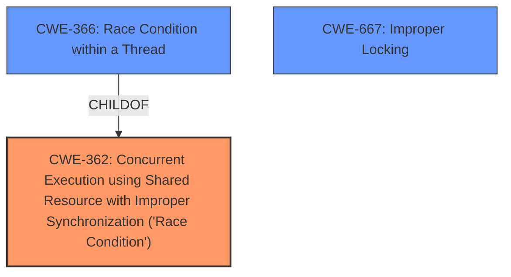

# Analysis Report for CVE-2020-36445

# Vulnerability Analysis Report: CVE-2020-36445

## Description


## Analysis (with Relationship Data)

# Summary
| CWE ID | CWE Name | Confidence | CWE Abstraction Level | CWE Vulnerability Mapping Label | CWE-Vulnerability Mapping Notes |
|---|---|---|---|---|---|
| CWE-362 | Concurrent Execution using Shared Resource with Improper Synchronization ('Race Condition') | 0.9 | Class | Primary | Allowed-with-Review |
| CWE-366 | Race Condition within a Thread | 0.7 | Base | Secondary | Allowed |
| CWE-667 | Improper Locking | 0.6 | Class | Secondary | Allowed-with-Review |

## Evidence and Confidence

*   **Confidence Score:** 0.9
*   **Evidence Strength:** HIGH

## Relationship Analysis
The primary CWE selected is CWE-362 (Concurrent Execution using Shared Resource with Improper Synchronization ('Race Condition')). CWE-366 (Race Condition within a Thread) is a child of CWE-362 and represents a more specific case, but the description provided does not limit the race condition to only within a thread. CWE-667 (Improper Locking) can lead to race conditions and could be related, but the provided information does not specify locking issues.



## Vulnerability Chain
The vulnerability chain starts with the **incorrect** implementation of `Send` and `Sync` traits in the `convec` crate, leading to a **race condition** (CWE-362) when multiple threads access the same `ConVec<T>` instance with types that are not thread-safe. This can then result in **memory corruption** and **undefined behavior.**

## Summary of Analysis
The initial assessment focused on identifying the root cause of the vulnerability. The primary factor was the **unsound** implementation of `Send` and `Sync` traits for `ConVec<T>`, which allows non-thread-safe types to be used concurrently, leading to race conditions.

The vulnerability description clearly states the **weakness** as the **unsoundness** of the `convec` crate and its incorrect implementation of `Send` and `Sync` traits, allowing data races. The CVE Reference Links Content Summary further reinforces this by highlighting the "**Unconditional `Send` and `Sync` Implementation**" as a key vulnerability. This directly aligns with the description of CWE-362, "The product contains a concurrent code sequence that requires temporary, exclusive access to a shared resource, but a timing window exists in which the shared resource can be modified by another code sequence operating concurrently."

The retriever results also listed CWE-362 and CWE-366 with high scores. Given the evidence, CWE-362 is the most appropriate primary CWE.

CWE-362 is at the Class level, and while it is generally preferred to select a Base or Variant level CWE, in this case, CWE-362 accurately represents the core weakness. While CWE-366 (Race Condition within a Thread) is more specific, the vulnerability is not necessarily limited to races within a single thread.

Therefore, the final decision is to map the vulnerability to CWE-362 as the primary CWE, with CWE-366 and CWE-667 as secondary considerations.

Relevant CWE Information:

# Enhanced Context (25 CWEs)
The following CWEs were identified as potentially relevant to this vulnerability:

## CWE-789: Memory Allocation with Excessive Size Value
**Abstraction Level**: Variant
**Similarity Score**: 0.78
**Source**: dense

**Description**:
The product allocates memory based on an untrusted, large size value, but it does not ensure that the size is within expected limits, allowing arbitrary amounts of memory to be allocated.

**Mapping Guidance**:
- Usage: Allowed
- Rationale: This CWE entry is at the Variant level of abstraction, which is a preferred level of abstraction for mapping to the root causes of vulnerabilities.

*This CWE was considered but not selected because the vulnerability isn't directly related to memory allocation size, but rather to the incorrect concurrent access.*

## CWE-131: Incorrect Calculation of Buffer Size
**Abstraction Level**: Base
**Similarity Score**: 0.78
**Source**: dense

**Description**:
The product does not correctly calculate the size to be used when allocating a buffer, which could lead to a buffer overflow.

**Mapping Guidance**:
- Usage: Allowed
- Rationale: This CWE entry is at the Base level of abstraction, which is a preferred level of abstraction for mapping to the root causes of vulnerabilities.

*This CWE was considered but not selected because the vulnerability is not directly related to incorrect calculation of buffer size.*

## CWE-362: Concurrent Execution using Shared Resource with Improper Synchronization ('Race Condition')
**Abstraction Level**: Class
**Similarity Score**: 0.78
**Source**: dense

**Description**:
The product contains a concurrent code sequence that requires temporary, exclusive access to a shared resource, but a timing window exists in which the shared resource can be modified by another code sequence operating concurrently.

**Mapping Guidance**:
- Usage: Allowed-with-Review
- Rationale: This CWE entry is a Class and might have Base-level children that would be more appropriate

*This CWE was selected as the primary CWE for the vulnerability. The vulnerability occurs due to concurrent execution of shared resources without proper synchronization.*

## CWE-667: Improper Locking
**Abstraction Level**: Class
**Similarity Score**: 0.78
**Source**: dense

**Description**:
The product does not properly acquire or release a lock on a resource, leading to unexpected resource state changes and behaviors.

**Mapping Guidance**:
- Usage: Allowed-with-Review
- Rationale: This CWE entry is a Class and might have Base-level children that would be more appropriate

*This CWE was considered as a potential secondary CWE. While the vulnerability involves concurrency issues, the specific problem of improper locking is not clearly mentioned in the description.*

## CWE-125: Out-of-bounds Read
**Abstraction Level**: Base
**Similarity Score**: 0.77
**Source**: dense

**Description**:
The product reads data past the end, or before the beginning, of the intended buffer.

**Mapping Guidance**:
- Usage: Allowed
- Rationale: This CWE entry is at the Base level of abstraction, which is a preferred level of abstraction for mapping to the root causes of vulnerabilities.

*This CWE was considered but not selected because the vulnerability is not directly related to out-of-bounds reads.*

## CWE-366: Race Condition within a Thread
**Abstraction Level**: Base
**Similarity Score**: 0.77
**Source**: dense

**Description**:
If two threads of execution use a resource simultaneously, there exists the possibility that resources may be used while invalid, in turn making the state of execution undefined.

**Mapping Guidance**:
- Usage: Allowed
- Rationale: This CWE entry is at the Base level of abstraction, which is a preferred level of abstraction for mapping to the root causes of vulnerabilities.

*This CWE was considered as a potential secondary CWE. It is a more specific type of race condition, but the provided description doesn't limit the vulnerability to just within a thread.*

## CWE-226: Sensitive Information in Resource Not Removed Before Reuse
**Abstraction Level**: Base
**Similarity Score**: 0.77
**Source**: dense

**Description**:
The product releases a resource such as memory or a file so that it can be made available for reuse, but it does not clear or "zeroize" the information contained in the resource before the product performs a critical state transition or makes the resource available for reuse by other entities.

**Mapping Guidance**:
- Usage: Allowed
- Rationale: This CWE entry is at the Base level of abstraction, which is a preferred level of abstraction for mapping to the root causes of vulnerabilities.

*This CWE was considered but not selected because the vulnerability is not directly related to sensitive information not being removed before reuse.*

## CWE-404: Improper Resource Shutdown or Release
**Abstraction Level**: Class
**Similarity Score**: 0.77
**Source**: dense

**Description**:
The product does not release or incorrectly releases a resource before it is made available for re-use.

**Mapping Guidance**:
- Usage: Allowed-with-Review
- Rationale: This CWE entry is a Class and might have Base-level children that would be more appropriate

*This CWE was considered but not selected because the vulnerability is not directly related to improper resource shutdown or release.*

## CWE-126: Buffer Over-read
**Abstraction Level**: Variant
**Similarity Score**: 0.77
**Source**: dense

**Description**:
The product reads from a buffer using buffer access mechanisms such as indexes or pointers that reference memory locations after the targeted buffer.

**Mapping Guidance**:
- Usage: Allowed
- Rationale: This CWE entry


## CWE Relationship Analysis

Current CWEs represent these abstraction levels: .


### Vulnerability Chain Analysis

**Chain starting from CWE-667:**
- 667 (Improper Locking) - ROOT


**Chain starting from CWE-404:**
- 404 (Improper Resource Shutdown or Release) - ROOT


### CWE Relationship Diagram

```mermaid
graph TD
    classDef primary fill:#f96,stroke:#333,stroke-width:2px
    classDef secondary fill:#69f,stroke:#333
    classDef tertiary fill:#9e9,stroke:#333
```


*Report generated on 2025-04-02 14:56:18*
