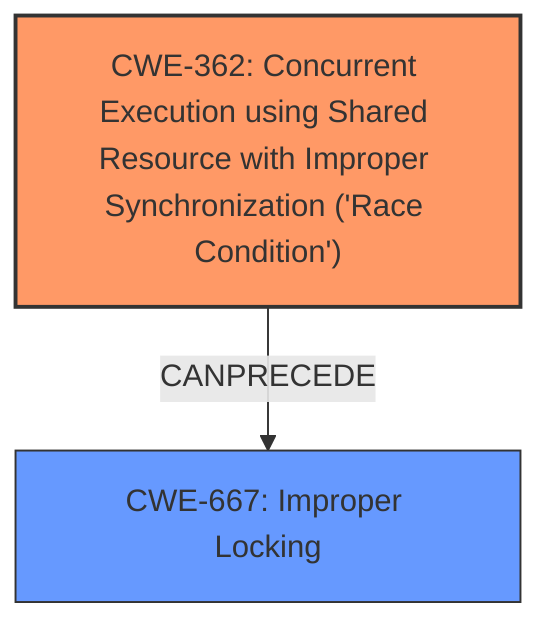

# Enhanced Analysis for CVE-2020-36446

# Summary
| CWE ID | CWE Name | Confidence | CWE Abstraction Level | CWE Vulnerability Mapping Label | CWE-Vulnerability Mapping Notes |
|---|---|---|---|---|---|
| CWE-362 | Concurrent Execution using Shared Resource with Improper Synchronization ('Race Condition') | 0.9 | Class | Allowed-with-Review | Primary CWE. The vulnerability allows non-`Send` types to be moved between threads, potentially leading to data races. |
| CWE-667 | Improper Locking | 0.7 | Class | Allowed-with-Review | Secondary CWE. The vulnerability could lead to the unlocking of mutexes from a thread that did not lock them. |

## Evidence and Confidence

*   **Confidence Score:** 0.8
*   **Evidence Strength:** HIGH

## Relationship Analysis
The primary CWE is CWE-362, which is a Class-level CWE. The vulnerability description directly mentions the potential for data races due to the **incorrect** implementation of `Send` and `Sync` traits. CWE-362's description fits this scenario because it involves concurrent execution and improper synchronization.
CWE-667 is related as a potential consequence of the race condition, where mutexes can be unlocked by the wrong thread.


## Vulnerability Chain
The chain of events starts with the **incorrect** implementation of `Send` and `Sync` for `SyncChannel`. This allows non-`Send` types to be moved between threads, leading to a race condition (CWE-362). The race condition can then lead to data races, memory corruption, and incorrect mutex unlocking.

## Summary of Analysis
The assessment is primarily based on the provided evidence, particularly the CVE Reference Links Content Summary, which explicitly mentions data races and incorrect thread safety implementation.

The key evidence is: "The `SyncChannel` type in the `signal-simple` crate **incorrectly** implemented `Send` and `Sync` traits unconditionally, without requiring the contained type `T` to also implement `Send`. This allows non-`Send` types to be moved between threads," and "Users can create undefined behavior (UB) in safe Rust code by sending types that are not safe to share between threads (i.e., `!Send` types). This can lead to data races, memory corruption, and the unlocking of mutexes from a thread that did not lock them."

The graph relationships support the selection of CWE-362 as the primary weakness, with CWE-667 as a secondary weakness arising from the race condition.

The selected CWEs are at the optimal level of specificity, with CWE-362 being a Class-level CWE and CWE-667 also a Class-level CWE.

Relevant CWE Information:

# Enhanced Context (25 CWEs)

## CWE-404: Improper Resource Shutdown or Release
**Abstraction Level**: Class
**Similarity Score**: 0.76
**Source**: dense

**Description**:
The product does not release or incorrectly releases a resource before it is made available for re-use.

**Mapping Guidance**:
- Usage: Allowed-with-Review
- Rationale: This CWE entry is a Class and might have Base-level children that would be more appropriate

*Not selected* because the core issue isn't about resource release, but about improper synchronization leading to data races.

## CWE-667: Improper Locking
**Abstraction Level**: Class
**Similarity Score**: 0.76
**Source**: dense

**Description**:
The product does not properly acquire or release a lock on a resource, leading to unexpected resource state changes and behaviors.

**Mapping Guidance**:
- Usage: Allowed-with-Review
- Rationale: This CWE entry is a Class and might have Base-level children that would be more appropriate

*Selected as a secondary CWE* because the vulnerability description mentions that the issue can lead to the unlocking of mutexes from a thread that did not lock them.

## CWE-405: Asymmetric Resource Consumption (Amplification)
**Abstraction Level**: Class
**Similarity Score**: 0.76
**Source**: dense

**Description**:
The product does not properly control situations in which an adversary can cause the product to consume or produce excessive resources without requiring the adversary to invest equivalent work or otherwise prove authorization, i.e., the adversary's influence is "asymmetric."

**Mapping Guidance**:
- Usage: Allowed-with-Review
- Rationale: This CWE entry is a Class and might have Base-level children that would be more appropriate

*Not selected* because the vulnerability does not primarily revolve around resource consumption or amplification.

## CWE-407: Inefficient Algorithmic Complexity
**Abstraction Level**: Class
**Similarity Score**: 0.75
**Source**: dense

**Description**:
An algorithm in a product has an inefficient worst-case computational complexity that may be detrimental to system performance and can be triggered by an attacker, typically using crafted manipulations that ensure that the worst case is being reached.

**Mapping Guidance**:
- Usage: Allowed-with-Review
- Rationale: This CWE entry is a Class and might have Base-level children that would be more appropriate

*Not selected* because the vulnerability is not related to inefficient algorithms.

## CWE-668: Exposure of Resource to Wrong Sphere
**Abstraction Level**: Class
**Similarity Score**: 0.75
**Source**: dense

**Description**:
The product exposes a resource to the wrong control sphere, providing unintended actors with inappropriate access to the resource.

**Mapping Guidance**:
- Usage: Discouraged
- Rationale: CWE-668 is high-level and is often misused as a catch-all when lower-level CWE IDs might be applicable. It is sometimes used for low-information vulnerability reports [REF-1287]. It is a level-1 Class (i.e., a child of a Pillar). It is not useful for trend analysis.

*Not selected* because more specific CWEs like CWE-362 and CWE-667 are more relevant.

## CWE-754: Improper Check for Unusual or Exceptional Conditions
**Abstraction Level**: Class
**Similarity Score**: 0.75
**Source**: dense

**Description**:
The product does not check or incorrectly checks for unusual or exceptional conditions that are not expected to occur frequently during day to day operation of the product.

**Mapping Guidance**:
- Usage: Allowed-with-Review
- Rationale: This CWE entry is a Class and might have Base-level children that would be more appropriate

*Not selected* because the issue isn't primarily about missing checks for unusual conditions, but about improper synchronization.

## CWE-799: Improper Control of Interaction Frequency
**Abstraction Level**: Class
**Similarity Score**: 0.75
**Source**: dense

**Description**:
The product does not properly limit the number or frequency of interactions that it has with an actor, such as the number of incoming requests.

**Mapping Guidance**:
- Usage: Allowed-with-Review
- Rationale: This CWE entry is a Class and might have Base-level children that would be more appropriate

*Not selected* because the vulnerability isn't related to interaction frequency.

## CWE-362: Concurrent Execution using Shared Resource with Improper Synchronization ('Race Condition')
**Abstraction Level**: Class
**Similarity Score**: 0.75
**Source**: dense

**Description**:
The product contains a concurrent code sequence that requires temporary, exclusive access to a shared resource, but a timing window exists in which the shared resource can be modified by another code sequence operating concurrently.

**Mapping Guidance**:
- Usage: Allowed-with-Review
- Rationale: This CWE entry is a Class and might have Base-level children that would be more appropriate

*Selected as the primary CWE* due to the evidence of a race condition leading to data races and memory corruption.

## CWE-226: Sensitive Information in Resource Not Removed Before Reuse
**Abstraction Level**: Base
**Similarity Score**: 0.75
**Source**: dense

**Description**:
The product releases a resource such as memory or a file so that it can be made available for reuse, but it does not clear or "zeroize" the information contained in the resource before the product performs a critical state transition or makes the resource available for reuse by other entities.

**Mapping Guidance**:
- Usage: Allowed
- Rationale: This CWE entry is at the Base level of abstraction, which is a preferred level of abstraction for mapping to the root causes of vulnerabilities.

*Not selected* because the issue doesn't involve sensitive information not being removed before resource reuse.

## CWE-367: Time-of-check Time-of-use (TOCTOU) Race Condition
**Abstraction Level**: Base
**Similarity Score**: 0.74
**Source**: dense

**Description**:
The product checks the state of a resource before using that resource


## CWE Relationship Analysis

Current CWEs represent these abstraction levels: .


### Vulnerability Chain Analysis

**Chain starting from CWE-667:**
- 667 (Improper Locking) - ROOT


**Chain starting from CWE-754:**
- 754 (Improper Check for Unusual or Exceptional Conditions) - ROOT


### CWE Relationship Diagram

```mermaid
graph TD
    classDef primary fill:#f96,stroke:#333,stroke-width:2px
    classDef secondary fill:#69f,stroke:#333
    classDef tertiary fill:#9e9,stroke:#333
```