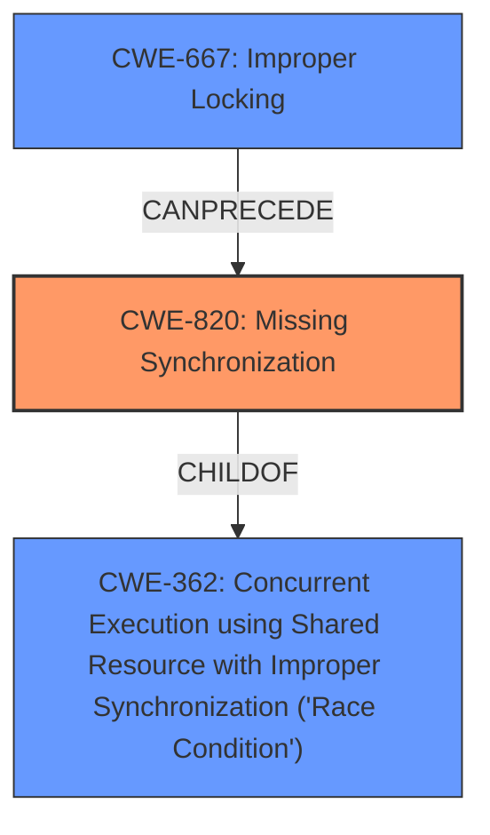

# Analysis for CVE-2020-36451

# Summary
| CWE ID  | CWE Name                                                                                                                                   | Confidence | CWE Abstraction Level | CWE Vulnerability Mapping Label | CWE-Vulnerability Mapping Notes |
| :-------- | :------------------------------------------------------------------------------------------------------------------------------------------ | :---------- | :---------------------- | :------------------------------ | :------------------------------ |
| CWE-820 | Missing Synchronization                                                                                                                                   | 0.90      | Base                     | Allowed                      | Primary CWE |
| CWE-362 | Concurrent Execution using Shared Resource with Improper Synchronization ('Race Condition') | 0.70     | Class                    | Allowed-with-Review                      | Secondary CWE Candidate |
| CWE-667 | Improper Locking                                                                                                                                   | 0.60      | Class                     | Allowed-with-Review                      | Secondary CWE Candidate |

## Evidence and Confidence

*   **Confidence Score:** 0.80
*   **Evidence Strength:** HIGH

## Relationship Analysis
The primary weakness is **missing synchronization (CWE-820)**, which can lead to **race conditions (CWE-362)**. **Improper locking (CWE-667)** is a potential cause of **missing synchronization**. The abstraction levels influenced the selection, favoring the Base level **CWE-820** for its specificity, while acknowledging that the higher-level Class CWEs provide a broader context.

## Vulnerability Chain
The vulnerability chain starts with the **unconditional implementation of Send and Sync**. This leads to **missing synchronization** and can cause **data races**, ultimately resulting in **memory corruption, memory leaks, and crashes**.
  - The unconditional `Send` and `Sync` implementation is the root cause.
  - **Missing synchronization** is a direct consequence of the **unconditional Send and Sync Implementation**, as it fails to enforce thread safety.
  - **Data races** are an outcome of **missing synchronization**, leading to further impacts.
  - **Memory corruption, memory leaks, and crashes** are the final impacts of the vulnerability.

## Summary of Analysis
The analysis identifies **CWE-820 (Missing Synchronization)** as the primary CWE due to the **unconditional implementations of Send and Sync** for RcuCell, which allows for data races. This is directly supported by the CVE Reference Links Content Summary, which states that the "core issue is that `RcuCell` was marked as `Send` and `Sync` regardless of whether the type `T` it contained was also `Send` and `Sync`," and that this lack of bounds resulted in data races "when multiple threads tried to access the data simultaneously without proper synchronization." This evidence strongly supports the selection of **CWE-820**. **CWE-362 (Concurrent Execution using Shared Resource with Improper Synchronization ('Race Condition'))** is considered as a secondary CWE, since **CWE-820** is a child of **CWE-362**.
**CWE-667 (Improper Locking)** could also be a contributing factor, since locks are a common mechanism for synchronization, which could prevent the race condition.
The choice of **CWE-820** is at the optimal level of specificity, as it directly reflects the **missing synchronization** that is the root cause of the vulnerability.

Relevant CWE Information:

# Enhanced Context (25 CWEs)
The following CWEs were identified as potentially relevant to this vulnerability:

## CWE-667: Improper Locking
**Abstraction Level**: Class
**Similarity Score**: 0.79
**Source**: dense

**Description**:
The product does not properly acquire or release a lock on a resource, leading to unexpected resource state changes and behaviors.

**Mapping Guidance**:
- Usage: Allowed-with-Review
- Rationale: This CWE entry is a Class and might have Base-level children that would be more appropriate

## CWE-404: Improper Resource Shutdown or Release
**Abstraction Level**: Class
**Similarity Score**: 0.78
**Source**: dense

**Description**:
The product does not release or incorrectly releases a resource before it is made available for re-use.

**Mapping Guidance**:
- Usage: Allowed-with-Review
- Rationale: This CWE entry is a Class and might have Base-level children that would be more appropriate

## CWE-362: Concurrent Execution using Shared Resource with Improper Synchronization ('Race Condition')
**Abstraction Level**: Class
**Similarity Score**: 0.78
**Source**: dense

**Description**:
The product contains a concurrent code sequence that requires temporary, exclusive access to a shared resource, but a timing window exists in which the shared resource can be modified by another code sequence operating concurrently.

**Mapping Guidance**:
- Usage: Allowed-with-Review
- Rationale: This CWE entry is a Class and might have Base-level children that would be more appropriate

## CWE-782: Exposed IOCTL with Insufficient Access Control
**Abstraction Level**: Variant
**Similarity Score**: 0.78
**Source**: dense

**Description**:
The product implements an IOCTL with functionality that should be restricted, but it does not properly enforce access control for the IOCTL.

**Mapping Guidance**:
- Usage: Allowed
- Rationale: This CWE entry is at the Variant level of abstraction, which is a preferred level of abstraction for mapping to the root causes of vulnerabilities.

## CWE-754: Improper Check for Unusual or Exceptional Conditions
**Abstraction Level**: Class
**Similarity Score**: 0.78
**Source**: dense

**Description**:
The product does not check or incorrectly checks for unusual or exceptional conditions that are not expected to occur frequently during day to day operation of the product.

**Mapping Guidance**:
- Usage: Allowed-with-Review
- Rationale: This CWE entry is a Class and might have Base-level children that would be more appropriate

## CWE-755: Improper Handling of Exceptional Conditions
**Abstraction Level**: Class
**Similarity Score**: 0.78
**Source**: dense

**Description**:
The product does not handle or incorrectly handles an exceptional condition.

**Mapping Guidance**:
- Usage: Discouraged
- Rationale: This CWE entry is a level-1 Class (i.e., a child of a Pillar). It might have lower-level children that would be more appropriate

## CWE-226: Sensitive Information in Resource Not Removed Before Reuse
**Abstraction Level**: Base
**Similarity Score**: 0.77
**Source**: dense

**Description**:
The product releases a resource such as memory or a file so that it can be made available for reuse, but it does not clear or "zeroize" the information contained in the resource before the product performs a critical state transition or makes the resource available for reuse by other entities.

**Mapping Guidance**:
- Usage: Allowed
- Rationale: This CWE entry is at the Base level of abstraction, which is a preferred level of abstraction for mapping to the root causes of vulnerabilities.

## CWE-41: Improper Resolution of Path Equivalence
**Abstraction Level**: Base
**Similarity Score**: 0.77
**Source**: dense

**Description**:
The product is vulnerable to file system contents disclosure through path equivalence. Path equivalence involves the use of special characters in file and directory names. The associated manipulations are intended to generate multiple names for the same object.

**Mapping Guidance**:
- Usage: Allowed
- Rationale: This CWE entry is at the Base level of abstraction, which is a preferred level of abstraction for mapping to the root causes of vulnerabilities.

## CWE-367: Time-of-check Time-of-use (TOCTOU) Race Condition
**Abstraction Level**: Base
**Similarity Score**: 0.77
**Source**: dense

**Description**:
The product checks the state of a resource before using that resource, but the resource's state can change between the check and the use in a way that invalidates the results of the check. This can cause the product to perform invalid actions when the resource is in an unexpected state.

**Mapping Guidance**:
- Usage: Allowed
- Rationale: This CWE entry is at the Base level of abstraction, which is a preferred level of abstraction for mapping to the root causes of vulnerabilities.

## CWE-119: Improper Restriction of Operations within the Bounds of a Memory Buffer
**Abstraction Level**: Class
**Similarity Score**: 0.77
**Source**: dense

**Description**:
The product performs operations on a memory buffer, but it reads from or writes to a memory location outside the buffer's intended boundary. This may result in read or write operations on unexpected memory locations that could