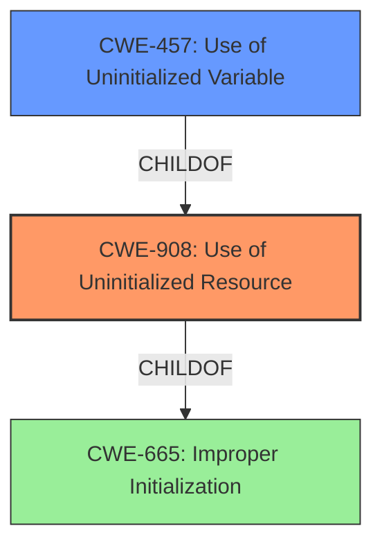

# Raw Analyzer Response for CVE-2020-36452

# Summary
| CWE ID | CWE Name | Confidence | CWE Abstraction Level | CWE Vulnerability Mapping Label | CWE-Vulnerability Mapping Notes |
|---|---|---|---|---|---|
| CWE-908 | Use of Uninitialized Resource | 1.0 | Base | Allowed | Primary CWE |
| CWE-457 | Use of Uninitialized Variable | 0.7 | Variant | Allowed | Secondary Candidate |
| CWE-909 | Missing Initialization of Resource | 0.6 | Class | Allowed-with-Review | Secondary Candidate |

## Evidence and Confidence

*   **Confidence Score:** 0.9
*   **Evidence Strength:** HIGH

## Relationship Analysis
The primary relationship that influenced the selection was the ChildOf relationship between CWE-457 and CWE-908, and between CWE-908 and CWE-665. This indicates that using an uninitialized variable (CWE-457) is a specific case of using an uninitialized resource (CWE-908), which in turn is a type of improper initialization (CWE-665). The selection of CWE-908 as the primary CWE reflects a balance between specificity and the overall nature of the vulnerability. While CWE-457 is more specific, the provided descriptions do not specify if this involves a variable. Therefore CWE-908 is more appropriate.

## Vulnerability Chain
The vulnerability chain starts with the **lack of panic handling** during the cloning process, leading to the **use of uninitialized memory** and the subsequent **drop of uninitialized memory**.
  - **Root Cause:** **Lack of panic handling** in `FixedCapacityDequeLike::clone()`
  - **Weakness:** **Use of Uninitialized Resource** (CWE-908)
  - **Impact:** Memory Corruption

## Summary of Analysis
The primary assessment focuses on the **drop of uninitialized memory** within the `FixedCapacityDequeLikeclone()` function of the `array-tools` crate. The analysis strongly supports mapping this vulnerability to CWE-908, "Use of Uninitialized Resource."

The evidence for this decision is found in:
- The **Vulnerability Description Key Phrases** which highlights the **weakness** as **drop of uninitialized memory**.
- The **CVE Reference Links Content Summary**, stating, "The function doesn't properly handle panics that might occur within the user-provided `T::clone()` method...leading to a partially initialized buffer being dropped...This is because the code was not designed to correctly clean up partially initialized memory if a panic occurs during the cloning process."
- The **CVE Reference Links Content Summary**, stating, "The dropping of a partially uninitialized buffer results in memory corruption."

The retriever results also strongly support this, with CWE-908 being the top result.

CWE-457 "Use of Uninitialized Variable" was considered, however, the description doesn't specify the use of a variable. Therefore, CWE-908 is selected due to the vulnerability concerning a broader "resource" (memory) rather than specifically a variable.

CWE-909 "Missing Initialization of Resource" was considered since the problem is that the memory was not properly initialized before being potentially dropped. However, CWE-908 is a better fit because it describes the actual *use* of the uninitialized resource, which is the core problem in the vulnerability.

The selection of CWE-908 is at the optimal level of specificity. While more specific CWEs exist, they do not accurately capture the overall weakness described in the vulnerability. CWE-908 directly addresses the **use of uninitialized memory** resource, making it the most fitting choice.