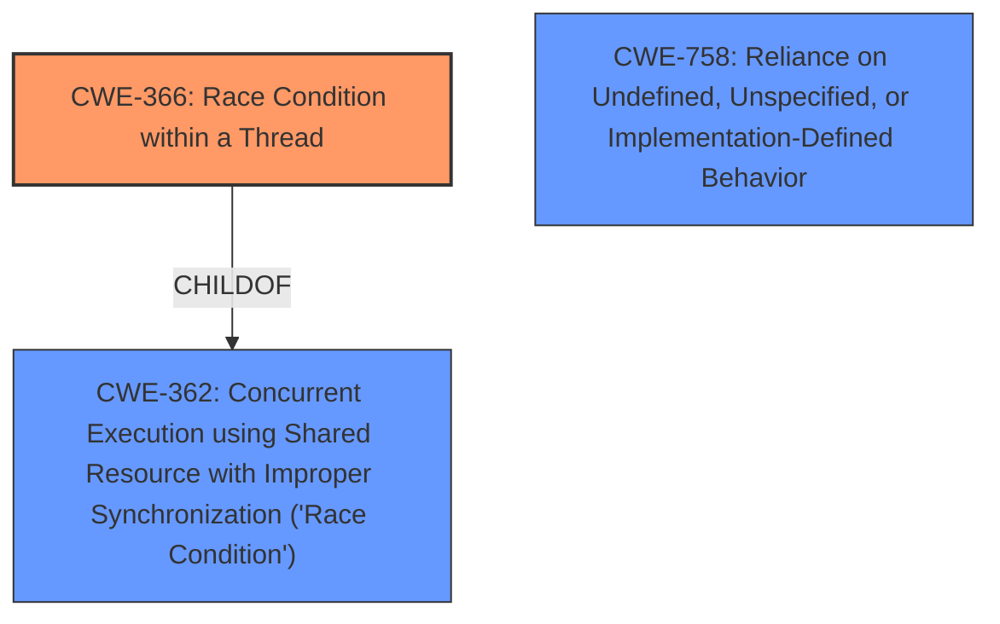

# Raw Analyzer Response for CVE-2020-36454

# Summary
| CWE ID | CWE Name | Confidence | CWE Abstraction Level | CWE Vulnerability Mapping Label | CWE-Vulnerability Mapping Notes |
|---|---|---|---|---|---|
| CWE-366 | Race Condition within a Thread | 0.9 | Base | Allowed | Primary CWE |
| CWE-362 | Concurrent Execution using Shared Resource with Improper Synchronization ('Race Condition') | 0.7 | Class | Allowed-with-Review | Secondary Candidate |
| CWE-758 | Reliance on Undefined, Unspecified, or Implementation-Defined Behavior | 0.6 | Class | Allowed-with-Review | Secondary Candidate |

## Evidence and Confidence

*   **Confidence Score:** 0.9
*   **Evidence Strength:** HIGH

## Relationship Analysis
The primary CWE is CWE-366, a Base level weakness, which is a child of CWE-362. The analysis considered the specific context of a race condition within a thread, making CWE-366 the more appropriate choice. CWE-758 was also considered as the **unconditional implementation of Send** could be relying on implementation-defined behavior related to thread safety. However, the more direct cause of the data race is the lack of synchronization.

## Vulnerability Chain
The vulnerability chain starts with the **incorrect implementation of the `Send` trait** for `LockWeak<T>` without requiring `T` to be `Sync`. This leads to a **race condition** (CWE-366) when multiple threads access the non-`Sync` data concurrently. The race condition can then lead to undefined behavior, memory corruption, or program crashes.

## Summary of Analysis
The analysis identifies CWE-366 as the primary weakness due to the race condition within a thread that arises from the flawed `Send` trait implementation. This is supported by the CVE Reference Links Content Summary, which details how the **unconditional `Send` implementation** for `LockWeak<T>` allows multiple threads to access non-`Sync` data concurrently, leading to data races.

CWE-362 was considered but, as a Class-level CWE, it is less specific than CWE-366. CWE-758 was considered as it highlights reliance on undefined behavior, which could apply to the incorrect assumptions about thread safety. However, the core issue is the race condition itself.

The decision to use CWE-366 is based on its direct relevance to the vulnerability description and its Base level of abstraction, which provides a more precise characterization of the weakness. This is consistent with the MITRE mapping guidance, which recommends using the most specific CWE available.

Relevant CWE Information:

# Enhanced Context (25 CWEs)
The following CWEs were identified as potentially relevant to this vulnerability:

## CWE-404: Improper Resource Shutdown or Release
**Abstraction Level**: Class
**Similarity Score**: 0.80
**Source**: dense

**Description**:
The product does not release or incorrectly releases a resource before it is made available for re-use.

**Mapping Guidance**:
- Usage: Allowed-with-Review
- Rationale: This CWE entry is a Class and might have Base-level children that would be more appropriate

**Why it was not selected**: Not relevant to the vulnerability, which is about improper synchronization, not resource management.

## CWE-226: Sensitive Information in Resource Not Removed Before Reuse
**Abstraction Level**: Base
**Similarity Score**: 0.79
**Source**: dense

**Description**:
The product releases a resource such as memory or a file so that it can be made available for reuse, but it does not clear or "zeroize" the information contained in the resource before the product performs a critical state transition or makes the resource available for reuse by other entities.

**Mapping Guidance**:
- Usage: Allowed
- Rationale: This CWE entry is at the Base level of abstraction, which is a preferred level of abstraction for mapping to the root causes of vulnerabilities.

**Why it was not selected**: Not relevant. The vulnerability is not about releasing resources with sensitive data.

## CWE-667: Improper Locking
**Abstraction Level**: Class
**Similarity Score**: 0.78
**Source**: dense

**Description**:
The product does not properly acquire or release a lock on a resource, leading to unexpected resource state changes and behaviors.

**Mapping Guidance**:
- Usage: Allowed-with-Review
- Rationale: This CWE entry is a Class and might have Base-level children that would be more appropriate

**Why it was not selected**: While related to concurrency, the description does not specify improper locking mechanisms, but instead a failure to enforce thread safety.

## CWE-789: Memory Allocation with Excessive Size Value
**Abstraction Level**: Variant
**Similarity Score**: 0.78
**Source**: dense

**Description**:
The product allocates memory based on an untrusted, large size value, but it does not ensure that the size is within expected limits, allowing arbitrary amounts of memory to be allocated.

**Mapping Guidance**:
- Usage: Allowed
- Rationale: This CWE entry is at the Variant level of abstraction, which is a preferred level of abstraction for mapping to the root causes of vulnerabilities.

**Why it was not selected**: Not related to memory allocation size. The vulnerability is about concurrent access to data.

## CWE-664: Improper Control of a Resource Through its Lifetime
**Abstraction Level**: Pillar
**Similarity Score**: 0.77
**Source**: dense

**Description**:
The product does not maintain or incorrectly maintains control over a resource throughout its lifetime of creation, use, and release.

**Mapping Guidance**:
- Usage: Discouraged
- Rationale: This CWE entry is high-level when lower-level children are available.

**Why it was not selected**: Too abstract. The issue is specifically a race condition, not general resource control.

## CWE-362: Concurrent Execution using Shared Resource with Improper Synchronization ('Race Condition')
**Abstraction Level**: Class
**Similarity Score**: 0.77
**Source**: dense

**Description**:
The product contains a concurrent code sequence that requires temporary, exclusive access to a shared resource, but a timing window exists in which the shared resource can be modified by another code sequence operating concurrently.

**Mapping Guidance**:
- Usage: Allowed-with-Review
- Rationale: This CWE entry is a Class and might have Base-level children that would be more appropriate

**Why it was not selected**: Although a race condition is present, CWE-366, which is a child of this CWE, is more specific as it explicitly mentions the race condition occurring within a thread.

## CWE-366: Race Condition within a Thread
**Abstraction Level**: Base
**Similarity Score**: 0.77
**Source**: dense

**Description**:
If two threads of execution use a resource simultaneously, there exists the possibility that resources may be used while invalid, in turn making the state of execution undefined.

**Mapping Guidance**:
- Usage: Allowed
- Rationale: This CWE entry is at the Base level of abstraction, which is a preferred level of abstraction for mapping to the root causes of vulnerabilities.

**Why it was selected**: Accurately describes the vulnerability where two threads access a shared resource concurrently, leading to undefined behavior.

## CWE-131: Incorrect Calculation of Buffer Size
**Abstraction Level**: Base
**Similarity Score**: 0.77
**Source**: dense

**Description**:
The product does not correctly calculate the size to be used when allocating a buffer, which could lead to a buffer overflow.

**Mapping Guidance**:
- Usage: Allowed
- Rationale: This CWE entry is at the Base level of abstraction, which is a preferred level of abstraction for mapping to the root causes of vulnerabilities.

**Why it was not selected**: Not relevant to the vulnerability, which is about improper synchronization, not buffer size calculation.

## CWE-1325: Improperly Controlled Sequential Memory Allocation
**Abstraction Level**: Base
**Similarity Score**: 0.76
**Source**: dense

**Description**:
The product manages a group of objects or resources and performs a separate memory allocation for each object, but it does not properly limit the total amount of memory that is consumed by all of the combined objects.

**Mapping Guidance**:
- Usage: Allowed
- Rationale: This CWE entry is at the Base level of abstraction, which is a preferred level of abstraction for mapping to the root causes of vulnerabilities.

**Why it was not selected**: Not related to memory allocation limits. The vulnerability is about concurrent access to data.

## CWE-908: Use of Uninitialized Resource
**Abstraction Level**: Base
**Similarity Score**: 0.76
**Source**: dense

**Description**:
The product