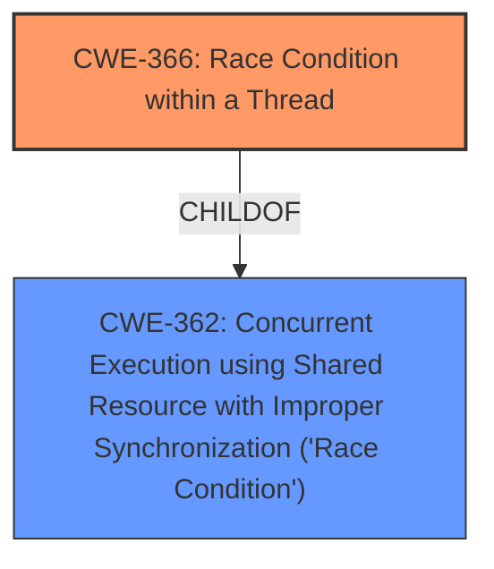

# Analysis Report for CVE-2020-36456

# Vulnerability Analysis Report: CVE-2020-36456

## Description


## Analysis (with Relationship Data)

# Summary
| CWE ID | CWE Name | Confidence | CWE Abstraction Level | CWE Vulnerability Mapping Label | CWE-Vulnerability Mapping Notes |
|---|---|---|---|---|---|
| CWE-366 | Race Condition within a Thread | 0.8 | Base | Allowed | Primary CWE |
| CWE-362 | Concurrent Execution using Shared Resource with Improper Synchronization ('Race Condition') | 0.6 | Class | Allowed-with-Review | Secondary CWE |

## Evidence and Confidence

*   **Confidence Score:** 0.8
*   **Evidence Strength:** HIGH

## Relationship Analysis
The primary CWE selected is CWE-366 (Race Condition within a Thread), which is a base level CWE. It is a child of CWE-362 (Concurrent Execution using Shared Resource with Improper Synchronization ('Race Condition')), which is a class level CWE. The vulnerability clearly describes a race condition, making CWE-366 the more specific and appropriate choice.



## Vulnerability Chain
The vulnerability chain starts with a **missing bound on the `Send` trait** for the `CopyCell<T>` type. This allows non-thread-safe types to be shared across threads, leading to a **race condition** (CWE-366) and potentially memory corruption and unpredictable program behavior.

## Summary of Analysis
The initial analysis identified CWE-366 as the primary weakness due to the presence of a race condition as the root cause. This is supported by the CVE Reference Links Content Summary, which states that "Data races can occur when non-thread-safe Copy types, such as references to Cell are sent to other threads via CopyCell."

The retriever results also list CWE-366 as the top candidate. CWE-362 was also considered, but since CWE-366 is a child of CWE-362 and provides a more specific description of the vulnerability, it was selected as the primary CWE.

The final selection is based on the evidence provided and the hierarchical relationship between CWE-366 and CWE-362. CWE-366 is at the optimal level of specificity as it directly describes the race condition caused by the **lack of thread safety** in the `CopyCell` implementation.

Relevant CWE Information:

# Enhanced Context (25 CWEs)
The following CWEs were identified as potentially relevant to this vulnerability:

## CWE-366: Race Condition within a Thread
**Abstraction Level**: Base
**Similarity Score**: 0.78
**Source**: dense

**Description**:
If two threads of execution use a resource simultaneously, there exists the possibility that resources may be used while invalid, in turn making the state of execution undefined.

**Mapping Guidance**:
- Usage: Allowed
- Rationale: This CWE entry is at the Base level of abstraction, which is a preferred level of abstraction for mapping to the root causes of vulnerabilities.

## CWE-362: Concurrent Execution using Shared Resource with Improper Synchronization ('Race Condition')
**Abstraction Level**: Class
**Similarity Score**: 0.77
**Source**: dense

**Description**:
The product contains a concurrent code sequence that requires temporary, exclusive access to a shared resource, but a timing window exists in which the shared resource can be modified by another code sequence operating concurrently.

**Mapping Guidance**:
- Usage: Allowed-with-Review
- Rationale: This CWE entry is a Class and might have Base-level children that would be more appropriate

## CWE-908: Use of Uninitialized Resource
CWE-908 was considered because the **lack of the `Send` bound** can lead to uninitialized or corrupted data being used. However, the core issue is the race condition itself, not the use of uninitialized data, so CWE-908 is not the best fit.

## CWE-119: Improper Restriction of Operations within the Bounds of a Memory Buffer
CWE-119 was considered, as data races can lead to memory corruption. However, the root cause is not a buffer overflow but the **race condition** enabling unsafe access, making CWE-119 less relevant.

## CWE-375: Returning a Mutable Object to an Untrusted Caller
CWE-375 was considered, but the issue is not directly related to returning mutable objects, but rather the **lack of thread safety** when using `CopyCell` in concurrent contexts.

## CWE-416: Use After Free
CWE-416 was considered, as data races can lead to use-after-free scenarios. However, the primary issue is the **race condition**, not the use-after-free condition itself.

## CWE-787: Out-of-bounds Write
CWE-787 was considered, as data races can lead to memory corruption and potential out-of-bounds writes. However, the root cause is the **race condition**, not the out-of-bounds write.


## CWE Relationship Analysis

Current CWEs represent these abstraction levels: .


### Vulnerability Chain Analysis

**Chain starting from CWE-787:**
- 787 (Out-of-bounds Write) - ROOT


**Chain starting from CWE-416:**
- 416 (Use After Free) - ROOT


### CWE Relationship Diagram

```mermaid
graph TD
    classDef primary fill:#f96,stroke:#333,stroke-width:2px
    classDef secondary fill:#69f,stroke:#333
    classDef tertiary fill:#9e9,stroke:#333
```


*Report generated on 2025-04-02 02:03:57*
