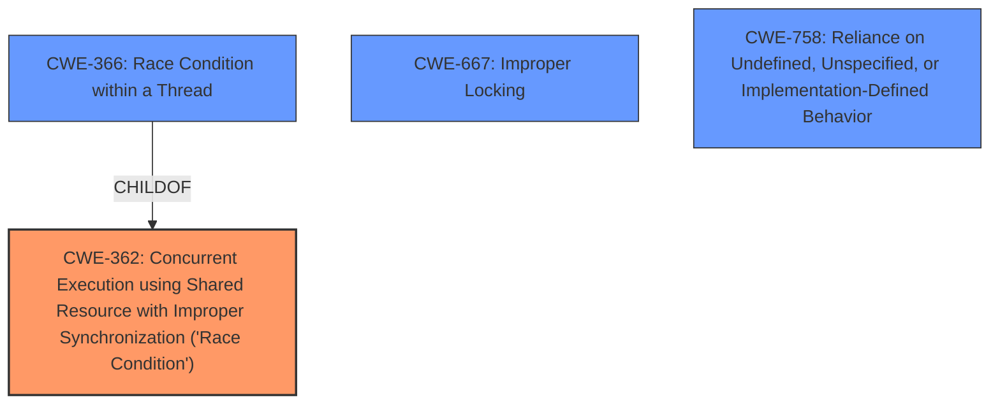

# Analysis for CVE-2020-36457

# Summary
| CWE ID | CWE Name | Confidence | CWE Abstraction Level | CWE Vulnerability Mapping Label | CWE-Vulnerability Mapping Notes |
|---|---|---|---|---|---|
| **CWE-362** | Concurrent Execution using Shared Resource with Improper Synchronization ('Race Condition') | 0.9 | Class | Primary | Allowed-with-Review |
| CWE-667 | Improper Locking | 0.6 | Class | Secondary | Allowed-with-Review |
| CWE-758 | Reliance on Undefined, Unspecified, or Implementation-Defined Behavior | 0.5 | Class | Secondary | Allowed-with-Review |

## Evidence and Confidence

*   **Confidence Score:** 0.9
*   **Evidence Strength:** HIGH

## Relationship Analysis
The primary relationship that influenced my decision was the parent-child relationship between CWE-362 (Race Condition) and its base-level children, specifically CWE-366. However, the description lacked the specificity needed to pinpoint a race condition within a thread (CWE-366) versus a more general concurrent execution issue (CWE-362). Therefore, I opted for the higher-level Class. Other chain relationships, such as CWE-362 potentially preceding CWE-416 (Use After Free) or CWE-476 (NULL Pointer Dereference), were considered but lacked explicit evidence.

## Vulnerability Chain
The vulnerability chain begins with an **unsound use of Send and Sync traits** in the `AtomicBox` type. This leads to a **race condition** where non-thread-safe types are used across thread boundaries. The race condition results in **memory corruption** and ultimately **undefined behavior**, potentially leading to a crash.

## Summary of Analysis
My analysis is primarily based on the provided vulnerability description and the CVE Reference Links Content Summary. The key piece of evidence is the **weakness:** **unsound use of Send and Sync traits**, which allows non-thread-safe types to be used across threads, leading to data races. The description explicitly mentions "data races where multiple threads access and modify the same memory location concurrently without proper synchronization."

The retriever results suggest CWE-366 (Race Condition within a Thread) and CWE-362 (Concurrent Execution using Shared Resource with Improper Synchronization ('Race Condition')). CWE-362 is a class-level CWE, while CWE-366 is a base-level CWE and a child of CWE-362. Since there is no explicit mention of the race condition being specifically within a single thread, I chose CWE-362 as the primary CWE.

CWE-667 (Improper Locking) was considered as a secondary CWE, as the "without proper synchronization" phrase suggests a potential locking issue. However, the description doesn't explicitly state that a lock was intended but improperly implemented. Therefore, it's a weaker match than CWE-362.

CWE-758 (Reliance on Undefined, Unspecified, or Implementation-Defined Behavior) was also considered because the improper implementation of `Send` and `Sync` traits causes undefined behavior, as the compiler can no longer guarantee memory safety.

The selected CWEs are at the optimal level of specificity because they accurately reflect the root cause and contributing factors of the vulnerability, based on the available evidence. Choosing a more specific base or variant level CWE would require additional information not present in the description.

Relevant CWE Information:

# Enhanced Context (25 CWEs)
The following CWEs were identified as potentially relevant to this vulnerability:

## CWE-362: Concurrent Execution using Shared Resource with Improper Synchronization ('Race Condition')
**Abstraction:** Class
**Status:** Draft

### Description
The product contains a concurrent code sequence that requires temporary, exclusive access to a shared resource, but a timing window exists in which the shared resource can be modified by another code sequence operating concurrently.

### Extended Description

A race condition occurs within concurrent environments, and it is effectively a property of a code sequence. Depending on the context, a code sequence may be in the form of a function call, a small number of instructions, a series of program invocations, etc.

A race condition violates these properties, which are closely related:

  - Exclusivity - the code sequence is given exclusive access to the shared resource, i.e., no other code sequence can modify properties of the shared resource before the original sequence has completed execution.

  - Atomicity - the code sequence is behaviorally atomic, i.e., no other thread or process can concurrently execute the same sequence of instructions (or a subset) against the same resource.

A race condition exists when an "interfering code sequence" can still access the shared resource, violating exclusivity.

The interfering code sequence could be "trusted" or "untrusted." A trusted interfering code sequence occurs within the product; it cannot be modified by the attacker, and it can only be invoked indirectly. An untrusted interfering code sequence can be authored directly by the attacker, and typically it is external to the vulnerable product.

### Alternative Terms
Race Condition

### Relationships
ChildOf -> CWE-691
CanPrecede -> CWE-416
CanPrecede -> CWE-476

### Mapping Guidance
**Usage:** Allowed-with-Review
**Rationale:** This CWE entry is a Class and might have Base-level children that would be more appropriate
**Comments:** Examine children of this entry to see if there is a better fit
**Reasons:**
- Abstraction