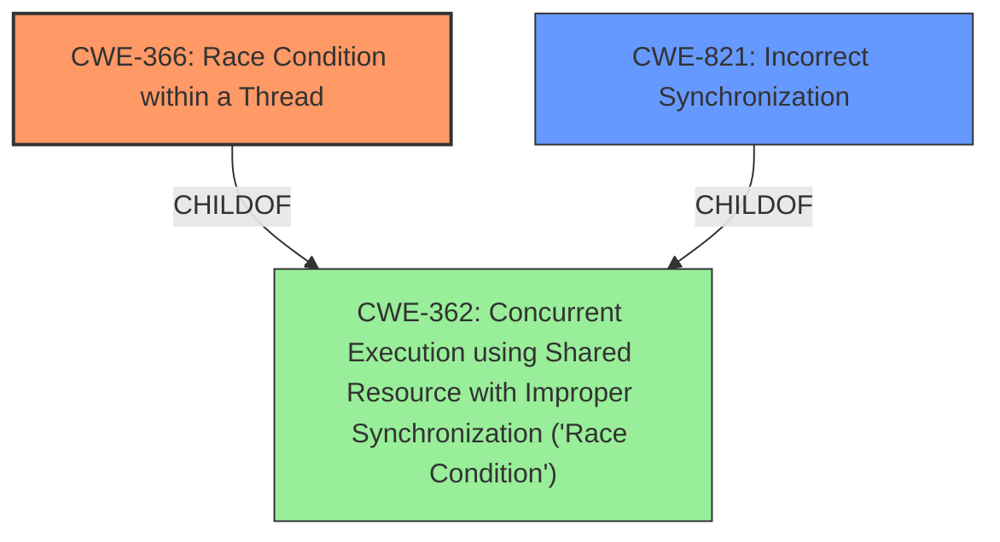

# Raw Analyzer Response for CVE-2020-36462

# Summary
| CWE ID | CWE Name | Confidence | CWE Abstraction Level | CWE Vulnerability Mapping Label | CWE-Vulnerability Mapping Notes |
|---|---|---|---|---|---|
| CWE-366 | Race Condition within a Thread | 0.8 | Base | Allowed | Primary CWE |
| CWE-821 | Incorrect Synchronization | 0.6 | Base | Allowed | Secondary Candidate |

## Evidence and Confidence

*   **Confidence Score:** 0.7
*   **Evidence Strength:** MEDIUM

## Relationship Analysis
The primary CWE selected is CWE-366, a **Base** level CWE, which is a child of the **Class** level CWE-362 (Concurrent Execution using Shared Resource with Improper Synchronization). CWE-821 (Incorrect Synchronization) is also a **Base** level CWE and a sibling of CWE-366. The relationship analysis focused on identifying the most specific CWE that accurately captured the **root cause** of the vulnerability, which is the concurrent execution of a shared resource without proper synchronization within a thread.

## Vulnerability Chain
The vulnerability chain starts with the **incorrect implementation of the `Send` trait** for the `Bucket2` type, allowing non-`Send` types to be moved between threads. This leads to a **race condition (CWE-366)** where multiple threads access and modify shared resources concurrently without proper synchronization, potentially resulting in data races and memory corruption.
  - **Root Cause:** Incorrect `Send` implementation
  - **Weakness:** Race Condition (CWE-366)
  - **Impact:** Data Races, Memory Corruption

## Summary of Analysis
The analysis is based on the provided vulnerability description and the CVE Reference Links Content Summary, which highlight the **incorrect implementation of the `Send` trait** for the `Bucket2` type in the `syncpool` crate. This allows non-`Send` types to be moved between threads, leading to potential data races and memory corruption.

The selection of CWE-366 (Race Condition within a Thread) as the primary CWE is justified by the evidence that the vulnerability involves concurrent execution of shared resources within a thread without proper synchronization. The CVE Reference Links Content Summary explicitly mentions "data races" as a consequence of the vulnerability.

CWE-821 (Incorrect Synchronization) was considered as a secondary candidate because the vulnerability involves **improper synchronization** of access to shared resources. However, CWE-366 is more specific in that it focuses on race conditions within a thread, which aligns more closely with the vulnerability description.

The selected CWEs are at the optimal level of specificity because they accurately represent the **root cause** and the immediate consequence of the vulnerability. More general CWEs, such as CWE-362 (Concurrent Execution using Shared Resource with Improper Synchronization), would not capture the specific context of the vulnerability being within a thread.

The selection of CWE-366 is further supported by the Retriever Results, which identifies it as the top candidate with a **Base** abstraction level. The MITRE mapping guidance for CWE-366 allows its usage, further reinforcing its suitability.

Relevant CWE Information:

# Enhanced Context (25 CWEs)
The following CWEs were identified as potentially relevant to this vulnerability:

## CWE-131: Incorrect Calculation of Buffer Size
**Abstraction Level**: Base
**Similarity Score**: 0.75
**Source**: dense

**Description**:
The product does not correctly calculate the size to be used when allocating a buffer, which could lead to a buffer overflow.

**Mapping Guidance**:
- Usage: Allowed
- Rationale: This CWE entry is at the Base level of abstraction, which is a preferred level of abstraction for mapping to the root causes of vulnerabilities.

## CWE-667: Improper Locking
**Abstraction Level**: Class
**Similarity Score**: 0.75
**Source**: dense

**Description**:
The product does not properly acquire or release a lock on a resource, leading to unexpected resource state changes and behaviors.

**Mapping Guidance**:
- Usage: Allowed-with-Review
- Rationale: This CWE entry is a Class and might have Base-level children that would be more appropriate

## CWE-362: Concurrent Execution using Shared Resource with Improper Synchronization ('Race Condition')
**Abstraction Level**: Class
**Similarity Score**: 0.75
**Source**: dense

**Description**:
The product contains a concurrent code sequence that requires temporary, exclusive access to a shared resource, but a timing window exists in which the shared resource can be modified by another code sequence operating concurrently.

**Mapping Guidance**:
- Usage: Allowed-with-Review
- Rationale: This CWE entry is a Class and might have Base-level children that would be more appropriate

## CWE-407: Inefficient Algorithmic Complexity
**Abstraction Level**: Class
**Similarity Score**: 0.75
**Source**: dense

**Description**:
An algorithm in a product has an inefficient worst-case computational complexity that may be detrimental to system performance and can be triggered by an attacker, typically using crafted manipulations that ensure that the worst case is being reached.

**Mapping Guidance**:
- Usage: Allowed-with-Review
- Rationale: This CWE entry is a Class and might have Base-level children that would be more appropriate

## CWE-404: Improper Resource Shutdown or Release
**Abstraction Level**: Class
**Similarity Score**: 0.75
**Source**: dense

**Description**:
The product does not release or incorrectly releases a resource before it is made available for re-use.

**Mapping Guidance**:
- Usage: Allowed-with-Review
- Rationale: This CWE entry is a Class and might have Base-level children that would be more appropriate

## CWE-366: Race Condition within a Thread
**Abstraction Level**: Base
**Similarity Score**: 0.75
**Source**: dense

**Description**:
If two threads of execution use a resource simultaneously, there exists the possibility that resources may be used while invalid, in turn making the state of execution undefined.

**Mapping Guidance**:
- Usage: Allowed
- Rationale: This CWE entry is at the Base level of abstraction, which is a preferred level of abstraction for mapping to the root causes of vulnerabilities.

## CWE-367: Time-of-check Time-of-use (TOCTOU) Race Condition
**Abstraction Level**: Base
**Similarity Score**: 0.74
**Source**: dense

**Description**:
The product checks the state of a resource before using that resource, but the resource's state can change between the check and the use in a way that invalidates the results of the check. This can cause the product to perform invalid actions when the resource is in an unexpected state.

**Mapping Guidance**:
- Usage: Allowed
- Rationale: This CWE entry is at the Base level of abstraction, which is a preferred level of abstraction for mapping to the root causes of vulnerabilities.

## CWE-226: Sensitive Information in Resource Not Removed Before Reuse
**Abstraction Level**: Base
**Similarity Score**: 0.74
**Source**: dense

**Description**:
The product releases a resource such as memory or a file so that it can be made available for reuse, but it does not clear or "zeroize" the information contained in the resource before the product performs a critical state transition or makes the resource available for reuse by other entities.

**Mapping Guidance**:
- Usage: Allowed
- Rationale: This CWE entry is at the Base level of abstraction, which is a preferred level of abstraction for mapping to the root causes of vulnerabilities.

## CWE-129: Improper Validation of Array Index
**Abstraction Level**: Variant
**Similarity Score**: 0.74
**Source**: dense

**Description**:
The product uses untrusted input when calculating or using an array index, but the product does not validate or incorrectly validates the index to ensure the index references a valid position within the array.

**Mapping Guidance**:
- Usage: Allowed
- Rationale: This CWE entry is at the Variant level of abstraction, which is a preferred level of abstraction for mapping to the root causes of vulnerabilities.

## CWE-125: Out-of-bounds Read
**Abstraction Level**: Base
**Similarity Score**: 0.74
**Source**: dense

**Description**:
The product reads data past the end, or before the beginning, of the intended buffer.

**Mapping Guidance**:
- Usage: Allowed
- Rationale: This CWE entry is at the Base level of abstraction, which is a preferred level of abstraction for mapping to the root causes of vulnerabilities.

## CWE-362: Concurrent Execution using Shared