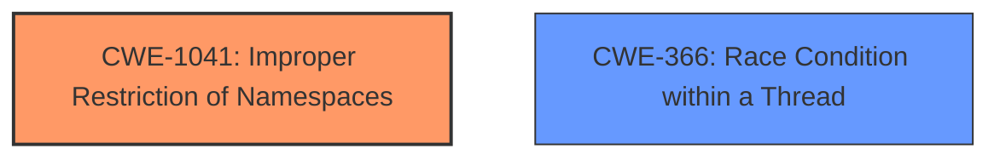

# Analysis for CVE-2020-36463

# Summary
| CWE ID | CWE Name | Confidence | CWE Abstraction Level | CWE Vulnerability Mapping Label | CWE-Vulnerability Mapping Notes |
|---|---|---|---|---|---|
| CWE-1041 | Improper Restriction of Namespaces | 0.8 | Base | Allowed | Primary CWE |
| CWE-366 | Race Condition within a Thread | 0.6 | Base | Allowed | Secondary CWE |

## Evidence and Confidence

*   **Confidence Score:** 0.7
*   **Evidence Strength:** MEDIUM

## Relationship Analysis
The primary CWE is CWE-1041, which indicates a problem with namespace restrictions related to the `Send` trait. The secondary CWE is CWE-366, Race Condition within a Thread, which reflects the potential for concurrent access issues due to the incorrect `Send` implementation.

## Vulnerability Chain
The chain starts with an **unconditional implementation of Send** in the `multiqueue` crate. This leads to the possibility of sending non-`Send` types between threads. If non-`Send` types are shared between threads, it can result in data races and undefined behavior. Thus, the chain is:
1.  **Improper implementation of Send trait (CWE-1041)**
2.  Sharing non-Send types between threads (Potential Data Race)
3.  Data Races and Undefined Behavior (Impact)

## Summary of Analysis
Initially, the most relevant aspect of the vulnerability description is the **unconditional implementations of Send**. This suggests a problem related to how types are handled in concurrent contexts, more specifically, how the `Send` trait is incorrectly applied without proper checks. The CVE description focuses on the **incorrect implementation of the Send trait**, allowing non-`Send` types to be sent between threads and the potential for data races.

The Retriever Results suggest considering CWE-366 (Race Condition within a Thread) and CWE-362 (Concurrent Execution using Shared Resource with Improper Synchronization). These are relevant because the incorrect `Send` implementation could lead to race conditions. However, the root cause is more accurately described by the improper use of the `Send` trait, which is a namespace issue.

CWE-1041 (Improper Restriction of Namespaces) is the most appropriate primary CWE because it directly addresses the **incorrect implementation of Send**, which is essentially an improper restriction on which types should be allowed to be sent between threads. Although CWE-1041 is not present in the Retriever Results, it's a more direct root cause than CWE-366. CWE-366 is still a plausible secondary candidate because the incorrect `Send` implementation can lead to race conditions, but it's more of a potential consequence than the direct root cause.

The analysis is based on the provided evidence. The **weakness** is the **unconditional implementations of Send**. This caused the crate to incorrectly implement the Send trait for its queue types, regardless of whether the type T was actually safe to send between threads.

Relevant CWE Information:

# Enhanced Context (25 CWEs)
The following CWEs were identified as potentially relevant to this vulnerability:

## CWE-667: Improper Locking
**Abstraction Level**: Class
**Similarity Score**: 0.75
**Source**: dense

**Description**:
The product does not properly acquire or release a lock on a resource, leading to unexpected resource state changes and behaviors.

**Mapping Guidance**:
- Usage: Allowed-with-Review
- Rationale: This CWE entry is a Class and might have Base-level children that would be more appropriate

## CWE-362: Concurrent Execution using Shared Resource with Improper Synchronization ('Race Condition')
**Abstraction Level**: Class
**Similarity Score**: 0.75
**Source**: dense

**Description**:
The product contains a concurrent code sequence that requires temporary, exclusive access to a shared resource, but a timing window exists in which the shared resource can be modified by another code sequence operating concurrently.

**Mapping Guidance**:
- Usage: Allowed-with-Review
- Rationale: This CWE entry is a Class and might have Base-level children that would be more appropriate

## CWE-407: Inefficient Algorithmic Complexity
**Abstraction Level**: Class
**Similarity Score**: 0.75
**Source**: dense

**Description**:
An algorithm in a product has an inefficient worst-case computational complexity that may be detrimental to system performance and can be triggered by an attacker, typically using crafted manipulations that ensure that the worst case is being reached.

**Mapping Guidance**:
- Usage: Allowed-with-Review
- Rationale: This CWE entry is a Class and might have Base-level children that would be more appropriate

## CWE-367: Time-of-check Time-of-use (TOCTOU) Race Condition
**Abstraction Level**: Base
**Similarity Score**: 0.75
**Source**: dense

**Description**:
The product checks the state of a resource before using that resource, but the resource's state can change between the check and the use in a way that invalidates the results of the check. This can cause the product to perform invalid actions when the resource is in an unexpected state.

**Mapping Guidance**:
- Usage: Allowed
- Rationale: This CWE entry is at the Base level of abstraction, which is a preferred level of abstraction for mapping to the root causes of vulnerabilities.

## CWE-404: Improper Resource Shutdown or Release
**Abstraction Level**: Class
**Similarity Score**: 0.75
**Source**: dense

**Description**:
The product does not release or incorrectly releases a resource before it is made available for re-use.

**Mapping Guidance**:
- Usage: Allowed-with-Review
- Rationale: This CWE entry is a Class and might have Base-level children that would be more appropriate

## CWE-226: Sensitive Information in Resource Not Removed Before Reuse
**Abstraction Level**: Base
**Similarity Score**: 0.74
**Source**: dense

**Description**:
The product releases a resource such as memory or a file so that it can be made available for reuse, but it does not clear or "zeroize" the information contained in the resource before the product performs a critical state transition or makes the resource available for reuse by other entities.

**Mapping Guidance**:
- Usage: Allowed
- Rationale: This CWE entry is at the Base level of abstraction, which is a preferred level of abstraction for mapping to the root causes of vulnerabilities.

## CWE-366: Race Condition within a Thread
**Abstraction Level**: Base
**Similarity Score**: 0.74
**Source**: dense

**Description**:
If two threads of execution use a resource simultaneously, there exists the possibility that resources may be used while invalid, in turn making the state of execution undefined.

**Mapping Guidance**:
- Usage: Allowed
- Rationale: This CWE entry is at the Base level of abstraction, which is a preferred level of abstraction for mapping to the root causes of vulnerabilities.

## CWE-1289: Improper Validation of Unsafe Equivalence in Input
**Abstraction Level**: Base
**Similarity Score**: 0.74
**Source**: dense

**Description**:
The product receives an input value that is used as a resource identifier or other type of reference, but it does not validate or incorrectly validates that the input is equivalent to a potentially-unsafe value.

**Mapping Guidance**:
- Usage: Allowed
- Rationale: This CWE entry is at the Base level of abstraction, which is a preferred level of abstraction for mapping to the root causes of vulnerabilities.

## CWE-755: Improper Handling of Exceptional Conditions
**Abstraction Level**: Class
**Similarity Score**: 0.74
**Source**: dense

**Description**:
The product does not handle or incorrectly handles an exceptional condition.

**Mapping Guidance**:
- Usage: Discouraged
- Rationale: This CWE entry is a level-1 Class (i.e., a child of a Pillar). It might have lower-level children that would be more appropriate

## CWE-754: Improper Check for Unusual or Exceptional Conditions
**Abstraction Level**: Class
**Similarity Score**: 0.74
**Source**: dense

**Description**:
The product does not check or incorrectly checks for unusual or exceptional conditions that are not expected to occur frequently during day to day operation of the product.

**Mapping Guidance**:
- Usage: Allowed-with-Review
- Rationale: This CWE entry is a Class and might have Base-level children that would be more appropriate

## CWE-362: Concurrent Execution using Shared Resource with Improper Synchronization ('Race Condition')
**Abstraction Level**: Class
**Similarity Score**: 4807.01
**Source**: sparse

**Description**:
The product contains a concurrent code sequence that requires temporary, exclusive access to a shared resource, but a timing window exists in which the shared resource can be modified by another code sequence operating concurrently.

**Mapping Guidance**:
- Usage: Allowed-with-Review
- Rationale

# Enhanced Query for CVE-2020-36463

## Vulnerability Description
An issue was discovered in the multiqueue crate through 2020-12-25 for Rust. There are **unconditional implementations of Send** for InnerSend, InnerRecv, FutInnerSend, and FutInnerRecv.

### Vulnerability Description Key Phrases
- **weakness:** **unconditional implementations of Send**
- **product:** multiqueue crate
- **version:** through 2020-12-25
- **component:** InnerSend and InnerRecv and FutInnerSend and FutInnerRecv

## CVE Reference Links Content Summary
Based on the provided content, here's an analysis of CVE-2020-36463:

**Root cause of vulnerability:**
The `multiqueue` crate incorrectly implemented the `Send` trait for its queue types (`InnerSend<RW, T>`, `InnerRecv<RW, T>`, `FutInnerSend<RW, T>`, `FutInnerRecv<RW, T>`). This was done unconditionally, regardless of whether the type `T` was actually safe to send between threads.

**Weaknesses/vulnerabilities present:**
- Incorrect implementation of the `Send` trait.
- Allowing non-`Send` types to be sent between threads.
- Potential for data races and undefined behavior.

**Impact of exploitation:**
- Data races can occur when non-Send types are shared between threads.
- Undefined behavior can result from data races. This could lead to crashes, memory corruption, or other unpredictable outcomes.

**Attack vectors:**
- The vulnerability can be triggered by any code that utilizes the `multiqueue` crate to send non-`Send` types to another thread.

**Required attacker capabilities/position:**
- An attacker needs to be able to influence the type of data being sent through the queue using the vulnerable `multiqueue` crate.
- No special privileges are required.

**Additional details:**
- The vulnerability affects versions of the `multiqueue` crate up to and including 0.3.2.
- No patched versions are available.
- The vulnerability is categorized as both memory corruption and thread-safety issues.
- The CVSS score is 8.1 (High) with a vector of CVSS:3.1/AV:N/AC:H/PR:N/UI:N/S:U/C:H/I:H/A:H, indicating a network-based attack with high confidentiality, integrity, and availability impact, though with high complexity.
- The vulnerability is also tracked under aliases: `GHSA-jf43-3v8j-qwwr`, `GHSA-r2x6-vrxx-jgv4`.
- There are references to the issue in the `multiqueue` GitHub repository:  [schets/multiqueue#31](https://github.com/schets/multiqueue/issues/31)

The provided information gives a clear understanding of the vulnerability, its root cause, impact, and how it could be exploited.

## Retriever Results

### Top Combined Results

| Rank | CWE ID | Name | Abstraction | Usage  | Retrievers | Individual Scores |
|------|--------|------|-------------|-------|------------|-------------------|
| 1 | 366 | Race Condition within a Thread | Base | Allowed | sparse | 0.376 |
| 2 | 362 | Concurrent Execution using Shared Resource with Improper Synchronization ('Race Condition') | Class | Allowed-with-Review | sparse | 0.188 |
| 3 | 908 | Use of Uninitialized Resource | Base | Allowed | sparse | 0.187 |
| 4 | 93 | Improper Neutralization of CRLF Sequences ('CRLF Injection') | Base | Allowed | sparse | 0.136 |
| 5 | 909 | Missing Initialization of Resource | Class | Allowed-with-Review | sparse | 0.136 |
| 6 | 758 | Reliance on Undefined, Unspecified, or Implementation-Defined Behavior | Class | Allowed-with-Review | dense | 0.482 |
| 7 | 117 | Improper Output Neutralization for Logs | Base | Allowed | graph | 0.002 |
| 8 | 782 | Exposed IOCTL with Insufficient Access Control | Variant | Allowed | sparse | 0.135 |
| 9 | 1342 | Information Exposure through Microarchitectural State after Transient Execution | Base | Allowed | sparse | 0.135 |
| 10 | 1333 | Inefficient Regular Expression Complexity | Base | Allowed | sparse | 0.134 |

# Complete CWE Specifications

## CWE-366: Race Condition within a Thread
**Abstraction:** Base
**Status:** Draft

### Description
If two threads of execution use a resource simultaneously, there exists the possibility that resources may be used while invalid, in turn making the state of execution undefined.

### Extended Description
Not provided

### Alternative Terms
None

### Relationships
ChildOf -> CWE-362
ChildOf -> CWE-662
ChildOf -> CWE-662

### Mapping Guidance
**Usage:** Allowed
**Rationale:** This CWE entry is at the Base level of abstraction, which is a preferred level of abstraction for mapping to the root causes of vulnerabilities.
**Comments:** Carefully read both the name and description to ensure that this mapping is an appropriate fit. Do not try to 'force' a mapping to a lower-level Base/Variant simply to comply with this preferred level of abstraction.
**Reasons:**
- Acceptable-Use

### Observed Examples
- **CVE-2022-2621:** Chain: two threads in a web browser use the same resource (CWE-366), but one of those threads can destroy the resource before the other has completed (CWE-416).

## CWE-362: Concurrent Execution using Shared Resource with Improper Synchronization ('Race Condition')
**Abstraction:** Class
**Status:** Draft

### Description
The product contains a concurrent code sequence that requires temporary, exclusive access to a shared resource, but a timing window exists in which the shared resource can be modified by another code sequence operating concurrently.

### Extended Description

A race condition occurs within concurrent environments, and it is effectively a property of a code sequence. Depending on the context, a code sequence may be in the form of a function call, a small number of instructions, a series of program invocations, etc.

A race condition violates these properties, which are closely related:

  - Exclusivity - the code sequence is given exclusive access to the shared resource, i.e., no other code sequence can modify properties of the shared resource before the original sequence has completed execution.

  - Atomicity - the code sequence is behaviorally atomic, i.e., no other thread or process can concurrently execute the same sequence of instructions (or a subset) against the same resource.

A race condition exists when an "interfering code sequence" can still access the shared resource, violating exclusivity.

The interfering code sequence could be "trusted" or "untrusted." A trusted interfering code sequence occurs within the product; it cannot be modified by the attacker, and it can only be invoked indirectly. An untrusted interfering code sequence can be authored directly by the attacker, and typically it is external to the vulnerable product.

### Alternative Terms
Race Condition

### Relationships
ChildOf -> CWE-691
CanPrecede -> CWE-416
CanPrecede -> CWE-476

### Mapping Guidance
**Usage:** Allowed-with-Review
**Rationale:** This CWE entry is a Class and might have Base-level children that would be more appropriate
**Comments:** Examine children of this entry to see if there is a better fit
**Reasons:**
- Abstraction

### Additional Notes
**[Maintenance]** The relationship between race conditions and synchronization problems (CWE-662) needs to be further developed. They are not necessarily two perspectives of the same core concept, since synchronization is only one technique for avoiding race conditions, and synchronization can be used for other purposes besides race condition prevention.

**[Research Gap]** Race conditions in web applications are under-studied and probably under-reported. However, in 2008 there has been growing interest in this area.

**[Research Gap]** Much of the focus of race condition research has been in Time-of-check Time-of-use (TOCTOU) variants (CWE-367), but many race conditions are related to synchronization problems that do not necessarily require a time-of-check.

**[Research Gap]** From a classification/taxonomy perspective, the relationships between concurrency and program state need closer investigation and may be useful in organizing related issues.

### Observed Examples
- **CVE-2022-29527:** Go application for cloud management creates a world-writable sudoers file that allows local attackers to inject sudo rules and escalate privileges to root by winning a race condition.
- **CVE-2021-1782:** Chain: improper locking (CWE-667) leads to race condition (CWE-362), as exploited in the wild per CISA KEV.
- **CVE-2021-0920:** Chain: mobile platform race condition (CWE-362) leading to use-after-free (CWE-416), as exploited in the wild per CISA KEV.

## CWE-908: Use of Uninitialized Resource
**Abstraction:** Base
**Status:** Incomplete

### Description
The product uses or accesses a resource that has not been initialized.

### Extended Description
When a resource has not been properly initialized, the product may behave unexpectedly. This may lead to a crash or invalid memory access, but the consequences vary depending on the type of resource and how it is used within the product.

### Alternative Terms
None

### Relationships
ChildOf -> CWE-665
ChildOf -> CWE-665

### Mapping Guidance
**Usage:** Allowed
**Rationale:** This CWE entry is at the Base level of abstraction, which is a preferred level of abstraction for mapping to the root causes of vulnerabilities.
**Comments:** Carefully read both the name and description to ensure that this mapping is an appropriate fit. Do not try to 'force' a mapping to a lower-level Base/Variant simply to comply with this preferred level of abstraction.
**Reasons:**
- Acceptable-Use

### Observed Examples
- **CVE-2019-9805:** Chain: Creation of the packet client occurs before initialization is complete (CWE-696) resulting in a read from uninitialized memory (CWE-908), causing memory corruption.
- **CVE-2008-4197:** Use of uninitialized memory may allow code execution.
- **CVE-2008-2934:** Free of an uninitialized pointer leads to crash and possible code execution.

## CWE-93: Improper Neutralization of CRLF Sequences ('CRLF Injection')
**Abstraction:** Base
**Status:** Draft

### Description
The product uses CRLF (carriage return line feeds) as a special element, e.g. to separate lines or records, but it does not neutralize or incorrectly neutralizes CRLF sequences from inputs.

### Extended Description
Not provided

### Alternative Terms
None

### Relationships
ChildOf -> CWE-74
CanPrecede -> CWE-117

### Mapping Guidance
**Usage:** Allowed
**Rationale:** This CWE entry is at the Base level of abstraction, which is a preferred level of abstraction for mapping to the root causes of vulnerabilities.
**Comments:** Carefully read both the name and description to ensure that this mapping is an appropriate fit. Do not try to 'force' a mapping to a lower-level Base/Variant simply to comply with this preferred level of abstraction.
**Reasons:**
- Acceptable-Use

### Observed Examples
- **CVE-2002-1771:** CRLF injection enables spam proxy (add mail headers) using email address or name.
- **CVE-2002-1783:** CRLF injection in API function arguments modify headers for outgoing requests.
- **CVE-2004-1513:** Spoofed entries in web server log file via carriage returns

## CWE-909: Missing Initialization of Resource
**Abstraction:** Class
**Status:** Incomplete

### Description
The product does not initialize a critical resource.

### Extended Description
Many resources require initialization before they can be properly used. If a resource is not initialized, it could contain unpredictable or expired data, or it could be initialized to defaults that are invalid. This can have security implications when the resource is expected to have certain properties or values.

### Alternative Terms
None

### Relationships
ChildOf -> CWE-665
ChildOf -> CWE-665
CanPrecede -> CWE-908

### Mapping Guidance
**Usage:** Allowed-with-Review
**Rationale:** This CWE entry is a Class and might have Base-level children that would be more appropriate
**Comments:** Examine children of this entry to see if there is a better fit
**Reasons:**
- Abstraction

### Observed Examples
- **CVE-2020-20739:** A variable that has its value set in a conditional statement is sometimes used when the conditional fails, sometimes causing data leakage
- **CVE-2005-1036:** Chain: Bypass of access restrictions due to improper authorization (CWE-862) of a user results from an improperly initialized (CWE-909) I/O permission bitmap

## CWE-758: Reliance on Undefined, Unspecified, or Implementation-Defined Behavior
**Abstraction:** Class
**Status:** Incomplete

### Description
The product uses an API function, data structure, or other entity in a way that relies on properties that are not always guaranteed to hold for that entity.

### Extended Description
This can lead to resultant weaknesses when the required properties change, such as when the product is ported to a different platform or if an interaction error (CWE-435) occurs.

### Alternative Terms
None

### Relationships
ChildOf -> CWE-710

### Mapping Guidance
**Usage:** Allowed-with-Review
**Rationale:** This CWE entry is a Class and might have Base-level children that would be more appropriate
**Comments:** Examine children of this entry to see if there is a better fit
**Reasons:**
- Abstraction

### Observed Examples
- **CVE-2006-1902:** Change in C compiler behavior causes resultant buffer overflows in programs that depend on behaviors that were undefined in the C standard.

## CWE-117: Improper Output Neutralization for Logs
**Abstraction:** Base
**Status:** Draft

### Description
The product does not neutralize or incorrectly neutralizes output that is written to logs.

### Extended Description

This can allow an attacker to forge log entries or inject malicious content into logs.

Log forging vulnerabilities occur when:

  1. Data enters an application from an untrusted source.

  1. The data is written to an application or system log file.

### Alternative Terms
None

### Relationships
ChildOf -> CWE-116
ChildOf -> CWE-20

### Mapping Guidance
**Usage:** Allowed
**Rationale:** This CWE entry is at the Base level of abstraction, which is a preferred level of abstraction for mapping to the root causes of vulnerabilities.
**Comments:** Carefully read both the name and description to ensure that this mapping is an appropriate fit. Do not try to 'force' a mapping to a lower-level Base/Variant simply to comply with this preferred level of abstraction.
**Reasons:**
- Acceptable-Use

### Observed Examples
- **CVE-2006-4624:** Chain: inject fake log entries with fake timestamps using CRLF injection

## CWE-782: Exposed IOCTL with Insufficient Access Control
**Abstraction:** Variant
**Status:** Draft

### Description
The product implements an IOCTL with functionality that should be restricted, but it does not properly enforce access control for the IOCTL.

### Extended Description

When an IOCTL contains privileged functionality and is exposed unnecessarily, attackers may be able to access this functionality by invoking the IOCTL. Even if the functionality is benign, if the programmer has assumed that the IOCTL would only be accessed by a trusted process, there may be little or no validation of the incoming data, exposing weaknesses that would never be reachable if the attacker cannot call the IOCTL directly.

The implementations of IOCTLs will differ between operating system types and versions, so the methods of attack and prevention may vary widely.

### Alternative Terms
None

### Relationships
ChildOf -> CWE-749
CanPrecede -> CWE-781

### Mapping Guidance
**Usage:** Allowed
**Rationale:** This CWE entry is at the Variant level of abstraction, which is a preferred level of abstraction for mapping to the root causes of vulnerabilities.
**Comments:** Carefully read both the name and description to ensure that this mapping is an appropriate fit. Do not try to 'force' a mapping to a lower-level Base/Variant simply to comply with this preferred level of abstraction.
**Reasons:**
- Acceptable-Use

### Additional Notes
**[Relationship]** This can be primary to many other weaknesses when the programmer assumes that the IOCTL can only be accessed by trusted parties. For example, a program or driver might not validate incoming addresses in METHOD_NEITHER IOCTLs in Windows environments (CWE-781), which could allow buffer overflow and similar attacks to take place, even when the attacker never should have been able to access the IOCTL at all.

**[Applicable Platform]** 

Because IOCTL functionality is typically performing low-level actions and closely interacts with the operating system, this weakness may only appear in code that is written in low-level languages.

### Observed Examples
- **CVE-2009-2208:** Operating system does not enforce permissions on an IOCTL that can be used to modify network settings.
- **CVE-2008-3831:** Device driver does not restrict ioctl calls to its direct rendering manager.
- **CVE-2008-3525:** ioctl does not check for a required capability before processing certain requests.

## CWE-1342: Information Exposure through Microarchitectural State after Transient Execution
**Abstraction:** Base
**Status:** Incomplete

### Description
The processor does not properly clear microarchitectural state after incorrect microcode assists or speculative execution, resulting in transient execution.

### Extended Description

In many processor architectures an exception, mis-speculation, or microcode assist results in a flush operation to clear results that are no longer required. This action prevents these results from influencing architectural state that is intended to be visible from software. However, traces of this transient execution may remain in microarchitectural buffers, resulting in a change in microarchitectural state that can expose sensitive information to an attacker using side-channel analysis. For example, Load Value Injection (LVI) [REF-1202] can exploit direct injection of erroneous values into intermediate load and store buffers.

Several conditions may need to be fulfilled for a successful attack:

  1. incorrect transient execution that results in remanence of sensitive information;

  1. attacker has the ability to provoke microarchitectural exceptions;

  1. operations and structures in victim code that can be exploited must be identified.

### Alternative Terms
None

### Relationships
ChildOf -> CWE-226
ChildOf -> CWE-226

### Mapping Guidance
**Usage:** Allowed
**Rationale:** This CWE entry is at the Base level of abstraction, which is a preferred level of abstraction for mapping to the root causes of vulnerabilities.
**Comments:** Carefully read both the name and description to ensure that this mapping is an appropriate fit. Do not try to 'force' a mapping to a lower-level Base/Variant simply to comply with this preferred level of abstraction.
**Reasons:**
- Acceptable-Use

### Additional Notes
**[Relationship]** CWE-1342 differs from CWE-1303, which is related to misprediction and biasing microarchitectural components, while CWE-1342 addresses illegal data flows and retention. For example, Spectre is an instance of CWE-1303 biasing branch prediction to steer the transient execution indirectly.

**[Maintenance]** As of CWE 4.9, members of the CWE Hardware SIG are closely analyzing this entry and others to improve CWE's coverage of transient execution weaknesses, which include issues related to Spectre, Meltdown, and other attacks. Additional investigation may include other weaknesses related to microarchitectural state. As a result, this entry might change significantly in CWE 4.10.

### Observed Examples
- **CVE-2020-0551:** Load value injection in some processors utilizing speculative execution may allow an authenticated user to enable information disclosure via a side-channel with local access.

## CWE-1333: Inefficient Regular Expression Complexity
**Abstraction:** Base
**Status:** Draft

### Description
The product uses a regular expression with an inefficient, possibly exponential worst-case computational complexity that consumes excessive CPU cycles.

### Extended Description
Some regular expression engines have a feature called "backtracking". If the token cannot match, the engine "backtracks" to a position that may result in a different token that can match.
 Backtracking becomes a weakness if all of these conditions are met:

  - The number of possible backtracking attempts are exponential relative to the length of the input.

  - The input can fail to match the regular expression.

  - The input can be long enough.

 Attackers can create crafted inputs that intentionally cause the regular expression to use excessive backtracking in a way that causes the CPU consumption to spike. 

### Alternative Terms
ReDoS: ReDoS is an abbreviation of "Regular expression Denial of Service".
Regular Expression Denial of Service: While this term is attack-focused, this is commonly used to describe the weakness.
Catastrophic backtracking: This term is used to describe the behavior of the regular expression as a negative technical impact.

### Relationships
ChildOf -> CWE-407
ChildOf -> CWE-407

### Mapping Guidance
**Usage:** Allowed
**Rationale:** This CWE entry is at the Base level of abstraction, which is a preferred level of abstraction for mapping to the root causes of vulnerabilities.
**Comments:** Carefully read both the name and description to ensure that this mapping is an appropriate fit. Do not try to 'force' a mapping to a lower-level Base/Variant simply to comply with this preferred level of abstraction.
**Reasons:**
- Acceptable-Use

### Observed Examples
- **CVE-2020-5243:** server allows ReDOS with crafted User-Agent strings, due to overlapping capture groups that cause excessive backtracking.
- **CVE-2021-21317:** npm package for user-agent parser prone to ReDoS due to overlapping capture groups
- **CVE-2019-16215:** Markdown parser uses inefficient regex when processing a message, allowing users to cause CPU consumption and delay preventing processing of other messages.

