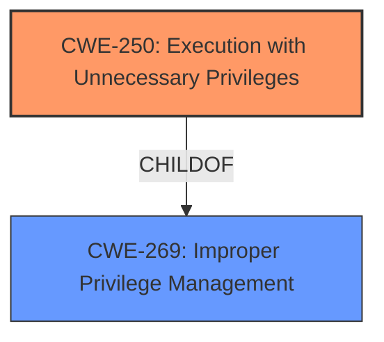

# Analysis for CVE-2020-3950

# Summary
| CWE ID | CWE Name | Confidence | CWE Abstraction Level | CWE Vulnerability Mapping Label | CWE-Vulnerability Mapping Notes |
|---|---|---|---|---|---|
| CWE-250 | Execution with Unnecessary Privileges | 0.9 | Base | Allowed | Primary CWE |
| CWE-269 | Improper Privilege Management | 0.6 | Class | Discouraged | Secondary Candidate |

## Evidence and Confidence

*   **Confidence Score:** 0.9
*   **Evidence Strength:** HIGH

## Relationship Analysis
The primary CWE selected is CWE-250 (Execution with Unnecessary Privileges), which is a Base-level CWE. It is a child of CWE-269 (Improper Privilege Management). The description indicates the **improper use of setuid binaries**, meaning the software is executing with more privileges than necessary. This directly aligns with CWE-250.



## Vulnerability Chain
The vulnerability chain is:
1.  **Root Cause:** **Improper use of setuid binaries** (CWE-250)
2.  **Impact:** Privilege escalation

## Summary of Analysis
The initial analysis focused on the **improper use of setuid binaries** leading to privilege escalation. The Retriever results highlighted CWE-250 (Execution with Unnecessary Privileges) as the top candidate, which aligns well with the root cause.

The vulnerability description states: "VMware Fusion (11.x before 11.5.2), VMware Remote Console for Mac (11.x and prior before 11.0.1) and Horizon Client for Mac (5.x and prior before 5.4.0) contain a privilege escalation vulnerability due to **improper use of setuid binaries**. Successful exploitation of this issue may allow attackers with normal user privileges to escalate their privileges to root on the system where Fusion, VMRC or Horizon Client is installed."

The CVE Reference Links Content Summary confirms this:
```
{
  "vulnerability_details": [
    {
      "cve_id": "CVE-2020-3950",
      "root_cause": "Improper use of setuid binaries.",
      "weaknesses": [
        "Privilege escalation due to setuid binaries."
      ],
      "impact": "Attackers with normal user privileges can escalate their privileges to root on the system where Fusion, VMRC, or Horizon Client is installed.",
      "attack_vectors": [
        "Local exploitation of setuid binaries."
      ],
      "required_capabilities": "Normal user privileges on the system where the vulnerable software is installed."
    }
  ]
}
```

CWE-250 (Execution with Unnecessary Privileges) is the best match because it directly addresses the root cause: the software is running with higher privileges than required, which enables the privilege escalation. The relationship analysis shows that it's a child of CWE-269, but CWE-250 is more specific and therefore more appropriate.

CWE-269 (Improper Privilege Management) was considered but not selected as the primary CWE because it's a more general class of weakness. While the vulnerability involves improper privilege management, the specific issue is the unnecessary elevation of privileges, which is better captured by CWE-250. The mapping guidance for CWE-269 also discourages its use when lower-level CWEs are applicable.

The selected CWE is at the optimal level of specificity because it directly reflects the technical weakness described in the vulnerability and is a Base-level CWE.

Relevant CWE Information:

# Enhanced Context (25 CWEs)

## CWE-250: Execution with Unnecessary Privileges
**Abstraction Level**: Base
**Similarity Score**: 0.533
**Source**: sparse

**Description**:
The product performs an operation at a privilege level that is higher than the minimum level required, which creates new weaknesses or amplifies the consequences of other weaknesses.

**Mapping Guidance**:
- Usage: Allowed
- Rationale: This CWE entry is at the Base level of abstraction, which is a preferred level of abstraction for mapping to the root causes of vulnerabilities.

## CWE-269: Improper Privilege Management
**Abstraction Level**: Class
**Similarity Score**: 0.440
**Source**: sparse

**Description**:
The product does not properly assign, modify, track, or check privileges for an actor, creating an unintended sphere of control for that actor.

**Mapping Guidance**:
- Usage: Discouraged
- Rationale: CWE-269 is commonly misused. It can be conflated with "privilege escalation," which is a technical impact that is listed in many low-information vulnerability reports [REF-1287]. It is not useful for trend analysis.