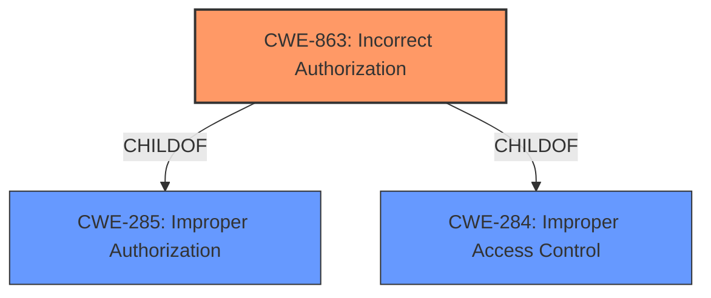

# Analysis Report for CVE-2020-3952

# Vulnerability Analysis Report: CVE-2020-3952

## Description


## Analysis (with Relationship Data)

# Summary
| CWE ID | CWE Name | Confidence | CWE Abstraction Level | CWE Vulnerability Mapping Label | CWE-Vulnerability Mapping Notes |
|---|---|---|---|---|---|
| CWE-863 | Incorrect Authorization | 1.0 | Class | Primary CWE | Allowed-with-Review |

## Evidence and Confidence

*   **Confidence Score:** 1.0
*   **Evidence Strength:** HIGH

## Relationship Analysis
The primary CWE is CWE-863 Incorrect Authorization which is a Class level CWE. It has child relationships to CWE-285 Improper Authorization and CWE-284 Improper Access Control. Given the vulnerability description speaks to **improper access controls**, but focuses on the authorization aspect, CWE-863 is the most appropriate given the evidence.



## Vulnerability Chain
The chain of root cause is that the vmdir component of VMware vCenter Server **does not correctly implement access controls**, leading to **incorrect authorization**.
  - The root cause is the **improper access controls**.
  - The weakness is **incorrect authorization**.

## Summary of Analysis
The vulnerability description states that vmdir "**does not correctly implement access controls**". The Retriever Results list CWE-863 Incorrect Authorization as the best match.

CWE-863 description is: "The product performs an authorization check when an actor attempts to access a resource or perform an action, but it does not correctly perform the check." This matches the vulnerability description of "**improper access controls**"

The CWE-863 is at the Class level, and the Mapping Guidance states: "This CWE entry is a Class and might have Base-level children that would be more appropriate". However, there is insufficient information to select a more specific CWE.

Therefore, the best CWE is CWE-863 Incorrect Authorization.

Relevant CWE Information:

# Enhanced Context (25 CWEs)
The following CWEs were identified as potentially relevant to this vulnerability:

## CWE-303: Incorrect Implementation of Authentication Algorithm
**Abstraction Level**: Base
**Similarity Score**: 0.78
**Source**: dense

**Description**:
The requirements for the product dictate the use of an established authentication algorithm, but the implementation of the algorithm is incorrect.
**Not Used:** Authentication is not mentioned in the vulnerability description.

## CWE-274: Improper Handling of Insufficient Privileges
**Abstraction Level**: Base
**Similarity Score**: 0.78
**Source**: dense

**Description**:
The product does not handle or incorrectly handles when it has insufficient privileges to perform an operation, leading to resultant weaknesses.
**Not Used:** Insufficient privileges are not mentioned in the vulnerability description.

## CWE-1390: Weak Authentication
**Abstraction Level**: Class
**Similarity Score**: 0.77
**Source**: dense

**Description**:
The product uses an authentication mechanism to restrict access to specific users or identities, but the mechanism does not sufficiently prove that the claimed identity is correct.
**Not Used:** Authentication is not mentioned in the vulnerability description.

## CWE-807: Reliance on Untrusted Inputs in a Security Decision
**Abstraction Level**: Base
**Similarity Score**: 0.77
**Source**: dense

**Description**:
The product uses a protection mechanism that relies on the existence or values of an input, but the input can be modified by an untrusted actor in a way that bypasses the protection mechanism.
**Not Used:** Untrusted inputs are not mentioned in the vulnerability description.

## CWE-41: Improper Resolution of Path Equivalence
**Abstraction Level**: Base
**Similarity Score**: 0.77
**Source**: dense

**Description**:
The product is vulnerable to file system contents disclosure through path equivalence. Path equivalence involves the use of special characters in file and directory names. The associated manipulations are intended to generate multiple names for the same object.
**Not Used:** Path equivalence is not mentioned in the vulnerability description.

## CWE-280: Improper Handling of Insufficient Permissions or Privileges 
**Abstraction Level**: Base
**Similarity Score**: 0.77
**Source**: dense

**Description**:
The product does not handle or incorrectly handles when it has insufficient privileges to access resources or functionality as specified by their permissions. This may cause it to follow unexpected code paths that may leave the product in an invalid state.
**Not Used:** Insufficient permissions or privileges are not mentioned in the vulnerability description.

## CWE-23: Relative Path Traversal
**Abstraction Level**: Base
**Similarity Score**: 0.77
**Source**: dense

**Description**:
The product uses external input to construct a pathname that should be within a restricted directory, but it does not properly neutralize sequences such as ".." that can resolve to a location that is outside of that directory.
**Not Used:** Path traversal is not mentioned in the vulnerability description.

## CWE-73: External Control of File Name or Path
**Abstraction Level**: Base
**Similarity Score**: 0.77
**Source**: dense

**Description**:
The product allows user input to control or influence paths or file names that are used in filesystem operations.
**Not Used:** File names or paths are not mentioned in the vulnerability description.

## CWE-1391: Use of Weak Credentials
**Abstraction Level**: Class
**Similarity Score**: 0.77
**Source**: dense

**Description**:
The product uses weak credentials (such as a default key or hard-coded password) that can be calculated, derived, reused, or guessed by an attacker.
**Not Used:** Credentials are not mentioned in the vulnerability description.

## CWE-552: Files or Directories Accessible to External Parties
**Abstraction Level**: Base
**Similarity Score**: 0.77
**Source**: dense

**Description**:
The product makes files or directories accessible to unauthorized actors, even though they should not be.
**Not Used:** While this could be an impact, the description focuses on the root cause.

## CWE-22: Improper Limitation of a Pathname to a Restricted Directory ('Path Traversal')
**Abstraction Level**: Base
**Similarity Score**: 5562.68
**Source**: sparse

**Description**:
The product uses external input to construct a pathname that is intended to identify a file or directory that is located underneath a restricted parent directory, but the product does not properly neutralize special elements within the pathname that can cause the pathname to resolve to a location that is outside of the restricted directory.
**Not Used:** Path traversal is not mentioned in the vulnerability description.

## CWE-863: Incorrect Authorization
**Abstraction Level**: Class
**Similarity Score**: 5330.09
**Source**: sparse

**Description**:
The product performs an authorization check when an actor attempts to access a resource or perform an action, but it does not correctly perform the check.
**Used:** This is the primary CWE as it matches the vulnerability description of "**improper access controls**".

## CWE-23: Relative Path Traversal
**Abstraction Level**: Base
**Similarity Score**: 5306.96
**Source**: sparse

**Description**:
The product uses external input to construct a pathname that should be within a restricted directory, but it does not properly neutralize sequences such as ".." that can resolve to a location that is outside of that directory.
**Not Used:** Path traversal is not mentioned in the vulnerability description.

## CWE-1390: Weak Authentication
**Abstraction Level**: Class
**Similarity Score**: 5234.25
**Source**: sparse

**Description**:
The product uses an authentication mechanism to restrict access to specific users or identities, but the mechanism does not sufficiently prove that the claimed identity is correct.
**Not Used:** Authentication is not mentioned in the vulnerability description.

## CWE-285: Improper Authorization
**Abstraction Level**: Class
**Similarity Score**: 5219.28
**Source**: sparse

**Description**:
The product does not perform or incorrectly performs an authorization check when an actor attempts to access a resource or perform an action.
**Not Used:** CWE-285 is high-level and lower-level CWEs can frequently be used instead.

## CWE-22: Improper Limitation of a Pathname to a Restricted Directory ('Path Traversal')
**Abstraction Level**: base
**Similarity Score**: 4.33
**Source**: graph

**Description**:
CWE-22: Improper Limitation of a Pathname to a Restricted Directory ('Path Traversal')
**Not Used:** Path traversal is not mentioned in the vulnerability description.

## CWE-434: Unrestricted Upload of File with Dangerous Type
**Abstraction Level**: base
**Similarity Score**: 4.33
**Source**:


## CWE Relationship Analysis

Current CWEs represent these abstraction levels: .


### Vulnerability Chain Analysis

**Chain starting from CWE-303:**
- 303 (Incorrect Implementation of Authentication Algorithm) - ROOT


**Chain starting from CWE-284:**
- 284 (Improper Access Control) - ROOT


### CWE Relationship Diagram

```mermaid
graph TD
    classDef primary fill:#f96,stroke:#333,stroke-width:2px
    classDef secondary fill:#69f,stroke:#333
    classDef tertiary fill:#9e9,stroke:#333
```


*Report generated on 2025-04-02 12:55:46*
