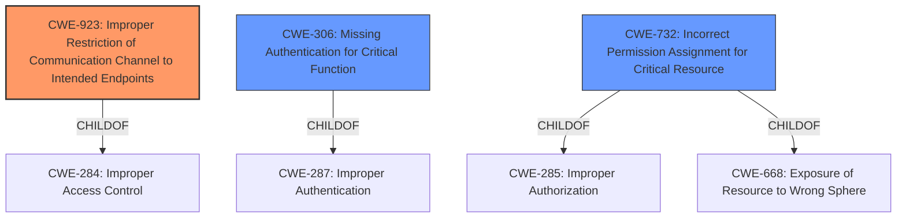

# Analysis Report for CVE-2020-4062

# Vulnerability Analysis Report: CVE-2020-4062

## Description


## Analysis (with Relationship Data)

# Summary
| CWE ID    | CWE Name                                                                | Confidence | CWE Abstraction Level | CWE Vulnerability Mapping Label | CWE-Vulnerability Mapping Notes |
| --------- | ----------------------------------------------------------------------- | ---------- | ----------------------- | ------------------------------- | ----------------------------- |
| CWE-923     | Improper Restriction of Communication Channel to Intended Endpoints     | 0.85       | Class                   | Primary                         | Allowed-with-Review           |
| CWE-306     | Missing Authentication for Critical Function                          | 0.75       | Base                    | Secondary                       | Allowed                       |
| CWE-732     | Incorrect Permission Assignment for Critical Resource                 | 0.65       | Class                   | Secondary                       | Allowed-with-Review           |

## Evidence and Confidence

*   **Confidence Score:** 0.75
*   **Evidence Strength:** HIGH

## Relationship Analysis
The primary relationship influencing the selection was the hierarchical relationship, considering that CWE-923 is a Class-level CWE, and the other candidates (CWE-306, CWE-732) are at the Base and Class level, respectively. The vulnerability involves an **open port** (**rootcause**) which represents a communication channel not properly restricted, aligning with CWE-923. The issue also suggests a lack of authentication (CWE-306) and potentially incorrect permission assignment (CWE-732), which could be contributing factors.



## Vulnerability Chain
The vulnerability chain starts with an **insecure default configuration** (**rootcause**), leading to an **open port** and **lack of authentication**. This results in **full read & write access to the database**, and finally, **potential privilege escalation** and **retrieval of any secret**.

## Summary of Analysis
The initial analysis identified the **open port** (**rootcause**) as a key element. The Retriever Results suggested CWE-923 as a top candidate. The Complete CWE Specifications confirmed that CWE-923 accurately describes the vulnerability, where the communication channel (Postgres port) is not properly restricted to intended endpoints.

CWE-306 was considered because the vulnerability description implies a **lack of authentication** for the database connection. CWE-732 was considered because the **open port** could be interpreted as an **incorrect permission assignment** for the database resource.

However, CWE-923 was chosen as the primary CWE because it is at a higher level of abstraction and encompasses the core issue of a communication channel being improperly restricted. The open port is the primary flaw that allows unauthorized access. CWE-306 and CWE-732 are potentially contributing factors but are more specific consequences of the **initial insecure configuration**.

The final decision is based on the evidence from the "Vulnerability Description Key Phrases" which states "**rootcause: open port for Conjur Postgres database**" and "CVE Reference Links Content Summary" which states "**Root cause of vulnerability: The Conjur OSS helm chart, in versions prior to 2.0, installed the Conjur Postgres database with an open port, allowing unauthorized access.**" These statements clearly identify the open port as the primary **rootcause**.

The selected CWEs are at an appropriate level of specificity, with CWE-923 capturing the broader issue and CWE-306 and CWE-732 highlighting potential contributing factors.

Relevant CWE Information:

# Enhanced Context (25 CWEs)

## CWE-552: Files or Directories Accessible to External Parties
**Abstraction Level**: Base
**Similarity Score**: 0.78
**Source**: dense

**Description**:
The product makes files or directories accessible to unauthorized actors, even though they should not be.

**Mapping Guidance**:
- Usage: Allowed
- Rationale: This CWE entry is at the Base level of abstraction, which is a preferred level of abstraction for mapping to the root causes of vulnerabilities.

## CWE-538: Insertion of Sensitive Information into Externally-Accessible File or Directory
**Abstraction Level**: Base
**Similarity Score**: 0.76
**Source**: dense

**Description**:
The product places sensitive information into files or directories that are accessible to actors who are allowed to have access to the files, but not to the sensitive information.

**Mapping Guidance**:
- Usage: Allowed
- Rationale: This CWE entry is at the Base level of abstraction, which is a preferred level of abstraction for mapping to the root causes of vulnerabilities.

## CWE-668: Exposure of Resource to Wrong Sphere
**Abstraction Level**: Class
**Similarity Score**: 0.75
**Source**: dense

**Description**:
The product exposes a resource to the wrong control sphere, providing unintended actors with inappropriate access to the resource.

**Mapping Guidance**:
- Usage: Discouraged
- Rationale: CWE-668 is high-level and is often misused as a catch-all when lower-level CWE IDs might be applicable. It is sometimes used for low-information vulnerability reports [REF-1287]. It is a level-1 Class (i.e., a child of a Pillar). It is not useful for trend analysis.

## CWE-226: Sensitive Information in Resource Not Removed Before Reuse
**Abstraction Level**: Base
**Similarity Score**: 0.74
**Source**: dense

**Description**:
The product releases a resource such as memory or a file so that it can be made available for reuse, but it does not clear or "zeroize" the information contained in the resource before the product performs a critical state transition or makes the resource available for reuse by other entities.

**Mapping Guidance**:
- Usage: Allowed
- Rationale: This CWE entry is at the Base level of abstraction, which is a preferred level of abstraction for mapping to the root causes of vulnerabilities.

## CWE-497: Exposure of Sensitive System Information to an Unauthorized Control Sphere
**Abstraction Level**: Base
**Similarity Score**: 0.74
**Source**: dense

**Description**:
The product does not properly prevent sensitive system-level information from being accessed by unauthorized actors who do not have the same level of access to the underlying system as the product does.

**Mapping Guidance**:
- Usage: Allowed
- Rationale: This CWE entry is at the Base level of abstraction, which is a preferred level of abstraction for mapping to the root causes of vulnerabilities.

## CWE-212: Improper Removal of Sensitive Information Before Storage or Transfer
**Abstraction Level**: Base
**Similarity Score**: 0.73
**Source**: dense

**Description**:
The product stores, transfers, or shares a resource that contains sensitive information, but it does not properly remove that information before the product makes the resource available to unauthorized actors.

**Mapping Guidance**:
- Usage: Allowed
- Rationale: This CWE entry is at the Base level of abstraction, which is a preferred level of abstraction for mapping to the root causes of vulnerabilities.

## CWE-41: Improper Resolution of Path Equivalence
**Abstraction Level**: Base
**Similarity Score**: 0.73
**Source**: dense

**Description**:
The product is vulnerable to file system contents disclosure through path equivalence. Path equivalence involves the use of special characters in file and directory names. The associated manipulations are intended to generate multiple names for the same object.

**Mapping Guidance**:
- Usage: Allowed
- Rationale: This CWE entry is at the Base level of abstraction, which is a preferred level of abstraction for mapping to the root causes of vulnerabilities.

## CWE-23: Relative Path Traversal
**Abstraction Level**: Base
**Similarity Score**: 0.73
**Source**: dense

**Description**:
The product uses external input to construct a pathname that should be within a restricted directory, but it does not properly neutralize sequences such as ".." that can resolve to a location that is outside of that directory.

**Mapping Guidance**:
- Usage: Allowed
- Rationale: This CWE entry is at the Base level of abstraction, which is a preferred level of abstraction for mapping to the root causes of vulnerabilities.

## CWE-653: Improper Isolation or Compartmentalization
**Abstraction Level**: Class
**Similarity Score**: 0.73
**Source**: dense

**Description**:
The product does not properly compartmentalize or isolate functionality, processes, or resources that require


## CWE Relationship Analysis

Current CWEs represent these abstraction levels: .


### Vulnerability Chain Analysis

**Chain starting from CWE-732:**
- 732 (Incorrect Permission Assignment for Critical Resource) - ROOT


**Chain starting from CWE-306:**
- 306 (Missing Authentication for Critical Function) - ROOT


### CWE Relationship Diagram

```mermaid
graph TD
    classDef primary fill:#f96,stroke:#333,stroke-width:2px
    classDef secondary fill:#69f,stroke:#333
    classDef tertiary fill:#9e9,stroke:#333
```


*Report generated on 2025-04-02 17:07:02*
