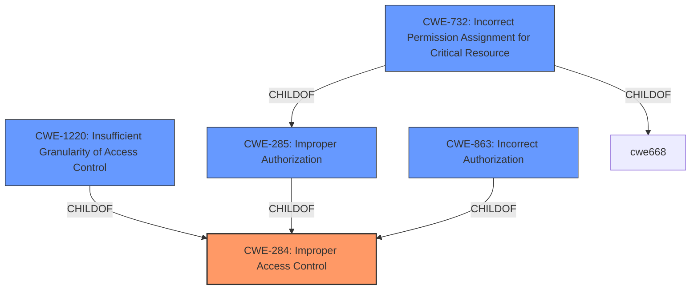

# Raw Analyzer Response for CVE-2020-4107

# Summary
| CWE ID | CWE Name | Confidence | CWE Abstraction Level | CWE Vulnerability Mapping Label | CWE-Vulnerability Mapping Notes |
|---|---|---|---|---|---|
| CWE-284 | Improper Access Control | 0.8 | Pillar | Discouraged | The description explicitly mentions "**insufficient access control**" as the **rootcause**, making this a relevant but high-level starting point. Discouraged per mapping guidance, but useful to start the analysis. |
| CWE-1220 | Insufficient Granularity of Access Control | 0.7 | Base | Allowed | More specific than CWE-284, focusing on the granularity of access control mechanisms. |
| CWE-285 | Improper Authorization | 0.6 | Class | Discouraged | The vulnerability occurs because the product does not perform or incorrectly performs an authorization check. |
| CWE-863 | Incorrect Authorization | 0.6 | Class | Allowed-with-Review | The product performs an authorization check, but the check is performed incorrectly. |
| CWE-732 | Incorrect Permission Assignment for Critical Resource | 0.5 | Class | Allowed-with-Review | The product specifies permissions for a security-critical resource in a way that allows that resource to be read or modified by unintended actors. |

## Evidence and Confidence

*   **Confidence Score:** 0.7
*   **Evidence Strength:** MEDIUM

## Relationship Analysis
The primary relationship is that CWE-284 is a high-level Pillar, and the other CWEs are more specific classifications that fall under the umbrella of "improper access control." CWE-1220 and CWE-782 are at the Base and Variant level respectively, making them preferable if the evidence supports them. CWE-285 and CWE-863 are children of CWE-284 and represent different types of authorization issues. The relationships influenced the decision to start with the broad CWE-284 and then consider more specific alternatives.

## Vulnerability Chain
The vulnerability chain starts with **insufficient access control** (**rootcause**), leading to the impact of escalation of privileges, denial of service, and information disclosure.

Insufficient Access Control -> Escalation of Privileges / Denial of Service / Information Disclosure

## Summary of Analysis
The initial analysis identified CWE-284 as a potential candidate due to the "**insufficient access control**" **rootcause** mentioned in the vulnerability description. However, CWE-284 is a high-level Pillar, and the mapping guidance discourages its use, recommending more specific descendants. The other candidates, such as CWE-1220, CWE-285, CWE-863 and CWE-732 are all children of CWE-284, making them more appropriate if the evidence supports them.

The vulnerability description states: "An authenticated attacker with local access to the system could exploit this vulnerability to attain escalation of privileges, denial of service, or information disclosure." This suggests that the access control mechanisms are either missing, incorrect, or not granular enough. The explicit mention of "**insufficient access control**" as the **rootcause** provides enough evidence to map to CWE-284 as the starting point, with the understanding that it is a high-level classification.

The selection of CWE-284 is influenced by the explicit mention of "**insufficient access control**" in the vulnerability description. While ideally a more specific CWE would be chosen, the lack of detailed information about the specific type of access control issue makes it difficult to select a lower-level CWE with high confidence. Therefore, CWE-284 is selected as a starting point.
CWE-1220, CWE-285, CWE-863, and CWE-732 are considered as more specific possibilities.

Relevant CWE Information:

# Enhanced Context (25 CWEs)

## CWE-782: Exposed IOCTL with Insufficient Access Control
**Abstraction Level**: Variant
**Similarity Score**: 0.79
**Source**: dense

**Description**:
The product implements an IOCTL with functionality that should be restricted, but it does not properly enforce access control for the IOCTL.

**Mapping Guidance**:
- Usage: Allowed
- Rationale: This CWE entry is at the Variant level of abstraction, which is a preferred level of abstraction for mapping to the root causes of vulnerabilities.

## CWE-1220: Insufficient Granularity of Access Control
**Abstraction Level**: Base
**Similarity Score**: 0.76
**Source**: dense

**Description**:
The product implements access controls via a policy or other feature with the intention to disable or restrict accesses (reads and/or writes) to assets in a system from untrusted agents. However, implemented access controls lack required granularity, which renders the control policy too broad because it allows accesses from unauthorized agents to the security-sensitive assets.

**Mapping Guidance**:
- Usage: Allowed
- Rationale: This CWE entry is at the Base level of abstraction, which is a preferred level of abstraction for mapping to the root causes of vulnerabilities.
CWE-1220 is potentially a good fit because the **rootcause** is the **insufficient access control**.
- This CWE could be the most appropriate one.

## CWE-285: Improper Authorization
**Abstraction Level**: Class
**Similarity Score**: 0.77
**Source**: dense

**Description**:
The product does not perform or incorrectly performs an authorization check when an actor attempts to access a resource or perform an action.

**Mapping Guidance**:
- Usage: Discouraged
- Rationale: CWE-285 is high-level and lower-level CWEs can frequently be used instead. It is a level-1 Class (i.e., a child of a Pillar).
- Considered due to the **insufficient access control**.

## CWE-863: Incorrect Authorization
**Abstraction Level**: Class
**Similarity Score**: 7275.84
**Source**: sparse

**Description**:
The product performs an authorization check when an actor attempts to access a resource or perform an action, but it does not correctly perform the check.

**Mapping Guidance**:
- Usage: Allowed-with-Review
- Rationale: This CWE entry is a Class and might have Base-level children that would be more appropriate
- Considered due to the **insufficient access control**.

## CWE-732: Incorrect Permission Assignment for Critical Resource
**Abstraction Level**: Class
**Similarity Score**: 0.76
**Source**: dense

**Description**:
The product specifies permissions for a security-critical resource in a way that allows that resource to be read or modified by unintended actors.

**Mapping Guidance**:
- Usage: Allowed-with-Review
- Rationale: While the name itself indicates an assignment of permissions for resources, this is often misused for vulnerabilities in which "permissions" are not checked, which is an "authorization" weakness (CWE-285 or descendants) within CWE's model.
- Considered due to the **insufficient access control**.

## CWE-782: Exposed IOCTL with Insufficient Access Control
**Abstraction Level**: Variant
**Similarity Score**: 0.79
**Source**: dense

**Description**:
The product implements an IOCTL with functionality that should be restricted, but it does not properly enforce access control for the IOCTL.
- Cannot be supported due to lack of information about IOCTL in the description.

While CWE-284 is too general, it captures the essence of the **rootcause**. It is at the Pillar level of abstraction, and its usage is discouraged, but it serves as a starting point due to the explicit mention of "**insufficient access control**" in the vulnerability description. A more specific CWE would be preferred if more details were available.
CWE-1220 might be a better fit, given the **insufficient access control**, but it isn't clear whether the access control lack required granularity.

In conclusion, the selection is primarily based on the available evidence, which points to "**insufficient access control**". While the ideal scenario would involve a more detailed analysis leading to a more specific CWE,