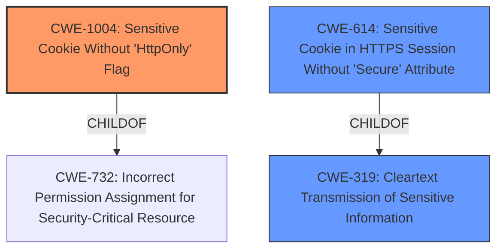

# Analysis for CVE-2020-4146

# Summary
| CWE ID    | CWE Name                                            | Confidence | CWE Abstraction Level | CWE Vulnerability Mapping Label | CWE-Vulnerability Mapping Notes |
| :-------- | :-------------------------------------------------- | :--------- | :-------------------- | :------------------------------ | :------------------------------ |
| CWE-1004 | Sensitive Cookie Without 'HttpOnly' Flag           | 1.0        | Variant               | Allowed                         | Primary CWE                     |
| CWE-614   | Sensitive Cookie in HTTPS Session Without 'Secure' Attribute | 0.7       | Variant               | Allowed                         | Secondary Candidate             |
| CWE-319   | Cleartext Transmission of Sensitive Information   | 0.6       | Base                  | Allowed                         | Secondary Candidate             |

## Evidence and Confidence

*   **Confidence Score:** 0.9
*   **Evidence Strength:** HIGH

## Relationship Analysis
The primary CWE, CWE-1004 (Sensitive Cookie Without 'HttpOnly' Flag), is a variant-level CWE and a child of CWE-732. This hierarchical relationship indicates that CWE-1004 is a specific type of weakness related to insecure handling of cookies. CWE-614 (Sensitive Cookie in HTTPS Session Without 'Secure' Attribute) is another Variant level CWE related to transmission of sensitive data over HTTPS. CWE-319 (Cleartext Transmission of Sensitive Information) is a Base level CWE that is a parent of CWE-614. The choice of CWE-1004 as primary is because the vulnerability description explicitly mentions the **missing HttpOnly flag**, directly aligning with CWE-1004's definition.

## Vulnerability Chain
The vulnerability chain involves a **missing HttpOnly flag** (CWE-1004) leading to potential exposure of sensitive cookie data, which can then be exploited by a remote attacker to obtain sensitive information.

## Summary of Analysis
The initial assessment focused on the **missing HttpOnly flag** as the root cause. The Retriever Results highlighted CWE-1004 (Sensitive Cookie Without 'HttpOnly' Flag) as the top candidate, aligning perfectly with the vulnerability description.

The evidence supporting this decision is the explicit mention of the **missing HttpOnly flag** in the "Vulnerability Description Key Phrases." This directly corresponds to the definition of CWE-1004.

The graph relationships helped contextualize the vulnerability within a broader scope of cookie security and data transmission issues.

The selection of CWE-1004 is at the optimal level of specificity because it directly addresses the **missing HttpOnly flag**, which is the core weakness exploited in this vulnerability.