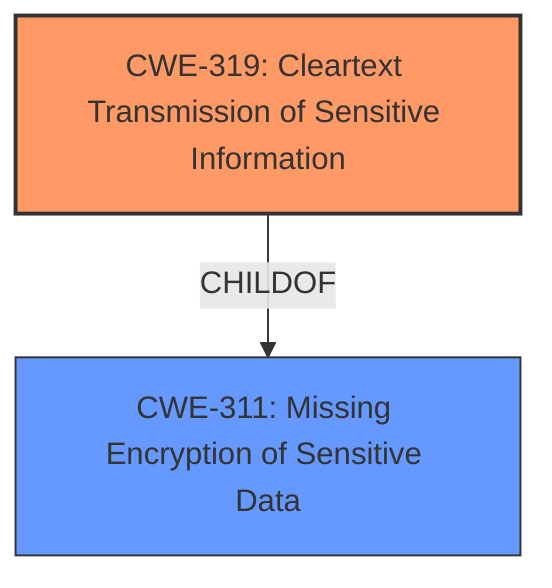

# Analysis for CVE-2020-4160

# Summary
| CWE ID  | CWE Name                                                        | Confidence | CWE Abstraction Level | CWE Vulnerability Mapping Label | CWE-Vulnerability Mapping Notes |
| :-------- | :-------------------------------------------------------------- | :--------- | :---------------------- | :------------------------------ | :------------------------------ |
| CWE-319   | Cleartext Transmission of Sensitive Information                 | 0.9        | Base                    | Primary                         | Allowed                       |

## Evidence and Confidence

*   **Confidence Score:** 0.9
*   **Evidence Strength:** HIGH

## Relationship Analysis
The primary relationship considered was the ChildOf relationship, specifically CWE-319 being a child of CWE-311 (Missing Encryption of Sensitive Data). The analysis focused on the cleartext transmission aspect, making CWE-319 the more fitting choice. Other relationships, such as those involving timing discrepancies or authentication, were not directly relevant to the described vulnerability.



## Vulnerability Chain
The vulnerability chain starts with the **failure to properly enable HTTP Strict Transport Security (HSTS)**, leading to the potential for **cleartext transmission of sensitive information**, which can then be exploited by an attacker using man-in-the-middle techniques to **obtain sensitive information**.

## Summary of Analysis
The initial analysis identified CWE-319 as the most relevant CWE based on the vulnerability description. The **failure to properly enable HTTP Strict Transport Security** directly leads to the possibility of transmitting sensitive information in cleartext. The description explicitly mentions that an attacker could "obtain sensitive information" using man-in-the-middle techniques, which aligns with the impact of CWE-319.

The provided evidence strongly supports this classification:
*   The "Vulnerability Description Key Phrases" section highlights the "**failure to properly enable HTTP Strict Transport Security**" as the root cause and "obtain sensitive information" as the impact.
*   The "CVE Reference Links Content Summary" section indicates that the document doesn't specify the root cause but this is incorrect because it is specified in the Vulnerability Description Key Phrases.

The retriever results also list CWE-319 with a high similarity score.

The selection of CWE-319 is at the optimal level of specificity, as it directly addresses the cleartext transmission aspect of the vulnerability.

Relevant CWE Information:

# Enhanced Context (25 CWEs)
The following CWEs were identified as potentially relevant to this vulnerability:

## CWE-703: Improper Check or Handling of Exceptional Conditions
**Abstraction Level**: Pillar
**Similarity Score**: 0.77
**Source**: dense

**Description**:
The product does not properly anticipate or handle exceptional conditions that rarely occur during normal operation of the product.

**Mapping Guidance**:
- Usage: Discouraged
- Rationale: This CWE entry is extremely high-level, a Pillar.

## CWE-203: Observable Discrepancy
**Abstraction Level**: Base
**Similarity Score**: 0.77
**Source**: dense

**Description**:
The product behaves differently or sends different responses under different circumstances in a way that is observable to an unauthorized actor, which exposes security-relevant information about the state of the product, such as whether a particular operation was successful or not.

**Mapping Guidance**:
- Usage: Allowed
- Rationale: This CWE entry is at the Base level of abstraction, which is a preferred level of abstraction for mapping to the root causes of vulnerabilities.

## CWE-345: Insufficient Verification of Data Authenticity
**Abstraction Level**: Class
**Similarity Score**: 0.77
**Source**: dense

**Description**:
The product does not sufficiently verify the origin or authenticity of data, in a way that causes it to accept invalid data.

**Mapping Guidance**:
- Usage: Discouraged
- Rationale: This CWE entry is a level-1 Class (i.e., a child of a Pillar). It might have lower-level children that would be more appropriate

## CWE-754: Improper Check for Unusual or Exceptional Conditions
**Abstraction Level**: Class
**Similarity Score**: 0.77
**Source**: dense

**Description**:
The product does not check or incorrectly checks for unusual or exceptional conditions that are not expected to occur frequently during day to day operation of the product.

**Mapping Guidance**:
- Usage: Allowed-with-Review
- Rationale: This CWE entry is a Class and might have Base-level children that would be more appropriate

## CWE-668: Exposure of Resource to Wrong Sphere
**Abstraction Level**: Class
**Similarity Score**: 0.76
**Source**: dense

**Description**:
The product exposes a resource to the wrong control sphere, providing unintended actors with inappropriate access to the resource.

**Mapping Guidance**:
- Usage: Discouraged
- Rationale: CWE-668 is high-level and is often misused as a catch-all when lower-level CWE IDs might be applicable. It is sometimes used for low-information vulnerability reports [REF-1287]. It is a level-1 Class (i.e., a child of a Pillar). It is not useful for trend analysis.

## CWE-319: Cleartext Transmission of Sensitive Information
**Abstraction Level**: Base
**Similarity Score**: 0.76
**Source**: dense

**Description**:
The product transmits sensitive or security-critical data in cleartext in a communication channel that can be sniffed by unauthorized actors.

**Mapping Guidance**:
- Usage: Allowed
- Rationale: This CWE entry is at the Base level of abstraction, which is a preferred level of abstraction for mapping to the root causes of vulnerabilities.

## CWE-1391: Use of Weak Credentials
**Abstraction Level**: Class
**Similarity Score**: 0.76
**Source**: dense

**Description**:
The product uses weak credentials (such as a default key or hard-coded password) that can be calculated, derived, reused, or guessed by an attacker.

**Mapping Guidance**:
- Usage: Allowed-with-Review
- Rationale: This CWE entry is a Class and might have Base-level children that would be more appropriate

## CWE-755: Improper Handling of Exceptional Conditions
**Abstraction Level**: Class
**Similarity Score**: 0.76
**Source**: dense

**Description**:
The product does not handle or incorrectly handles an exceptional condition.

**Mapping Guidance**:
- Usage: Discouraged
- Rationale: This CWE entry is a level-1 Class (i.e., a child of a Pillar). It might have lower-level children that would be more appropriate

## CWE-212: Improper Removal of Sensitive Information Before Storage or Transfer
**Abstraction Level**: Base
**Similarity Score**: 0.75
**Source**: dense

**Description**:
The product stores, transfers, or shares a resource that contains sensitive information, but it does not properly remove that information before the product makes the resource available to unauthorized actors.

**Mapping Guidance**:
- Usage: Allowed
- Rationale: This CWE entry is at the Base level of abstraction, which is a preferred level of abstraction for mapping to the root causes of vulnerabilities.

## CWE-807: Reliance on Untrusted Inputs in a Security Decision
**Abstraction Level**: Base
**Similarity Score**: 0.75
**Source**: dense

**Description**:
The product uses a protection mechanism that relies on the existence or values of an input, but the input can be modified by an untrusted actor in a way that bypasses the protection mechanism.

**Mapping Guidance**:
- Usage: Allowed
- Rationale: This CWE entry is at the Base level of abstraction, which is a preferred level of abstraction for mapping to the root causes of vulnerabilities.

## CWE-319: Cleartext Transmission of Sensitive Information
**Abstraction Level**: Base
**Similarity Score**: 5288.08
**Source**: sparse

**Description**:
The product transmits sensitive or security-critical data in cleartext in a communication channel that can be sniffed by unauthorized actors.

**Mapping Guidance**:
- Usage: Allowed
- Rationale: This CWE entry is at the Base level of abstraction, which is a preferred level of abstraction for mapping to the root causes of vulnerabilities.

## CWE-327: Use of a Broken or Risky Cryptographic Algorithm
**Abstraction Level**: Class
**Similarity Score**: 5233.76
**Source**: sparse

**Description**:
The product uses a broken or risky cryptographic algorithm or protocol.

**Mapping Guidance**:
- Usage: Allowed-with-Review
- Rationale: This CWE entry is a Class and might have Base-level children that would be more appropriate

## CWE-203: Observable Discrepancy
**Abstraction Level**: Base
**Similarity Score**: 5045.38
**Source**: sparse

**Description**:
The product behaves differently or sends different responses under different circumstances in a way that is observable to an

# Enhanced Query for CVE-2020-4160

## Vulnerability Description
IBM QRadar Network Security 5.4.0 and 5.5.0 could allow a remote attacker to obtain sensitive information, caused by the **failure to properly enable HTTP Strict Transport Security**. An attacker could exploit this vulnerability to obtain sensitive information using man in the middle techniques. IBM X-Force ID 174340.

### Vulnerability Description Key Phrases
- **rootcause:** **failure to properly enable HTTP Strict Transport Security**
- **impact:** obtain sensitive information
- **vector:** man in the middle techniques
- **attacker:** remote attacker
- **product:** IBM QRadar Network Security
- **version:** 5.4.0 and 5.5.0

## CVE Reference Links Content Summary
```
{
  "vulnerability_details": {
    "root_cause": "The provided document does not specify the root cause of the vulnerability, only that it exists in IBM QRadar Network Security.",
    "weaknesses": "The document mentions multiple vulnerabilities affecting IBM QRadar Network Security but doesn't detail the specific weaknesses for CVE-2020-4160.",
    "impact": "The document doesn't specify the impact. It only notes the existence of vulnerabilities without elaborating on exploitation scenarios or potential damage.",
    "attack_vectors": "The document does not specify the attack vectors for the vulnerability.",
    "attacker_capabilities": "The document does not specify the attacker capabilities for the vulnerability."
  },
    "affected_products": [
    {
      "product": "IBM QRadar Network Security",
      "versions": ["5.4.0", "5.5.0"]
    }
  ],
  "remediation": "Firmware updates are available for versions 5.4.0 and 5.5.0",
  "workarounds": "None",
  "cvss_environment_score_note": "The CVSS Environment Score is customer environment specific and will ultimately impact the Overall CVSS Score. Customers can evaluate the impact of this vulnerability in their environments by accessing the links in the Reference section of this Security Bulletin."
}
```

## Retriever Results

### Top Combined Results

| Rank | CWE ID | Name | Abstraction | Usage  | Retrievers | Individual Scores |
|------|--------|------|-------------|-------|------------|-------------------|
| 1 | 319 | Cleartext Transmission of Sensitive Information | Base | Allowed | sparse | 0.507 |
| 2 | 300 | Channel Accessible by Non-Endpoint | Class | Discouraged | sparse | 0.475 |
| 3 | 322 | Key Exchange without Entity Authentication | Base | Allowed | sparse | 0.364 |
| 4 | 1004 | Sensitive Cookie Without 'HttpOnly' Flag | Variant | Allowed | sparse | 0.346 |
| 5 | 326 | Inadequate Encryption Strength | Class | Allowed-with-Review | sparse | 0.343 |
| 6 | 327 | Use of a Broken or Risky Cryptographic Algorithm | Class | Allowed-with-Review | dense | 0.567 |
| 7 | 208 | Observable Timing Discrepancy | Base | Allowed | graph | 0.003 |
| 8 | 522 | Insufficiently Protected Credentials | Class | Allowed-with-Review | sparse | 0.324 |
| 9 | 614 | Sensitive Cookie in HTTPS Session Without 'Secure' Attribute | Variant | Allowed | sparse | 0.323 |
| 10 | 248 | Uncaught Exception | Base | Allowed | sparse | 0.308 |


# Complete CWE Specifications


## CWE-319: Cleartext Transmission of Sensitive Information
**Abstraction:** Base
**Status:** Draft

### Description
The product transmits sensitive or security-critical data in cleartext in a communication channel that can be sniffed by unauthorized actors.

### Extended Description


Many communication channels can be "sniffed" (monitored) by adversaries during data transmission. For example, in networking, packets can traverse many intermediary nodes from the source to the destination, whether across the internet, an internal network, the cloud, etc. Some actors might have privileged access to a network interface or any link along the channel, such as a router, but they might not be authorized to collect the underlying data. As a result, network traffic could be sniffed by adversaries, spilling security-critical data.


Applicable communication channels are not limited to software products. Applicable channels include hardware-specific technologies such as internal hardware networks and external debug channels, supporting remote JTAG debugging. When mitigations are not applied to combat adversaries within the product's threat model, this weakness significantly lowers the difficulty of exploitation by such adversaries.


When full communications are recorded or logged, such as with a packet dump, an adversary could attempt to obtain the dump long after the transmission has occurred and try to "sniff" the cleartext from the recorded communications in the dump itself. Even if the information is encoded in a way that is not human-readable, certain techniques could determine which encoding is being used, then decode the information. 


### Alternative Terms
None

### Relationships
ChildOf -> CWE-311
ChildOf -> CWE-311

### Mapping Guidance
**Usage:** Allowed
**Rationale:** This CWE entry is at the Base level of abstraction, which is a preferred level of abstraction for mapping to the root causes of vulnerabilities.
**Comments:** Carefully read both the name and description to ensure that this mapping is an appropriate fit. Do not try to 'force' a mapping to a lower-level Base/Variant simply to comply with this preferred level of abstraction.
**Reasons:**
- Acceptable-Use


### Additional Notes
**[Maintenance]** The Taxonomy_Mappings to ISA/IEC 62443 were added in CWE 4.10, but they are still under review and might change in future CWE versions. These draft mappings were performed by members of the "Mapping CWE to 62443" subgroup of the CWE-CAPEC ICS/OT Special Interest Group (SIG), and their work is incomplete as of CWE 4.10. The mappings are included to facilitate discussion and review by the broader ICS/OT community, and they are likely to change in future CWE versions.


### Observed Examples
- **CVE-2022-29519:** Programmable Logic Controller (PLC) sends sensitive information in plaintext, including passwords and session tokens.
- **CVE-2022-30312:** Building Controller uses a protocol that transmits authentication credentials in plaintext.
- **CVE-2022-31204:** Programmable Logic Controller (PLC) sends password in plaintext.


## CWE-300: Channel Accessible by Non-Endpoint
**Abstraction:** Class
**Status:** Draft

### Description
The product does not adequately verify the identity of actors at both ends of a communication channel, or does not adequately ensure the integrity of the channel, in a way that allows the channel to be accessed or influenced by an actor that is not an endpoint.

### Extended Description
In order to establish secure communication between two parties, it is often important to adequately verify the identity of entities at each end of the communication channel. Inadequate or inconsistent verification may result in insufficient or incorrect identification of either communicating entity. This can have negative consequences such as misplaced trust in the entity at the other end of the channel. An attacker can leverage this by interposing between the communicating entities and masquerading as the original entity. In the absence of sufficient verification of identity, such an attacker can eavesdrop and potentially modify the communication between the original entities.

### Alternative Terms
Adversary-in-the-Middle / AITM
Man-in-the-Middle / MITM
Person-in-the-Middle / PITM
Monkey-in-the-Middle
Monster-in-the-Middle
Manipulator-in-the-Middle
On-path attack
Interception attack

### Relationships
ChildOf -> CWE-923

### Mapping Guidance
**Usage:** Discouraged
**Rationale:** CWE-300 is commonly misused for vulnerabilities in which the prerequisites for exploitation require the adversary to be in a privileged "in-the-middle" position.
**Comments:** Consider root-cause weaknesses that allow adversary-in-the-middle attacks to happen, such as CWEs involving poor integrity protection.
**Reasons:**
- Frequent Misuse


### Additional Notes
**[Maintenance]** The summary identifies multiple distinct possibilities, suggesting that this is a category that must be broken into more specific weaknesses.


### Observed Examples
- **CVE-2014-1266:** chain: incorrect "goto" in Apple SSL product bypasses certificate validation, allowing Adversry-in-the-Middle (AITM) attack (Apple "goto fail" bug). CWE-705 (Incorrect Control Flow Scoping) -> CWE-561 (Dead Code) -> CWE-295 (Improper Certificate Validation) -> CWE-393 (Return of Wrong Status Code) -> CWE-300 (Channel Accessible by Non-Endpoint).


## CWE-322: Key Exchange without Entity Authentication
**Abstraction:** Base
**Status:** Draft

### Description
The product performs a key exchange with an actor without verifying the identity of that actor.

### Extended Description
Performing a key exchange will preserve the integrity of the information sent between two entities, but this will not guarantee that the entities are who they claim they are. This may enable an attacker to impersonate an actor by modifying traffic between the two entities. Typically, this involves a victim client that contacts a malicious server that is impersonating a trusted server. If the client skips authentication or ignores an authentication failure, the malicious server may request authentication information from the user. The malicious server can then use this authentication information to log in to the trusted server using the victim's credentials, sniff traffic between the victim and trusted server, etc.

### Alternative Terms
None

### Relationships
ChildOf -> CWE-306
CanPrecede -> CWE-923
PeerOf -> CWE-295

### Mapping Guidance
**Usage:** Allowed
**Rationale:** This CWE entry is at the Base level of abstraction, which is a preferred level of abstraction for mapping to the root causes of vulnerabilities.
**Comments:** Carefully read both the name and description to ensure that this mapping is an appropriate fit. Do not try to 'force' a mapping to a lower-level Base/Variant simply to comply with this preferred level of abstraction.
**Reasons:**
- Acceptable-Use


## CWE-1004: Sensitive Cookie Without 'HttpOnly' Flag
**Abstraction:** Variant
**Status:** Incomplete

### Description
The product uses a cookie to store sensitive information, but the cookie is not marked with the HttpOnly flag.

### Extended Description
The HttpOnly flag directs compatible browsers to prevent client-side script from accessing cookies. Including the HttpOnly flag in the Set-Cookie HTTP response header helps mitigate the risk associated with Cross-Site Scripting (XSS) where an attacker's script code might attempt to read the contents of a cookie and exfiltrate information obtained. When set, browsers that support the flag will not reveal the contents of the cookie to a third party via client-side script executed via XSS.

### Alternative Terms
None

### Relationships
ChildOf -> CWE-732

### Mapping Guidance
**Usage:** Allowed
**Rationale:** This CWE entry is at the Variant level of abstraction, which is a preferred level of abstraction for mapping to the root causes of vulnerabilities.
**Comments:** Carefully read both the name and description to ensure that this mapping is an appropriate fit. Do not try to 'force' a mapping to a lower-level Base/Variant simply to comply with this preferred level of abstraction.
**Reasons:**
- Acceptable-Use


### Observed Examples
- **CVE-2022-24045:** Web application for a room automation system has client-side Javascript that sets a sensitive cookie without the HTTPOnly security attribute, allowing the cookie to be accessed.
- **CVE-2014-3852:** CMS written in Python does not include the HTTPOnly flag in a Set-Cookie header, allowing remote attackers to obtain potentially sensitive information via script access to this cookie.
- **CVE-2015-4138:** Appliance for managing encrypted communications does not use HttpOnly flag.


## CWE-326: Inadequate Encryption Strength
**Abstraction:** Class
**Status:** Draft

### Description
The product stores or transmits sensitive data using an encryption scheme that is theoretically sound, but is not strong enough for the level of protection required.

### Extended Description
A weak encryption scheme can be subjected to brute force attacks that have a reasonable chance of succeeding using current attack methods and resources.

### Alternative Terms
None

### Relationships
ChildOf -> CWE-693

### Mapping Guidance
**Usage:** Allowed-with-Review
**Rationale:** This CWE entry is a Class and might have Base-level children that would be more appropriate
**Comments:** Examine children of this entry to see if there is a better fit
**Reasons:**
- Abstraction


### Observed Examples
- **CVE-2001-1546:** Weak encryption
- **CVE-2004-2172:** Weak encryption (chosen plaintext attack)
- **CVE-2002-1682:** Weak encryption


## CWE-327: Use of a Broken or Risky Cryptographic Algorithm
**Abstraction:** Class
**Status:** Draft

### Description
The product uses a broken or risky cryptographic algorithm or protocol.

### Extended Description


Cryptographic algorithms are the methods by which data is scrambled to prevent observation or influence by unauthorized actors. Insecure cryptography can be exploited to expose sensitive information, modify data in unexpected ways, spoof identities of other users or devices, or other impacts.


It is very difficult to produce a secure algorithm, and even high-profile algorithms by accomplished cryptographic experts have been broken. Well-known techniques exist to break or weaken various kinds of cryptography. Accordingly, there are a small number of well-understood and heavily studied algorithms that should be used by most products. Using a non-standard or known-insecure algorithm is dangerous because a determined adversary may be able to break the algorithm and compromise whatever data has been protected.


Since the state of cryptography advances so rapidly, it is common for an algorithm to be considered "unsafe" even if it was once thought to be strong. This can happen when new attacks are discovered, or if computing power increases so much that the cryptographic algorithm no longer provides the amount of protection that was originally thought.


For a number of reasons, this weakness is even more challenging to manage with hardware deployment of cryptographic algorithms as opposed to software implementation. First, if a flaw is discovered with hardware-implemented cryptography, the flaw cannot be fixed in most cases without a recall of the product, because hardware is not easily replaceable like software. Second, because the hardware product is expected to work for years, the adversary's computing power will only increase over time.


### Alternative Terms
None

### Relationships
ChildOf -> CWE-693
PeerOf -> CWE-311

### Mapping Guidance
**Usage:** Allowed-with-Review
**Rationale:** This CWE entry is a Class and might have Base-level children that would be more appropriate
**Comments:** Examine children of this entry to see if there is a better fit
**Reasons:**
- Abstraction


### Additional Notes
**[Maintenance]** Since CWE 4.4, various cryptography-related entries, including CWE-327 and CWE-1240, have been slated for extensive research, analysis, and community consultation to define consistent terminology, improve relationships, and reduce overlap or duplication. As of CWE 4.6, this work is still ongoing.

**[Maintenance]** The Taxonomy_Mappings to ISA/IEC 62443 were added in CWE 4.10, but they are still under review and might change in future CWE versions. These draft mappings were performed by members of the "Mapping CWE to 62443" subgroup of the CWE-CAPEC ICS/OT Special Interest Group (SIG), and their work is incomplete as of CWE 4.10. The mappings are included to facilitate discussion and review by the broader ICS/OT community, and they are likely to change in future CWE versions.


### Observed Examples
- **CVE-2022-30273:** SCADA-based protocol supports a legacy encryption mode that uses Tiny Encryption Algorithm (TEA) in ECB mode, which leaks patterns in messages and cannot protect integrity
- **CVE-2022-30320:** Programmable Logic Controller (PLC) uses a protocol with a cryptographically insecure hashing algorithm for passwords.
- **CVE-2008-3775:** Product uses "ROT-25" to obfuscate the password in the registry.


## CWE-208: Observable Timing Discrepancy
**Abstraction:** Base
**Status:** Incomplete

### Description
Two separate operations in a product require different amounts of time to complete, in a way that is observable to an actor and reveals security-relevant information about the state of the product, such as whether a particular operation was successful or not.

### Extended Description
In security-relevant contexts, even small variations in timing can be exploited by attackers to indirectly infer certain details about the product's internal operations. For example, in some cryptographic algorithms, attackers can use timing differences to infer certain properties about a private key, making the key easier to guess. Timing discrepancies effectively form a timing side channel.

### Alternative Terms
None

### Relationships
ChildOf -> CWE-203
CanPrecede -> CWE-385
CanPrecede -> CWE-327

### Mapping Guidance
**Usage:** Allowed
**Rationale:** This CWE entry is at the Base level of abstraction, which is a preferred level of abstraction for mapping to the root causes of vulnerabilities.
**Comments:** Carefully read both the name and description to ensure that this mapping is an appropriate fit. Do not try to 'force' a mapping to a lower-level Base/Variant simply to comply with this preferred level of abstraction.
**Reasons:**
- Acceptable-Use


### Additional Notes
**[Relationship]** Often primary in cryptographic applications and algorithms.

**[Maintenance]** CWE 4.16 removed a demonstrative example for a hardware module because it was inaccurate and unable to be adapted. The CWE team is developing an alternative.


### Observed Examples
- **CVE-2019-10071:** Java-oriented framework compares HMAC signatures using String.equals() instead of a constant-time algorithm, causing timing discrepancies
- **CVE-2019-10482:** Smartphone OS uses comparison functions that are not in constant time, allowing side channels
- **CVE-2014-0984:** Password-checking function in router terminates validation of a password entry when it encounters the first incorrect character, which allows remote attackers to obtain passwords via a brute-force attack that relies on timing differences in responses to incorrect password guesses, aka a timing side-channel attack.


## CWE-522: Insufficiently Protected Credentials
**Abstraction:** Class
**Status:** Incomplete

### Description
The product transmits or stores authentication credentials, but it uses an insecure method that is susceptible to unauthorized interception and/or retrieval.

### Extended Description
Not provided

### Alternative Terms
None

### Relationships
ChildOf -> CWE-1390
ChildOf -> CWE-287
ChildOf -> CWE-668

### Mapping Guidance
**Usage:** Allowed-with-Review
**Rationale:** This CWE entry is a Class and might have Base-level children that would be more appropriate
**Comments:** Examine children of this entry to see if there is a better fit
**Reasons:**
- Abstraction


### Observed Examples
- **CVE-2022-30018:** A messaging platform serializes all elements of User/Group objects, making private information available to adversaries
- **CVE-2022-29959:** Initialization file contains credentials that can be decoded using a "simple string transformation"
- **CVE-2022-35411:** Python-based RPC framework enables pickle functionality by default, allowing clients to unpickle untrusted data.


## CWE-614: Sensitive Cookie in HTTPS Session Without 'Secure' Attribute
**Abstraction:** Variant
**Status:** Draft

### Description
The Secure attribute for sensitive cookies in HTTPS sessions is not set, which could cause the user agent to send those cookies in plaintext over an HTTP session.

### Extended Description
Not provided

### Alternative Terms
None

### Relationships
ChildOf -> CWE-319

### Mapping Guidance
**Usage:** Allowed
**Rationale:** This CWE entry is at the Variant level of abstraction, which is a preferred level of abstraction for mapping to the root causes of vulnerabilities.
**Comments:** Carefully read both the name and description to ensure that this mapping is an appropriate fit. Do not try to 'force' a mapping to a lower-level Base/Variant simply to comply with this preferred level of abstraction.
**Reasons:**
- Acceptable-Use


### Observed Examples
- **CVE-2004-0462:** A product does not set the Secure attribute for sensitive cookies in HTTPS sessions, which could cause the user agent to send those cookies in plaintext over an HTTP session with the product.
- **CVE-2008-3663:** A product does not set the secure flag for the session cookie in an https session, which can cause the cookie to be sent in http requests and make it easier for remote attackers to capture this cookie.
- **CVE-2008-3662:** A product does not set the secure flag for the session cookie in an https session, which can cause the cookie to be sent in http requests and make it easier for remote attackers to capture this cookie.


## CWE-248: Uncaught Exception
**Abstraction:** Base
**Status:** Draft

### Description
An exception is thrown from a function, but it is not caught.

### Extended Description
When an exception is not caught, it may cause the program to crash or expose sensitive information.

### Alternative Terms
None

### Relationships
ChildOf -> CWE-705
ChildOf -> CWE-755
ChildOf -> CWE-703
ChildOf -> CWE-703

### Mapping Guidance
**Usage:** Allowed
**Rationale:** This CWE entry is at the Base level of abstraction, which is a preferred level of abstraction for mapping to the root causes of vulnerabilities.
**Comments:** Carefully read both the name and description to ensure that this mapping is an appropriate fit. Do not try to 'force' a mapping to a lower-level Base/Variant simply to comply with this preferred level of abstraction.
**Reasons:**
- Acceptable-Use


### Observed Examples
- **CVE-2023-41151:** SDK for OPC Unified Architecture (OPC UA) server has uncaught exception when a socket is blocked for writing but the server tries to send an error
- **CVE-2023-21087:** Java code in a smartphone OS can encounter a "boot loop" due to an uncaught exception

