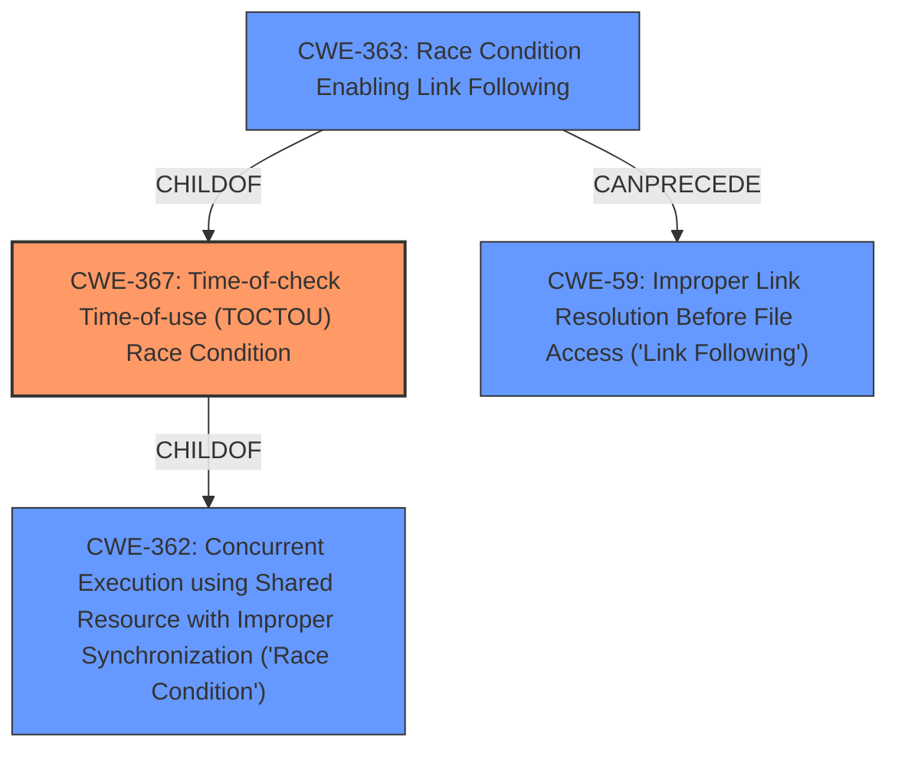

# Enhanced Analysis for CVE-2020-4386

# Summary
| CWE ID | CWE Name | Confidence | CWE Abstraction Level | CWE Vulnerability Mapping Label | CWE-Vulnerability Mapping Notes |
|---|---|---|---|---|---|
| CWE-367 | Time-of-check Time-of-use (TOCTOU) Race Condition | 0.9 | Base | Allowed | Primary CWE |
| CWE-59 | Improper Link Resolution Before File Access ('Link Following') | 0.7 | Base | Allowed | Secondary Candidate |
| CWE-362 | Concurrent Execution using Shared Resource with Improper Synchronization ('Race Condition') | 0.6 | Class | Allowed-with-Review | Secondary Candidate |

## Evidence and Confidence

*   **Confidence Score:** 0.8
*   **Evidence Strength:** HIGH

## Relationship Analysis
The primary CWE is CWE-367, a **Base** level weakness describing a Time-of-check Time-of-use (TOCTOU) Race Condition. This aligns well with the vulnerability description's mention of a **race condition** involving a symbolic link. CWE-367 is a child of CWE-362 (Race Condition), which represents a broader class of concurrency issues. CWE-363 (Race Condition Enabling Link Following) is a child of CWE-367 and can precede CWE-59 (Improper Link Resolution). CWE-59 is a **Base** level weakness that describes the improper handling of symbolic links, which is also present in the vulnerability.



## Vulnerability Chain
The vulnerability chain involves a **race condition** (CWE-367) in the handling of symbolic links, potentially leading to the ability to access sensitive information. The chain starts with the **race condition**, followed by the improper resolution of the symbolic link (CWE-59), which can lead to information disclosure.

## Summary of Analysis
The initial analysis correctly identified the presence of a **race condition** and symbolic link handling issues. The final assessment concludes that CWE-367 (Time-of-check Time-of-use Race Condition) is the most appropriate primary CWE because the vulnerability description explicitly mentions a **race condition** involving symbolic links. This is further supported by the "CVE Reference Links Content Summary" which states that the root cause is a **race condition** in how IBM Db2 handles symbolic links. CWE-59 is a closely related secondary CWE, because the **race condition** makes it possible to exploit the symbolic link handling vulnerability. CWE-362 is a more general class of **race condition**, so it is less specific than CWE-367.

Relevant CWE Information:

# Enhanced Context (25 CWEs)

## CWE-367: Time-of-check Time-of-use (TOCTOU) Race Condition
**Abstraction Level**: Base
**Similarity Score**: 0.81
**Source**: dense

**Description**:
The product checks the state of a resource before using that resource, but the resource's state can change between the check and the use in a way that invalidates the results of the check. This can cause the product to perform invalid actions when the resource is in an unexpected state.

**Mapping Guidance**:
- Usage: Allowed
- Rationale: This CWE entry is at the Base level of abstraction, which is a preferred level of abstraction for mapping to the root causes of vulnerabilities.

**Justification:** This is the primary weakness as it directly addresses the **race condition** issue described in the vulnerability.

## CWE-59: Improper Link Resolution Before File Access ('Link Following')
**Abstraction Level**: Base
**Similarity Score**: 0.77
**Source**: dense

**Description**:
The product attempts to access a file based on the filename, but it does not properly prevent that filename from identifying a link or shortcut that resolves to an unintended resource.

**Mapping Guidance**:
- Usage: Allowed
- Rationale: This CWE entry is at the Base level of abstraction, which is a preferred level of abstraction for mapping to the root causes of vulnerabilities.

**Justification:** This is a secondary weakness, because the **race condition** can lead to a failure to properly handle the symbolic link.

## CWE-362: Concurrent Execution using Shared Resource with Improper Synchronization ('Race Condition')
**Abstraction Level**: Class
**Similarity Score**: 0.78
**Source**: dense

**Description**:
The product contains a concurrent code sequence that requires temporary, exclusive access to a shared resource, but a timing window exists in which the shared resource can be modified by another code sequence operating concurrently.

**Mapping Guidance**:
- Usage: Allowed-with-Review
- Rationale: This CWE entry is a Class and might have Base-level children that would be more appropriate

**Justification:** This is a less specific weakness, since CWE-367 provides more specific details of the **race condition**.

## CWE-61: UNIX Symbolic Link (Symlink) Following
**Abstraction Level**: Compound
**Similarity Score**: 0.75
**Source**: dense

**Description**:
The product, when opening a file or directory, does not sufficiently account for when the file is a symbolic link that resolves to a target outside of the intended control sphere. This could allow an attacker to cause the product to operate on unauthorized files.

**Mapping Guidance**:
- Usage: Allowed
- Rationale: This is a well-known Composite of multiple weaknesses that must all occur simultaneously, although it is attack-oriented in nature.

**Justification:** While this CWE covers symbolic link issues, it doesn't focus on the **race condition** aspect, making CWE-367 and CWE-59 more appropriate.

CWE-732, CWE-269, CWE-476, CWE-209, and CWE-327 were not selected because they did not directly relate to the **race condition** and symbolic link handling described in the vulnerability.


## CWE Relationship Analysis

Current CWEs represent these abstraction levels: .


### Vulnerability Chain Analysis

**Chain starting from CWE-732:**
- 732 (Incorrect Permission Assignment for Critical Resource) - ROOT


**Chain starting from CWE-476:**
- 476 (NULL Pointer Dereference) - ROOT


### CWE Relationship Diagram

```mermaid
graph TD
    classDef primary fill:#f96,stroke:#333,stroke-width:2px
    classDef secondary fill:#69f,stroke:#333
    classDef tertiary fill:#9e9,stroke:#333
```