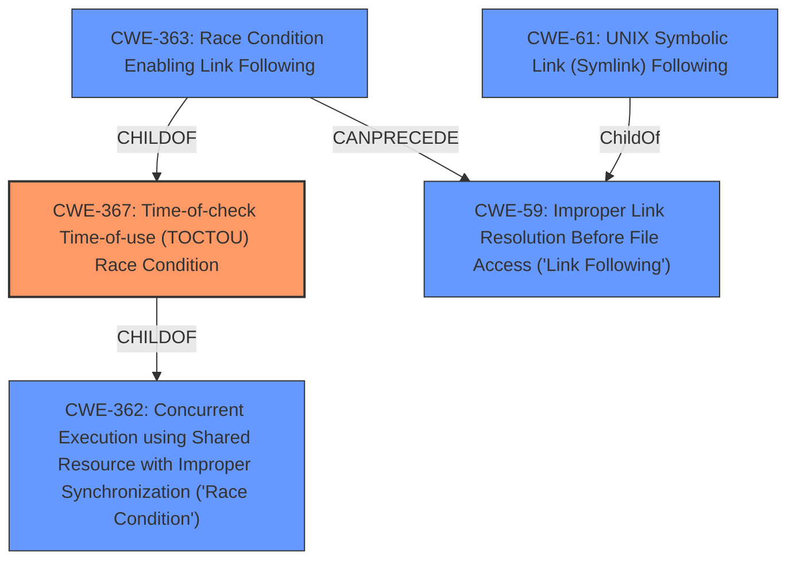

# Analysis Report for CVE-2020-4387

# Vulnerability Analysis Report: CVE-2020-4387

## Description


## Analysis (with Relationship Data)

# Summary

| CWE ID | CWE Name | Confidence | CWE Abstraction Level | CWE Vulnerability Mapping Label | CWE-Vulnerability Mapping Notes |
|---|---|---|---|---|---|
| CWE-367 | Time-of-check Time-of-use (TOCTOU) Race Condition | 0.9 | Base | Allowed | Primary CWE |
| CWE-59 | Improper Link Resolution Before File Access ('Link Following') | 0.7 | Base | Allowed | Secondary Candidate |
| CWE-61 | UNIX Symbolic Link (Symlink) Following | 0.6 | Compound | Allowed | Secondary Candidate |
| CWE-363 | Race Condition Enabling Link Following | 0.6 | Base | Allowed | Secondary Candidate |
| CWE-362 | Concurrent Execution using Shared Resource with Improper Synchronization ('Race Condition') | 0.5 | Class | Allowed-with-Review | Secondary Candidate |

## Evidence and Confidence

*   **Confidence Score:** 0.8
*   **Evidence Strength:** HIGH

## Relationship Analysis
The primary weakness is a Time-of-check Time-of-use (TOCTOU) race condition (CWE-367) which can lead to issues like improper link resolution (CWE-59) and symlink following (CWE-61), or Race Condition Enabling Link Following (CWE-363). CWE-362 is a parent class of CWE-367. Selecting CWE-367 provides a more specific base-level identification of the root cause, whereas CWE-362 is too general.



## Vulnerability Chain
The vulnerability chain starts with a **race condition of a symbolic link**. A local user exploits this to **obtain sensitive information**.
  - **Root Cause:** CWE-367 Time-of-check Time-of-use (TOCTOU) Race Condition
  - **Weakness:** CWE-59 Improper Link Resolution Before File Access ('Link Following') or CWE-61 UNIX Symbolic Link (Symlink) Following
  - **Impact:** Information Disclosure

## Summary of Analysis
The initial analysis indicated a **race condition of a symbolic link**. The primary focus was to identify the CWE that best represents this **race condition** and its relationship with symbolic links.

The vulnerability description explicitly mentions a **race condition of a symbolic link** which leads to sensitive information disclosure. The phrase "*race condition of a symbolic link*" is a direct quote from the "**Vulnerability Description Key Phrases**". The "**CVE Reference Links Content Summary**" also states the "*Root cause of vulnerability: A race condition involving a symbolic link could allow a local user to obtain sensitive information.*"

CWE-367 (Time-of-check Time-of-use (TOCTOU) Race Condition) is the most accurate representation of the **root cause**, as it describes a scenario where the state of a resource changes between the check and the use, leading to unexpected actions. The involvement of a symbolic link makes CWE-59 (Improper Link Resolution Before File Access ('Link Following')) and CWE-61 (UNIX Symbolic Link (Symlink) Following) relevant, since the **race condition** allows the symbolic link to be exploited. CWE-363 (Race Condition Enabling Link Following) is also relevant.

While CWE-362 (Concurrent Execution using Shared Resource with Improper Synchronization ('Race Condition')) could apply as a general case of a race condition, CWE-367 is more specific to the TOCTOU scenario described in the vulnerability.

The final selection of CWE-367 is at the optimal level of specificity (Base) and accurately represents the root cause of the vulnerability.

Relevant CWE Information:

# Enhanced Context (25 CWEs)

## CWE-367: Time-of-check Time-of-use (TOCTOU) Race Condition
**Abstraction Level**: Base
**Similarity Score**: 0.81
**Source**: dense

**Description**:
The product checks the state of a resource before using that resource, but the resource's state can change between the check and the use in a way that invalidates the results of the check. This can cause the product to perform invalid actions when the resource is in an unexpected state.

**Mapping Guidance**:
- Usage: Allowed
- Rationale: This CWE entry is at the Base level of abstraction, which is a preferred level of abstraction for mapping to the root causes of vulnerabilities.

## CWE-59: Improper Link Resolution Before File Access ('Link Following')
**Abstraction Level**: Base
**Similarity Score**: 0.76
**Source**: dense

**Description**:
The product attempts to access a file based on the filename, but it does not properly prevent that filename from identifying a link or shortcut that resolves to an unintended resource.

**Mapping Guidance**:
- Usage: Allowed
- Rationale: This CWE entry is at the Base level of abstraction, which is a preferred level of abstraction for mapping to the root causes of vulnerabilities.

## CWE-61: UNIX Symbolic Link (Symlink) Following
**Abstraction Level**: Compound
**Similarity Score**: 0.75
**Source**: dense

**Description**:
The product, when opening a file or directory, does not sufficiently account for when the file is a symbolic link that resolves to a target outside of the intended control sphere. This could allow an attacker to cause the product to operate on unauthorized files.

**Mapping Guidance**:
- Usage: Allowed
- Rationale: This is a well-known Composite of multiple weaknesses that must all occur simultaneously, although it is attack-oriented in nature.

## CWE-363: Race Condition Enabling Link Following
**Abstraction Level**: Base
**Similarity Score**: 2.89
**Source**: graph

**Description**:
The product checks the status of a file or directory before accessing it, which produces a race condition in which the file can be replaced with a link before the access is performed, causing the product to access the wrong file.

**Mapping Guidance**:
- Usage: Allowed
- Rationale: This CWE entry is at the Base level of abstraction, which is a preferred level of abstraction for mapping to the root causes of vulnerabilities.


## CWE Relationship Analysis

Current CWEs represent these abstraction levels: .


### Vulnerability Chain Analysis

**Chain starting from CWE-362:**
- 362 (Concurrent Execution using Shared Resource with Improper Synchronization ('Race Condition')) - ROOT


**Chain starting from CWE-367:**
- 367 (Time-of-check Time-of-use (TOCTOU) Race Condition) - ROOT


### CWE Relationship Diagram

```mermaid
graph TD
    classDef primary fill:#f96,stroke:#333,stroke-width:2px
    classDef secondary fill:#69f,stroke:#333
    classDef tertiary fill:#9e9,stroke:#333
```


*Report generated on 2025-04-02 16:52:07*
