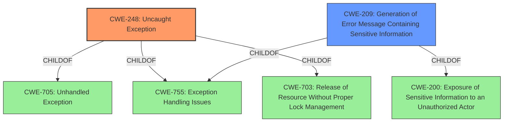

# Enhanced Analysis for CVE-2020-4388

# Summary
| CWE ID | CWE Name | Confidence | CWE Abstraction Level | CWE Vulnerability Mapping Label | CWE-Vulnerability Mapping Notes |
|---|---|---|---|---|---|
| CWE-248 | Uncaught Exception | 0.9 | Base | Allowed | Primary CWE |
| CWE-209 | Generation of Error Message Containing Sensitive Information | 0.7 | Base | Allowed | Secondary Candidate |

## Evidence and Confidence

*   **Confidence Score:** 0.8
*   **Evidence Strength:** MEDIUM

## Relationship Analysis
The primary CWE, CWE-248 (Uncaught Exception), is a Base level CWE, which is the preferred level of abstraction. It is related to CWE-705, CWE-755, and CWE-703 as a child. The secondary CWE, CWE-209 (Generation of Error Message Containing Sensitive Information), is also a Base level CWE and a child of CWE-200 (Exposure of Sensitive Information to an Unauthorized Actor) and CWE-755 (Exception Handling Issues). The relationship between CWE-248 and CWE-209 suggests that an uncaught exception might lead to the generation of an error message containing sensitive information, creating a potential vulnerability chain.



## Vulnerability Chain
The vulnerability chain starts with the **failure to catch exceptions** (CWE-248). This can lead to a denial-of-service attack, as mentioned in the vulnerability description. Additionally, the exposure of debug information could be used in future attacks, which could be related to the generation of error messages containing sensitive information (CWE-209).

## Summary of Analysis
The primary assessment is based on the vulnerability description, which explicitly states the **root cause** as "**failing to catch exceptions**". This directly aligns with CWE-248 (Uncaught Exception). The description also mentions the exposure of debug information, which hints at CWE-209 (Generation of Error Message Containing Sensitive Information). However, the evidence for CWE-209 is weaker since it's an indirect implication.

The relationship graph shows that CWE-248 and CWE-209 are both child CWEs of other exception handling related CWEs, reinforcing their relevance. CWE-248 is at the optimal level of specificity (Base) for the given information.

Relevant CWE Information:

# Enhanced Context (25 CWEs)

## CWE-538: Insertion of Sensitive Information into Externally-Accessible File or Directory
**Abstraction Level**: Base
**Similarity Score**: 0.77
**Source**: dense

**Description**:
The product places sensitive information into files or directories that are accessible to actors who are allowed to have access to the files, but not to the sensitive information.

**Mapping Guidance**:
- Usage: Allowed
- Rationale: This CWE entry is at the Base level of abstraction, which is a preferred level of abstraction for mapping to the root causes of vulnerabilities.

*Not Selected:* This CWE does not apply because the vulnerability description doesn't mention sensitive information being placed into externally accessible files or directories.

## CWE-668: Exposure of Resource to Wrong Sphere
**Abstraction Level**: Class
**Similarity Score**: 0.77
**Source**: dense

**Description**:
The product exposes a resource to the wrong control sphere, providing unintended actors with inappropriate access to the resource.

**Mapping Guidance**:
- Usage: Discouraged
- Rationale: CWE-668 is high-level and is often misused as a catch-all when lower-level CWE IDs might be applicable. It is sometimes used for low-information vulnerability reports [REF-1287]. It is a level-1 Class (i.e., a child of a Pillar). It is not useful for trend analysis.

*Not Selected:* This CWE is too high-level and discouraged for use when lower-level CWEs are available.

## CWE-203: Observable Discrepancy
**Abstraction Level**: Base
**Similarity Score**: 0.76
**Source**: dense

**Description**:
The product behaves differently or sends different responses under different circumstances in a way that is observable to an unauthorized actor, which exposes security-relevant information about the state of the product, such as whether a particular operation was successful or not.

**Mapping Guidance**:
- Usage: Allowed
- Rationale: This CWE entry is at the Base level of abstraction, which is a preferred level of abstraction for mapping to the root causes of vulnerabilities.

*Not Selected:* This CWE doesn't directly relate to the described vulnerability.

## CWE-212: Improper Removal of Sensitive Information Before Storage or Transfer
**Abstraction Level**: Base
**Similarity Score**: 0.76
**Source**: dense

**Description**:
The product stores, transfers, or shares a resource that contains sensitive information, but it does not properly remove that information before the product makes the resource available to unauthorized actors.

**Mapping Guidance**:
- Usage: Allowed
- Rationale: This CWE entry is at the Base level of abstraction, which is a preferred level of abstraction for mapping to the root causes of vulnerabilities.

*Not Selected:* This CWE doesn't directly relate to the described vulnerability.

## CWE-209: Generation of Error Message Containing Sensitive Information
**Abstraction Level**: Base
**Similarity Score**: 0.75
**Source**: dense

**Description**:
The product generates an error message that includes sensitive information about its environment, users, or associated data.

**Mapping Guidance**:
- Usage: Allowed
- Rationale: This CWE entry is at the Base level of abstraction, which is a preferred level of abstraction for mapping to the root causes of vulnerabilities.

*Selected as Secondary:* The vulnerability description mentions that exposing debug information could be used in future attacks, which suggests that the application might generate error messages containing sensitive information.

## CWE-319: Cleartext Transmission of Sensitive Information
**Abstraction Level**: Base
**Similarity Score**: 0.75
**Source**: dense

**Description**:
The product transmits sensitive or security-critical data in cleartext in a communication channel that can be sniffed by unauthorized actors.

**Mapping Guidance**:
- Usage: Allowed
- Rationale: This CWE entry is at the Base level of abstraction, which is a preferred level of abstraction for mapping to the root causes of vulnerabilities.

*Not Selected:* This CWE doesn't directly relate to the described vulnerability.

## CWE-200: Exposure of Sensitive Information to an Unauthorized Actor
**Abstraction Level**: Class
**Similarity Score**: 0.75
**Source**: dense

**Description**:
The product exposes sensitive information to an actor that is not explicitly authorized to have access to that information.

**Mapping Guidance**:
- Usage: Discouraged
- Rationale: CWE-200 is commonly misused to represent the loss of confidentiality in a vulnerability, but confidentiality loss is a technical impact - not a root cause error. As of CWE 4.9, over 400 CWE entries can lead to a loss of confidentiality. Other options are often available. [REF-1287].

*Not Selected:* This CWE is too high-level and discouraged for use when lower-level CWEs are available.

## CWE-41: Improper Resolution of Path Equivalence
**Abstraction Level**: Base
**Similarity Score**: 0.75
**Source**: dense

**Description**:
The product is vulnerable to file system contents disclosure through path equivalence. Path equivalence involves the use of special characters in file and directory names. The associated manipulations are intended to generate multiple names for the same object.

**Mapping Guidance**:
- Usage: Allowed
- Rationale: This CWE entry is at the Base level of abstraction, which is a preferred level of abstraction for mapping to the root causes of vulnerabilities.

*Not Selected:* This CWE doesn't directly relate to the described vulnerability.

## CWE-807: Reliance on Untrusted Inputs in a Security Decision
**Abstraction Level**: Base
**Similarity Score**: 0.75
**Source**: dense


## CWE Relationship Analysis

Current CWEs represent these abstraction levels: .


### Vulnerability Chain Analysis

**Chain starting from CWE-248:**
- 248 (Uncaught Exception) - ROOT


**Chain starting from CWE-705:**
- 705 (Incorrect Control Flow Scoping) - ROOT


### CWE Relationship Diagram

```mermaid
graph TD
    classDef primary fill:#f96,stroke:#333,stroke-width:2px
    classDef secondary fill:#69f,stroke:#333
    classDef tertiary fill:#9e9,stroke:#333
```