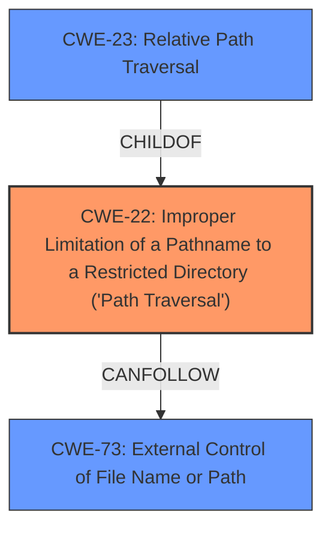

# Raw Analyzer Response for CVE-2020-4430

# Summary
| CWE ID | CWE Name | Confidence | CWE Abstraction Level | CWE Vulnerability Mapping Label | CWE-Vulnerability Mapping Notes |
|---|---|---|---|---|---|
| CWE-22 | Improper Limitation of a Pathname to a Restricted Directory ('Path Traversal') | 1.0 | Base | Allowed | Primary CWE |

## Evidence and Confidence

*   **Confidence Score:** 1.0
*   **Evidence Strength:** HIGH

## Relationship Analysis
The primary relationship influencing the decision is the direct match of the vulnerability description to the definition of CWE-22. The vulnerability involves a remote authenticated attacker being able to traverse directories and download arbitrary files, directly aligning with the "Improper Limitation of a Pathname to a Restricted Directory" definition. While other CWEs like CWE-23 (Relative Path Traversal) are related, CWE-22 provides a broader and more accurate representation of the vulnerability.

## Vulnerability Chain
The vulnerability chain starts with **improper access control** leading to a **directory traversal** weakness, ultimately resulting in the ability to download arbitrary files.

## Summary of Analysis
The primary CWE is CWE-22 because the vulnerability description clearly states that a remote authenticated attacker can traverse directories and download arbitrary files by sending a specially-crafted URL request. This aligns directly with the definition of CWE-22, which involves the **improper limitation of a pathname to a restricted directory**.

The evidence supporting this decision comes directly from the vulnerability description: "IBM Data Risk Manager 2.0.1, 2.0.2, 2.0.3, and 2.0.4 could allow a remote authenticated attacker to traverse directories on the system. An attacker could send a specially-crafted URL request to download arbitrary files from the system." Additionally, the "Vulnerability Description Key Phrases" section highlights "**directory traversal**" as a **weakness**.

CWE-23 (Relative Path Traversal) was considered, but CWE-22 is more fitting as it encompasses both relative and absolute path traversal, and the description doesn't explicitly specify that the traversal is limited to relative paths.

CWE-73 (External Control of File Name or Path) was also considered but deemed less appropriate as the primary issue is the improper limitation of the path, not the external control of the file name or path itself. The **improper access control** is the rootcause.

The selection of CWE-22 is at the optimal level of specificity because it directly addresses the weakness described in the vulnerability.