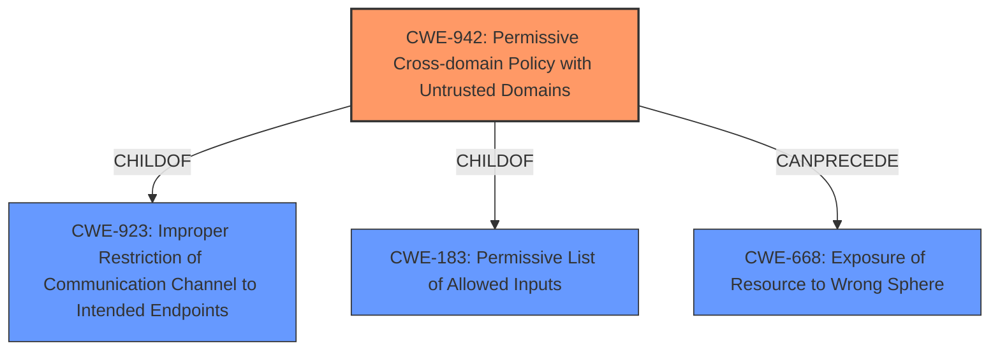

# Analysis for CVE-2020-4562

# Summary
| CWE ID  | CWE Name                                                        | Confidence | CWE Abstraction Level | CWE Vulnerability Mapping Label | CWE-Vulnerability Mapping Notes |
| :------- | :-------------------------------------------------------------- | :--------- | :-------------------- | :------------------------------ | :------------------------------ |
| CWE-942 | Permissive Cross-domain Policy with Untrusted Domains         | 0.8        | Variant               | Allowed                       | Primary CWE                     |
| CWE-923 | Improper Restriction of Communication Channel to Intended Endpoints | 0.6        | Class                 | Allowed-with-Review           | Secondary candidate             |
| CWE-200 | Exposure of Sensitive Information to an Unauthorized Actor        | 0.5        | Class                 | Discouraged                    | Secondary candidate             |

## Evidence and Confidence

*   **Confidence Score:** 0.7
*   **Evidence Strength:** MEDIUM

## Relationship Analysis
The primary CWE, CWE-942 (Permissive Cross-domain Policy with Untrusted Domains), is a variant of CWE-923 (Improper Restriction of Communication Channel to Intended Endpoints) and CWE-183 (Permissive List of Allowed Inputs). This indicates a hierarchical relationship where CWE-942 is a more specific case of a broader communication channel restriction issue. It can also precede CWE-668 (Exposure of Resource to Wrong Sphere), suggesting a potential chain of events.

## Vulnerability Chain
The chain of events starts with a **permissive cross-domain policy**, which leads to **improper restriction of the communication channel**, ultimately resulting in the **exposure of sensitive information**.

## Summary of Analysis
The vulnerability description clearly states the **rootcause** as "**allowing cross-window communication with unrestricted target origin via documentation frames**". The **impact** is that the attacker can "**obtain sensitive information**."

The retriever results list CWE-942 (Permissive Cross-domain Policy with Untrusted Domains) as a candidate. The description of CWE-942 states: "The product uses a cross-domain policy file that includes domains that should not be trusted." This aligns well with the vulnerability description and is therefore selected as the primary CWE.

CWE-923 (Improper Restriction of Communication Channel to Intended Endpoints) is also considered because CWE-942 is a child of CWE-923. However, CWE-942 is more specific and thus a better fit.

CWE-200 (Exposure of Sensitive Information to an Unauthorized Actor) is considered but discouraged per MITRE guidance: "CWE-200 is commonly misused to represent the loss of confidentiality in a vulnerability, but confidentiality loss is a technical impact - not a root cause error." Since the root cause is the permissive cross-domain policy, CWE-200 is a secondary impact.

My assessment relies on the vulnerability description and the retriever results. The hierarchical relationships confirm that CWE-942 is the most specific and appropriate CWE. The selection is justified by the root cause identified in the vulnerability description, which is "**allowing cross-window communication with unrestricted target origin via documentation frames**". CWE-942 is at the optimal level of specificity, being a Variant that directly addresses the cross-domain policy issue.

Relevant CWE Information:

# Enhanced Context (25 CWEs)
The following CWEs were identified as potentially relevant to this vulnerability:

## CWE-552: Files or Directories Accessible to External Parties
**Abstraction Level**: Base
**Similarity Score**: 0.79
**Source**: dense

**Description**:
The product makes files or directories accessible to unauthorized actors, even though they should not be.

**Mapping Guidance**:
- Usage: Allowed
- Rationale: This CWE entry is at the Base level of abstraction, which is a preferred level of abstraction for mapping to the root causes of vulnerabilities.

## CWE-538: Insertion of Sensitive Information into Externally-Accessible File or Directory
**Abstraction Level**: Base
**Similarity Score**: 0.79
**Source**: dense

**Description**:
The product places sensitive information into files or directories that are accessible to actors who are allowed to have access to the files, but not to the sensitive information.

**Mapping Guidance**:
- Usage: Allowed
- Rationale: This CWE entry is at the Base level of abstraction, which is a preferred level of abstraction for mapping to the root causes of vulnerabilities.

## CWE-434: Unrestricted Upload of File with Dangerous Type
**Abstraction Level**: Base
**Similarity Score**: 0.78
**Source**: dense

**Description**:
The product allows the upload or transfer of dangerous file types that are automatically processed within its environment.

**Mapping Guidance**:
- Usage: Allowed
- Rationale: This CWE entry is at the Base level of abstraction, which is a preferred level of abstraction for mapping to the root causes of vulnerabilities.

## CWE-184: Incomplete List of Disallowed Inputs
**Abstraction Level**: Base
**Similarity Score**: 0.78
**Source**: dense

**Description**:
The product implements a protection mechanism that relies on a list of inputs (or properties of inputs) that are not allowed by policy or otherwise require other action to neutralize before additional processing takes place, but the list is incomplete.

**Mapping Guidance**:
- Usage: Allowed
- Rationale: This CWE entry is at the Base level of abstraction, which is a preferred level of abstraction for mapping to the root causes of vulnerabilities.

## CWE-212: Improper Removal of Sensitive Information Before Storage or Transfer
**Abstraction Level**: Base
**Similarity Score**: 0.77
**Source**: dense

**Description**:
The product stores, transfers, or shares a resource that contains sensitive information, but it does not properly remove that information before the product makes the resource available to unauthorized actors.

**Mapping Guidance**:
- Usage: Allowed
- Rationale: This CWE entry is at the Base level of abstraction, which is a preferred level of abstraction for mapping to the root causes of vulnerabilities.

## CWE-41: Improper Resolution of Path Equivalence
**Abstraction Level**: Base
**Similarity Score**: 0.77
**Source**: dense

**Description**:
The product is vulnerable to file system contents disclosure through path equivalence. Path equivalence involves the use of special characters in file and directory names. The associated manipulations are intended to generate multiple names for the same object.

**Mapping Guidance**:
- Usage: Allowed
- Rationale: This CWE entry is at the Base level of abstraction, which is a preferred level of abstraction for mapping to the root causes of vulnerabilities.

## CWE-807: Reliance on Untrusted Inputs in a Security Decision
**Abstraction Level**: Base
**Similarity Score**: 0.77
**Source**: dense

**Description**:
The product uses a protection mechanism that relies on the existence or values of an input, but the input can be modified by an untrusted actor in a way that bypasses the protection mechanism.

**Mapping Guidance**:
- Usage: Allowed
- Rationale: This CWE entry is at the Base level of abstraction, which is a preferred level of abstraction for mapping to the root causes of vulnerabilities.

## CWE-668: Exposure of Resource to Wrong Sphere
**Abstraction Level**: Class
**Similarity Score**: 0.77
**Source**: dense

**Description**:
The product exposes a resource to the wrong control sphere, providing unintended actors with inappropriate access to the resource.

**Mapping Guidance**:
- Usage: Discouraged
- Rationale: CWE-668 is high-level and is often misused as a catch-all when lower-level CWE IDs might be applicable. It is sometimes used for low-information vulnerability reports [REF-1287]. It is a level-1 Class (i.e., a child of a Pillar). It is not useful for trend analysis.

## CWE-1289: Improper Validation of Unsafe Equivalence in Input
**Abstraction Level**: Base
**Similarity Score**: 0.77
**Source**: dense

**Description**:
The product receives an input value that is used as a resource identifier or other type of reference, but it does not validate or incorrectly validates that the input is equivalent to a potentially-unsafe value.

**Mapping Guidance**:
- Usage: Allowed
- Rationale: This CWE entry is at the Base level of abstraction, which is a preferred level of abstraction for mapping to the root causes