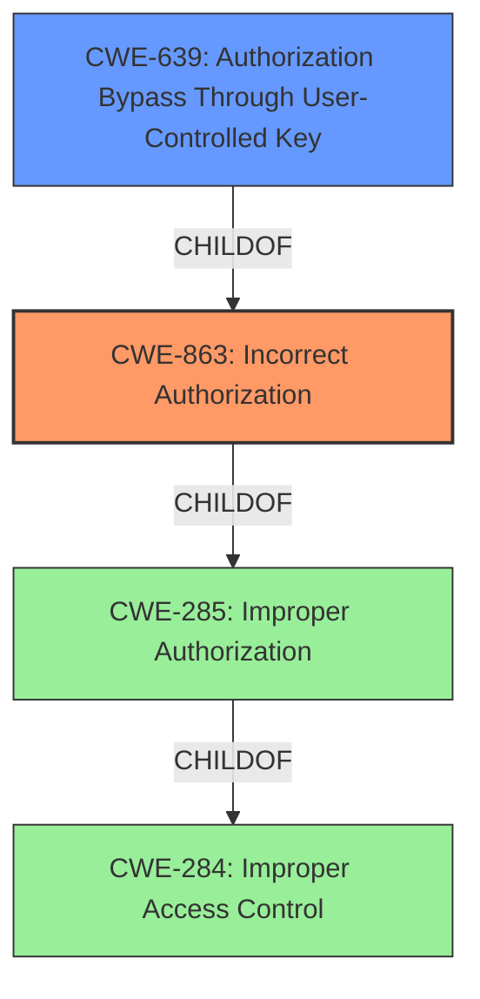

# Enhanced Analysis for CVE-2020-4646

# Summary
| CWE ID  | CWE Name                       | Confidence | CWE Abstraction Level | CWE Vulnerability Mapping Label | CWE-Vulnerability Mapping Notes |
| :-------- | :----------------------------- | :--------- | :---------------------- | :------------------------------ | :------------------------------ |
| CWE-863 | Incorrect Authorization          | 0.9        | Class                   | Allowed-with-Review           | Primary CWE                     |
| CWE-639 | Authorization Bypass Through User-Controlled Key | 0.75     | Base                    | Allowed                       | Secondary Candidate             |

## Evidence and Confidence

*   **Confidence Score:** 0.8
*   **Evidence Strength:** HIGH

## Relationship Analysis
The primary relationship influencing the selection is the parent-child relationship between CWE-285 (Improper Authorization), CWE-863 (Incorrect Authorization), and CWE-639 (Authorization Bypass Through User-Controlled Key). Since the vulnerability description indicates **improper authorization control**, CWE-863 is a more specific Class-level CWE than CWE-285. CWE-639 is a Base-level CWE and a child of CWE-863, but the description doesn't clearly indicate user-controlled keys are involved. The abstraction levels guided the selection towards more specific classifications where the evidence supports it.



## Vulnerability Chain
The vulnerability chain starts with the **improper authorization control** in IBM Sterling B2B Integrator. This allows an authenticated user to bypass intended access restrictions, leading to the ability to view pages they should not have access to.
  - Root Cause: **Improper Authorization Control**
  - Weakness: Failure in the access control mechanism
  - Impact: Unauthorized viewing of pages

## Summary of Analysis
The initial analysis focused on identifying the root cause of the vulnerability, which is described as **improper authorization control**. The "Vulnerability Description Key Phrases" section explicitly mentions this, and the "CVE Reference Links Content Summary" confirms that the core problem is a failure of the access control mechanism in the Dashboard UI.

The Retriever Results suggested several CWEs related to authorization, including CWE-284 (Improper Access Control), CWE-285 (Improper Authorization), CWE-863 (Incorrect Authorization), and CWE-639 (Authorization Bypass Through User-Controlled Key).

CWE-284 is a Pillar-level CWE and is discouraged due to its high-level nature. CWE-285 is a Class-level CWE, and the mapping guidance suggests considering its children for a more specific fit.

CWE-863 (Incorrect Authorization) is a Class-level CWE that describes a scenario where an authorization check is performed but is not done correctly. This aligns well with the vulnerability description, which states that the **improper authorization control** allows unauthorized access. Therefore, CWE-863 is selected as the primary CWE.

CWE-639 (Authorization Bypass Through User-Controlled Key) is a Base-level CWE that describes a specific type of authorization bypass where a user can modify a key value to access another user's data. While this could be a potential mechanism, the vulnerability description does not explicitly mention user-controlled keys. Therefore, CWE-639 is considered a secondary candidate, but with less confidence.

The final decision is based on the provided evidence, relationship analysis, and mapping guidance. CWE-863 provides the optimal level of specificity, accurately representing the **improper authorization control** that leads to unauthorized access. The selection is supported by the vulnerability description and the Retriever Results.

Relevant CWE Information:

# Enhanced Context (25 CWEs)
The following CWEs were identified as potentially relevant to this vulnerability:

## CWE-639: Authorization Bypass Through User-Controlled Key
**Abstraction Level**: Base
**Similarity Score**: 0.76
**Source**: dense

**Description**:
The system's authorization functionality does not prevent one user from gaining access to another user's data or record by modifying the key value identifying the data.

**Mapping Guidance**:
- Usage: Allowed
- Rationale: This CWE entry is at the Base level of abstraction, which is a preferred level of abstraction for mapping to the root causes of vulnerabilities.

## CWE-807: Reliance on Untrusted Inputs in a Security Decision
**Abstraction Level**: Base
**Similarity Score**: 0.75
**Source**: dense

**Description**:
The product uses a protection mechanism that relies on the existence or values of an input, but the input can be modified by an untrusted actor in a way that bypasses the protection mechanism.

**Mapping Guidance**:
- Usage: Allowed
- Rationale: This CWE entry is at the Base level of abstraction, which is a preferred level of abstraction for mapping to the root causes of vulnerabilities.

## CWE-668: Exposure of Resource to Wrong Sphere
**Abstraction Level**: Class
**Similarity Score**: 0.75
**Source**: dense

**Description**:
The product exposes a resource to the wrong control sphere, providing unintended actors with inappropriate access to the resource.

**Mapping Guidance**:
- Usage: Discouraged
- Rationale: CWE-668 is high-level and is often misused as a catch-all when lower-level CWE IDs might be applicable. It is sometimes used for low-information vulnerability reports [REF-1287]. It is a level-1 Class (i.e., a child of a Pillar). It is not useful for trend analysis.

## CWE-274: Improper Handling of Insufficient Privileges
**Abstraction Level**: Base
**Similarity Score**: 0.75
**Source**: dense

**Description**:
The product does not handle or incorrectly handles when it has insufficient privileges to perform an operation, leading to resultant weaknesses.

**Mapping Guidance**:
- Usage: Discouraged
- Rationale: This CWE entry could be deprecated in a future version of CWE.

## CWE-1220: Insufficient Granularity of Access Control
**Abstraction Level**: Base
**Similarity Score**: 0.74
**Source**: dense

**Description**:
The product implements access controls via a policy or other feature with the intention to disable or restrict accesses (reads and/or writes) to assets in a system from untrusted agents. However, implemented access controls lack required granularity, which renders the control policy too broad because it allows accesses from unauthorized agents to the security-sensitive assets.

**Mapping Guidance**:
- Usage: Allowed
- Rationale: This CWE entry is at the Base level of abstraction, which is a preferred level of abstraction for mapping to the root causes of vulnerabilities.

## CWE-280: Improper Handling of Insufficient Permissions or Privileges
**Abstraction Level**: Base
**Similarity Score**: 0.74
**Source**: dense

**Description**:
The product does not handle or incorrectly handles when it has insufficient privileges to access resources or functionality as specified by their permissions. This may cause it to follow unexpected code paths that may leave the product in an invalid state.

**Mapping Guidance**:
- Usage: Allowed
- Rationale: This CWE entry is at the Base level of abstraction, which is a preferred level of abstraction for mapping to the root causes of vulnerabilities.

## CWE-472: External Control of Assumed-Immutable Web Parameter
**Abstraction Level**: Base
**Similarity Score**: 0.74
**Source**: dense

**Description**:
The web application does not sufficiently verify inputs that are assumed to be immutable but are actually externally controllable, such as hidden form fields.

**Mapping Guidance**:
- Usage: Allowed
- Rationale: This CWE entry is at the Base level of abstraction, which is a preferred level of abstraction for mapping to the root causes of vulnerabilities.

## CWE-303: Incorrect Implementation of Authentication Algorithm
**Abstraction Level**: Base
**Similarity Score**: 0.73
**Source**: dense

**Description**:
The requirements for the product dictate the use of an established authentication algorithm, but the implementation of the algorithm is incorrect.

**Mapping Guidance**:
- Usage: Allowed
- Rationale: This CWE entry is at the Base level of abstraction, which is a preferred level of abstraction for mapping to the root causes of vulnerabilities.

## CWE-552: Files or Directories Accessible to External Parties
**Abstraction Level**: Base
**Similarity Score**: 0.73
**Source**: dense

**Description**:
The product makes files or directories accessible to unauthorized actors, even though they should not be.


## CWE Relationship Analysis

Current CWEs represent these abstraction levels: .


### Vulnerability Chain Analysis

**Chain starting from CWE-303:**
- 303 (Incorrect Implementation of Authentication Algorithm) - ROOT


**Chain starting from CWE-284:**
- 284 (Improper Access Control) - ROOT


### CWE Relationship Diagram

```mermaid
graph TD
    classDef primary fill:#f96,stroke:#333,stroke-width:2px
    classDef secondary fill:#69f,stroke:#333
    classDef tertiary fill:#9e9,stroke:#333
```